# Gerir a sua origem de dados – Analysis Services
Depois de instalar o gateway de dados no local, terá de adicionar as origens de dados que podem ser utilizadas com o gateway. Este artigo abordará como trabalhar com gateways e origens de dados. Pode utilizar a origem de dados do Analysis Services para atualização agendada ou para ligações em direto.

<iframe width="560" height="315" src="https://www.youtube.com/embed/ownIGbcRAAU" frameborder="0" allowfullscreen></iframe>

## Transferir e instalar o gateway
Pode transferir o gateway a partir do serviço Power BI. Selecione **Transferências** > **Gateway de Dados** ou aceda à [página de transferência do gateway](https://go.microsoft.com/fwlink/?LinkId=698861).

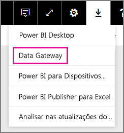

## Limitações das ligações em direto do Analysis Services
Pode utilizar uma ligação em direto para instâncias em tabela ou multidimensionais.

| **Versão do servidor** | **SKU necessário** |
| --- | --- |
| 2012 SP1 CU4 ou posterior |Business Intelligence e SKU Enterprise |
| 2014 |Business Intelligence e SKU Enterprise |
| 2016 |SKU Standard ou superior |

* As funcionalidades de conversão e Formatação ao nível da célula não são suportadas.
* As Ações e os Conjuntos Nomeados não são expostos no Power BI, mas pode ligar a cubos multidimensionais que também contêm Ações ou Conjuntos Nomeados e criar elementos visuais e relatórios.

## Adicionar um gateway
Para adicionar um gateway, basta [Transferir](https://go.microsoft.com/fwlink/?LinkId=698861) e instalar o gateway num servidor do seu ambiente. Depois de instalar o gateway, será apresentado na lista de gateways em **Gerir gateways**.

> [!NOTE]
> **Gerir gateways** não será apresentado até ser o administrador de, pelo menos, um gateway. Isto pode acontecer ao ser adicionado como um administrador ou ao instalar e configurar um gateway.
> 
> 

## Remover um gateway
A remoção de um gateway também elimina as origens de dados contidas no mesmo.  Isto também interromperá todos os dashboards e relatórios que dependem dessas origens de dados.

1. Selecione o ícone de engrenagem  no canto superior direito > **Gerir gateways**.
2. Gateway > **Remover**
   
   

## Adicionar uma origem de dados
Pode adicionar uma origem de dados ao selecionar um gateway e clicar em **Adicionar origem de dados** ou ir para Gateway > **Adicionar origem de dados**.

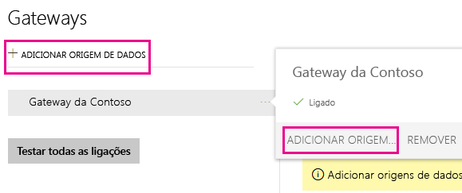

Pode selecionar o **Tipo de Origem de Dados** na lista. Se estiver a ligar a um servidor Multidimensional ou de Tabela, selecione o Analysis Services.

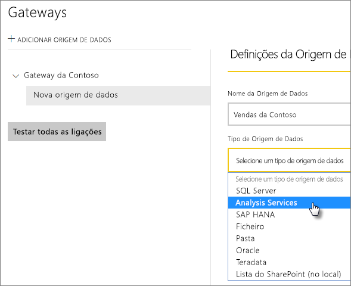

Em seguida, é necessário preencher as informações da origem de dados, que incluem o **Servidor** e a **Base de Dados**.  

O **Nome de Utilizador** e a **Palavra-passe** que inserir serão utilizados pelo gateway para ligar à instância do Analysis Services.

> [!NOTE]
> A conta do Windows inserida deve ter permissões de Administrador do Servidor para a instância à qual está a ligar. Se a palavra-passe desta conta estiver configurada para expirar, os utilizadores poderão receber um erro de ligação se a palavra-passe não estiver atualizada para a origem de dados. Para obter mais informações, veja o artigo sobre o gateway de dados principal no local para saber mais sobre como as [credenciais](service-gateway-onprem.md#credentials) são armazenadas.
> 
> 

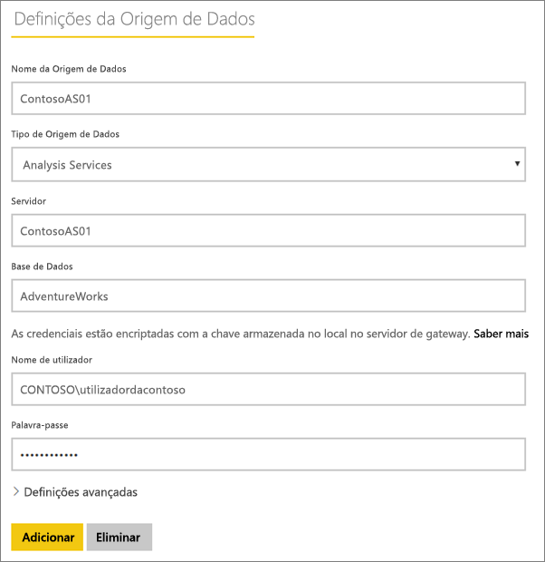

Pode clicar em **Adicionar** depois de preencher tudo.  Agora, pode utilizar esta origem de dados para atualização agendada ou ligações em direto numa instância no local do Analysis Services.  Verá *Ligação Efetuada com Êxito*, se tiver êxito.

### Definições avançadas
Pode configurar o nível de privacidade para a sua origem de dados. Controla a forma como os dados podem ser combinados. É utilizado apenas para a atualização agendada. Não é aplicável às ligações em direto. [Saiba mais](https://support.office.com/article/Privacy-levels-Power-Query-CC3EDE4D-359E-4B28-BC72-9BEE7900B540)

## Nomes de Utilizador com o Analysis Services
Sempre que um utilizador interage com um relatório ligado ao Analysis Services, o nome do utilizador efetivo é passado para o gateway e, em seguida, para o seu servidor no local do Analysis Services. O endereço de e-mail com o qual inicia sessão no Power BI é aquele que transmitiremos ao Analysis Services como sendo o utilizador efetivo. Isto é transmitido na propriedade de ligação [EffectiveUserName](https://msdn.microsoft.com/library/dn140245.aspx#bkmk_auth). Este endereço de e-mail deve corresponder a um UPN definido dentro do Domínio do Active Directory local. O UPN é uma propriedade de uma conta do Active Directory. Essa conta do Windows deverá, então, estar presente numa função do Analysis Services. Se uma correspondência não for encontrada, o início de sessão no Active Directory não será bem-sucedido. [Saber mais](https://msdn.microsoft.com/library/ms677605.aspx)

Também pode mapear o seu nome de início de sessão do Power BI com um UPN de diretório local. [Saber mais](service-gateway-enterprise-manage-ssas.md#map-user-names)

<iframe width="560" height="315" src="https://www.youtube.com/embed/Qb5EEjkHoLg" frameborder="0" allowfullscreen></iframe>

### Como posso saber qual é o meu UPN?
Pode não saber qual é o seu UPN nem ser um administrador do domínio. Pode utilizar o seguinte comando da sua estação de trabalho para descobrir o UPN da sua conta.

    whoami /upn

O resultado será semelhante a um endereço de e-mail, mas trata-se do UPN que está na sua conta de domínio. Se estiver a utilizar uma origem de dados do Analysis Services para ligações em direto e se a mesma não corresponder ao endereço de e-mail com o qual iniciou sessão no Power BI, poderá querer observar como [Mapear nomes de utilizador](#map-user-names).

## Mapear nomes de utilizador
<iframe width="560" height="315" src="https://www.youtube.com/embed/eATPS-c7YRU" frameborder="0" allowfullscreen></iframe>

Pode mapear os nomes de utilizador para o Analysis Services de duas formas diferentes:

1. Remapeamento manual de utilizador 
2. Pesquisa de Propriedade no Local do Active Directory para remapear UPNs do AAD para utilizadores do Active Directory (mapeamento de pesquisa do AD)

Embora seja possível efetuar o mapeamento manual com a segunda abordagem, fazê-lo iria ser moroso e difícil de manter; é particularmente difícil quando a correspondência de padrões não é suficiente - por exemplo, quando os nomes de domínio são diferentes entre o AAD e o AD no local ou quando os nomes de contas de utilizadores são diferentes entre o AAD e o AD. Como tal, o mapeamento manual com a segunda abordagem não é recomendado.

Iremos descrever estas duas abordagens, por ordem, nas duas secções seguintes

### Remapeamento manual do nome de utilizador
Para origens de dados do Analysis Services, pode configurar regras personalizadas do Nome Principal de Utilizador (UPN). Isto irá ajudá-lo, se os nomes de início de sessão do serviço Power BI não corresponderem ao UPN no diretório local. Por exemplo, se iniciar sessão no Power BI com john@contoso.com, mas o seu diretório UPN local for john@contoso.local, pode configurar uma regra de mapeamento para que john@contoso.local seja transmitido ao Analysis Services.

Para aceder ao ecrã de Mapeamento de UPN, efetue o seguinte.

1. Vá para o **Ícone de engrenagem** e selecione **Gerir Gateways**.
2. Expanda o gateway que contém a origem de dados do Analysis Services. Em alternativa, se ainda não tiver criado a origem de dados do Analysis Services, pode fazê-lo neste momento.
3. Selecione a origem de dados e selecione o separador **Utilizadores**.
4. Selecione **Mapear nomes de utilizador**.
   
    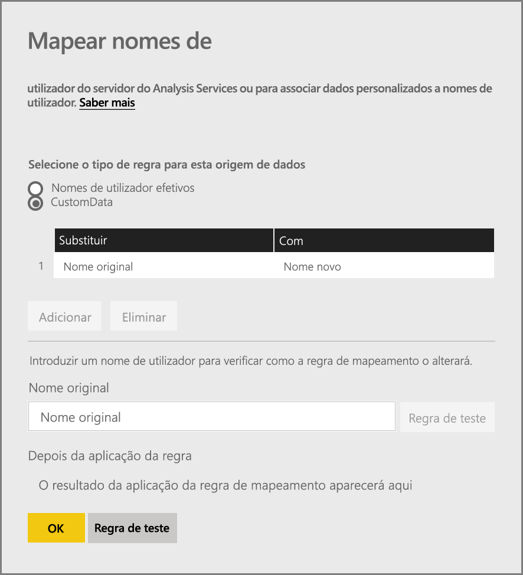

Verá as opções para adicionar regras, bem como de teste para um determinado utilizador.

> [!NOTE]
> Poderá, inadvertidamente, alterar um utilizador. Por exemplo, se **Substituir (valor original)** for *@contoso.com* e **Por (Novo nome)** for *@contoso.local*, todos os utilizadores com um início de sessão que contenha *@contoso.com* serão então substituídos por *@contoso.local*. Por exemplo, se **Substituir (valor original)** for *dave@contoso.com* e **Por (Novo nome)** for *dave@contoso.local*, um utilizador com o início de sessão de v-dave@contoso.com seria enviado como v-dave*@contoso.local*.
> 
> 

### Mapeamento de pesquisa do AD
Para executar uma pesquisa de propriedade do AD no local para remapear UPNs do AAD para utilizadores do Active Directory, siga os passos nesta secção. Para começar, vamos rever como funciona.

No **serviço Power BI** ocorre o seguinte:

- Para cada consulta por um utilizador do AAD do Power BI para um servidor SSAS no local, uma cadeia UPN é transmitida, tal como:      firstName.lastName@contoso.com

> [!NOTE]
> Quaisquer mapeamentos manuais de utilizadores de UPN definidos na configuração da origem de dados do Power BI continuam a ser aplicados *antes* do envio da cadeia do nome de utilizador para o gateway de dados no local.
> 
> 

No gateway de dados no local com o Mapeamento de Utilizador Personalizado configurável, efetue o seguinte:

1. Localize o Active Directory para pesquisa (automática ou configurável)
2. Procure o atributo da Pessoa do AD (como *E-mail*) com base na cadeia UPN recebida ("firstName.lastName@contoso.com") do **serviço Power BI**.
3. Se a Pesquisa do AD falhar, este tenta utilizar o UPN transmitido juntamente como o EffectiveUser do SSAS.
4. Se a Pesquisa do AD for bem-sucedida, obtém o *UserPrincipalName* dessa Pessoa do AD. 
5. Transmite o e-mail do *UserPrincipalName* como *EffectiveUser* para o SSAS, como: *Alias@corp.on-prem.contoso*

Como configurar o gateway para efetuar a Pesquisa do AD:

1. Transferir e instalar o gateway mais recente
2. No gateway, terá de alterar o **serviço de gateway de dados no local** para que seja executado com uma conta de domínio (em vez de uma conta de serviço local – caso contrário, a Pesquisa do AD não irá funcionar corretamente no tempo de execução). Terá de reiniciar o serviço de gateway para a alteração produzir efeito.  Vá para a aplicação de gateway na sua máquina (procure "gateway de dados no local"). Para fazê-lo, aceda a **Definições do serviço > Alterar conta de serviço**. Certifique-se de que tem a chave de recuperação deste gateway, uma vez que terá de restaurá-lo na mesma máquina, a menos que pretenda criar um novo gateway em vez disso. 
3. Navegue até à pasta de instalação do gateway, *C:\Programas\Microsoft Files\Gateway de dados no local* como administrador, para ter a certeza de que tem permissões de escrita, e edite o seguinte ficheiro:
   
       Microsoft.PowerBI.DataMovement.Pipeline.GatewayCore.dll.config 
4. Edite os seguintes dois valores de configuração, em conformidade com as *suas* configurações de atributo do Active Directory dos seus utilizadores do AD. Os valores de configuração apresentados abaixo são apenas exemplos – é necessário especificá-los com base na configuração do Active Directory. 
   
   
5. Reinicie o serviço **gateway de dados no local** para que a alteração da configuração produza efeito.

### Trabalhar com regras de mapeamento
Para criar uma regra de mapeamento, introduza um valor para **Nome original** e **Novo Nome** e, em seguida, selecione **Adicionar**.

| Campo | Descrição |
| --- | --- |
| Substituir (Nome original) |O endereço de e-mail com o qual iniciou sessão no Power BI. |
| Por (Novo Nome) |O valor pelo qual pretende substituí-lo. O resultado da substituição é o que será transmitido à propriedade *EffectiveUserName* para a ligação do Analysis Services. |

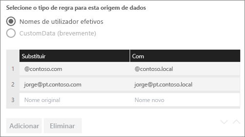

Quando seleciona um item na lista, pode optar por reordená-la com os **ícones de divisa** ou **Eliminar** a entrada.

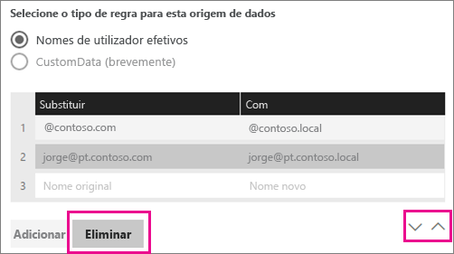

### Utilizar caráter universal (*)
Pode utilizar um caráter universal para a sua cadeia **Substituir (Nome original)**. Só pode ser utilizado isoladamente e não com qualquer outra parte da cadeia. Isto irá permitir aceitar todos os utilizadores e transmitirá um valor único à origem de dados. Isto é útil quando pretende que todos os utilizadores na sua organização utilizem o mesmo utilizador no seu ambiente local.

### Testar uma regra de mapeamento
Pode confirmar o nome pelo qual o nome será substituído ao introduzir um valor para **Nome original** e selecionando **Testar regra**.

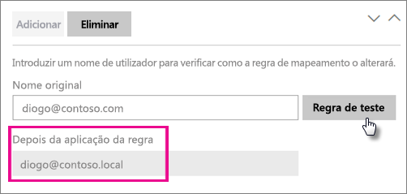

> [!NOTE]
> O serviço irá demorar alguns minutos para começar a utilizar as regras que foram guardadas. No browser, a regra irá funcionar imediatamente.
> 
> 

### Limitações das regras de mapeamento
* O mapeamento destina-se à origem de dados específica que está a ser configurada. Não é uma definição global. Se tiver várias origens de dados do Analysis Services, terá de mapear os utilizadores para cada origem de dados.

## Remover uma origem de dados
A remoção de uma origem de dados interromperá todos os dashboards ou relatórios que dependem da origem de dados em questão.  

Para remover uma origem de dados, vá para Origem de Dados > **Remover**.

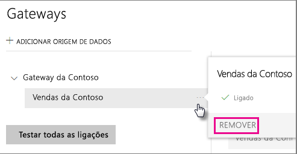

## Gerir administradores
No separador Administradores no gateway, pode adicionar e remover os utilizadores (ou grupos de segurança) que podem administrar o gateway.

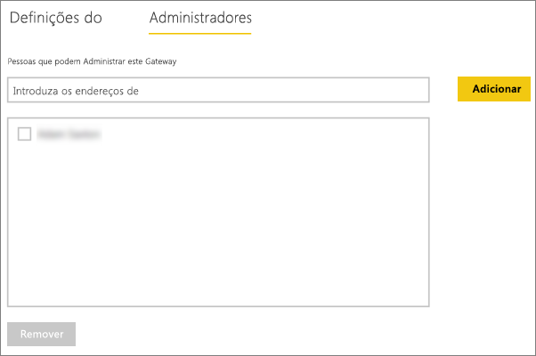

## Gerir utilizadores
No separador Utilizadores da origem de dados, pode adicionar e remover utilizadores ou grupos de segurança que podem utilizar esta origem de dados.

> [!NOTE]
> A lista de utilizadores apenas controla quem tem permissões para publicar relatórios. Os proprietários de relatório podem criar dashboards ou pacotes de conteúdos e partilhá-los com outros utilizadores.
> 
> 

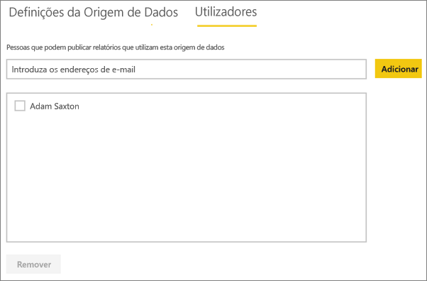

## Utilizar a origem de dados
Depois de criar a origem de dados, esta ficará disponível para utilização com qualquer uma das ligações em direto ou através da atualização agendada.

> [!NOTE]
> O nome do servidor e da base de dados têm de corresponder entre o Power BI Desktop e a origem de dados no gateway de dados no local!
> 
> 

A ligação entre o conjunto de dados e a origem de dados no gateway é baseada no nome do servidor e no nome da base de dados. Estes têm de corresponder. Por exemplo, se fornecer um Endereço IP ao nome do servidor, no Power BI Desktop, terá de utilizar o Endereço IP para a origem de dados na configuração do gateway. Se utilizar *SERVIDOR\INSTÂNCIA*, no Power BI Desktop, terá de utilizar o mesmo na origem de dados configurada para o gateway.

Isto aplica-se tanto às ligações em direto como à atualização agendada.

### Utilizar a origem de dados com ligações em direto
Terá de certificar-se de que o nome do servidor e o nome da base de dados correspondem entre o Power BI Desktop e a origem de dados configurada para o gateway. Também terá de certificar-se de que o utilizador está listado no separador **Utilizadores** da origem de dados, para poder publicar conjuntos de dados de ligação em direto. Para ligações em direto, a seleção ocorre no Power BI Desktop quando importa dados pela primeira vez.

Depois de publicar, a partir do Power BI Desktop ou de **Obter Dados**, os seus relatórios devem começar a funcionar. Poderá demorar vários minutos, depois de criar a origem de dados dentro do gateway, para a ligação ser utilizável.

### Utilizar a origem de dados com a atualização agendada
Se estiver listado no separador **Utilizadores** da origem de dados configurada no gateway, e o nome do servidor e da base de dados corresponderem, irá ver o gateway como uma opção a utilizar com a atualização agendada.

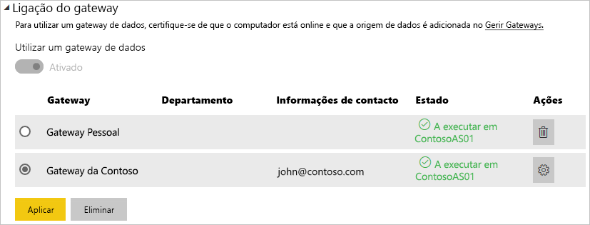

## Próximos passos
[Gateway de dados no local](service-gateway-onprem.md)  
[Gateway de dados no local - detalhado](service-gateway-onprem-indepth.md)  
[Resolução de problemas do gateway de dados no local](service-gateway-onprem-tshoot.md)  
Mais perguntas? [Pergunte à Comunidade do Power BI](http://community.powerbi.com/)

