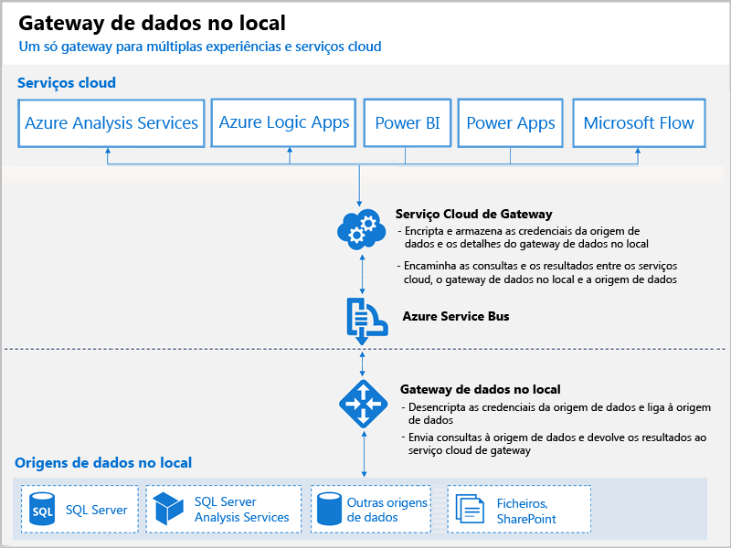

# O que são os gateways do Power BI?

Um gateway do Power BI é software que instala dentro de uma rede no local; facilita o acesso aos dados nessa rede. É como um controlador de chamadas que escuta pedidos de ligação e concede-os apenas se os pedidos dos utilizadores cumprirem determinados critérios. Tal permite às organizações manter bases de dados e outras origens de dados nas suas redes no local, mas utilizar de forma segura esses dados no local em relatórios e dashboards do Power BI.

Pode utilizar um gateway para uma única origem de dados ou para múltiplas origens de dados. O diagrama seguinte mostra uma vista básica, com o gateway a processar pedidos da cloud para três computadores no local. Vamos desenvolver este tema mais adiante no artigo.

## Tipos de gateways

O Power BI oferece dois gateways, cada um para um cenário diferente:

* **Gateway de dados no local (modo pessoal)** – permite que um utilizador estabeleça ligação a origens e não pode ser partilhado com outras pessoas. Só pode ser utilizado com o Power BI. Este gateway é adequado para cenários em que o utilizador é a única pessoa responsável pela criação de relatórios e não precisa de partilhar as origens de dados com outras pessoas.

* **Gateway de dados no local** – permite que vários utilizadores se liguem a várias origens de dados no local. Pode ser utilizado pelas aplicações Power BI, PowerApps, Flow, Azure Analysis Services e Azure Logic, todas com uma instalação de gateway única. Este gateway é adequado a cenários mais complexos com várias pessoas que acedem a várias origens de dados. 

## Utilizar um gateway

Existem quatro passos principais para utilizar um gateway:

1. **Instalar o gateway** num computador local com o modo adequado
2. **Adicionar utilizadores ao gateway** para que possam aceder a origens de dados no local
3. **Ligar-se a origens de dados** para que possam ser utilizadas em relatórios e dashboards
4. **Atualizar dados no local** para que os relatórios do Power BI estejam atualizados

Pode instalar um gateway autónomo ou adicionar um gateway a um *cluster*, o que se recomenda para uma elevada disponibilidade.

## Como funcionam os gateways

O gateway que instalar é executado como um serviço Windows, um **Gateway de dados no local**. Este serviço local é registado com o Serviço Cloud do Gateway através do Azure Service Bus. O diagrama seguinte mostra o fluxo entre os dados no local e os serviços cloud que utilizam o gateway.

Fluxo de dados e consultas:

1. Uma consulta é criada pelo serviço cloud com as credenciais encriptadas para a origem de dados no local. Em seguida, é enviada para uma fila, de modo a ser processada pelo gateway.
2. O serviço cloud do gateway analisa a consulta e envia o pedido para o Azure Service Bus.
3. O gateway de dados no local consulta o Azure Service Bus quanto a pedidos pendentes.
4. O gateway obtém a consulta, desencripta as credenciais e liga à ou às origens de dados com essas credenciais.
5. O gateway envia a consulta para a origem de dados para execução.
6. Os resultados são enviados da origem de dados de volta para o gateway e, em seguida, para o serviço cloud e o seu servidor.

## Próximos passos
[Instalar o gateway de dados no local](service-gateway-install.md)

Mais perguntas? [Pergunte à Comunidade do Power BI](http://community.powerbi.com/)

