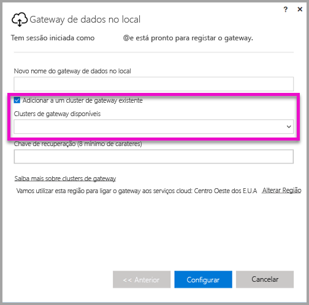

# <a name="high-availability-clusters-for-on-premises-data-gateway"></a>Clusters de elevada disponibilidade para gateways de dados no local
Pode criar **clusters de elevada disponibilidade** de instalações de **gateways de dados no local** para garantir que a sua organização consegue aceder a recursos de dados no local utilizados nos relatórios e dashboards do Power BI. Estes clusters permitem aos administradores de gateway agrupar gateways de forma a evitar pontos únicos de falha ao aceder a recursos de dados no local. Este artigo descreve os passos a seguir para criar um cluster de elevada disponibilidade de gateways de dados no local, além de partilhar as melhores práticas de configuração dos mesmos. Os clusters de gateway de elevada disponibilidade requerem a atualização de novembro de 2017 para o gateway de dados no local ou versão superior.


## <a name="setting-up-high-availability-clusters-of-gateways"></a>Configurar clusters de elevada disponibilidade de gateways

Durante o processo de instalação do **gateway de dados no local**, pode especificar se quer adicionar o gateway a um cluster de gateway existente. 



Para adicionar um gateway a um cluster existente, tem de fornecer a *Chave de recuperação* da instância de gateway principal para o cluster ao qual quer associar o novo gateway. O gateway principal do cluster tem de executar a atualização de gateway de novembro de 2017 ou versão superior. 


## <a name="managing-a-gateway-cluster"></a>Gerir um cluster de gateway

Assim que um cluster de gateway consistir de dois ou mais gateways, todas as operações de gestão de gateway, como adicionar uma origem de dados ou conceder permissões administrativas a um gateway, aplicam-se a todos os gateways que façam parte do cluster. 

Quando os administradores utilizam o item de menu **Gerir gateways**, que se encontra abaixo do ícone de engrenagem no **serviço Power BI**, poderão ver a lista de clusters ou gateways individuais registados, mas não as instâncias de gateway individuais que são membros do cluster.

Todos os novos pedidos de **Atualização Agendada** e as operações do DirectQuery são encaminhados automaticamente para a instância principal de um determinado cluster de gateway. Se a instância de gateway principal não está online, o pedido é encaminhado para outra instância de gateway no cluster.

## <a name="powershell-support-for-gateway-clusters"></a>Suporte do PowerShell para clusters de gateway

Os scripts do PowerShell estão disponíveis na pasta de instalação do gateway de dados no local. Por predefinição, essa pasta é *C:\Program Files\On-premises data gateway*. Tem de utilizar a versão 5, ou mais recente, do PowerShell para que estes scripts funcionem corretamente. Os scripts do PowerShell permitem aos utilizadores realizar as seguintes operações:

-   Obter a lista de clusters de gateway disponíveis para um utilizador
-   Obter a lista de instâncias de gateway registadas num cluster, bem como o respetivo estado online ou offline
-   Modificar o estado ativado/desativado de uma instância de gateway dentro de um cluster, bem como outras propriedades do gateway
-   Excluir um gateway

Para executar os comandos do PowerShell apresentados na tabela, terá, primeiro, de seguir estes passos:

1. Abra uma janela de comando do PowerShell como Administrador
2. Em seguida, execute o seguinte comando do PowerShell de execução única (neste passo, parte-se do princípio de que nunca executou comandos do PowerShell no computador atual):

    ```
    Set-ExecutionPolicy -ExecutionPolicy Unrestricted -Force
    ```

3. Depois, navegue para a pasta de instalação do gateway de dados no local na janela do PowerShell e utilize o seguinte comando para importar o módulo necessário:

    ```
    Import-Module .\OnPremisesDataGatewayHAMgmt.psm1
    ```

Quando concluir estes passos, pode utilizar os comandos apresentados na tabela seguinte para gerir os seus clusters de gateway

| **Comando** | **Descrição** | **Parâmetros** |
| --- | --- | --- |
| *Login-OnPremisesDataGateway* |Este comando permite que um utilizador inicie sessão para gerir os respetivos clusters de gateway de dados no local.  Tem de executar este comando e iniciar sessão *para que* os outros comandos de elevada disponibilidade funcionem corretamente. Nota: o token de autenticação do AAD adquirido como parte de uma chamada de Início de sessão só é válido durante uma hora, após a qual expira. Pode executar novamente o comando de Início de sessão para adquirir um novo token.| Nome de utilizador e palavra-passe do AAD (fornecidos como parte da execução do comando, não da invocação inicial)|
| *Get-OnPremisesDataGatewayClusters* | Obtém a lista de clusters de gateway para o utilizador com sessão iniciada. | Opcionalmente, pode passar parâmetros de formatação para este comando para assegurar uma melhor legibilidade, como, por exemplo: *Format-Table -AutoSize -Wrap* |
| *Get-OnPremisesDataClusterGateways* | Obtém a lista de gateways dentro do cluster especificado, bem como informações adicionais sobre cada gateway (estado online/offline, o nome do computador, entre outros) | *-ClusterObjectID xyz*  (em que *xyz* é substituído por um valor de ID de objeto de cluster real, o qual pode ser obtido com o comando *Get-OnPremisesDataGatewayClusters*)|
| *Set-OnPremisesDataGateway* | Permite-lhe definir os valores de propriedade de um determinado gateway num cluster, incluindo a capacidade de Ativar/Desativar uma instância de gateway específica  | *-ClusterObjectID xyz* (*xyz* deve ser substituído por um valor de ID de objeto de cluster real, o qual pode ser obtido com o comando *Get-OnPremisesDataGatewayClusters*) *-GatewayObjectID abc* (*abc* deve ser substituído por um valor de ID de objeto de gateway real, o qual pode ser obtido com o comando *Get-OnPremisesDataClusterGateways*, tendo em conta um ID de objeto de cluster) |
| *Get-OnPremisesDataGatewayStatus* | Permite-lhe obter o estado de uma determinada instância de gateway dentro de um cluster  | *-ClusterObjectID xyz* (*xyz* deve ser substituído por um valor de ID de objeto de cluster real, o qual pode ser obtido com o comando *Get-OnPremisesDataGatewayClusters*)  *-GatewayObjectID abc*  (*abc* deve ser substituído por um valor de ID de objeto de gateway real, o qual pode ser obtido com o comando *Get-OnPremisesDataClusterGateways*, tendo em conta um ID de objeto de cluster) |
| *Remove-OnPremisesDataGateway*  | Permite-lhe remover uma instância de gateway de um cluster. Tenha em atenção que não pode remover o gateway principal no cluster até que tenha removido todos os outros gateways no cluster.| *-ClusterObjectID xyz* (*xyz* deve ser substituído por um valor de ID de objeto de cluster real, o qual pode ser obtido com o comando *Get-OnPremisesDataGatewayClusters*)  *-GatewayObjectID abc*  (*abc* deve ser substituído por um valor de ID de objeto de gateway real, o qual pode ser obtido com o comando *Get-OnPremisesDataClusterGateways*, tendo em conta um ID de objeto de cluster) |


## <a name="next-steps"></a>Próximas etapas

-   [Gerir a sua origem de dados - Analysis Services](service-gateway-enterprise-manage-ssas.md)  
-   [Gerir a sua origem de dados - SAP HANA](service-gateway-enterprise-manage-sap.md)  
-   [Gerir a sua origem de dados - SQL Server](service-gateway-enterprise-manage-sql.md)  
-   [Gerir a sua origem de dados - Oracle](service-gateway-onprem-manage-oracle.md)  
-   [Gerir a sua origem de dados - Atualização Importada/Agendada](service-gateway-enterprise-manage-scheduled-refresh.md)  
-   [Gateway de dados no local - detalhado](service-gateway-onprem-indepth.md)  
-   [Gateway de dados no local (modo pessoal)](service-gateway-personal-mode.md)
-   [Configurar definições de proxy para o gateway de dados no local](service-gateway-proxy.md)  
-   [Utilizar o Kerberos para SSO (início de sessão único) do Power BI para origens de dados no local](service-gateway-kerberos-for-sso-pbi-to-on-premises-data.md)  

Mais perguntas? [Experimente a Comunidade do Power BI](http://community.powerbi.com/)
