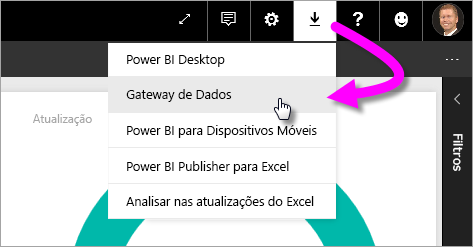
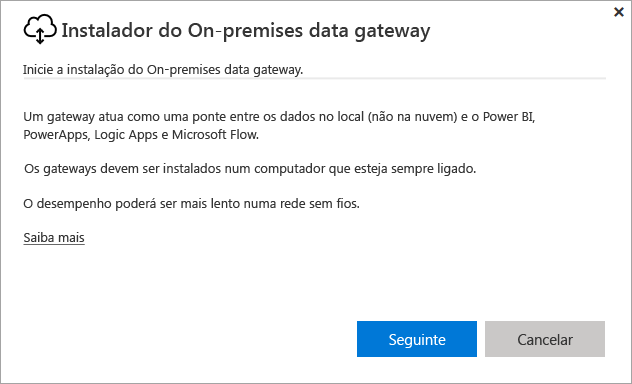
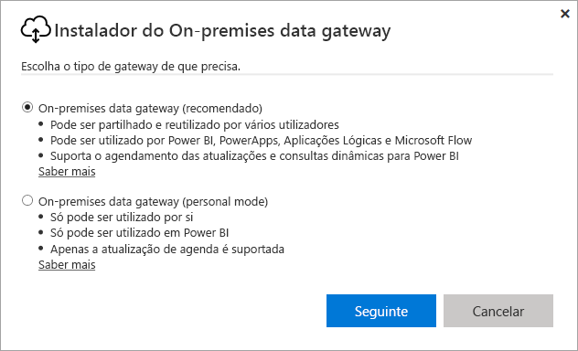
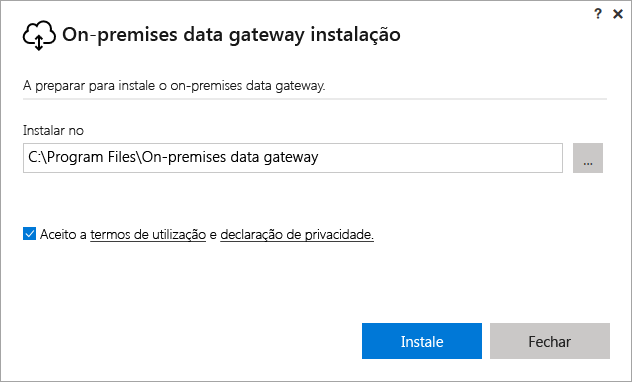
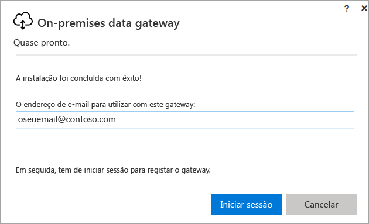
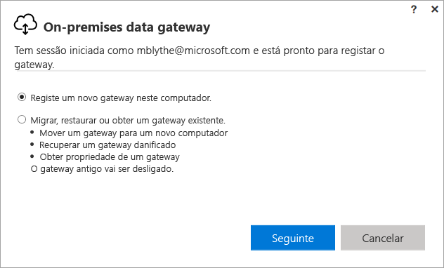
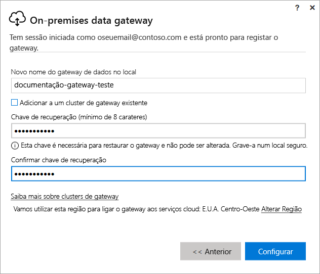
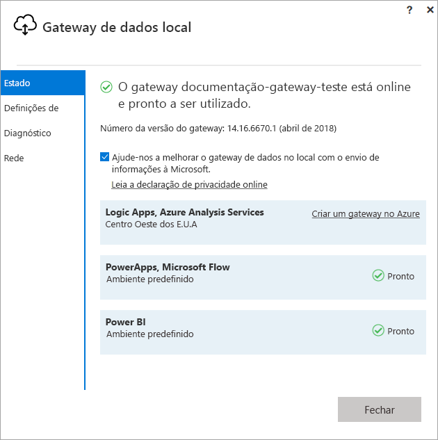
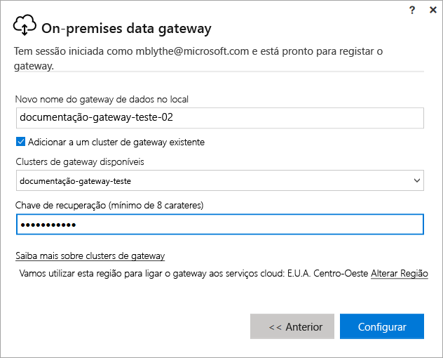

# Instalar um gateway para o Power BI

Um gateway do Power BI é software que instala dentro de uma rede no local; facilita o acesso aos dados nessa rede. Conforme está descrito na [descrição geral](service-gateway-getting-started.md), pode instalar um gateway no modo pessoal ou padrão (recomendado). No modo padrão, pode instalar um gateway autónomo ou adicionar um gateway a um *cluster*, o que se recomenda para uma elevada disponibilidade. Neste artigo, mostramos-lhe como instalar um gateway padrão e, em seguida, adicionar outro gateway para criar um cluster.

Se não estiver inscrito no Power BI, [inscreva-se para uma avaliação gratuita](https://app.powerbi.com/signupredirect?pbi_source=web) antes de começar.

## Transferir e instalar um gateway

O gateway é executado no computador onde o instalou, por isso, verifique se o instala num computador que esteja sempre ligado. Para obter um melhor desempenho e fiabilidade, recomendamos que o computador esteja ligado a uma rede com fios, em vez de uma rede sem fios.

1. No serviço Power BI, no canto superior direito, selecione o **ícone de transferência**  > **Gateway de Dados**.

    

2. Na página de transferência, selecione o botão **TRANSFERIR GATEWAY**.

3. Selecione **Seguinte**.     

    

4. Selecione **Gateway de dados no local (recomendado)** > **Seguinte**.

    

5. Mantenha o caminho de instalação predefinido e aceite os termos > **Instalar**.

    

6. Introduza a conta que utiliza para iniciar sessão no Power BI > **Iniciar sessão**.

    

    O gateway está associado à sua conta do Power BI e os gateways são geridos por si a partir do serviço Power BI. Agora tem sessão iniciada na sua conta.

7. Selecione **Registar um novo gateway neste computador** > **Seguinte**.

    

8. Introduza um nome para o gateway (tem de ser exclusivo em todo o inquilino) e uma chave de recuperação. Vai precisar desta chave se quiser recuperar ou mover o gateway. Selecione **Configurar**.

    

    Veja a opção **Adicionar a um cluster de gateway existente**. Vamos utilizar esta opção na secção seguinte do artigo.

9. Reveja as informações na última janela. Tenha em atenção que o gateway está disponível para o Power BI e também para o PowerApps e o Flow, porque utilizamos a mesma conta para os três. Selecione **Fechar**.

    

Agora que instalou com êxito um gateway, pode adicionar outro gateway para criar um cluster.

## Adicionar outro gateway para criar um cluster

Um cluster permite que os administradores do gateway evitem ter um ponto único de falha para o acesso a dados no local. Se o gateway primário não estiver disponível, os pedidos de dados são encaminhados para o segundo gateway que adicionar e assim sucessivamente. Pode instalar apenas um gateway padrão num computador, pelo que tem de instalar o segundo gateway para o cluster noutro computador, o que faz sentido porque no cluster é ideal existir redundância.

Os clusters de gateway de elevada disponibilidade requerem a atualização de novembro de 2017 do Gateway de dados no local ou posterior.

1. Transfira o gateway para outro computador e instale-o.

2. Depois de ter iniciado sessão na sua conta do Power BI, registe o gateway. Selecione **Adicionar a um cluster existente**. Em **Clusters de gateway disponíveis**, selecione o primeiro gateway instalou (o *gateway principal*) e introduza a chave de recuperação para esse gateway. Selecione **Configurar**.

    

## Próximos passos

[Gerir um Gateway do Power BI](service-gateway-manage.md)

Mais perguntas? [Pergunte à Comunidade do Power BI](http://community.powerbi.com/)