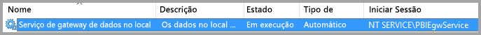
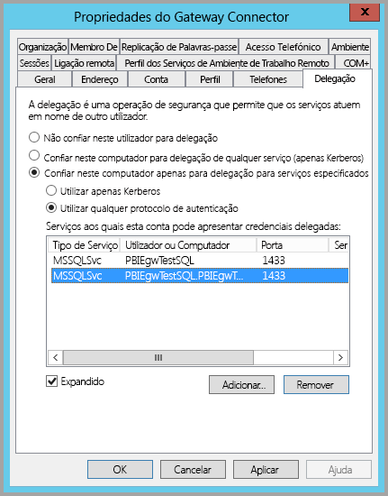
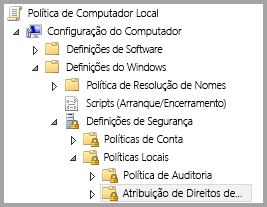
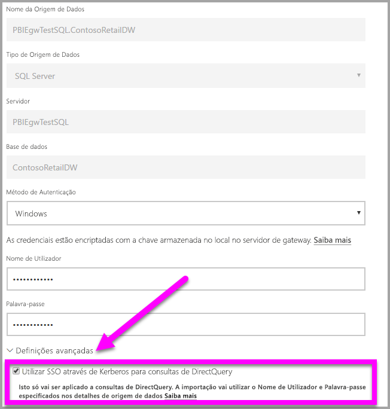
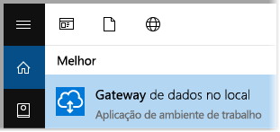
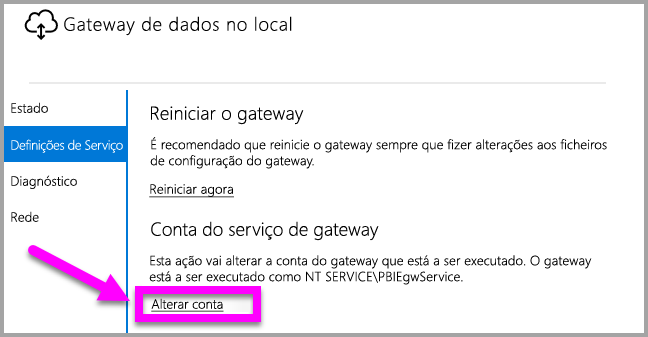

# Utilizar o Kerberos para SSO (início de sessão único) a partir do Power BI para origens de dados no local
Pode obter conectividade totalmente integrada de início de sessão único, ao ativar os relatórios e dashboards do Power BI para atualizarem a partir de dados no local, através da configuração do Gateway de dados no local com o Kerberos. O Gateway de dados no local facilita o início de sessão único (SSO) com o DirectQuery, que utiliza para ligar às origens de dados no local.

As seguintes origens de dados são atualmente suportadas, SQL Server, SAP HANA e Teradata, todas com base na [Delegação Restrita de Kerberos](https://technet.microsoft.com/library/jj553400.aspx).

* SQL Server
* SAP HANA
* Teradata

Quando um utilizador interage com um relatório do DirectQuery no serviço Power BI, cada filtro cruzado, setor, ordenação e operação de edição do relatório pode resultar em consultas que são executadas em direto com a origem de dados no local subjacente.  Quando o início de sessão único é configurado para a origem de dados, as consultas são executadas sob a identidade do utilizador que interage com o Power BI (ou seja, através da experiência Web ou das aplicações móveis do Power BI). Assim, cada utilizador verá precisamente os dados para os quais tem permissões na origem de dados subjacente – com o início de sessão único configurado, não existe colocação em cache de dados partilhados com diferentes utilizadores.

## Executar uma consulta com SSO - os passos que ocorrem
Uma consulta que é executada com o SSO consiste em três passos, conforme mostrado no diagrama seguinte.

> [!NOTE]
> O SSO para Oracle não está ativado ainda, mas está em desenvolvimento e ficará disponível em breve.
> 
> 

Seguem-se detalhes adicionais sobre esses passos:

1. Para cada consulta, o **serviço Power BI** inclui o *nome principal de utilizador* (UPN) ao enviar um pedido de consulta para o gateway configurado.
2. O gateway tem de mapear o UPN do Azure Active Directory para uma identidade do Active Directory local.
   
   a.  Se o AAD DirSync (também conhecido como *AAD Connect*) estiver configurado, o mapeamento funciona automaticamente no gateway.
   
   b.  Caso contrário, o gateway pode procurar e mapear o UPN do Azure AD para um utilizador local, efetuando uma pesquisa de domínio do Active Directory local.
3. O processo do serviço de gateway representa o utilizador local mapeado, abre a ligação à base de dados subjacente e envia a consulta. O gateway não tem de ser instalado na mesma máquina da base de dados.
   
   - A representação de utilizadores e ligação à base de dados apenas é bem-sucedida se a conta do serviço de gateway for uma conta de domínio (ou SID do serviço) e se a delegação restrita de Kerberos tiver sido configurada para que a base de dados aceite permissões Kerberos da conta do serviço de gateway.  
   
   > [!NOTE]
   > Relativamente ao sid do serviço, se AAD DirSync/Ligar estiver configurado e as contas de utilizador estiverem sincronizadas, o serviço de gateway não tem de efetuar pesquisas de AD locais no tempo de execução e pode utilizar o SID do Serviço local (em vez de uma conta de domínio) para o serviço de gateway.  Os passos de configuração da delegação restrita de Kerberos descritos neste documento são os mesmos (mas aplicados com base no SID do serviço, em vez da conta de domínio).
   > 
   > 

> [!NOTE]
> Para ativar o SSO para SAP HANA:
>
> - Certifique-se de que o servidor SAP HANA está a executar a versão mínima exigida, consoante o nível de plataforma do servidor SAP HANA:
>     - [HANA 2 SPS 01 Rev 012.03](https://launchpad.support.sap.com/#/notes/2557386)
>     - [HANA 2 SPS 02 Rev 22](https://launchpad.support.sap.com/#/notes/2547324)
>     - [HANA 1 SP 12 Rev 122.13](https://launchpad.support.sap.com/#/notes/2528439)
>
> - Na máquina do gateway, instale o controlador OBDC HANA mais recente do SAP.  A versão mínima é ODBC HANA, versão 2.00.020.00 de agosto de 2017.
>
> Para obter mais informações sobre como definir e configurar o início de sessão único para o SAP HANA com o Kerberos, veja o tópico [Single Sign-on Using Kerberos](https://help.sap.com/viewer/b3ee5778bc2e4a089d3299b82ec762a7/2.0.03/en-US/1885fad82df943c2a1974f5da0eed66d.html) (Início de Sessão Único com o Kerberos) no SAP HANA Security Guide (Guia de Segurança do SAP HANA) e as ligações nessa página, em particular a SAP Note 1837331 – [HOWTO HANA DBSSO Kerberos/Active Directory]. 
>
>

## Erros devidos a uma configuração de Kerberos insuficiente
Se o servidor de bases de dados subjacente e o gateway não estiverem configurados corretamente para **Delegação Restrita de Kerberos**, poderá receber a seguinte mensagem de erro:

E os detalhes técnicos associados à mensagem de erro poderão ter o seguinte aspeto:

O resultado é esse porque, devido à configuração insuficiente de Kerberos, o gateway não conseguiu representar devidamente o utilizador original, e a tentativa de ligação à base de dados falhou.

## Preparar a Delegação Restrita de Kerberos
Vários itens têm de ser configurados para que a Delegação Restrita de Kerberos funcione corretamente, incluindo os *Nomes dos Principais de Serviço* (SPN) e as definições de delegação em contas de serviço.

### Pré-requisito 1: instalar e configurar o Gateway de dados no local
Esta versão do Gateway de dados no local suporta uma atualização no local, bem como o controlo das definições de gateways existentes.

### Pré-requisito 2: executar o serviço Windows do gateway como uma conta de domínio
Numa instalação padrão, o gateway é executado como uma conta de serviço da máquina local (especificamente, *NT Service\PBIEgwService*), conforme é mostrado na imagem seguinte:

Para ativar a **Delegação Restrita de Kerberos**, o gateway tem de ser executado como uma conta de domínio, a menos que o AAD já esteja sincronizado com o Active Directory local (utilizando AAD DirSync/Ligar). Para que esta alteração de conta funcione corretamente, tem duas opções:

* Se começou com uma versão anterior do Gateway de dados no local, siga exatamente todos os cinco passos em sequência (incluindo a execução do configurador do gateway no passo 3) descritos no seguinte artigo:
  
  * [Alterar a conta do serviço de gateway para um utilizador de domínio](https://powerbi.microsoft.com/documentation/powerbi-gateway-proxy/#changing-the-gateway-service-account-to-a-domain-user)
  * Se já instalou a versão de Pré-visualização do Gateway de dados no local, há uma nova abordagem orientada por IU para mudar as contas de serviço diretamente a partir do configurador do gateway. Consulte a secção **Mudar o gateway para uma conta de domínio** na parte final deste artigo.

> [!NOTE]
> Se AAD DirSync/Ligar estiver configurado e as contas de utilizador estiverem sincronizadas, o serviço de gateway não tem de efetuar pesquisas de AD locais no tempo de execução e pode utilizar o SID do Serviço local (em vez de uma conta de domínio) para o serviço de gateway. Os passos de configuração da Delegação Restrita de Kerberos descritos neste artigo são os mesmos dessa configuração (são simplesmente aplicados com base no SID do serviço, em vez da conta de domínio).
> 
> 

### Pré-requisito 3: ter direitos de administrador de domínio para configurar as definições de Delegação Restrita de Kerberos e SPNs (SetSPN)
Embora seja tecnicamente possível que um administrador de domínio conceda direitos, temporária ou permanentemente, a outro utilizador para configurar SPNs e a delegação Kerberos, sem serem necessários direitos de administração do domínio, esta não é a abordagem recomendada. Na secção seguinte, encontram-se os passos necessários para a configuração do **Pré-requisito 3** em detalhe.

## Configurar a Delegação Restrita de Kerberos para o gateway e a origem de dados
Para configurar corretamente o sistema, é preciso configurar ou validar os dois seguintes itens:

1. Se necessário, configure um SPN para a conta de domínio do serviço de gateway (se ainda não estiver criado).
2. Configure as definições de delegação na conta de domínio do serviço de gateway.

Tenha em atenção que tem de ser um administrador de domínio para efetuar esses dois passos de configuração.

As secções seguintes descrevem estes passos, um de cada vez.

### Configurar um SPN para a conta do serviço de gateway
Em primeiro lugar, determine se já foi criado um SPN para a conta de domínio utilizada como a conta do serviço de gateway, mas seguindo estes passos:

1. Como administrador de domínio, inicie **Utilizadores e Computadores do Active Directory**
2. Clique com o botão direito no domínio, selecione **Localizar** e escreva o nome da conta do serviço de gateway
3. No resultado da pesquisa, clique com o botão direito do rato na conta do serviço de gateway e selecione **Propriedades**.
   
   * Se o separador **Delegação** estiver visível na caixa de diálogo **Propriedades** significa que já foi criado um SPN e pode ir diretamente para a subsecção seguinte sobre como configurar definições de Delegação.

Se não existir nenhum separador **Delegação** na caixa de diálogo **Propriedades**, pode criar manualmente um SPN nessa conta, que adiciona o separador **Delegação** (é a forma mais fácil de configurar as definições de delegação). Criar um SPN pode ser feito com a [ferramenta setspn](https://technet.microsoft.com/library/cc731241.aspx) fornecida com o Windows (precisa de direitos de administrador de domínio para criar o SPN).

Por exemplo, imagine que a conta do serviço de gateway é “PBIEgwTest\GatewaySvc” e que o nome da máquina que executa o serviço de gateway é **Machine1**. Para definir o SPN para a conta do serviço de gateway para essa máquina neste exemplo, pode executar o seguinte comando:

Com esse passo concluído, podemos avançar para a configuração das definições de delegação.

### Configurar as definições de delegação na conta do serviço de gateway
O segundo requisito de configuração são as definições de delegação na conta do serviço de gateway. Pode utilizar várias ferramentas existentes para executar estes passos. Neste artigo, vamos utilizar **Utilizadores e Computadores do Active Directory** , que é um snap-in da Consola de Gestão da Microsoft (MMC), que pode utilizar para administrar e publicar informações no diretório, e que está disponível nos controladores de domínio por predefinição. Também pode ativá-lo através da configuração de **Funcionalidades do Windows** noutras máquinas.

Precisamos de configurar a **Delegação Restrita de Kerberos** com trânsito de protocolo. Com a delegação restrita, tem de ser explícito relativamente aos serviços que pretende delegar – por exemplo, apenas o SQL Server ou o seu servidor SAP HANA aceitará chamadas de delegação da conta do serviço de gateway.

Esta secção pressupõe que já configurou os SPNs para os suas origens de dados subjacentes (como o SQL Server, SAP HANA, Teradata, etc.). Para saber como configurar esses SPNs do servidor de origem de dados, consulte a documentação técnica do respetivo servidor de bases de dados. Também pode ver a mensagem de blogue que descreve [*Qual SPN a aplicação requer?*](https://blogs.msdn.microsoft.com/psssql/2010/06/23/my-kerberos-checklist/)

Nos passos seguintes, utilizamos um ambiente no local com duas máquinas: uma máquina de gateway e um servidor de base de dados (base de dados do SQL Server), e, para efeitos deste exemplo, iremos também utilizar as definições e os nomes seguintes:

* O nome da máquina de gateway: **PBIEgwTestGW**
* Conta do serviço de gateway: **PBIEgwTest\GatewaySvc** (nome de apresentação da conta: Gateway Connector)
* Nome da máquina da origem de dados do SQL Server: **PBIEgwTestSQL**
* Conta do serviço da origem de dados do SQL Server: **PBIEgwTest\SQLService**

Tendo em conta os nomes e as definições de exemplo, os passos de configuração são os seguintes:

1. Com direitos de administrador de domínio, inicie **Utilizadores e Computadores do Active Directory**.
2. Clique com o botão direito do rato na conta do serviço de gateway (**PBIEgwTest\GatewaySvc**) e selecione **Propriedades**.
3. Selecione o separador **Delegação**.
4. Selecione **Confiar neste computador apenas para delegação para serviços especificados.**
5. Selecione **Utilizar qualquer protocolo de autenticação.**
6. Em **Serviços aos quais esta conta pode apresentar credenciais delegadas**: selecione **Adicionar**.
7. Na nova caixa de diálogo, selecione **Utilizadores ou Computadores**.
8. Introduza a conta de serviço para o serviço de Base de Dados do SQL Server (**PBIEgwTest\SQLService**) e selecione **OK**.
9. Selecione o SPN que criou para o servidor de bases de dados. No nosso exemplo, o SPN irá começar com **MSSQLSvc**. Se adicionou o FQDN e o SPN NetBIOS para o serviço de base de dados, irá selecionar ambos. Só poderá ver um.
10. Selecione **OK**. Agora, deverá ver o SPN na lista.
11. Como opção, pode selecionar **Expandido** para mostrar o FQDN e o SPN NetBIOS em
12. Se tiver selecionado **Expandido**, a caixa de diálogo terá um aspeto semelhante ao seguinte.
    
    
13. Selecione **OK**.
    
    Por fim, na máquina que executa o serviço de gateway (**PBIEgwTestGW** no nosso exemplo), tem de ser concedida à conta do serviço de gateway a política local “Representar um cliente após autenticação”. Pode efetuar/verificar isto com o Editor de Políticas de Grupo Local (**gpedit**).
14. Na máquina de gateway, execute: *gpedit.msc*
15. Navegue para **Política de Computador Local > Configuração do Computador > Definições do Windows > Definições de Segurança > Políticas Locais > Atribuição de Direitos de Utilizadores**, conforme mostrado na imagem seguinte.
    
    
16. Na lista de políticas em **Atribuição de Direitos de Utilizadores**, selecione **Representar um cliente após autenticação**.
    
    
    
    Clique com botão direito e abra as **Propriedades** de **Representar um cliente após autenticação** e verifique a lista de contas. Tem de incluir a conta do serviço de gateway (**PBIEgwTest\GatewaySvc**).
17. Na lista de políticas em **Atribuição de Direitos de Utilizadores**, selecione **Atuar como parte do sistema operativo (SeTcbPrivilege)**. Certifique-se de que a conta do serviço de gateway também está incluída na lista de contas.
18. Reinicie o processo do serviço de **Gateway de dados no local**.

## Executar um relatório do Power BI
Depois de todos os passos de configuração descritos anteriormente neste artigo estarem concluídos, pode utilizar a página **Gerir Gateway** do Power BI para configurar a origem de dados e, nas respetivas **Definições Avançadas**, ativar o SSO e, em seguida, publicar relatórios e conjuntos de dados vinculados a essa origem de dados.

Esta configuração irá funcionar na maioria dos casos. No entanto, com o Kerberos podem existir configurações diferentes, dependendo do seu ambiente. Se, ainda assim, o relatório não carregar, terá de contactar o administrador de domínio para uma investigação mais aprofundada.

## Mudar o gateway para uma conta de domínio
Anteriormente neste artigo, discutimos como mudar o gateway de uma conta de serviço local para ser executado como uma conta de domínio, com a interface de utilizador do **Gateway de dados no local**. Eis os passos necessários para o fazer.

1. Inicie a ferramenta de configuração do **Gateway de dados no local**.
   
   
2. Selecione o botão **Iniciar Sessão** na página principal e inicie sessão com a sua conta do Power BI.
3. Depois de o início de sessão estar concluído, selecione o separador **Definições do Serviço**.
4. Clique em **Alterar conta** para iniciar as instruções orientadas, conforme mostrado na figura seguinte.
   
   

## Próximos passos
Para obter mais informações sobre o **Gateway de dados no local** e o **DirectQuery**, consulte os seguintes recursos:

* [Gateway de dados no local](service-gateway-onprem.md)
* [DirectQuery no Power BI](desktop-directquery-about.md)
* [Origens de dados suportadas pelo DirectQuery](desktop-directquery-data-sources.md)
* [DirectQuery e SAP BW](desktop-directquery-sap-bw.md)
* [DirectQuery and SAP HANA](desktop-directquery-sap-hana.md) (DirectQuery e SAP HANA)

