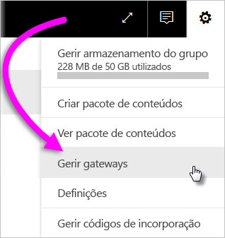
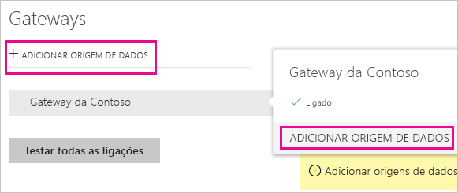
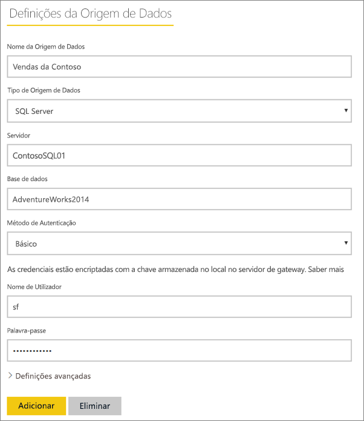
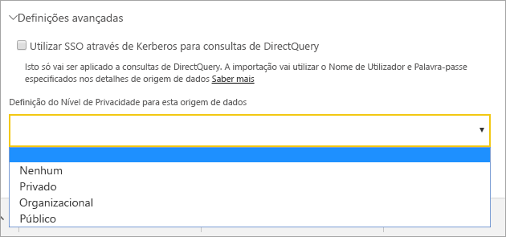
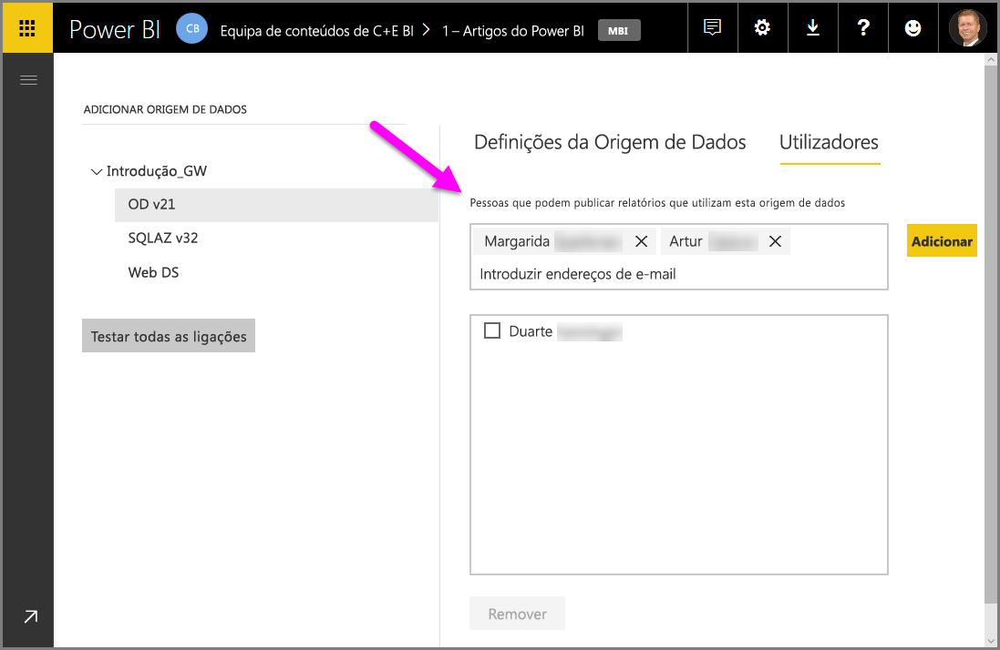
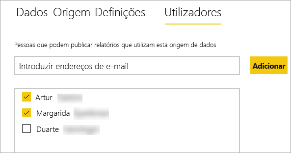
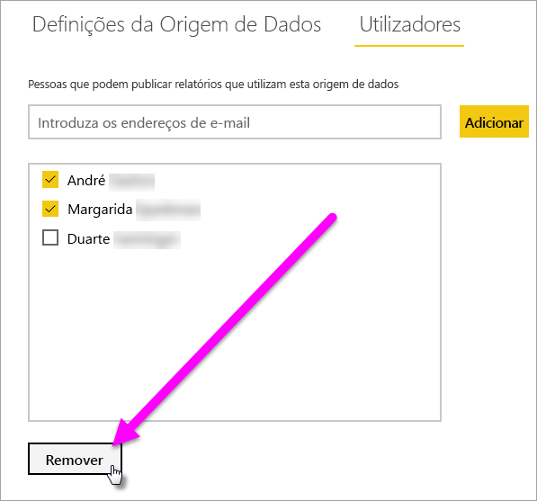
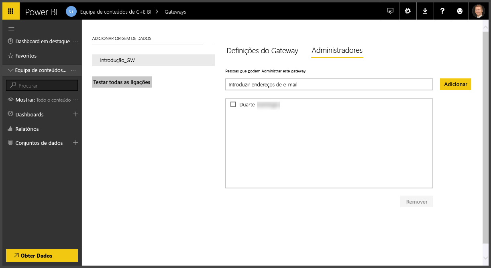
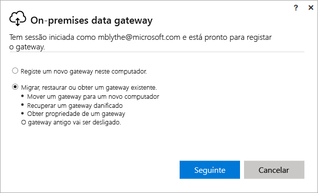
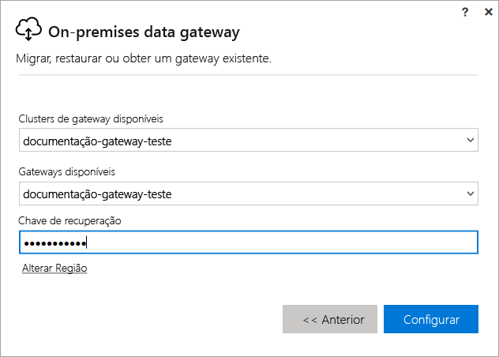

# Gerir um gateway no local do Power BI

Depois de [instalar um gateway de dados do Power BI](service-gateway-install.md), pode geri-lo com base nos seus requisitos. Neste tópico, vai aprender a: adicionar e remover origens de dados e utilizadores; reiniciar um gateway; e migrar, restaurar, assumir e remover um gateway.

Pode gerir um gateway através da área **Gerir gateways** do serviço Power BI, na aplicação de gateway no computador local e com scripts do PowerShell. Este artigo concentra-se no serviço Power BI.

Se instalou recentemente um gateway, recomendamos que [adicione uma origem de dados](#add-a-data-source) e, em seguida, [adicione utilizadores](#add-users-to-a-data-source) para que possam aceder à origem de dados.

## Gerir origens de dados

O Power BI suporta várias origens de dados no local, sendo que cada uma delas tem os seus próprios requisitos. Pode utilizar um gateway para uma única origem de dados ou para múltiplas origens de dados. Neste exemplo, vamos mostrar-lhe como adicionar o SQL Server como uma origem de dados, mas os passos são semelhantes para outras origens de dados.

### Adicionar uma origem de dados

1. No canto superior direito do serviço Power BI, selecione o ícone de engrenagem  > **Gerir gateways**.

    

1. Selecione um gateway > **Adicionar origem de dados** ou aceda a Gateways > **Adicionar origem de dados**.

    

1. Selecione o **Tipo de Origem de Dados**.

    

1. Introduza as informações da origem de dados. Neste exemplo, trata-se de **Servidor**, **Base de dados** e outras informações.  

    

1. Para o SQL Server, deveria escolher um **Método de Autenticação** do **Windows** ou **Básico** (Autenticação SQL).  Se optar por **Básico**, introduza as credenciais da sua origem de dados.

1. Em **Definições avançadas**, opcionalmente, configure o [nível de privacidade](https://support.office.com/article/Privacy-levels-Power-Query-CC3EDE4D-359E-4B28-BC72-9BEE7900B540) da sua origem de dados (não é aplicável ao [DirectQuery](desktop-directquery-about.md)).

    

1. Selecione **Adicionar**. Aparece a mensagem *Ligação Efetuada com Êxito* se o processo for bem-sucedido.

    

Agora, pode utilizar esta origem de dados para incluir dados do SQL Server nos seus dashboards e relatórios do Power BI.

### Remover uma origem de dados

Pode remover uma origem de dados se já não estiver a utilizá-la. Tenha em conta que a remoção de uma origem de dados interrompe todos os dashboards e relatórios que dependem dessa origem de dados.

Para remover uma origem de dados, aceda à origem de dados e, em seguida, selecione **Remover**.

## Gerir utilizadores e administradores

Depois de adicionar uma origem de dados para um gateway, concede a grupos de segurança e a utilizadores acesso à origem de dados específica (não a todo o gateway). A lista de utilizadores da origem de dados controla apenas quem está autorizado a publicar relatórios que incluam dados da origem de dados. Os proprietários de relatórios podem criar dashboards, pacotes de conteúdos e aplicações e, em seguida, partilhá-los com outros utilizadores.

Também pode conceder aos utilizadores e grupos de segurança acesso administrativo ao gateway.

### Adicionar utilizadores a uma origem de dados

1. No canto superior direito do serviço Power BI, selecione o ícone de engrenagem  > **Gerir gateways**.

2. Selecione a origem de dados onde pretende adicionar utilizadores.

3. Selecione **Utilizadores**e introduza um utilizador da sua organização a quem pretenda conceder acesso à origem de dados selecionada. No ecrã seguinte, pode ver que estou a adicionar a Margarida e o André.

    

4. Selecione **Adicionar** e o membro adicionado aparece na caixa.

    

E é tudo. Lembre-se que tem de adicionar utilizadores a cada origem de dados para o qual pretende conceder acesso. Cada origem de dados tem uma lista de utilizadores separada, e deve adicionar utilizadores a cada origem de dados em separado.

### Remover utilizadores de uma origem de dados

No separador **Utilizadores** da origem de dados, pode remover utilizadores e grupos de segurança que utilizam esta origem de dados.

### Adicionar e remover administradores

No separador **Administradores** no gateway, adicione e remova os utilizadores (ou grupos de segurança) que podem administrar o gateway.

## Gerir um cluster de gateways

Assim que criar um cluster dois ou mais gateways, todas as operações de gestão de gateway, como adicionar uma origem de dados ou conceder permissões administrativas a um gateway, aplicam-se a todos os gateways que façam parte do cluster. 

Quando os administradores utilizam o item de menu **Gerir gateways**, que se encontra abaixo do ícone de engrenagem no **serviço Power BI**, poderão ver a lista de clusters ou gateways individuais registados, mas não as instâncias de gateway individuais que são membros do cluster.

Todos os novos pedidos de **Atualização Agendada** e as operações do DirectQuery são encaminhados automaticamente para a instância principal de um determinado cluster de gateways. Se a instância de gateway principal não está online, o pedido é encaminhado para outra instância de gateway no cluster.

## Partilhar um gateway

Não é possível *partilhar* um gateway propriamente dito, mas pode adicionar administradores ao gateway e adicionar utilizadores às origens de dados do gateway. 

Depois de instalar um gateway, por predefinição, torna-se no administrador desse gateway. Conforme mostrado anteriormente, pode adicionar outras pessoas como administradores. Estes administradores podem adicionar origens de dados, configurar e remover o gateway.

Também pode atribuir utilizadores às origens de dados que cria em cada um dos gateways. Os utilizadores podem, em seguida, utilizar estas origens de dados para atualizar os relatórios do Power BI. No entanto, não podem alterar nenhuma das origens de dados ou das definições do gateway.

## Migrar, restaurar ou assumir um gateway

Execute o instalador do gateway no computador em que pretende migrar, restaurar ou assumir o gateway.

1. Transferir o gateway e instalá-lo.

2. Depois de ter iniciado sessão na sua conta do Power BI, registe o gateway. Selecione **Migrar, restaurar ou assumir um gateway existente** > **Seguinte**.

    

3. Selecione a partir dos clusters e gateways disponíveis e introduza a chave de recuperação do gateway selecionado. Selecione **Configurar**.

    

## Reiniciar um gateway

O gateway é executado como um serviço Windows. À semelhança de qualquer serviço do Windows, existem várias formas de o iniciar e parar. Veja como pode fazê-lo na linha de comandos.

1. No computador em que o gateway está em execução, inicie uma linha de comandos com privilégios de Administrador

2. Introduza `net stop PBIEgwService` para parar o serviço.

3. Introduza `net start PBIEgwService` para reiniciar o serviço.

## Remover um gateway

Pode remover um gateway se já não estiver a utilizá-lo. No entanto, tenha em atenção de que a remoção de um gateway elimina todas as origens de dados no mesmo. Por sua vez, esta ação interrompe todos os dashboards e relatórios que dependem dessas origens de dados.

1. No canto superior direito do serviço Power BI, selecione o ícone de engrenagem  > **Gerir gateways**.

2. Selecione o gateway > **Remover**
   
   

## Próximos passos

[Diretrizes para implementar um gateway de dados](service-gateway-deployment-guidance.md)

Mais perguntas? [Pergunte à Comunidade do Power BI](http://community.powerbi.com/)
