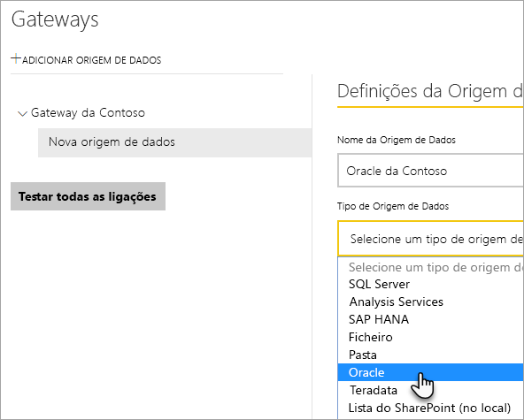
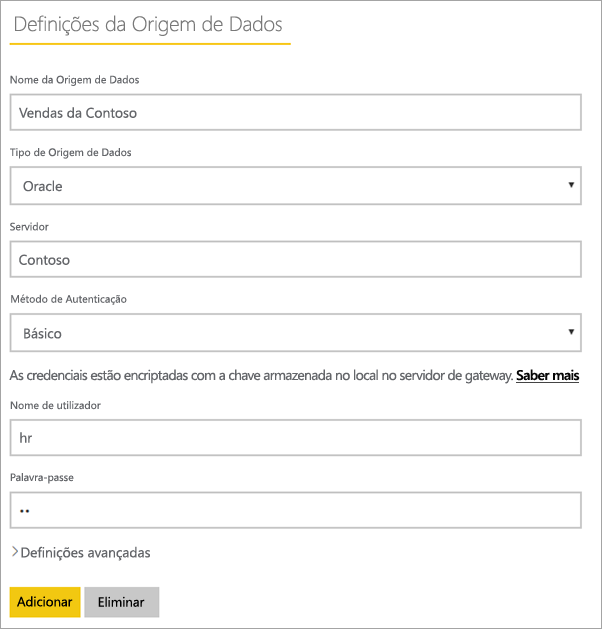
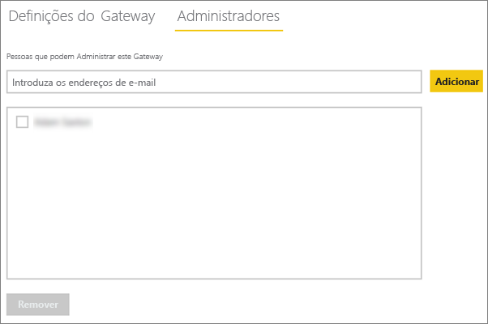
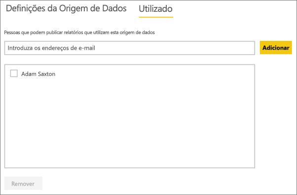
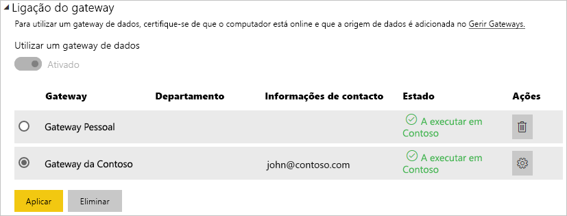

# <a name="manage-your-data-source---oracle"></a>Gerir a origem de dados – Oracle
Depois de instalar o Gateway de dados no local, terá de adicionar as origens de dados que podem ser utilizadas com o gateway. Este artigo abordará como trabalhar com gateways e origens de dados. Pode utilizar a origem de dados Oracle para a atualização agendada ou para o DirectQuery.

## <a name="download-and-install-the-gateway"></a>Transferir e instalar o gateway
Pode transferir o gateway a partir do serviço Power BI. Selecione **Transferências** > **Gateway de Dados** ou aceda à [página de transferência do gateway](https://go.microsoft.com/fwlink/?LinkId=698861).


> [!WARNING]
> Para o gateway conseguir ligar ao seu servidor Oracle, o Oracle Data Provider para .NET (ODP.NET) tem de estar instalado e configurado. Este processo faz parte do Oracle Data Access Components (ODAC). Para obter mais informações sobre como transferir o fornecedor Oracle, veja [Instalar o Cliente Oracle](#installing-the-oracle-client) abaixo.
> 
> 

## <a name="installing-the-oracle-client"></a>Instalar o cliente Oracle
Para as versões de **32 bits** do Power BI Desktop, utilize a seguinte ligação para transferir e instalar o cliente Oracle de **32 bits**:

* [Oracle Data Access Components (ODAC) de 32 bits com o Oracle Developer Tools for Visual Studio (12.1.0.2.4)](http://www.oracle.com/technetwork/topics/dotnet/utilsoft-086879.html)

Para as versões de **64 bits** do Power BI Desktop ou para o Gateway de dados no local, utilize a seguinte ligação para transferir e instalar o cliente Oracle de **64 bits**:

* [ODAC 12.2c Release 1 (12.2.0.1.0) de 64 bits para o Windows x64](http://www.oracle.com/technetwork/database/windows/downloads/index-090165.html)

Após a instalação, terá de configurar o ficheiro tnsnames.ora com as informações adequadas para a base de dados. O Power BI Desktop e o gateway sairão do net_service_name definido no ficheiro tnsnames.ora. Se não estiver configurado, não conseguirá estabelecer ligação. O caminho predefinido para tnsnames.ora é o seguinte: `[Oracle Home Directory]\Network\Admin\tnsnames.ora`. Para obter mais informações sobre como configurar ficheiros tnsnames.ora, veja [Oracle: Parâmetros de Nomenclatura Locais (tnsnames.ora)](https://docs.oracle.com/cd/B28359_01/network.111/b28317/tnsnames.htm).

### <a name="example-tnsnamesora-file-entry"></a>Entrada do ficheiro tnsnames.ora de exemplo
O formato básico de uma entrada no ficheiro tnsname.ora é o seguinte.

```
net_service_name=
 (DESCRIPTION=
   (ADDRESS=(protocol_address_information))
   (CONNECT_DATA=
     (SERVICE_NAME=service_name)))
```

Segue-se um exemplo do servidor e das informações da porta preenchidas.

```
CONTOSO =
  (DESCRIPTION =
    (ADDRESS = (PROTOCOL = TCP)(HOST = oracleserver.contoso.com)(PORT = 1521))
    (CONNECT_DATA =
      (SERVER = DEDICATED)
      (SERVICE_NAME = CONTOSO)
    )
  )
```

## <a name="add-a-gateway"></a>Adicionar um gateway
Para adicionar um gateway, basta [Transferir](https://go.microsoft.com/fwlink/?LinkId=698861) e instalar o gateway num servidor do seu ambiente. Depois de instalar o gateway, será apresentado na lista de gateways em **Gerir gateways**.

> [!NOTE]
> **Gerir gateways** não será apresentado até ser o administrador de, pelo menos, um gateway. Isto pode acontecer ao ser adicionado como um administrador ou ao instalar e configurar um gateway.
> 
> 

## <a name="remove-a-gateway"></a>Remover um gateway
A remoção de um gateway também elimina as origens de dados contidas no mesmo.  Isto também interromperá todos os dashboards e relatórios que dependem dessas origens de dados.

1. Selecione o ícone de engrenagem  no canto superior direito > **Gerir gateways**.
2. Gateway > **Remover**
   
   

## <a name="add-a-data-source"></a>Adicionar uma origem de dados
Pode adicionar uma origem de dados ao selecionar um gateway e clicar em **Adicionar origem de dados** ou ir para Gateway > **Adicionar origem de dados**.


Pode selecionar o **Tipo de Origem de Dados** na lista.



Em seguida, é necessário preencher as informações sobre a origem de dados, que incluem o **Servidor** e a **Base de Dados**.  

Também é necessário selecionar um **Método de Autenticação**.  Pode ser **Windows** ou **Básico**.  É recomendado selecionar **Básico** se quiser utilizar uma conta criada no Oracle em vez da Autenticação do Windows. Em seguida, insira as credenciais que serão utilizadas para esta origem de dados.

> [!NOTE]
> Todas as consultas à origem de dados serão executadas com estas credenciais. Para obter mais informações, veja o artigo principal sobre o Gateway de dados no local para saber mais sobre como as [credenciais](service-gateway-onprem.md#credentials) são armazenadas.
> 
> 



Pode clicar em **Adicionar** depois preencher tudo.  Agora, pode utilizar esta origem de dados para atualização agendada, ou DirectQuery, num servidor Oracle que esteja no local. Verá *Ligação Efetuada com Êxito* se for bem-sucedida.


### <a name="advanced-settings"></a>Definições avançadas
Pode configurar o nível de privacidade para a sua origem de dados. Controla a forma como os dados podem ser combinados. É utilizado apenas para a atualização agendada. Não se aplica ao DirectQuery. [Saiba mais](https://support.office.com/article/Privacy-levels-Power-Query-CC3EDE4D-359E-4B28-BC72-9BEE7900B540)


## <a name="remove-a-data-source"></a>Remover uma origem de dados
A remoção de uma origem de dados interromperá todos os dashboards ou relatórios que dependem da origem de dados em questão.  

Para remover uma Origem de Dados, vá para Origem de Dados > **Remover**.


## <a name="manage-administrators"></a>Gerir administradores
No separador Administradores no gateway, pode adicionar e remover os utilizadores (ou grupos de segurança) que podem administrar o gateway.



## <a name="manage-users"></a>Gerir utilizadores
No separador Utilizadores, da origem de dados, pode adicionar e remover os utilizadores ou grupos de segurança que podem utilizar esta origem de dados.

> [!NOTE]
> A lista de utilizadores controla apenas quem tem permissão para publicar relatórios. Os proprietários de relatório podem criar dashboards ou pacotes de conteúdos e partilhá-los com outros utilizadores. Os utilizadores que estão a consumir o relatório ou o dashboard não têm de estar na lista de utilizadores.
> 
> 



## <a name="using-the-data-source"></a>Utilizar a origem de dados
Depois de criar a origem de dados, esta ficará disponível para utilização com qualquer uma das ligações do DirectQuery ou através da atualização agendada.

> [!WARNING]
> Os nomes do servidor e da base de dados têm de corresponder entre o Power BI Desktop e a origem de dados do Gateway de dados no local!
> 
> 

A ligação entre o conjunto de dados e a origem de dados no gateway é baseada no nome do servidor e no nome da base de dados. Estes têm de corresponder! Por exemplo, se fornecer um Endereço IP para o nome do servidor, no Power BI Desktop, terá de utilizar o Endereço IP para a origem de dados na configuração do gateway. Este nome também tem de corresponder ao alias definido no ficheiro tnsnames.ora. Para obter mais informações sobre o ficheiro tnsnames.ora, veja [Instalar o Cliente Oracle](#installing-the-oracle-client).

Este é o caso do DirectQuery e da atualização agendada.

### <a name="using-the-data-source-with-directquery-connections"></a>Utilizar a origem de dados com ligações do DirectQuery
Terá de se certificar de que os nomes do servidor e da base de dados correspondem entre o Power BI Desktop e a origem de dados configurada para o gateway. Também terá de certificar-se de que o utilizador está listado no separador **Utilizadores** da origem de dados para poder publicar conjuntos de dados do DirectQuery. Para o DirectQuery, a seleção ocorre no Power BI Desktop quando importa dados pela primeira vez. [Saiba mais](desktop-use-directquery.md)

Depois de publicar, a partir do Power BI Desktop ou de **Obter Dados**, os seus relatórios devem começar a funcionar. Poderá demorar vários minutos, depois de criar a origem de dados dentro do gateway, para a ligação ser utilizável.

### <a name="using-the-data-source-with-scheduled-refresh"></a>Utilizar a origem de dados com a atualização agendada
Se estiver listado no separador **Utilizadores** da origem de dados configurada no gateway, e os nomes do servidor e da base de dados corresponderem, irá ver o gateway como uma opção a utilizar com a atualização agendada.



## <a name="troubleshooting"></a>Resolução de problemas
Pode encontrar vários erros do Oracle quando a sintaxe de nomenclatura estiver incorreta ou não estiver configurada corretamente.

* ORA-12154: TNS: não foi possível resolver o identificador de ligação especificado  
* ORA-12514: TNS: o serviço de escuta não conhece atualmente o serviço pedido no descritor de ligação  
* ORA-12541: TNS: nenhum serviço de escuta  
* ORA-12170: TNS: tempo limite da ligação excedido  
* ORA-12504: TNS: o serviço de escuta não foi atribuído a SERVICE_NAME em CONNECT_DATA  

Estes erros podem ocorrer se o cliente Oracle não estiver instalado ou se não estiver configurado corretamente. Se estiver instalado, certifique-se de que o ficheiro tnsnames.ora está configurado corretamente e está a utilizar o net_service_name adequado. Também terá de certificar-se de que o net_service_name é o mesmo entre o computador que está a utilizar o Power BI Desktop e o computador que está a executar o gateway. Para obter mais informações, veja [Instalar o Cliente Oracle](#installing-the-oracle-client).

> [!NOTE]
> Pode também estar a ocorrer um problema de compatibilidade entre a versão do servidor Oracle e a versão do cliente Oracle. Normalmente, estes têm de corresponder.
> 
> 

Para obter informações adicionais de resolução de problemas relacionadas com o gateway, veja [Resolução de problemas do Gateway de dados no local](service-gateway-onprem-tshoot.md).

## <a name="next-steps"></a>Próximos passos
[Gateway de dados no local](service-gateway-onprem.md)  
[Gateway de dados no local - detalhado](service-gateway-onprem-indepth.md)  
[Resolução de problemas do Gateway de dados no local](service-gateway-onprem-tshoot.md)  
[Power BI Premium](service-premium.md)

Mais perguntas? [Experimente perguntar à Comunidade do Power BI](http://community.powerbi.com/)

