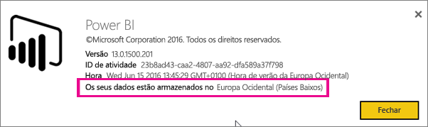
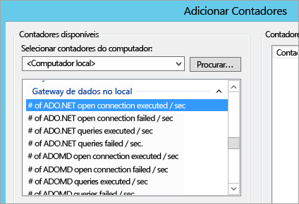
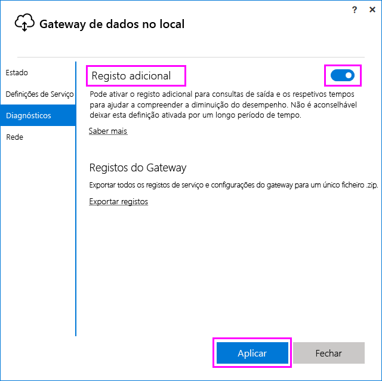
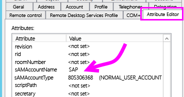
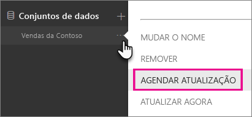
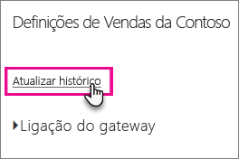
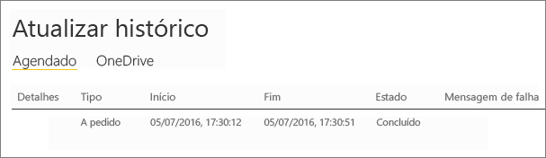

# <a name="troubleshooting-the-on-premises-data-gateway"></a>Resolução de Problemas do Gateway de Dados no Local
Este artigo aborda alguns problemas comuns que poderá encontrar ao utilizar o **Gateway de dados no local**.

<!-- Shared Community & support links Include -->
[!INCLUDE [gateway-onprem-tshoot-support-links-include](./includes/gateway-onprem-tshoot-support-links-include.md)]

<!-- Shared Troubleshooting Install Include -->
[!INCLUDE [gateway-onprem-tshoot-install-include](./includes/gateway-onprem-tshoot-install-include.md)]

## <a name="configuration"></a>Configuração
### <a name="how-to-restart-the-gateway"></a>Como reiniciar o gateway
O gateway é executado como um serviço Windows, para que o possa iniciar e parar de várias formas. Por exemplo, pode abrir uma linha de comandos com permissões elevadas na máquina onde o gateway está em execução e, em seguida, executar um dos seguintes comandos:

* Para parar o serviço, execute este comando:
  
    '''   net stop PBIEgwService   '''
* Para iniciar o serviço, execute este comando:
  
    '''   net start PBIEgwService   '''

### <a name="error-failed-to-create-gateway-please-try-again"></a>Erro: falha ao criar gateway. Tente novamente.
Todos os detalhes estão disponíveis, mas a chamada para o serviço Power BI devolveu um erro. O erro e um ID de atividade serão apresentados. Isto pode acontecer por diferentes motivos. Pode recolher e rever os registos, conforme mencionado abaixo, para obter mais detalhes.

Isto também pode dever-se a problemas de configuração de proxy. A interface de utilizador agora permite a configuração de proxy. Pode saber mais sobre como efetuar [alterações da configuração de proxy](service-gateway-proxy.md)

### <a name="error-failed-to-update-gateway-details--please-try-again"></a>Erro: falha ao atualizar detalhes do gateway.  Tente novamente.
As informações foram recebidas do serviço Power BI para o gateway. As informações foram transmitidas para o serviço Windows local, mas ocorreu uma falha ao devolver. Ou então ocorreu uma falha de geração de chave simétrica. A exceção interna será apresentada em **Mostrar detalhes**. Pode recolher e rever os registos, conforme mencionado abaixo, para obter mais detalhes.

### <a name="error-power-bi-service-reported-local-gateway-as-unreachable-please-restart-the-gateway-and-try-again"></a>Erro: o serviço Power BI reportou o gateway local como inacessível. Reinicie o gateway e repita a operação.
No final da configuração, o serviço Power BI será chamado novamente para validar o gateway. O serviço Power BI não reporta o gateway como *dinâmico*. Reiniciar o serviço Windows pode permitir que a comunicação seja bem-sucedida. Pode recolher e rever os registos, conforme mencionado abaixo, para obter mais detalhes.

### <a name="script-error-during-sign-into-power-bi"></a>Erro de script durante o início de sessão no Power BI
Poderá receber um erro de script ao iniciar sessão no Power BI, como parte da configuração do Gateway de dados no local. Instalar a seguinte atualização de segurança deve resolver o problema. Pode ser instalada através do Windows Update.

[MS16-051: atualização de segurança para o Internet Explorer: 10 de maio de 2016 (BDC 3154070)](https://support.microsoft.com/kb/3154070)

### <a name="gateway-configuration-failed-with-a-null-reference-exception"></a>A configuração do gateway falhou com uma exceção de referência nula
Pode encontrar um erro semelhante ao seguinte.

        Failed to update gateway details.  Please try again.
        Error updating gateway configuration.

Isto irá incluir um rastreio de pilha, e esse rastreio de pilha poderá incluir o seguinte.

        Microsoft.PowerBI.DataMovement.Pipeline.Diagnostics.CouldNotUpdateGatewayConfigurationException: Error updating gateway configuration. ----> System.ArgumentNullException: Value cannot be null.
        Parameter name: serviceSection

Se estiver a atualizar a partir de um gateway antigo, mantemos o ficheiro de configuração. Uma secção poderá estar em falta. Quando o gateway tenta lê-la, irá obter a exceção de referência nula mencionada acima.

Para corrigir isto, faça o seguinte.

1. Desinstale o gateway.
2. Elimine a pasta seguinte.
   
        c:\Program Files\On-premises data gateway
3. Reinstale o gateway.
4. Opcionalmente, aplique a chave de recuperação para restaurar um gateway existente.

### <a name="support-for-tls-1112"></a>Suporte para TLS 1.1/1.2
Com a atualização de agosto de 2017 e posterior, o gateway de dados no local utiliza o TLS (Transport Layer Security) 1.1 ou 1.2 para comunicar com o **serviço Power BI** por predefinição. As versões anteriores do gateway de dados no local utilizam o TLS 1.0 por predefinição. Em 1 de novembro de 2017, o suporte para o TLS 1.0 terminou, pelo que terá de atualizar as instalações dos Gateways de dados no local para a versão de agosto de 2017 ou mais recente, para garantir que os gateways continuam a funcionar.

É importante ter em atenção que o TLS 1.0 ainda é suportado pelo gateway de dados no local antes de 1 de novembro e é utilizado pelo gateway como um mecanismo de contingência. Para garantir que todo o tráfego de gateway utiliza o TLS 1.1 ou 1.2 (e para impedir a utilização de TLS 1.0 no seu gateway), tem de adicionar ou modificar as seguintes chaves de registo na máquina que executa o serviço de gateway:

        [HKEY_LOCAL_MACHINE\SOFTWARE\Microsoft\.NETFramework\v4.0.30319]"SchUseStrongCrypto"=dword:00000001
        [HKEY_LOCAL_MACHINE\SOFTWARE\Wow6432Node\Microsoft\.NETFramework\v4.0.30319]"SchUseStrongCrypto"=dword:00000001

> [!NOTE]
> Adicionar ou modificar estas chaves de registo aplica a alteração a todas as aplicações .NET. Para obter informações sobre as alterações de registo que afetam o TLS de outras aplicações, veja [Definições de registo do TLS (Transport Layer Security)](https://docs.microsoft.com/windows-server/security/tls/tls-registry-settings).
> 
> 

## <a name="data-sources"></a>Origens de dados
### <a name="error-unable-to-connect-details-invalid-connection-credentials"></a>Erro: não é possível ligar. Detalhes: "Credenciais de ligação inválidas"
Em **Mostrar detalhes**, deve ser apresentada a mensagem de erro recebida da origem de dados. Para o SQL Server, verá algo semelhante ao seguinte.

    Login failed for user 'username'.

Verifique se tem o nome de utilizador e a palavra-passe corretos. Verifique também se essas credenciais podem ligar à origem de dados com êxito. Verifique se a conta que está a ser utilizada corresponde ao **Método de Autenticação**.

### <a name="error-unable-to-connect-details-cannot-connect-to-the-database"></a>Erro: não é possível ligar. Detalhes: "Não é possível ligar à base de dados"
Conseguimos ligar ao servidor, mas não à base de dados fornecida. Verifique o nome da base de dados e se as credenciais do utilizador têm a permissão adequada para aceder a essa base de dados.

Em **Mostrar detalhes**, deve ser apresentada a mensagem de erro recebida da origem de dados. Para o SQL Server, verá algo semelhante ao seguinte.

    Cannot open database "AdventureWorks" requested by the login. The login failed. Login failed for user 'username'.

### <a name="error-unable-to-connect-details-unknown-error-in-data-gateway"></a>Erro: não é possível ligar. Detalhes: "Erro desconhecido no gateway de dados"
Este erro pode ocorrer por diferentes motivos. Não se esqueça de confirmar que pode ligar à origem de dados da máquina que aloja o gateway. Isto pode ocorrer devido ao facto de o servidor não estar acessível.

Em **Mostrar detalhes**, verá um código de erro **DM_GWPipeline_UnknownError**.

Também pode observar os Registos de Eventos > **Registos de Aplicações e Serviços** > **Serviço de Gateway de dados no local** para obter mais detalhes.

### <a name="error-we-encountered-an-error-while-trying-to-connect-to-server-details-we-reached-the-data-gateway-but-the-gateway-cant-access-the-on-premises-data-source"></a>Erro: encontramos um erro ao tentar ligar a <server>. Detalhes : “Alcançámos o gateway de dados, mas o gateway não consegue aceder à origem de dados no local”.
Não é possível ligar à origem de dados especificada. Certifique-se de que valida as informações fornecidas para essa origem de dados.

Em **Mostrar detalhes**, encontrará um código de erro de **DM_GWPipeline_Gateway_DataSourceAccessError**.

Se a mensagem de erro subjacente for semelhante à seguinte, isto significa que a conta que está a utilizar para a origem de dados não é um administrador do servidor para essa instância do Analysis Services. [Saiba mais](https://docs.microsoft.com/sql/analysis-services/instances/grant-server-admin-rights-to-an-analysis-services-instance)

    The 'CONTOSO\account' value of the 'EffectiveUserName' XML for Analysis property is not valid.

Se a mensagem de erro subjacente for semelhante à seguinte, pode significar que o atributo de diretório [token-groups-global-and-universal](https://msdn.microsoft.com/library/windows/desktop/ms680300.aspx) (TGGAU) pode estar em falta na conta de serviço do Analysis Services.

    The user name or password is incorrect.

Os domínios com acesso de compatibilidade anterior ao Windows 2000 terão o atributo TGGAU ativado. No entanto, os domínios criados mais recentemente não irão ativar este atributo, por predefinição. Pode ler mais sobre isto [aqui](https://support.microsoft.com/kb/331951).

Pode confirmar isto efetuando o seguinte procedimento.

1. Ligue à máquina do Analysis Services no SQL Server Management Studio. Nas propriedades de ligação Avançadas, inclua EffectiveUserName para o utilizador em questão e confira se o erro é reproduzido.
2. Pode utilizar a ferramenta dsacls do Active Directory para confirmar se o atributo está listado. Esta ferramenta encontra-se normalmente num controlador de domínio. Terá de saber qual é o nome de domínio único da conta e transmiti-lo à ferramenta.
   
        dsacls "CN=John Doe,CN=UserAccounts,DC=contoso,DC=com"
   
    Pretende ver algo semelhante ao seguinte nos resultados.
   
            Allow BUILTIN\Windows Authorization Access Group
                                          SPECIAL ACCESS for tokenGroupsGlobalAndUniversal
                                          READ PROPERTY

Para corrigir este problema, terá de ativar o TGGAU na conta utilizada para o serviço Windows do Analysis Services.

**Outra possibilidade para o nome de utilizador ou palavra-passe incorreta**

Este erro pode também dever-se ao facto de o servidor do Analysis Services estar num domínio diferente do domínio dos utilizadores e não estar estabelecida uma confiança bidirecional.

Terá de trabalhar com os administradores de domínios para verificar a relação de confiança entre os domínios.

**Não é possível visualizar as origens de dados do gateway na experiência “Obter Dados” do Analysis Services a partir do serviço Power BI**

Certifique-se de que a sua conta está listada no separador **Utilizadores** da origem de dados na configuração do gateway. Se não tiver acesso ao gateway, consulte o administrador do gateway e peça-lhe para verificar. Apenas as contas na lista **Utilizadores** irão ver a origem de dados listada na lista do Analysis Services.

## <a name="datasets"></a>Conjuntos de dados
### <a name="error-there-is-not-enough-space-for-this-row"></a>Erro: não existe espaço suficiente para esta linha.
Esta situação ocorrerá se tiver uma única linha com um tamanho superior a 4 MB. Terá de determinar qual linha pertence à sua origem de dados e tentar filtrá-la ou reduzir o tamanho dessa linha.

### <a name="error-the-server-name-provided-doesnt-match-the-server-name-on-the-sql-server-ssl-certificate"></a>Erro: o nome do servidor fornecido não corresponde ao nome do servidor no Certificado SSL do SQL Server.
Isto pode ocorrer quando o CN do certificado se destina ao nome de domínio completamente qualificado (FQDN) do servidor, mas só tiver fornecido o nome netbios do servidor. Isto irá provocar um erro de correspondência do certificado. Para resolver este problema, terá de fazer com que o nome do servidor na origem de dados do gateway e o ficheiro PBIX utilizem o FQDN do servidor.

### <a name="i-dont-see-the-on-premises-data-gateway-persent-when-configuring-scheduled-refresh"></a>Não consigo ver o Gateway de dados no local ao configurar a atualização agendada.
Isto pode dever-se a alguns cenários diferentes.

1. O nome do servidor e da base dados não correspondem entre o que foi introduzido no Power BI Desktop e a origem de dados configurada para o gateway. Estes têm de ser os mesmos valores. Não são sensíveis a maiúsculas e minúsculas.
2. A sua conta não está listada no separador **Utilizadores** da origem de dados na configuração do gateway. Terá de contactar o administrador do gateway para ser adicionado a essa lista.
3. O ficheiro do Power BI Desktop inclui várias origens de dados e nem todas foram configuradas com o gateway. Terá de definir cada origem de dados com o gateway, para que este seja apresentado na Atualização Agendada.

### <a name="error-the-received-uncompressed-data-on-the-gateway-client-has-exceeded-limit"></a>Erro: os dados não comprimidos recebidos no cliente do gateway excederam o limite.
A limitação exata é de 10 GB de dados não comprimidos por tabela. Se este problema ocorrer, existem boas opções para otimizar e evitar o problema. Em particular, reduzir a utilização de valores de cadeia altamente repetitivos e longos e, em alternativa, utilizar uma chave normalizada ou remover a coluna (se não estiver a ser utilizada) irá ajudar.

## <a name="reports"></a>Relatórios
### <a name="report-could-not-access-the-data-source-because-you-do-not-have-access-to-our-data-source-via-an-on-premises-data-gateway"></a>O relatório não pôde aceder à origem de dados porque não tem acesso aos nossos dados através de um Gateway de dados no local.
Geralmente, isto deve-se a um dos seguintes motivos.

1. As informações da origem de dados não correspondem às que estão no conjunto de dados subjacente. Os nomes do servidor e da base de dados têm de corresponder entre a origem de dados definida no Gateway de dados no local e o que fornecer no Power BI Desktop. Se utilizar um endereço IP no Power BI Desktop, a origem de dados do Gateway de dados no local terá de utilizar o mesmo endereço IP.
2. Não há uma origem de dados disponível em qualquer gateway na organização. Pode configurar a origem de dados num Gateway de dados no local novo ou existente.

### <a name="error-data-source-access-error-please-contact-the-gateway-administrator"></a>Error: erro de acesso à origem de dados. Contacte o administrador do gateway.
Se este relatório estiver a utilizar uma ligação em direto do Analysis Services, poderia deparar-se com o problema de um valor transmitido para o EffectiveUserName não ser válido ou não ter permissões na máquina do Analysis Services. Normalmente, um problema de autenticação deve-se ao facto de o valor que é transmitido para EffectiveUserName não corresponder a um nome principal de utilizador (UPN) local.

Para confirmação, pode fazer o seguinte.

1. Localize o nome do utilizador efetivo nos [registos do gateway](#logs).
2. Assim que o valor estiver a ser transmitido, confirme se está correto. Se for o seu utilizador, pode utilizar o seguinte comando numa linha de comandos para ver qual deve ser o UPN. O UPN terá um aspeto semelhante um endereço de e-mail.
   
        whoami /upn

Opcionalmente, pode ver o que o Power BI obtém do Azure Active Directory.

1. Navegue para [https://graphexplorer.cloudapp.net](https://graphexplorer.cloudapp.net).
2. Selecione **Iniciar Sessão** no canto superior direito.
3. Execute a consulta seguinte. Verá uma resposta JSON bastante grande.
   
        https://graph.windows.net/me?api-version=1.5
4. Procure **userPrincipalName**.

Se o UPN do Azure Active Directory não corresponder ao seu UPN local do Azure Active Directory, pode utilizar a funcionalidade [Mapear nomes de utilizador](service-gateway-enterprise-manage-ssas.md#map-user-names) para substituí-lo por um valor válido. Em alternativa, pode consultar o seu administrador de inquilinos ou administrador do Active Directory local para alterar o UPN.

<!-- Shared Troubleshooting Firewall/Proxy Include -->
[!INCLUDE [gateway-onprem-tshoot-firewall-include](./includes/gateway-onprem-tshoot-firewall-include.md)]

Pode saber qual a região do datacenter em que se encontra, efetuando o seguinte procedimento:

1. Selecione o **?** no canto superior direito do serviço Power BI.
2. Selecione **Sobre o Power BI**.
3. A região de dados estará listada em **Os seus dados estão armazenados no**.
   
    

Se, mesmo assim, não conseguir, pode tentar obter um rastreio de rede com uma ferramenta com o [fiddler](#fiddler) ou netsh, embora sejam métodos de recolha avançados e talvez precise de ajuda para analisar os dados recolhidos. Pode contactar o [suporte](https://support.microsoft.com) para obter assistência.

## <a name="performance"></a>Desempenho
<iframe width="560" height="315" src="https://www.youtube.com/embed/IJ_DJ30VNk4?showinfo=0" frameborder="0" allowfullscreen></iframe>

### <a name="performance-counters"></a>Contadores de Desempenho
Existem vários contadores de desempenho que podem ser utilizados para medir as atividades do gateway. Estes podem ser úteis para compreender se temos uma grande carga de atividade que requeira um novo gateway. Estes contadores não irão refletir o tempo de duração de uma tarefa.

Estes contadores podem ser acedidos através da ferramenta Monitor de Desempenho do Windows.



Não existem agrupamentos gerais destes contadores.

| Tipo de Contador | Descrição |
| --- | --- |
| ADO.NET |É utilizado para qualquer ligação DirectQuery. |
| ADOMD |É utilizado para o Analysis Services 2014 e versões anteriores. |
| OLEDB |É utilizado por determinadas origens de dados. Isto inclui o SAP HANA e Analysis Services 2016 ou posterior. |
| Aplicação Híbrida |Isto inclui qualquer origem de dados importada. Se estiver a agendar uma atualização ou a efetuar uma atualização a pedido, esta irá passar pelo motor de aplicação híbrida. |

Eis uma lista dos contadores de desempenho disponíveis.

| Contador | Descrição |
| --- | --- |
| N. º de ligações ADO.NET abertas executadas/seg |O número de ações de ligações ADO.NET abertas executadas por segundo (com êxito ou falhadas). |
| N. º de ligações ADO.NET abertas falhadas/seg |O número de ações de ligações ADO.NET abertas falhadas por segundo. |
| N. º de consultas ADO.NET executadas/seg |O número de consultas ADO.NET executadas por segundo (com êxito ou falhadas). |
| N. º de consultas ADO.NET falhadas/seg |O número de consultas ADO.NET falhadas executadas por segundo. |
| N. º de ligações ADOMD abertas executadas/seg |O número de ações de ligações ADOMD abertas executadas por segundo (com êxito ou falhadas). |
| N. º de ligações ADOMD abertas falhadas/seg |O número de ações de ligações ADOMD abertas falhadas por segundo. |
| N. º de consultas ADOMD executadas/seg |O número de consultas ADOMD executadas por segundo (com êxito ou falhadas). |
| N. º de consultas ADOMD falhadas/seg |O número de consultas ADOMD falhadas executadas por segundo. |
| N. º de todas as ligações abertas executadas/seg |O número de ações de ligações abertas executadas por segundo (com êxito ou falhadas). |
| N. º de todas as ligações abertas falhadas/seg |O número de ações de ligações abertas falhadas executadas por segundo. |
| N. º de todas as consultas executadas/seg |O número de consultas executadas por segundo (com êxito ou falhadas). |
| N. º de itens no conjunto de ligações ADO.NET |O número de itens no conjunto de ligações ADO.NET. |
| N. º de itens no conjunto de ligações OLEDB |O número de itens no conjunto de ligações OLEDB. |
| N. º de itens no conjunto do Service Bus |O número de itens no conjunto do Service Bus. |
| N. º de ligações de Aplicações Híbridas abertas executadas/seg |O número de ações de ligações de Aplicações Híbridas abertas executadas por segundo (com êxito ou falhadas). |
| N. º de ligações de Aplicações Híbridas abertas falhadas/seg |O número de ações de ligações de Aplicações Híbridas abertas falhadas por segundo. |
| N. º de consultas de Aplicações Híbridas executadas/seg |O número de consultas de Aplicações Híbridas executadas por segundo (com êxito ou falhadas). |
| N. º de consultas de Aplicações Híbridas falhadas/seg |O número de consultas de Aplicações Híbridas falhadas executadas por segundo |
| N. º de consultas OLEDB de vários conjuntos de resultados falhadas/seg |O número de consultas OLEDB de vários conjuntos de resultados falhadas executadas por segundo. |
| N. º de consultas OLEDB de vários conjuntos de resultados executadas/seg |O número de consultas OLEDB de vários conjuntos de resultados executadas por segundo (com êxito ou falhadas). |
| N. º de ligações OLEDB abertas executadas/seg |O número de ações de ligações OLEDB abertas executadas por segundo (com êxito ou falhadas). |
| N. º de ligações OLEDB abertas falhadas/seg |O número de ações de ligações OLEDB abertas falhadas por segundo. |
| N. º de consultas OLEDB executadas/seg |O número de consultas OLEDB de vários conjuntos de resultados executadas por segundo (com êxito ou falhadas). |
| N. º de consultas OLEDB falhadas/seg |O número de consultas OLEDB de vários conjuntos de resultados falhadas executadas por segundo. |
| N. º de consultas OLEDB de um único conjunto de resultados executadas/seg |O número de consultas OLEDB de um único conjunto de resultados executadas por segundo (com êxito ou falhadas). |
| N. º de consultas falhadas/seg |O número de consultas falhadas executadas por segundo. |
| N. º de consultas OLEDB de um único conjunto de resultados falhadas/seg |O número de consultas OLEDB de um único conjunto de resultados falhadas executadas por segundo. |

## <a name="reviewing-slow-performing-queries"></a>Rever as consultas com desempenho lento
Pode achar que a resposta através do gateway é lenta. Isto pode aplicar-se a consultas de DirectQuery ou ao atualizar um conjunto de dados importados. Pode ativar o registo adicional para consultas de saída e os respetivos tempos para ajudar a compreender a diminuição do desempenho. Quando encontrar uma consulta de execução longa, esta pode requerer a modificação adicional na sua origem de dados para otimizar o desempenho da consulta. Por exemplo, para ajustar os índices de uma consulta do SQL Server.

Terá de modificar dois ficheiros de configuração para determinar a duração de uma consulta.

### <a name="microsoftpowerbidatamovementpipelinegatewaycoredllconfig"></a>Microsoft.PowerBI.DataMovement.Pipeline.GatewayCore.dll.config
No ficheiro *Microsoft.PowerBI.DataMovement.Pipeline.GatewayCore.dll.config*, altere o valor `EmitQueryTraces`, de `False` para `True`. Este ficheiro está localizado, por predefinição, em *C:\Programas\Gateway de dados no local*. Ativar `EmitQueryTraces` começará a registar as consultas que são enviadas do gateway para uma origem de dados.

> [!IMPORTANT]
> Ativar EmitQueryTraces poderia aumentar o tamanho do registo significativamente, consoante a utilização do gateway. Quando tiver terminado de rever os registos, defina EmitQueryTraces para Falso. Não é aconselhável deixar esta definição ativada por um longo período de tempo.
> 
> 

```
<setting name="EmitQueryTraces" serializeAs="String">
    <value>True</value>
</setting>
```

**Entrada de consulta de exemplo**

```
DM.EnterpriseGateway Information: 0 : 2016-09-15T16:09:27.2664967Z DM.EnterpriseGateway    4af2c279-1f91-4c33-ae5e-b3c863946c41    d1c77e9e-3858-4b21-3e62-1b6eaf28b176    MGEQ    c32f15e3-699c-4360-9e61-2cc03e8c8f4c    FF59BC20 [DM.GatewayCore] Executing query (timeout=224) "<pi>
SELECT
TOP (1000001) [t0].[ProductCategoryName],[t0].[FiscalYear],SUM([t0].[Amount])
 AS [a0]
FROM
(
(select [$Table].[ProductCategoryName] as [ProductCategoryName],
    [$Table].[ProductSubcategory] as [ProductSubcategory],
    [$Table].[Product] as [Product],
    [$Table].[CustomerKey] as [CustomerKey],
    [$Table].[Region] as [Region],
    [$Table].[Age] as [Age],
    [$Table].[IncomeGroup] as [IncomeGroup],
    [$Table].[CalendarYear] as [CalendarYear],
    [$Table].[FiscalYear] as [FiscalYear],
    [$Table].[Month] as [Month],
    [$Table].[OrderNumber] as [OrderNumber],
    [$Table].[LineNumber] as [LineNumber],
    [$Table].[Quantity] as [Quantity],
    [$Table].[Amount] as [Amount]
from [dbo].[V_CustomerOrders] as [$Table])
)
 AS [t0]
GROUP BY [t0].[ProductCategoryName],[t0].[FiscalYear] </pi>"
```

### <a name="microsoftpowerbidatamovementpipelinediagnosticsdllconfig"></a>Microsoft.PowerBI.DataMovement.Pipeline.Diagnostics.dll.config
No ficheiro *Microsoft.PowerBI.DataMovement.Pipeline.Diagnostics.dll.config*, altere o valor `TracingVerbosity`, de `4` para `5`. Este ficheiro está localizado, por predefinição, em *C:\Programas\Gateway de dados no local*. Alterar esta definição começará a registar as entradas verbosas no registo do gateway. Isto inclui entradas que mostram a duração. Também pode ativar entradas verbosas ao ativar o botão “Registo Adicional” na aplicação Gateway no Local.

   

> [!IMPORTANT]
> A ativação de TracingVerbosity para `5` poderá aumentar significativamente o tamanho do registo, consoante a utilização do gateway. Quando tiver terminado de rever os registos, defina TraceVerbosity para `4`. Não é aconselhável deixar esta definição ativada por um longo período de tempo.
> 
> 

```
<setting name="TracingVerbosity" serializeAs="String">
    <value>5</value>
</setting>
```

<a name="activities"></a>

### <a name="activity-types"></a>Tipos de Atividade
| Tipo de Atividade | Descrição |
| --- | --- |
| MGEQ |Consultas executadas através de ADO.NET. Isto inclui outras origens de dados do DirectQuery. |
| MGEO |Consultas executadas através de OLEDB. Isto inclui o SAP HANA e Analysis Services 2016. |
| MGEM |Consultas executadas a partir do motor de Aplicação Híbrida. Isto é utilizado com conjuntos de dados importados que utilizam a atualização agendada ou a atualização a pedido. |

### <a name="determine-the-duration-of-a-query"></a>Determinar a duração de uma consulta
Para determinar o tempo de duração da consulta da origem de dados, pode fazer o seguinte.

1. Abra o registo do gateway.
2. Procure um [Tipo de Atividade](#activities) para localizar a consulta. Um exemplo seria MGEQ.
3. Tome nota do segundo GUID, uma vez que este é o id do pedido.
4. Continue a pesquisar MGEQ até encontrar a entrada FireActivityCompletedSuccessfullyEvent com a duração. Pode verificar que a entrada tem o mesmo id do pedido. A duração estará em milissegundos.
   
        DM.EnterpriseGateway Verbose: 0 : 2016-09-26T23:08:56.7940067Z DM.EnterpriseGateway    baf40f21-2eb4-4af1-9c59-0950ef11ec4a    5f99f566-106d-c8ac-c864-c0808c41a606    MGEQ    21f96cc4-7496-bfdd-748c-b4915cb4b70c    B8DFCF12 [DM.Pipeline.Common.TracingTelemetryService] Event: FireActivityCompletedSuccessfullyEvent (duration=5004)
   
   > [!NOTE]
   > FireActivityCompletedSuccessfullyEvent é uma entrada verbosa. Esta entrada não será registada, a menos que TraceVerbosity esteja no nível 5.
   > 
   > 

## <a name="kerberos"></a>Kerberos

Se o servidor de bases de dados subjacente e o Gateway de dados no local não estiverem configurados corretamente para a [Delegação Restrita de Kerberos](service-gateway-kerberos-for-sso-pbi-to-on-premises-data.md), ative o [registo verboso](#microsoftpowerbidatamovementpipelinediagnosticsdllconfig) no gateway e investigue com base nos erros/rastreios nos ficheiros de registo do gateway como um ponto de partida para a resolução de problemas.

### <a name="impersonationlevel"></a>ImpersonationLevel

O ImpersonationLevel está relacionado com a configuração do SPN ou a definição da política local.

```
[DataMovement.PipeLine.GatewayDataAccess] About to impersonate user DOMAIN\User (IsAuthenticated: True, ImpersonationLevel: Identification)
```

**Solução**

Siga estes passos para resolver o problema:
1. Configure um SPN para o Gateway no Local
2. Configure a delegação restrita no Active Directory (AD)

### <a name="failedtoimpersonateuserexception-failed-to-create-windows-identity-for-user-userid"></a>FailedToImpersonateUserException: falha ao criar a identidade do Windows para o ID do utilizador

FailedToImpersonateUserException ocorrerá se não for capaz de representar em nome de outro utilizador. Esta falha também poderá ocorrer se a conta que estiver a tentar representar for de outro domínio que não o domínio de serviço de gateway ativo (esta é uma limitação).

**Solução**
* Confirme se a configuração está correta de acordo com os passos na secção ImpersonationLevel acima
* Verifique se o ID de utilizador que está a tentar representar é uma conta AD válida

### <a name="general-error-1033-error-while-parsing-protocol"></a>Erro geral; erro 1033 ao analisar o protocolo

Obterá o erro 1033 quando o ID externo configurado no SAP HANA não corresponder ao início de sessão se o utilizador for representado com o UPN (alias@domain.com). Nos registos, verá o “UPN Original alias@domain.com substituído por um UPN novo alias@domain.com no topo dos registos de erros, como mostrado abaixo”.

```
[DM.GatewayCore] SingleSignOn Required. Original UPN 'alias@domain.com' replaced with new UPN 'alias@domain.com'.
```

**Solução**
* O SAP HANA requer que o utilizador representado utilize o atributo sAMAccountName no AD (alias do utilizador). Se este não estiver correto, verá o erro 1033.

    

* Nos registos, deverá ver sAMAccountName (alias) e não o UPN, que é o alias seguido do domínio (alias@doimain.com)

    

```
      <setting name="ADUserNameReplacementProperty" serializeAs="String">
        <value>sAMAccount</value>
      </setting>
      <setting name="ADServerPath" serializeAs="String">
        <value />
      </setting>
      <setting name="CustomASDataSource" serializeAs="String">
        <value />
      </setting>
      <setting name="ADUserNameLookupProperty" serializeAs="String">
        <value>AADEmail</value>
```

### <a name="sap-aglibodbchdb-dllhdbodbc-communication-link-failure-10709-connection-failed-rte-1-kerberos-error-major-miscellaneous-failure-851968-minor-no-credentials-are-available-in-the-security-package"></a>[SAP AG][LIBODBCHDB DLL][HDBODBC] Falha na ligação de comunicações;-10709 Falha na ligação (RTE:[-1] erro do Kerberos. Sério: “Falha diversa [851968]”, menor: “Nenhuma credencial disponível no pacote de segurança”

Receberá a mensagem de erro -10709 Falha na ligação se a sua delegação não estiver configurada corretamente no AD.

**Solução**
* Verifique se tem o servidor do SAP Hana no separador Delegação no AD da conta do serviço de gateway

   

<!-- Shared Troubleshooting tools Include -->
[!INCLUDE [gateway-onprem-tshoot-tools-include](./includes/gateway-onprem-tshoot-tools-include.md)]

### <a name="refresh-history"></a>Histórico de atualização
Ao utilizar o gateway para a atualização agendada, o **Histórico de Atualizações** pode ajudá-lo a ver os erros que ocorreram, além de fornecer dados úteis caso precise de criar um pedido de suporte. Pode ver as atualizações agendadas e a pedido. Aqui está como pode aceder ao **Histórico de Atualização**.

1. No painel de navegação do Power BI, em **Conjuntos de Dados** , selecione um conjunto de dados &gt; Abrir Menu &gt; **Agendar Atualização**.
   
    
2. Em **Definições para...** &gt; **Atualização Agendada**, selecione **Histórico de Atualizações**.
   
    
   
    

Para obter mais informações sobre a resolução de problemas em cenários de atualização, consulte o artigo [Resolução de problemas de cenários de atualização](refresh-troubleshooting-refresh-scenarios.md).

## <a name="next-steps"></a>Passos seguintes
[Configurar definições de proxy para os gateways do Power BI](service-gateway-proxy.md)  
[Gateway de dados no local](service-gateway-onprem.md)  
[Gateway de dados no local - detalhado](service-gateway-onprem-indepth.md)  
[Gerir a sua origem de dados – Analysis Services](service-gateway-enterprise-manage-ssas.md)  
[Gerir a sua origem de dados – SAP HANA](service-gateway-enterprise-manage-sap.md)  
[Gerir a sua origem de dados – SQL Server](service-gateway-enterprise-manage-sql.md)  
[Gerir a sua origem de dados – Atualização Importada/Agendada](service-gateway-enterprise-manage-scheduled-refresh.md)  
Mais perguntas? [Pergunte à Comunidade do Power BI](http://community.powerbi.com/)
