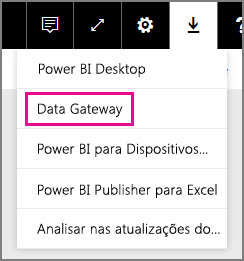
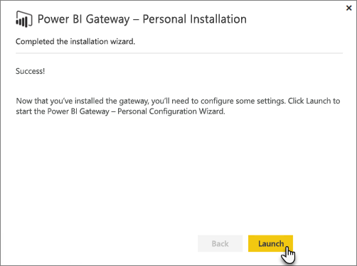
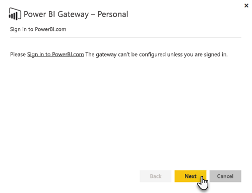
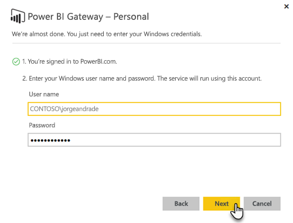

# Gateway de dados no local

O Gateway de dados no local funciona como uma ponte ao proporcionar a transferência rápida e segura de dados entre os dados no local (dados que não estão na cloud) e os serviços Power BI, Microsoft Flow, Logic Apps e PowerApps.

Pode utilizar um único gateway com diferentes serviços em simultâneo. Se estiver a utilizar o Power BI, bem como o PowerApps, pode utilizar um único gateway para ambos. Depende da conta com que inicia sessão.

> [!NOTE]
> O Gateway de dados no local implementa a compressão de dados e a encriptação de transporte em todos os modos.

<!-- Shared Requirements Include -->
[!INCLUDE [gateway-onprem-requirements-include](./includes/gateway-onprem-requirements-include.md)]

### Limitações das ligações em direto do Analysis Services

Pode utilizar uma ligação em direto para instâncias em tabela ou multidimensionais.

| **Versão do servidor** | **SKU necessário** |
| --- | --- |
| 2012 SP1 CU4 ou posterior |Business Intelligence e SKU Enterprise |
| 2014 |Business Intelligence e SKU Enterprise |
| 2016 |SKU Standard ou superior |

* As funcionalidades de conversão e Formatação ao nível da célula não são suportadas.
* As Ações e os Conjuntos com Nome não são expostos ao Power BI, mas pode ligar a cubos multidimensionais que também contêm Ações ou Conjuntos com Nome e criar elementos visuais e relatórios.

<!-- Shared Install steps Include -->
[!INCLUDE [gateway-onprem-datasources-include](./includes/gateway-onprem-datasources-include.md)]

## Transferir e instalar o Gateway de dados no local

Para transferir o gateway, selecione **Gateway de Dados** no menu Transferências. Transfira o [Gateway de dados no local](http://go.microsoft.com/fwlink/?LinkID=820925).

Tenha em atenção que a atualização do Gateway de dados no local é conseguida através da reinstalação do gateway, conforme descrito nesta secção. Desde que instale uma versão mais recente do gateway, as definições existentes são mantidas. Se instalar a mesma versão, será processada como uma reinstalação completa e as definições não serão mantidas.

<!-- Shared Install steps Include -->
[!INCLUDE [gateway-onprem-install-include](./includes/gateway-onprem-install-include.md)]

## Instalar o gateway no modo pessoal

> [!NOTE]
> A versão Personal do gateway só funciona com o Power BI.

Após a instalação do gateway pessoal, terá de iniciar o **Assistente de Configuração do Power BI Gateway - Personal**.

Em seguida, terá de iniciar sessão no Power BI para registar o gateway no serviço cloud.

Também terá de fornecer o nome de utilizador e a palavra-passe do Windows com os quais o serviço Windows será executado. Pode especificar uma conta Windows diferente da sua própria conta. O serviço do gateway será executado através dessa conta.

Após a conclusão da instalação, terá de aceder aos seus conjuntos de dados no Power BI e certificar-se de que as credenciais são introduzidas para as origens de dados no local.

## Armazenar credenciais encriptadas na cloud

Quando adiciona uma origem de dados ao gateway, é necessário fornecer credenciais para essa origem de dados. Todas as consultas à origem de dados serão executadas com essas credenciais. As credenciais são encriptadas com segurança, com a encriptação assimétrica, para que não possam ser desencriptadas na cloud antes de serem armazenadas na cloud. As credenciais são enviadas para o computador que executa o gateway no local, onde são desencriptadas quando as origens de dados são acedidas.

<!-- Account and Port information -->
[!INCLUDE [gateway-onprem-accounts-ports-more](./includes/gateway-onprem-accounts-ports-more.md)]

<!-- How the gateway works -->
[!INCLUDE [gateway-onprem-how-it-works-include](./includes/gateway-onprem-how-it-works-include.md)]

## Limitações e considerações

* O [Azure Information Protection](https://docs.microsoft.com/microsoft-365/enterprise/protect-files-with-aip
) não é atualmente suportado.
* O [Access Online](https://products.office.com/en-us/access) não é atualmente suportado.
* Os scripts R só são suportados se o gateway for executado no modo pessoal.

## Administração ao nível do inquilino

Enquanto administrador de inquilinos, poderá ver todos os gateways de dados no local instalados no seu inquilino e fazer a respetiva gestão. Esta funcionalidade está atualmente em modo de pré-visualização pública. Para obter mais informações, veja a [documentação do Centro de Administração da Plataforma Power](/power-platform/admin/onpremises-data-gateway-management).

Em alternativa, se for um administrador de inquilinos, recomendamos que peça aos utilizadores na sua organização para o adicionarem como administrador em cada gateway que instalarem. Isto permite-lhe gerir todos os gateways na sua organização através da página Definições do Gateway ou através de [comandos do PowerShell](service-gateway-high-availability-clusters.md#powershell-support-for-gateway-clusters). 

## Ativar as ligações de saída do Azure

O Gateway de dados no local baseia-se no Azure Service Bus para conectividade da cloud e estabelece ligações de saída de forma correspondente com a respetiva região do Azure associada. Por predefinição, esta é a localização do seu inquilino do Power BI. Veja [Onde está localizado o meu inquilino do Power BI?](https://powerbi.microsoft.com/en-us/documentation/powerbi-admin-where-is-my-tenant-located/)
Se uma firewall estiver a bloquear ligações de saída, tem de a configurar para permitir ligações de saída do Gateway de dados no local para a respetiva região do Azure associada. Veja [Microsoft Azure Datacenter IP Ranges](https://www.microsoft.com/download/details.aspx?id=41653) (Intervalos de IP do Microsoft Azure Datacenter) para obter detalhes sobre os intervalos de endereço IP de cada datacenter do Azure.
> [!NOTE]
> Os intervalos de endereço IP podem ser alterados ao longo do tempo, por isso certifique-se de que transfere as informações mais recentes regularmente. 

## Resolução de problemas

Se tiver problemas ao instalar e configurar um gateway, veja [Resolver problemas do Gateway de dados no local](service-gateway-onprem-tshoot.md). Se pensa que está a ter um problema com a firewall, veja a secção [firewall ou proxy](service-gateway-onprem-tshoot.md#firewall-or-proxy) do artigo de resolução de problemas.

Se pensa que está a ter problemas de proxy, com o gateway, veja [Configurar definições de proxy para os gateways do Power BI](service-gateway-proxy.md).

## Próximos passos

[Gerir a sua origem de dados – Analysis Services](service-gateway-enterprise-manage-ssas.md)  
[Gerir a sua origem de dados – SAP HANA](service-gateway-enterprise-manage-sap.md)  
[Gerir a sua origem de dados – SQL Server](service-gateway-enterprise-manage-sql.md)  
[Gerir a sua origem de dados – Oracle](service-gateway-onprem-manage-oracle.md)  
[Gerir a sua origem de dados - Atualização Importada/Agendada](service-gateway-enterprise-manage-scheduled-refresh.md)  
[Gateway de dados no local detalhado](service-gateway-onprem-indepth.md)  
[Gateway de dados no local (modo pessoal) – a nova versão do gateway pessoal](service-gateway-personal-mode.md)  
[Configurar as definições de proxy do Gateway de dados no local](service-gateway-proxy.md)  

Mais perguntas? [Pergunte à Comunidade do Power BI](http://community.powerbi.com/)
