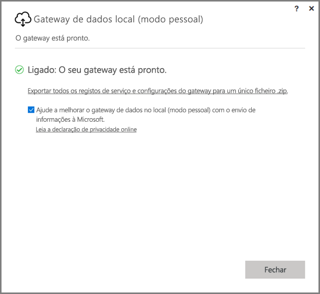
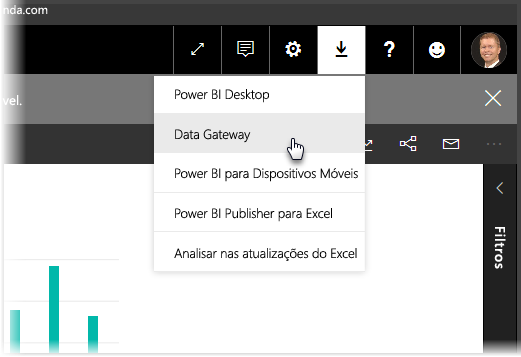
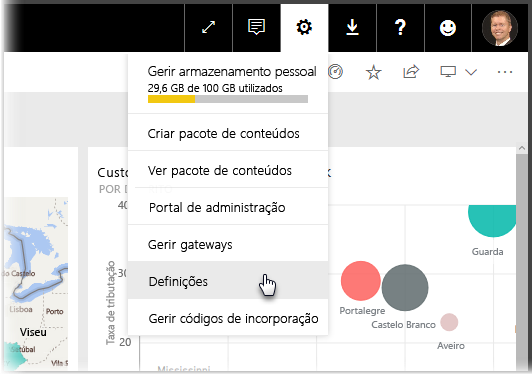
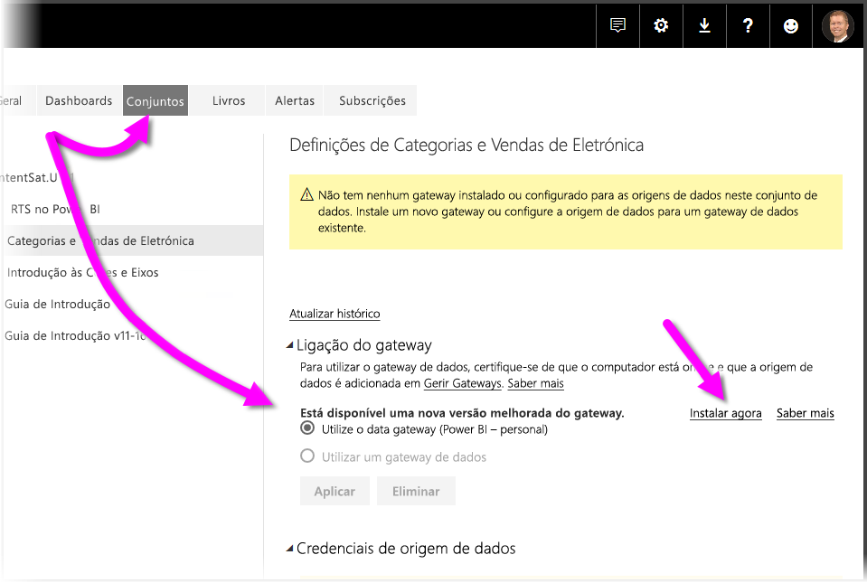
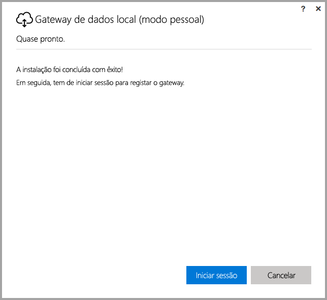
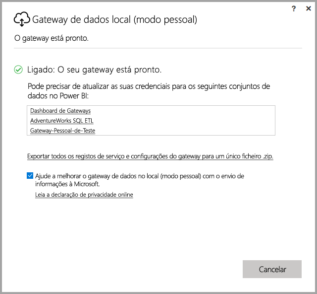

# <a name="on-premises-data-gateway-personal-mode"></a>Gateway de dados local (modo pessoal)
Pode utilizar origens de dados no local e criar relatórios do Power BI e dashboards com um gateway. Um **gateway** é um software que facilita o acesso aos dados que estão armazenados numa rede privada no local, e permite-lhe utilizar dados nos serviços online, como o **serviço do Power BI**. O **Gateway de dados no local (modo pessoal)** é uma atualização lançada recentemente do Power BI Gateway que permite aos indivíduos instalarem um gateway no próprio computador e obter acesso a dados no local.



> [!NOTE]
> O **Gateway de dados no local (modo pessoal)** substitui a versão anteriormente suportada do gateway pessoal, designado **Power BI Gateway – Personal**. O anterior gateway pessoal irá continuar a trabalhar apenas até 31 de julho de 2017. Veja as secções abaixo para obter informações sobre como atualizar para a nova versão.
> 
> 

## <a name="features-of-the-on-premises-data-gateway-personal-mode"></a>Funcionalidades do Gateway de dados no local (modo pessoal)
Com o lançamento do **Gateway de dados no local (modo pessoal)**, está agora disponível uma coleção de funcionalidades e melhorias. Na versão anterior do gateway pessoal (designado **Power BI Gateway - Personal**), a implementação impôs algumas limitações. Tal como acontece com muitos produtos do Power BI, ouvimos as necessidades e pedidos do cliente e a forma como utilizaram o produto. Como resultado, o **Gateway de dados no local (modo pessoal)** foi reestruturado a partir do zero e inclui as seguintes funcionalidades e melhorias:

* **Fiabilidade melhorada** - a nova versão do gateway pessoal melhorou a fiabilidade relativamente à versão anterior, devido às melhorias estruturais de software e de código.
* **Extensibilidade melhorada** - como parte das melhorias estruturais de software, as funcionalidades adicionais podem ser facilmente adicionadas ao gateway pessoal à medida que ficam disponíveis.
* **Elimine o gateway pessoal do serviço do Power BI** - com a nova versão, agora pode eliminar o seu gateway pessoal no **serviço do Power BI**.
* **Configuração e registos do serviço** - a nova versão permite-lhe facilmente exportar a configuração e os registos do serviço para um ficheiro .zip, com um único clique.

## <a name="installing-on-premises-data-gateway-personal-mode"></a>Instalar o Gateway de dados no local (modo pessoal)
Para instalar o **Gateway de dados no local (modo pessoal)** sem ter a versão anterior do gateway instalada, selecione o ícone de ferramenta no **serviço Power BI** e selecione **Dados do Gateway**.



Também pode transferir o gateway a partir [desta localização](https://go.microsoft.com/fwlink/?LinkId=820925&clcid=0x409). Pode seguir os passos de instalação, e uma vez que o processo de instalação lhe permite instalar a versão do gateway (o gateway padrão que pode ser partilhado com outras pessoas ou o modo pessoal), confirme que seleciona **Gateway de dados no local (modo pessoal)** quando lhe for perguntado qual é a versão do gateway que pretende instalar.

### <a name="updating-from-the-previous-personal-gateway"></a>Atualizar a partir do gateway pessoal anterior
Se já tiver o gateway do **Power BI Gateway - personal** instalado, ser-lhe-á pedido para instalar a nova versão melhorada do gateway pessoal quando visualiza **Conjuntos de Dados** em **Definições** no **Serviço do Power BI**.



Quando selecionar um conjunto de dados e, em seguida, selecionar **Ligação de Gateway**, é notificado de que a nova versão melhorada do gateway pessoal está disponível. Quando o fizer, selecione **Instalar agora**.



> [!NOTE]
> Se estiver a executar a versão anterior do **Power BI Gateway - personal** como um processo elevado, certifique-se de que inicia o novo processo de instalação do gateway igualmente elevado, para que as suas credenciais do conjunto de dados possam ser atualizadas automaticamente. Caso contrário, terá de atualizar manualmente as credenciais do conjunto de dados.
> 
> 

Será direcionado através do processo de atualização, após o qual, verá que a instalação foi concluída com êxito. Não feche já as coisas, existe um último passo.



Eis o último passo. Assim que o novo gateway pessoal estiver instalado (e o último ecrã de instalação ainda estiver visível), inicie sessão no **serviço do Power BI** e aguarde até ver que o gateway está online, conforme mostrado na imagem seguinte.



Se atualizou o gateway pessoal no mesmo computador em que o gateway anterior foi instalado, as suas credenciais serão atualizadas automaticamente e todas as atividades de atualização irão passar pelo novo gateway. Se o gateway anterior foi instalado num computador diferente, ser-lhe-á pedido para atualizar as credenciais em determinados conjuntos de dados. Na imagem anterior, repare na lista de conjuntos de dados na janela; a lista irá apresentar conjuntos de dados que poderão necessitar de credenciais atualizadas. Cada conjunto de dados listado é uma ligação direta em pode clicar para atualizar facilmente as suas credenciais.

Já está quase. Com o novo gateway instalado, já não precisa da versão anterior instalada no seu computador, pelo que deve desinstalá-la. Pode fazê-lo ao procurar por **Power BI Gateway - personal** no seu computador e desinstalá-lo.

### <a name="determining-which-version-of-the-personal-gateway-you-have-installed"></a>Determinar qual é a versão do gateway pessoal instalada
Para determinar qual é a versão do gateway pessoal atualmente instalada, pode fazer o seguinte:

* A versão anterior do gateway pessoal denomina-se **Power BI Gateway - Personal** e utiliza o ícone do Power BI na sua caixa de diálogo de instalação.
* A nova versão do gateway pessoal denomina-se **Gateway de dados no local (modo pessoal)** e utiliza o ícone de gateway (uma cloud com uma seta para cima e para baixo ao longo da parte inferior).

Pode aceder a **Adicionar/Remover Programas** e ver se o **Power BI Gateway - Personal** aparece na lista e, em caso afirmativo, tem a versão anterior do gateway pessoal instalado.

## <a name="using-fast-combine-with-the-personal-gateway"></a>Utilizar a opção de Combinação Rápida com o gateway pessoal
Se estava a utilizar a opção **Combinação Rápida** com o gateway anterior, terá de realizar os seguintes passos para reativar a **Combinação Rápida** para trabalhar com o **Gateway de dados no local (modo pessoal)**:

1. No Explorador de Ficheiros, abra o ficheiro seguinte:
   
   ```
   %localappdata%\Microsoft\On-premises data gateway (personal mode)\Microsoft.PowerBI.DataMovement.Pipeline.GatewayCore.dll.config
   ```
2. Na parte inferior do ficheiro, adicione o seguinte texto:
   
       ```
       <setting name="EnableFastCombine" serializeAs="String">```
       <value>true</value>
       </setting>
       ```
3. Assim que estiver concluído, a definição entra em vigor em cerca de um minuto. Para verificar se está a funcionar corretamente, experimente uma atualização a pedido no **serviço do Power BI** para confirmar que a **Combinação Rápida** está a funcionar.

## <a name="limitations-and-considerations"></a>Limitações e considerações
Existem alguns aspetos a considerar ao utilizar o **Gateway de dados no local (modo pessoal)**, conforme descrito na lista seguinte.

* Se estiver a utilizar o **Windows Hello** ou um PIN para iniciar sessão no Windows, poderá encontrar o seguinte erro: 
  * *A conta de utilizador que selecionou não coincide com os requisitos da aplicação. Utilize uma conta diferente.*
  * Para resolver este erro, selecione *Utilizar uma conta diferente* e inicie sessão novamente. 

As seguintes origens de dados não são atualmente suportadas no **Gateway de dados no local (modo pessoal)**:

* ADO.NET 
* CurrentWorkbook
* FTP
* HDFS
* SAP BusinessObjects         
* Spark

O suporte do Spark está planeado para o segundo semestre de 2017.

## <a name="frequently-asked-questions-faq"></a>Perguntas Frequentes (FAQ)
* Posso executar o **Gateway de dados no local (modo pessoal)** lado a lado com o **Gateway de dados no local** (anteriormente conhecido como a versão Empresarial do gateway)?
  
  * **Resposta**: Sim, com a nova versão, ambos podem ser executados em simultâneo.
* Posso executar o **Gateway de dados no local (modo pessoal)** como um serviço?
  
  * **Resposta:** Não. O **Gateway de dados no local (modo pessoal)** só pode ser executado como uma aplicação. Se precisar de executar o gateway como um serviço e/ou no modo de administrador, terá de considerar o [**Gateway de dados no local**](service-gateway-onprem.md) (anteriormente conhecido como o gateway Empresarial).
* Com que frequência é atualizado o **Gateway de dados no local (modo pessoal)**?
  
  * **Resposta**: Pretendemos atualizar o gateway pessoal mensalmente.
* Por que razão é-me pedido para atualizar as minhas credenciais?
  
  * **Resposta**: Muitas situações podem desencadear um pedido de credenciais. A mais comum prende-se com o facto de ter instalado novamente o **Gateway de dados no local (modo pessoal)** num computador diferente do gateway do **Power BI - Personal**. Também pode ser um problema na origem de dados e o Power BI não ter conseguido realizar uma ligação de teste, ter alcançado o tempo limite ou ocorrido um erro de sistema. Pode atualizar as suas credenciais no **serviço do Power BI** ao aceder ao **ícone de ferramenta** e selecionar **Definições**, **Conjuntos de dados**, encontrar o conjunto de dados em questão e clicar em *atualizar credenciais*.
* Quanto tempo os meus gateways pessoais anteriores estarão offline durante a atualização?
  
  * **Resposta**: Atualizar o gateway pessoal para a nova versão deverá demorar apenas alguns minutos. 
* O que acontece se não migrar para o novo gateway pessoal até 31 de julho de 2017?
  
  * **Resposta**: Se estiver a atualizar os seus relatórios com o gateway atual, as suas atualizações irão parar. A única forma de configurar uma nova agenda de atualização será instalar e configurar o novo gateway.
* Estou a utilizar o script R. É suportado?
  
  * **Resposta**: Os scripts R são suportados no modo pessoal.
* Porque não estou a ver a mensagem para atualizar o meu gateway no **serviço do Power BI**?
  
  * **Resposta**: Provavelmente porque tem um ou mais conjuntos de dados que incluem uma origem de dados que ainda não é atualmente suportada.

## <a name="next-steps"></a>Passos seguintes
[Configurar definições de proxy para os Gateways do Power BI](service-gateway-proxy.md)  
Mais perguntas? [Pergunte à Comunidade do Power BI](http://community.powerbi.com/)

