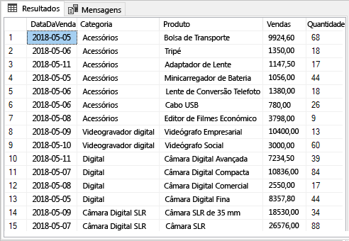
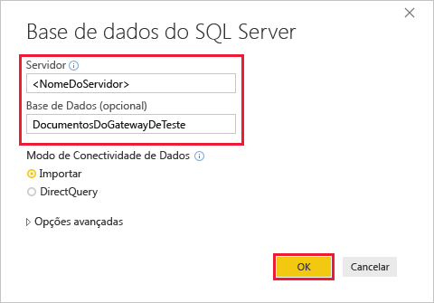
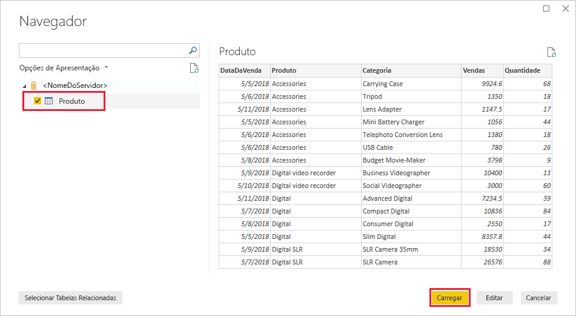
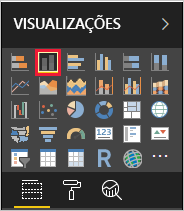
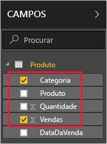
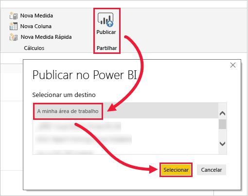
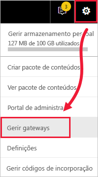
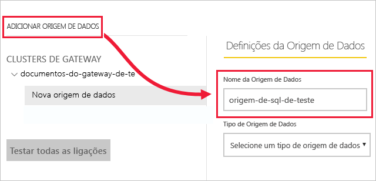
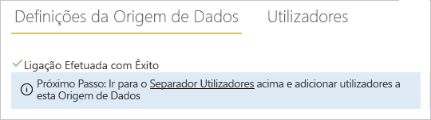
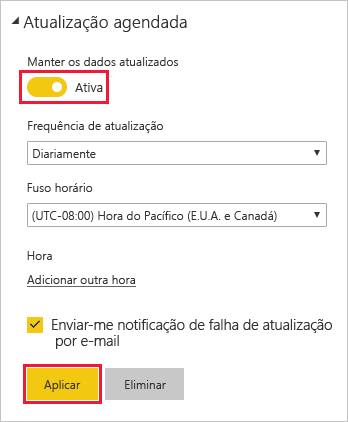

# <a name="tutorial-connect-to-on-premises-data-in-sql-server"></a>Tutorial: Ligar a dados no local no SQL Server

Um gateway de dados no local é software que instala dentro de uma rede no local; facilita o acesso aos dados nessa rede. Neste tutorial, vai criar um relatório no Power BI Desktop com base nos dados de exemplo importados a partir do SQL Server. Em seguida, publica o relatório no serviço Power BI e configura um gateway para que o serviço possa aceder os dados no local. Este acesso significa que o serviço pode atualizar os dados para manter o relatório atualizado.

Neste tutorial, vai aprender a:
> [!div class="checklist"]
> * Criar um relatório a partir dos dados no SQL Server
> * Publicar o relatório no Serviço Power BI
> * Adicionar o SQL Server como uma origem de dados do gateway
> * Atualizar os dados no relatório

Se não estiver inscrito no Power BI, [inscreva-se para uma avaliação gratuita](https://app.powerbi.com/signupredirect?pbi_source=web) antes de começar.


## <a name="prerequisites"></a>Pré-requisitos

* [Instalar o Power BI Desktop](https://powerbi.microsoft.com/desktop/)
* [Instalar o SQL Server](https://docs.microsoft.com/sql/database-engine/install-windows/install-sql-server) num computador local 
* [Instalar um gateway de dados no local](service-gateway-install.md) no mesmo computador local (na produção, normalmente, seria um computador diferente)


## <a name="set-up-sample-data"></a>Configurar dados de exemplo

Começa por adicionar dados de exemplo ao SQL Server, pelo que pode utilizar esses dados no resto do tutorial.

1. No SQL Server Management Studio (SSMS), ligue-se à sua instância do SQL Server e crie uma base de dados de teste.

    ```sql
    CREATE DATABASE TestGatewayDocs
    ```

2. Na base de dados que criou, adicione uma tabela e insira os dados.

    ```sql
    USE TestGatewayDocs

    CREATE TABLE Product (
        SalesDate DATE,
        Category  VARCHAR(100),
        Product VARCHAR(100),
        Sales MONEY,
        Quantity INT
    )

    INSERT INTO Product VALUES('2018-05-05','Accessories','Carrying Case',9924.60,68)
    INSERT INTO Product VALUES('2018-05-06','Accessories','Tripod',1350.00,18)
    INSERT INTO Product VALUES('2018-05-11','Accessories','Lens Adapter',1147.50,17)
    INSERT INTO Product VALUES('2018-05-05','Accessories','Mini Battery Charger',1056.00,44)
    INSERT INTO Product VALUES('2018-05-06','Accessories','Telephoto Conversion Lens',1380.00,18)
    INSERT INTO Product VALUES('2018-05-06','Accessories','USB Cable',780.00,26)
    INSERT INTO Product VALUES('2018-05-08','Accessories','Budget Movie-Maker',3798.00,9)
    INSERT INTO Product VALUES('2018-05-09','Digital video recorder','Business Videographer',10400.00,13)
    INSERT INTO Product VALUES('2018-05-10','Digital video recorder','Social Videographer',3000.00,60)
    INSERT INTO Product VALUES('2018-05-11','Digital','Advanced Digital',7234.50,39)
    INSERT INTO Product VALUES('2018-05-07','Digital','Compact Digital',10836.00,84)
    INSERT INTO Product VALUES('2018-05-08','Digital','Consumer Digital',2550.00,17)
    INSERT INTO Product VALUES('2018-05-05','Digital','Slim Digital',8357.80,44)
    INSERT INTO Product VALUES('2018-05-09','Digital SLR','SLR Camera 35mm',18530.00,34)
    INSERT INTO Product VALUES('2018-05-07','Digital SLR','SLR Camera',26576.00,88)
    ```

3. Selecione os dados da tabela para validação.

    ```sql
    SELECT * FROM Product
    ```

    


## <a name="build-and-publish-a-report"></a>Criar e publicar um relatório

Agora que tem dados de exemplo nos quais pode trabalhar, pode ligar-se ao SQL Server no Power BI Desktop e criar um relatório com base nesses dados. Em seguida, publica o relatório no serviço Power BI.

1. No Power BI Desktop, no separador **Base**, selecione **Obter Dados** > **SQL Server**.

2. Em **Servidor**, introduza o nome do seu servidor e, em **Base de dados** introduza “TestGatewayDocs”. Selecione **OK**. 

    

3. Valide as suas credenciais e, em seguida, selecione **Ligar**.

4. Em **Navegador**, selecione a tabela **Produto** e, em seguida, selecione **Carregar**.

    

5. Na vista **Relatório** do Power BI Desktop, no painel **Visualizações**, selecione o **Gráfico de colunas empilhadas**.

        

6. Com o gráfico de colunas selecionado na tela do relatório, no painel **Campos**, selecione os campos **Produto** e **Vendas**.  

    

    O gráfico deverá passar a ter este aspeto.

    

    Tenha em atenção que **Câmara SLR** é o líder de vendas atual. Esta situação vai mudar quando atualizar os dados e atualizar o relatório numa fase posterior deste tutorial.

7. Guarde o relatório com o nome "TestGatewayDocs.pbix".

8. No separador **Base**, selecione **Publicar** > **A Minha Área de Trabalho** > **Selecionar**. Caso lhe seja solicitado, inicie sessão no serviço Power BI. 

    

9. No ecrã **Êxito**, selecione **Abrir “TestGatewayDocs.pbix” no Power BI**.


## <a name="add-sql-server-as-a-gateway-data-source"></a>Adicionar o SQL Server como uma origem de dados do gateway

No Power BI Desktop, liga-se diretamente ao SQL Server, mas o serviço Power BI exige que um gateway atue como uma ponte. Agora, deve adicionar a sua instância do SQL Server como origem de dados para o gateway que criou num artigo anterior (indicado em [Pré-requisitos](#prerequisites)). 

1. No canto superior direito do serviço Power BI, selecione o ícone de engrenagem  > **Gerir gateways**.

    

2. Selecione **Adicionar origem de dados** e introduza “test-sql-source” para o **Nome da Origem de Dados**.

    

3. Selecione um **Tipo de Origem de Dados** do **SQL Server** e, em seguida, introduza outros valores, conforme mostrado.

    


   |          Opção           |                                               Valor                                                |
   |---------------------------|----------------------------------------------------------------------------------------------------|
   |   **Nome da Origem de Dados**    |                                          test-sql-source                                           |
   |   **Tipo de Origem de Dados**    |                                             SQL Server                                             |
   |        **Servidor**         | O nome da sua instância do SQL Server (tem de ser idêntico ao que especificou no Power BI Desktop) |
   |       **Base de dados**        |                                          TestGatewayDocs                                           |
   | **Método de Autenticação** |                                              Windows                                               |
   |       **Nome de utilizador**        |             A conta, como michael@contoso.com, que utiliza para se ligar ao SQL Server             |
   |       **Palavra-passe**        |                   A palavra-passe da conta que utiliza para se ligar ao SQL Server                    |


4. Selecione **Adicionar**. Aparece a mensagem *Ligação Efetuada com Êxito* quando o processo for bem-sucedido.

    

    Agora, pode utilizar esta origem de dados para incluir dados do SQL Server nos seus dashboards e relatórios do Power BI.


## <a name="configure-and-use-data-refresh"></a>Configurar e utilizar atualização de dados

Tem um relatório publicado no serviço Power BI e a origem de dados do SQL Server configurada. Com estes fatores estabelecidos, agora efetua uma alteração na tabela Produto, sendo que essa alteração passa pelo gateway até ao relatório publicado. Também configura a atualização agendada para processar quaisquer alterações futuras.

1. No SSMS, atualize os dados na tabela Produto.

    ```sql
    UPDATE Product
    SET Sales = 32508, Quantity = 252
    WHERE Product='Compact Digital'     

    ```

2. No Serviço Power BI, no painel de navegação à esquerda, selecione **A Minha Área de Trabalho**.

3. Em **Conjuntos de dados**, para o conjunto de dados **TestGatewayDocs**, selecione **mais** (**. . .**) > **Atualizar agora**.

    

4. Selecione **A Minha Área de Trabalho** > **Relatórios** > **TestGatewayDocs**. Veja como a atualização se processou e como o líder de vendas passou a ser a **Compact Digital**. 

    

5. Selecione **A Minha Área de Trabalho** > **Relatórios** > **TestGatewayDocs**. Selecione **mais** (**. . .**) > **Agendar atualização**.

6. Em **Agendar atualização**, defina atualizar para **Ligada** e, em seguida, selecione **Aplicar**. O conjunto de dados é atualizado diariamente por predefinição.

    

## <a name="clean-up-resources"></a>Limpar recursos
Se quiser deixar de utilizar os dados de exemplo, execute `DROP DATABASE TestGatewayDocs` no SSMS. Se não quiser utilizar a origem de dados do SQL Server, [remova a origem de dados](service-gateway-manage.md#remove-a-data-source). 


## <a name="next-steps"></a>Próximos passos
Neste tutorial, aprendeu a:
> [!div class="checklist"]
> * Criar um relatório a partir dos dados no SQL Server
> * Publicar o relatório no Serviço Power BI
> * Adicionar o SQL Server como uma origem de dados do gateway
> * Atualizar os dados no relatório

Avance para o artigo seguinte para saber mais
> [!div class="nextstepaction"]
> [Gerir um Gateway do Power BI](service-gateway-manage.md)

