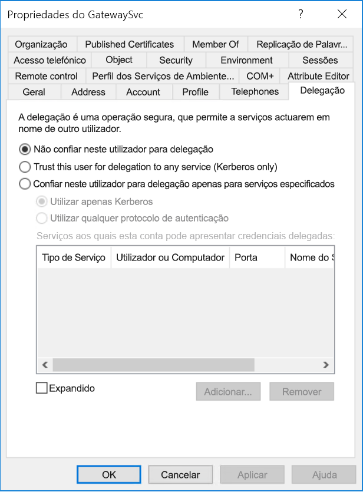
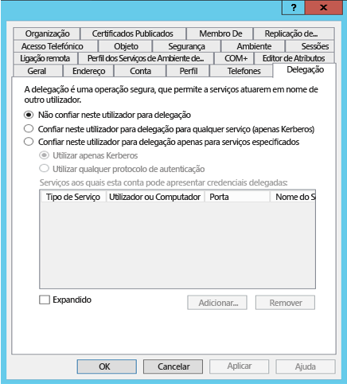
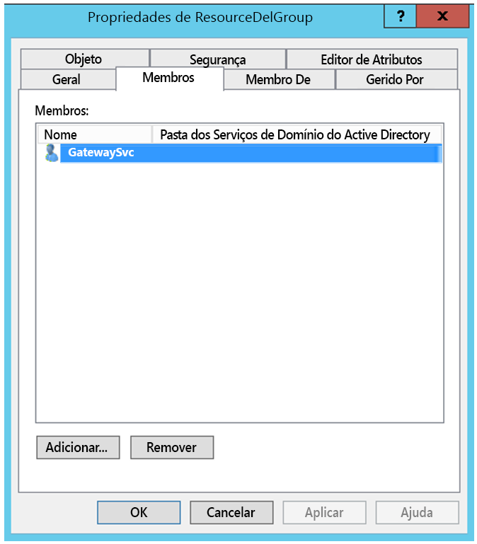
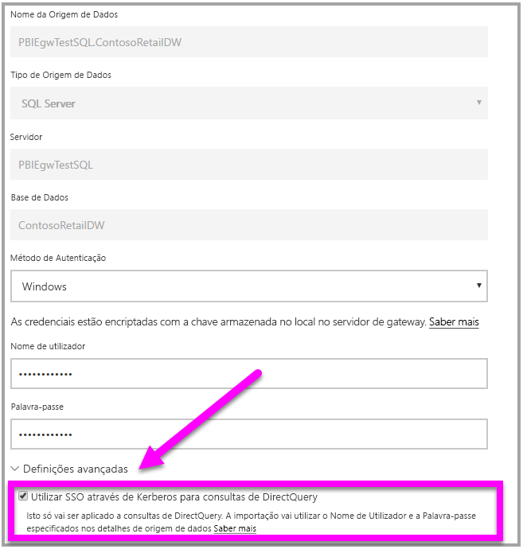

# <a name="use-resource-based-kerberos-for-single-sign-on-sso-from-power-bi-to-on-premises-data-sources"></a>Utilizar o Kerberos baseado em recursos para o início de sessão único (SSO) no Power BI para as origens de dados no local

Utilize a [delegação restrita de Kerberos baseada em recursos](/windows-server/security/kerberos/kerberos-constrained-delegation-overview) para ativar a conectividade de início de sessão único para o Windows Server 2012 e versões posteriores, ao permitir serviços de front-end e back-end para estar em domínios diferentes. Para funcionar, o domínio do serviço de back-end tem de confiar no domínio do serviço de front-end.

## <a name="preparing-for-resource-based-kerberos-constrained-delegation"></a>Preparar para a delegação restrita de Kerberos baseada em recursos

Vários itens têm de ser configurados para que a Delegação Restrita de Kerberos funcione corretamente, incluindo os _Nomes dos Principais do Serviço_ (SPN) e as definições de delegação em contas de serviço.

### <a name="prerequisite-1-operating-system-requirements"></a>Pré-requisito 1: Requisitos do sistema operativo

A delegação restrita baseada em recursos só pode ser configurada num controlador de domínio a executar o Windows Server 2012 R2 ou Windows Server 2012 ou superior.

### <a name="prerequisite-2-install-and-configure-the-on-premises-data-gateway"></a>Pré-requisito 2: instalar e configurar o gateway de dados no local

O gateway de dados no local suporta uma atualização no local e o _controlo das definições_ dos gateways existentes.

### <a name="prerequisite-3-run-the-gateway-windows-service-as-a-domain-account"></a>Pré-requisito 3: executar o serviço Windows do gateway como uma conta de domínio

Numa instalação padrão, o gateway é executado como uma conta de serviço da máquina local (especificamente, _NT Service\PBIEgwService_), conforme é mostrado na imagem seguinte:


Para ativar a **Delegação Restrita de Kerberos, o gateway tem de ser executado como uma conta de domínio, a menos que o Azure AD já esteja sincronizado com o Active Directory local (através do Azure AD DirSync/Connect). Se precisar de mudar a conta para uma conta de domínio, veja [Change the gateway service account](/data-integration/gateway/service-gateway-service-account) (Alterar a conta do serviço de gateway).

Se o Azure AD DirSync/Connect estiver configurado e as contas de utilizador estiverem sincronizadas, o serviço de gateway não precisará de realizar pesquisas de AD locais no runtime. Pode utilizar o SID de Serviço local (em vez de exigir uma conta de domínio) para o serviço de gateway. Os passos de configuração da Delegação Restrita de Kerberos descritos neste artigo são os mesmos da configuração (a diferença é que são aplicados ao objeto do computador do gateway no Active Directory, em vez de à conta do domínio).

### <a name="prerequisite-4-have-domain-admin-rights-to-configure-spns-setspn-and-kerberos-constrained-delegation-settings"></a>Pré-requisito 4: ter direitos de administrador de domínio para configurar as definições de delegação restrita de Kerberos e SPN (SetSPN)

Embora seja tecnicamente possível que um administrador de domínio conceda direitos, temporária ou permanentemente, a outro utilizador para configurar SPNs e a delegação Kerberos, sem serem necessários direitos de administração do domínio, esta não é a abordagem recomendada. Na secção seguinte, vamos descrever os passos necessários para a configuração do **Pré-requisito 3** em detalhe.

## <a name="configuring-kerberos-constrained-delegation-for-the-gateway-and-data-source"></a>Configurar a delegação restrita de Kerberos para o gateway e a origem de dados

Para configurar corretamente o sistema, é preciso configurar ou validar os dois seguintes itens:

* Se for necessário, configure um SPN para a conta de domínio do serviço de gateway.

* Configure as definições de delegação na conta de domínio do serviço de gateway.

Tenha em atenção que tem de ser um administrador de domínio para efetuar esses dois passos de configuração.

As secções seguintes descrevem estes passos, um de cada vez.

### <a name="configure-an-spn-for-the-gateway-service-account"></a>Configurar um SPN para a conta do serviço de gateway

Em primeiro lugar, determine se já foi criado um SPN para a conta de domínio utilizada como a conta do serviço de gateway, ao seguir estes passos:

1. Como administrador de domínio, inicie **Utilizadores e Computadores do Active Directory**.

1. Clique com o botão direito no domínio, selecione **Localizar** e escreva o nome da conta do serviço de gateway.

1. No resultado da pesquisa, clique com o botão direito do rato na conta do serviço de gateway e selecione **Propriedades**.

1. Se o separador **Delegação** for apresentado na caixa de diálogo **Propriedades**, isso significa que já foi criado um SPN e pode ir diretamente para a subsecção seguinte sobre como [configurar definições de Delegação](#configure-delegation-settings).

    Se não existir nenhum separador **Delegação** na caixa de diálogo **Propriedades**, pode criar manualmente um SPN nessa conta, que adiciona o separador **Delegação** (é a forma mais fácil de configurar as definições de delegação). Criar um SPN pode ser feito com a [ferramenta setspn](https://technet.microsoft.com/library/cc731241.aspx) fornecida com o Windows (precisa de direitos de administrador de domínio para criar o SPN).

    Por exemplo, imagine que a conta do serviço de gateway é “PBIEgwTest\GatewaySvc” e que o nome do computador que executa o serviço de gateway é **Machine1**. Para definir o SPN para a conta do serviço de gateway para essa máquina neste exemplo, pode executar o seguinte comando:

      

    Com esse passo concluído, podemos avançar para a configuração das definições de delegação.

### <a name="configure-delegation-settings"></a>Configurar as definições de delegação

Nos passos seguintes, utilizamos um ambiente no local com dois computadores em domínios diferentes: um computador do gateway e um servidor de base de dados com SQL Server. Para efeitos deste exemplo, vamos utilizar os seguintes nomes e definições:

* Nome do computador do gateway: **PBIEgwTestGW**
* Conta do serviço de gateway: **PBIEgwTestFrontEnd\GatewaySvc** (nome a apresentar da conta: Conector do Gateway)
* Nome do computador da origem de dados do SQL Server: **PBIEgwTestSQL**
* Conta do serviço da origem de dados do SQL Server: **PBIEgwTestBackEnd\SQLService**

Considerando estes nomes e definições de exemplo, utilize os seguintes passos de configuração:

1. Ao utilizar **Utilizadores e Computadores do Active Directory**, que é um snap-in da Consola de Gestão da Microsoft (MMC), no controlador do domínio **PBIEgwTestFront-end**, confirme que não são aplicadas definições de delegação para a conta do serviço de gateway.

    

1. Ao utilizar **Utilizadores e Computadores do Active Directory**, no controlador do domínio **PBIEgwTestBack-end**, confirme que não são aplicadas definições de delegação para a conta do serviço de back-end. Confirme também que o atributo “msDS-AllowedToActOnBehalfOfOtherIdentity” desta conta também não está definido. Pode encontrar este atributo no “Editor de Atributos”, conforme mostrado na imagem seguinte:

    

1. Crie um grupo em **Utilizadores e Computadores do Active Directory**, no controlador do domínio **PBIEgwTestBack-end**. Adicione a conta do serviço de gateway a este grupo, conforme mostrado na imagem seguinte. A imagem mostra um novo grupo denominado _ResourceDelGroup_ e a conta do serviço de gateway **GatewaySvc** adicionada a este grupo.

    

1. Abra uma linha de comandos e execute os seguintes comandos no controlador do domínio **PBIEgwTestBack-end** para atualizar o atributo msDS-AllowedToActOnBehalfOfOtherIdentity da conta do serviço de back-end:

    ```powershell
    $c = Get-ADGroup ResourceDelGroup
    Set-ADUser SQLService -PrincipalsAllowedToDelegateToAccount $c
    ```

1. Pode verificar que a atualização é refletida no separador “Editor de Atributos” nas propriedades da conta do serviço de back-end em **Utilizadores e Computadores do Active Directory**.

Por fim, no computador que executa o serviço de gateway (**PBIEgwTestGW** no nosso exemplo), tem de ser concedida à conta do serviço de gateway a política local “Representar um cliente após autenticação”. Pode efetuar/verificar isto com o Editor de Políticas de Grupo Local (**gpedit**).

1. Na máquina do gateway, execute: _gpedit.msc_.

1. Navegue para **Política de Computador Local > Configuração do Computador > Definições do Windows > Definições de Segurança > Políticas Locais > Atribuição de Direitos de Utilizadores**, conforme mostrado na imagem seguinte.

    

1. Na lista de políticas em **Atribuição de Direitos de Utilizadores**, selecione **Representar um cliente após autenticação**.

    

1. Clique com botão direito do rato e abra as **Propriedades** de **Representar um cliente após autenticação** e verifique a lista de contas. Tem de incluir a conta do serviço de gateway (**PBIEgwTestFront-end** **\GatewaySvc**).

1. Na lista de políticas em **Atribuição de Direitos de Utilizadores**, selecione **Atuar como parte do sistema operativo (SeTcbPrivilege)** . Certifique-se de que a conta do serviço de gateway também está incluída na lista de contas.

1. Reinicie o processo do serviço de **Gateway de dados no local**.

## <a name="running-a-power-bi-report"></a>Executar um relatório do Power BI

Depois de concluir todos os passos de configuração indicados neste artigo, pode utilizar a página **Gerir Gateway** no Power BI para configurar a origem de dados. Em seguida, nas **Definições Avançadas**, ative o SSO e publique relatórios e conjuntos de dados vinculados a essa origem de dados.



Esta configuração irá funcionar na maioria dos casos. No entanto, com o Kerberos podem existir configurações diferentes, dependendo do seu ambiente. Se, ainda assim, o relatório não carregar, terá de contactar o administrador de domínio para uma investigação mais aprofundada.

## <a name="next-steps"></a>Próximos passos

Para obter mais informações sobre o **gateway de dados no local** e o **DirectQuery**, consulte os seguintes recursos:

* [What is an on-premises data gateway?](/data-integration/gateway/service-gateway-onprem.md) (O que é um gateway de dados no local?)
* [DirectQuery no Power BI](desktop-directquery-about.md)
* [Origens de dados suportadas pelo DirectQuery](desktop-directquery-data-sources.md)
* [DirectQuery e SAP BW](desktop-directquery-sap-bw.md)
* [DirectQuery and SAP HANA](desktop-directquery-sap-hana.md) (DirectQuery e SAP HANA)
