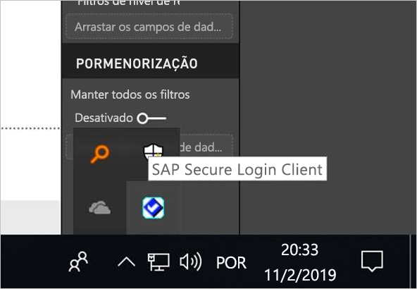
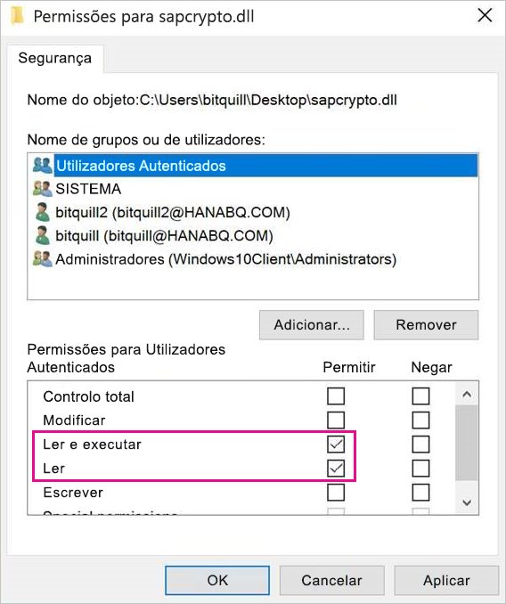
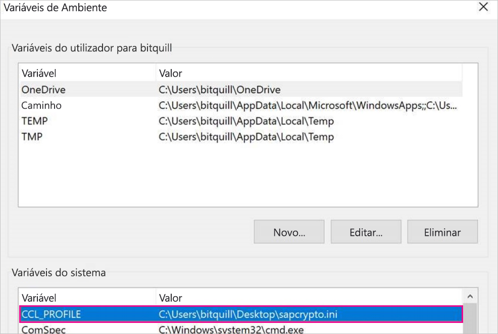
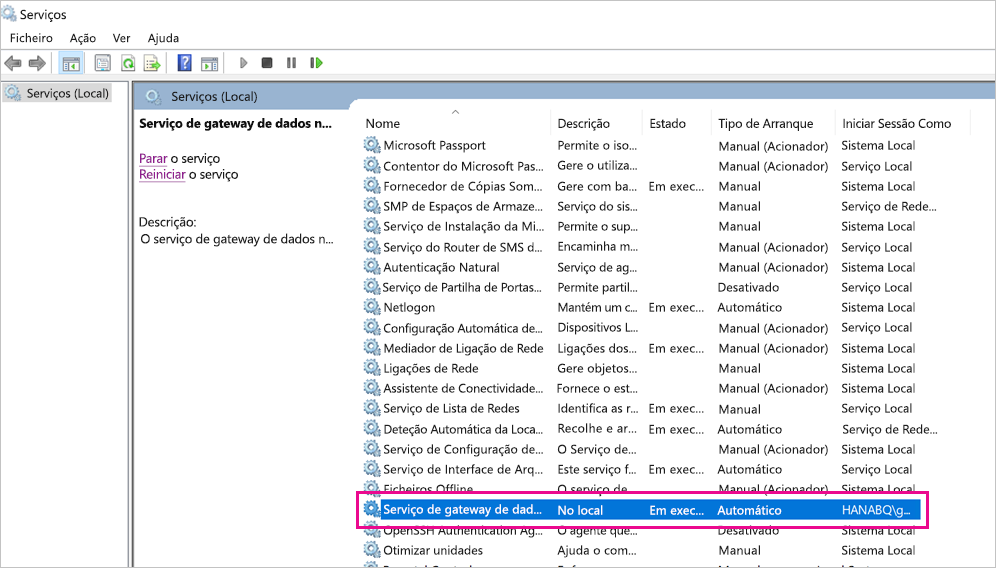
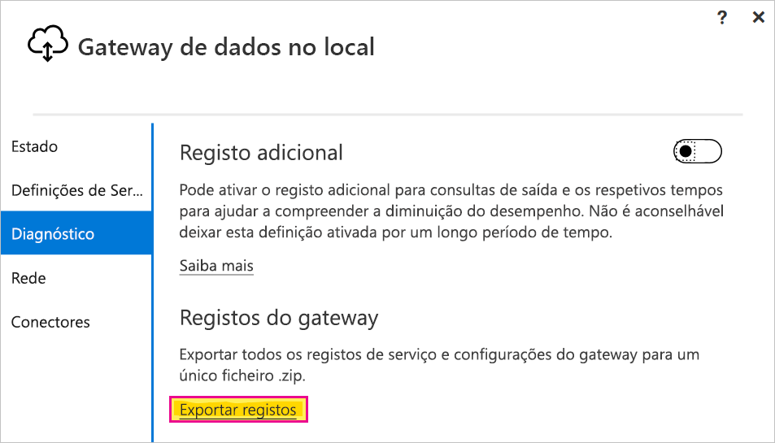

# <a name="use-kerberos-single-sign-on-for-sso-to-sap-bw-using-commoncryptolib-sapcryptodll"></a>Usar o início de sessão único Kerberos para SSO no SAP BW com CommonCryptoLib (sapcrypto.dll)

Este artigo descreve como configurar a origem de dados SAP BW para ativar o SSO no serviço Power BI ao utilizar a biblioteca CommonCryptoLib (sapcrypto.dll).

> [!NOTE]
> Antes de tentar atualizar um relatório baseado em SAP BW que utiliza o SSO do Kerberos, conclua os passos neste artigo e os passos em [Configurar SSO do Kerberos](service-gateway-sso-kerberos.md). Utilizar o CommonCryptoLib como a sua biblioteca SNC permite ligações de SSO a Servidores de Aplicações SAP BW e a Servidores de Mensagens SAP BW.

## <a name="configure-sap-bw-to-enable-sso-using-commoncryptolib"></a>Configurar o SAP BW para ativar o SSO com a biblioteca CommonCryptoLib

> [!NOTE]
> O gateway de dados no local é um software de 64 bits e, portanto, exige a versão de 64 bits da CommonCryptoLib (sapcrypto.dll) para executar o SSO do BW. Se tenciona testar a ligação de SSO ao seu servidor SAP BW no GUI do SAP antes de tentar uma ligação SSO através do gateway (recomendado), também irá precisar da versão de 32 bits da CommonCryptoLib, uma vez que o GUI do SAP é um software de 32 bits.

1. Confirme que o seu servidor BW está configurado corretamente para o SSO do Kerberos com CommonCryptoLib. Se estiver, pode utilizar o SSO para aceder ao seu servidor BW (diretamente ou através de um Servidor de Mensagens SAP BW) com uma ferramenta SAP como o GUI do SAP, que foi configurado para utilizar a CommonCryptoLib. 

   Para obter mais informações sobre os passos de configuração, veja [SAP Single Sign-On: Authenticate with Kerberos/SPNEGO](https://blogs.sap.com/2017/07/27/sap-single-sign-on-authenticate-with-kerberosspnego/) (Início de Sessão Único do SAP: autenticação com Kerberos/SPNEGO). O seu servidor BW deverá utilizar a CommonCryptoLib como a respetiva Biblioteca SNC e ter um nome SNC que comece por *CN=* , como *CN=BW1*. Para obter mais informações sobre os requisitos de nomes SNC (especificamente, o parâmetro snc/identity/as), veja [SNC Parameters for Kerberos Configuration](https://help.sap.com/viewer/df185fd53bb645b1bd99284ee4e4a750/3.0/360534094511490d91b9589d20abb49a.html) (Parâmetros SNC para Configuração do Kerberos).

1. Se ainda não o tiver feito, instale a versão x64 do [SAP .NET Connector](https://support.sap.com/en/product/connectors/msnet.html) no computador onde o gateway foi instalado. 
   
   Pode verificar se o componente foi instalado ao tentar ligar ao seu servidor BW no Power BI Desktop a partir do computador de gateway. Se não conseguir ligar com a implementação 2.0, isso significa que o .NET Connector não está instalado ou não foi instalado no GAC.

1. Certifique-se de que o SAP Secure Login Client (SLC) não está em execução no computador onde o gateway está instalado. 

   O SLC coloca os pedidos do Kerberos em cache de uma forma que pode interferir com a capacidade de o gateway utilizar o Kerberos para SSO. 

1. Se o SLC estiver instalado, desinstale-o ou certifique-se de que sai do SAP Secure Login Client. Clique com o botão direito do rato no ícone do tabuleiro do sistema e selecione **Log Out** (Terminar Sessão) e **Exit** (Sair) antes de tentar efetuar uma ligação SSO com o gateway. 

   A utilização do SLC não é suportada em computadores com o Windows Server. Para obter mais informações, veja [SAP Note 2780475](https://launchpad.support.sap.com/#/notes/2780475) (Nota do SAP 2780475 [é necessário um utilizador S]).

   

1. Se desinstalar o SLC ou selecionar **Log Out** (Terminar Sessão) e **Exit** (Sair), abra uma janela cmd e introduza `klist purge` para limpar os pedidos do Kerberos em cache existentes antes de tentar uma ligação SSO através do gateway.

1. Transfira a versão *8.5.25 ou superior* de 64 bits ou superior da CommonCryptoLib (sapcrypto.dll) a partir do SAP Launchpad e copie a mesma para uma pasta no computador do seu gateway. No mesmo diretório para onde copiou o ficheiro sapcrypto.dll, crie um ficheiro com o nome sapcrypto.ini com os seguintes conteúdos:

    ```
    ccl/snc/enable_kerberos_in_client_role = 1
    ```

    O ficheiro .ini contém informações de configuração de que a CommonCryptoLib precisa para ativar o SSO no cenário de gateway.

    > [!NOTE]
    > Estes ficheiros têm de ser armazenados na mesma localização. Por outras palavras, o parâmetro _/path/to/sapcrypto/_ deve conter os ficheiros sapcrypto.ini e sapcrypto.dll.

    O utilizador de serviço do gateway e o utilizador do Active Directory (AD) que o utilizador de serviço representa necessitam de permissões de leitura e execução para ambos os ficheiros. Recomendamos que conceda permissões nos ficheiros .ini e .dll ao grupo Utilizadores Autenticados. Para fins de teste, também pode conceder explicitamente estas permissões ao utilizador de serviço do gateway e ao utilizador do Active Directory que utiliza para os testes. Na seguinte captura de ecrã, concedemos permissões de **Leitura e execução** ao grupo Utilizadores Autenticados para o ficheiro sapcrypto.dll:

    

1. Se ainda não tiver uma origem de dados de SAP BW associada ao gateway em que pretende que a ligação de SSO passe, adicione uma na página **Gerir gateways** no serviço Power BI. Se já tiver esta origem de dados, edite-a: 
    - Escolha **SAP Business Warehouse** como o **Tipo de Origem de Dados** se quiser criar uma ligação de SSO com um Servidor de Aplicações BW. 
    - Selecione o **Servidor de Mensagens SAP Business Warehouse** se quiser criar uma ligação de SSO com um Servidor de Mensagens BW.

1. Para **Biblioteca SNC**, selecione a variável de ambiente **SNC\_LIB** ou **SNC\_LIB\_64**, ou **Personalizar**. 

   - Se selecionar **SNC\_LIB**, terá de definir o valor da variável de ambiente **SNC\_LIB\_64** no computador do gateway para o caminho absoluto da cópia de 64 bits do ficheiro sapcrypto.dll nesse computador do gateway. Por exemplo, *C:\Users\Test\Desktop\sapcrypto.dll*.

   - Se selecionar **Personalizar**, cole o caminho absoluto no ficheiro *sapcrypto.dll*, no campo Caminho da Biblioteca SNC Personalizado apresentado na página **Gerir gateways**. 

1. Para o **Nome do Parceiro SNC**, introduza o Nome SNC do servidor BW. Nas **definições Avançadas**, confirme que **Utilizar SSO através de Kerberos para consultas de DirectQuery** está selecionado. Preencha os outros campos como se estivesse a estabelecer uma ligação de Autenticação do Windows no PBI Desktop.

1. Crie uma variável de ambiente de sistema **CCL\_PROFILE** e defina o respetivo valor como o caminho para o ficheiro sapcrypto.ini.

    

    Os ficheiros sapcrypto .dll e .ini têm de existir na mesma localização. No exemplo acima, os ficheiros sapcrypto.ini e sapcrypto.dll estão localizados na área de trabalho.

1. Reinicie o serviço de gateway.

    

1. [Executar um relatório do Power BI](service-gateway-sso-kerberos.md#run-a-power-bi-report)

## <a name="troubleshooting"></a>Resolução de problemas

Se não conseguir atualizar o relatório no serviço Power BI, pode utilizar o rastreio de gateways, o rastreio de CPIC e o rastreio de CommonCryptoLib para diagnosticar o problema. Uma vez que o rastreio de CPIC e de CommonCryptoLib são produtos do SAP, a Microsoft não pode fornecer suporte para os mesmos. Para os utilizadores do Active Directory aos quais é concedido acesso de SSO ao BW, algumas configurações do Active Directory poderão exigir que os utilizadores sejam membros do grupo Administradores no computador onde o gateway foi instalado.

### <a name="gateway-logs"></a>Registos do gateway

1. Reproduza o problema.

2. Abra a [aplicação de gateway](https://docs.microsoft.com/data-integration/gateway/service-gateway-app)e selecione **Export logs** (Exportar registos) no separador **Diagnostics** (Diagnóstico).

      

### <a name="cpic-tracing"></a>Rastreio de CPIC

1. para ativar o rastreio de CPIC, defina duas variáveis de ambiente: **CPIC\_TRACE** e **CPIC\_TRACE\_DIR**. 

   A primeira variável define o nível de rastreio e a segunda variável define o diretório do ficheiro de rastreio. O diretório tem de ser uma localização na qual os membros do grupo Utilizadores Autenticados possam escrever. 
 
2. Defina a variável **CPIC\_TRACE** para *3* e a variável **CPIC\_TRACE\_DIR** para o diretório no qual pretende que os ficheiros de rastreio sejam escritos. Por exemplo:

   

 3. Reproduza o problema e certifique-se de que a variável **CPIC\_TRACE\_DIR** contém os ficheiros de rastreio.

### <a name="commoncryptolib-tracing"></a>Rastreio de CommonCryptoLib 

1. Ative o rastreio de CommonCryptoLib ao adicionar as seguintes linhas ao ficheiro sapcrypto.ini que criou anteriormente:

    ```
    ccl/trace/level=5
    ccl/trace/directory=<drive>:\logs\sectrace
    ```

2. Altere a opção `ccl/trace/directory` para uma localização onde os membros do grupo Utilizadores Autenticados possam escrever. 

3. Em alternativa, crie um novo ficheiro .ini para alterar este comportamento. No mesmo diretório dos ficheiros sapcrypto.ini e sapcrypto.dll, crie um ficheiro com o nome sectrace.ini e com os seguintes conteúdos. Substitua a opção `DIRECTORY` por uma localização no seu computador onde os membros do grupo Utilizadores Autenticados possam escrever:

    ```
    LEVEL = 5
    DIRECTORY = <drive>:\logs\sectrace
    ```

4. Reproduza o problema e verifique se a localização apontada por **DIRECTORY** contém ficheiros de rastreio. 

5. Quando terminar, desative o rastreio de CPIC e CCL.

    Para obter mais informações sobre o rastreio de CommonCryptoLib, veja [SAP Note 2491573](https://launchpad.support.sap.com/#/notes/2491573) (Nota do SAP 2491573) (é necessário um utilizador S do SAP).

## <a name="next-steps"></a>Próximos passos

Para obter mais informações sobre o gateway de dados no local e o DirectQuery, veja os seguintes recursos:

* [What is an on-premises data gateway?](/data-integration/gateway/service-gateway-onprem) (O que é um gateway de dados no local?)
* [DirectQuery no Power BI](desktop-directquery-about.md)
* [Origens de dados suportadas pelo DirectQuery](desktop-directquery-data-sources.md)
* [DirectQuery e SAP BW](desktop-directquery-sap-bw.md)
* [DirectQuery and SAP HANA](desktop-directquery-sap-hana.md) (DirectQuery e SAP HANA)
