# <a name="use-kerberos-for-single-sign-on-sso-from-power-bi-to-on-premises-data-sources"></a>Utilizar o Kerberos para SSO (início de sessão único) a partir do Power BI para origens de dados no local

Utilize a [delegação restrita de Kerberos](https://technet.microsoft.com/library/jj553400.aspx) para ativar a conectividade de início de sessão único totalmente integrado. Ativar o SSO facilita a atualização de dados de origens no local através de relatórios e dashboards do Power BI.

## <a name="supported-data-sources"></a>Supported data sources (Origens de dados suportadas)

Atualmente, suportamos as seguintes origens de dados:

* SQL Server
* SAP HANA
* Teradata
* Spark

Também suportamos SAP HANA com [Security Assertion Markup Language (SAML)](service-gateway-sso-saml.md).

### <a name="sap-hana"></a>SAP HANA

Para ativar o SSO para SAP HANA, siga primeiro estes passos:

* Certifique-se de que o servidor SAP HANA está a executar a versão mínima exigida, consoante o nível de plataforma do servidor SAP HANA:
  * [HANA 2 SPS 01 Rev 012.03](https://launchpad.support.sap.com/#/notes/2557386)
  * [HANA 2 SPS 02 Rev 22](https://launchpad.support.sap.com/#/notes/2547324)
  * [HANA 1 SP 12 Rev 122.13](https://launchpad.support.sap.com/#/notes/2528439)
* Na máquina do gateway, instale o controlador OBDC HANA mais recente do SAP.  A versão mínima é ODBC HANA, versão 2.00.020.00 de agosto de 2017.

Para obter mais informações sobre como definir e configurar o início de sessão único para o SAP HANA com o Kerberos, veja o tópico [Single Sign-on Using Kerberos](https://help.sap.com/viewer/b3ee5778bc2e4a089d3299b82ec762a7/2.0.03/en-US/1885fad82df943c2a1974f5da0eed66d.html) (Início de Sessão Único com o Kerberos) no SAP HANA Security Guide (Guia de Segurança do SAP HANA) e as ligações nessa página, em particular a SAP Note 1837331 – [HOWTO HANA DBSSO Kerberos/Active Directory].

## <a name="preparing-for-kerberos-constrained-delegation"></a>Preparar a Delegação Restrita de Kerberos

Vários itens têm de ser configurados para que a Delegação Restrita de Kerberos funcione corretamente, incluindo os *Nomes dos Principais de Serviço* (SPN) e as definições de delegação em contas de serviço.

### <a name="prerequisite-1-install--configure-the-on-premises-data-gateway"></a>Pré-requisito 1: instalar e configurar o Gateway de dados no local

Esta versão do Gateway de dados no local suporta uma atualização no local, bem como o controlo das definições de gateways existentes.

### <a name="prerequisite-2-run-the-gateway-windows-service-as-a-domain-account"></a>Pré-requisito 2: executar o serviço Windows do gateway como uma conta de domínio

Numa instalação padrão, o gateway é executado como uma conta de serviço da máquina local (especificamente, *NT Service\PBIEgwService*), conforme é mostrado na imagem seguinte:

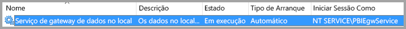

Para ativar a **Delegação Restrita de Kerberos**, o gateway tem de ser executado como uma conta de domínio, a menos que o Azure AD já esteja sincronizado com o Active Directory local (através do Azure AD DirSync/Connect). Se precisar de mudar a conta para uma conta de domínio, veja [Mudar o gateway para uma conta de domínio](#switching-the-gateway-to-a-domain-account) mais adiante neste artigo.

> [!NOTE]
> Se o Azure AD DirSync/Connect estiver configurado e as contas de utilizador estiverem sincronizadas, o serviço de gateway não tem de efetuar pesquisas de AD locais no runtime e pode utilizar o SID do Serviço local (em vez de uma conta de domínio) para o serviço de gateway. Os passos de configuração da Delegação Restrita de Kerberos descritos neste artigo são os mesmos dessa configuração (são simplesmente aplicados com base no SID do serviço, em vez da conta de domínio).

### <a name="prerequisite-3-have-domain-admin-rights-to-configure-spns-setspn-and-kerberos-constrained-delegation-settings"></a>Pré-requisito 3: ter direitos de administrador de domínio para configurar as definições de Delegação Restrita de Kerberos e SPNs (SetSPN)

Embora seja tecnicamente possível que um administrador de domínio conceda direitos, temporária ou permanentemente, a outro utilizador para configurar SPNs e a delegação Kerberos, sem serem necessários direitos de administração do domínio, esta não é a abordagem recomendada. Na secção seguinte, vamos descrever os passos necessários para a configuração do **Pré-requisito 3** em detalhe.

## <a name="configuring-kerberos-constrained-delegation-for-the-gateway-and-data-source"></a>Configurar a Delegação Restrita de Kerberos para o gateway e a origem de dados

Para configurar corretamente o sistema, é preciso configurar ou validar os dois seguintes itens:

1. Se necessário, configure um SPN para a conta de domínio do serviço de gateway.

2. Configure as definições de delegação na conta de domínio do serviço de gateway.

Tenha em atenção que tem de ser um administrador de domínio para efetuar esses dois passos de configuração.

As secções seguintes descrevem estes passos, um de cada vez.

### <a name="configure-an-spn-for-the-gateway-service-account"></a>Configurar um SPN para a conta do serviço de gateway

Em primeiro lugar, determine se já foi criado um SPN para a conta de domínio utilizada como a conta do serviço de gateway, mas seguindo estes passos:

1. Como administrador de domínio, inicie **Utilizadores e Computadores do Active Directory**.

2. Clique com o botão direito no domínio, selecione **Localizar** e escreva o nome da conta do serviço de gateway

3. No resultado da pesquisa, clique com o botão direito do rato na conta do serviço de gateway e selecione **Propriedades**.

4. Se o separador **Delegação** estiver visível na caixa de diálogo **Propriedades** significa que já foi criado um SPN e pode ir diretamente para a subsecção seguinte sobre como configurar definições de Delegação.

    Se não existir nenhum separador **Delegação** na caixa de diálogo **Propriedades**, pode criar manualmente um SPN nessa conta, que adiciona o separador **Delegação** (é a forma mais fácil de configurar as definições de delegação). Criar um SPN pode ser feito com a [ferramenta setspn](https://technet.microsoft.com/library/cc731241.aspx) fornecida com o Windows (precisa de direitos de administrador de domínio para criar o SPN).

    Por exemplo, imagine que a conta do serviço de gateway é “PBIEgwTest\GatewaySvc” e que o nome da máquina que executa o serviço de gateway é **Machine1**. Para definir o SPN para a conta do serviço de gateway para essa máquina neste exemplo, pode executar o seguinte comando:

    

    Com esse passo concluído, podemos avançar para a configuração das definições de delegação.

### <a name="configure-delegation-settings-on-the-gateway-service-account"></a>Configurar as definições de delegação na conta do serviço de gateway

O segundo requisito de configuração são as definições de delegação na conta do serviço de gateway. Pode utilizar várias ferramentas existentes para executar estes passos. Neste artigo, vamos utilizar **Utilizadores e Computadores do Active Directory**, que é um snap-in da Consola de Gestão da Microsoft (MMC), que pode utilizar para administrar e publicar informações no diretório. Está disponível nos controladores de domínio por predefinição. Também pode ativá-lo através da configuração de **Funcionalidades do Windows** noutras máquinas.

Precisamos de configurar a **Delegação Restrita de Kerberos** com trânsito de protocolo. Com a delegação restrita, tem de ser explícito relativamente aos serviços que pretende delegar. Por exemplo, apenas o SQL Server ou o seu servidor SAP HANA aceitará chamadas de delegação da conta do serviço de gateway.

Esta secção pressupõe que já configurou os SPNs para as suas origens de dados subjacentes (como o SQL Server, SAP HANA, Teradata, Spark, etc.). Para saber como configurar esses SPNs do servidor de origem de dados, consulte a documentação técnica do respetivo servidor de bases de dados. Também pode ver a mensagem de blogue que descreve [*Qual SPN a aplicação requer?*](https://blogs.msdn.microsoft.com/psssql/2010/06/23/my-kerberos-checklist/)

Nos passos seguintes, utilizamos um ambiente no local com duas máquinas: uma máquina de gateway e um servidor de base de dados com SQL Server. Para efeitos deste exemplo, vamos utilizar os seguintes nomes e definições:

* O nome da máquina de gateway: **PBIEgwTestGW**
* Conta do serviço de gateway: **PBIEgwTest\GatewaySvc** (nome de apresentação da conta: Gateway Connector)
* Nome da máquina da origem de dados do SQL Server: **PBIEgwTestSQL**
* Conta do serviço da origem de dados do SQL Server: **PBIEgwTest\SQLService**

Tendo em conta os nomes e as definições de exemplo, os passos de configuração são os seguintes:

1. Com direitos de administrador de domínio, inicie **Utilizadores e Computadores do Active Directory**.

2. Clique com o botão direito do rato na conta do serviço de gateway (**PBIEgwTest\GatewaySvc**) e selecione **Propriedades**.

3. Selecione o separador **Delegação**.

4. Selecione **Confiar neste computador apenas para delegação para serviços especificados.**

5. Selecione **Utilizar qualquer protocolo de autenticação.**

6. Em **Services to which this account can present delegated credentials** (Serviços aos quais esta conta pode apresentar credenciais delegadas), selecione **Add** (Adicionar).

7. Na nova caixa de diálogo, selecione **Users or Computers** (Utilizadores ou Computadores).

8. Introduza a conta de serviço para o serviço de Base de Dados do SQL Server (**PBIEgwTest\SQLService**) e selecione **OK**.

9. Selecione o SPN que criou para o servidor de bases de dados. No nosso exemplo, o SPN irá começar com **MSSQLSvc**. Se adicionou o FQDN e o SPN NetBIOS para o serviço de base de dados, irá selecionar ambos. Só poderá ver um.

10. Selecione **OK**. Agora, deverá ver o SPN na lista.

11. Opcionalmente, pode selecionar **Expanded** (Expandido) para mostrar o FQDN e o SPN NetBIOS.

12. A caixa de diálogo terá um aspeto semelhante à seguinte se selecionar **Expanded** (Expandido). Selecione **OK**.

    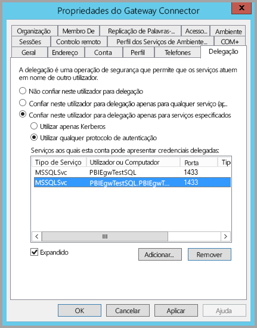

Por fim, na máquina que executa o serviço de gateway (**PBIEgwTestGW** no nosso exemplo), tem de ser concedida à conta do serviço de gateway a política local “Representar um cliente após autenticação”. Pode efetuar/verificar isto com o Editor de Políticas de Grupo Local (**gpedit**).

1. Na máquina do gateway, execute: *gpedit.msc*.

1. Navegue para **Política de Computador Local > Configuração do Computador > Definições do Windows > Definições de Segurança > Políticas Locais > Atribuição de Direitos de Utilizadores**, conforme mostrado na imagem seguinte.

    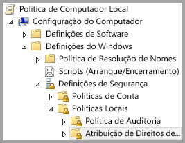

1. Na lista de políticas em **Atribuição de Direitos de Utilizadores**, selecione **Representar um cliente após autenticação**.

    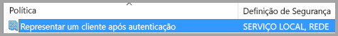

    Clique com botão direito do rato e abra as **Properties** (Propriedades) de **Impersonate a client after authentication** (Representar um cliente após autenticação) e verifique a lista de contas. Tem de incluir a conta do serviço de gateway (**PBIEgwTest\GatewaySvc**).

1. Na lista de políticas em **Atribuição de Direitos de Utilizadores**, selecione **Atuar como parte do sistema operativo (SeTcbPrivilege)**. Certifique-se de que a conta do serviço de gateway também está incluída na lista de contas.

18. Reinicie o processo do serviço de **Gateway de dados no local**.

Se estiver a utilizar o SAP HANA, recomendamos que siga estes passos adicionais, que podem resultar numa pequena melhoria no desempenho.

1. No diretório de instalação do gateway, localize e abra este ficheiro de configuração: *Microsoft.PowerBI.DataMovement.Pipeline.GatewayCore.dll.config*.

1. Localize a propriedade *FullDomainResolutionEnabled* e altere o respetivo valor para *True* (Verdadeiro).

    ```xml
    <setting name=" FullDomainResolutionEnabled " serializeAs="String">
          <value>True</value>
    </setting>
    ```

## <a name="running-a-power-bi-report"></a>Executar um relatório do Power BI

Depois de concluir todos os passos de configuração indicados neste artigo, pode utilizar a página **Gerir Gateway** no Power BI para configurar a origem de dados. Em seguida, nas **Definições Avançadas**, ative o SSO e publique relatórios e conjuntos de dados vinculados a essa origem de dados.

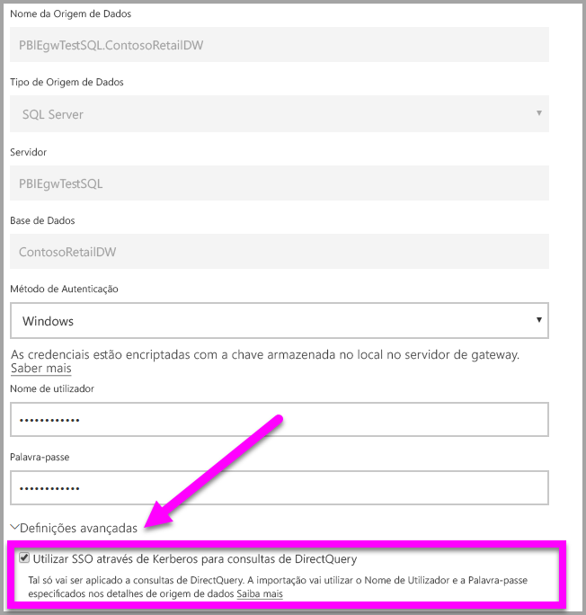

Esta configuração irá funcionar na maioria dos casos. No entanto, com o Kerberos podem existir configurações diferentes, dependendo do seu ambiente. Se, ainda assim, o relatório não carregar, terá de contactar o administrador de domínio para uma investigação mais aprofundada.

## <a name="switching-the-gateway-to-a-domain-account"></a>Mudar o gateway para uma conta de domínio

Anteriormente neste artigo, discutimos como mudar o gateway de uma conta de serviço local para ser executado como uma conta de domínio, com a interface de utilizador do **Gateway de dados no local**. Eis os passos necessários para o fazer.

1. Inicie a ferramenta de configuração do **Gateway de dados no local**.

   

2. Selecione o botão **Iniciar Sessão** na página principal e inicie sessão com a sua conta do Power BI.

3. Depois de o início de sessão estar concluído, selecione o separador **Definições do Serviço**.

4. Selecione **Alterar conta** para iniciar as instruções orientadas, conforme mostrado na imagem seguinte.

   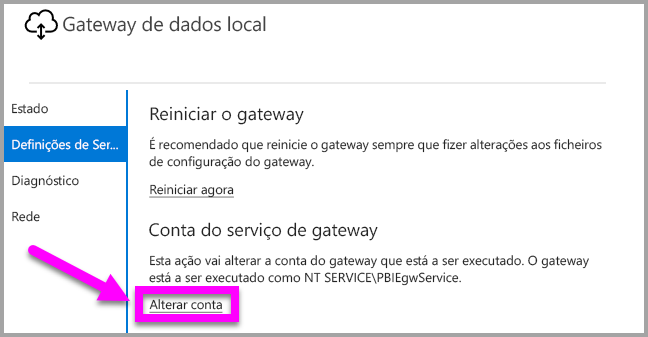

## <a name="configuring-sap-bw-for-sso"></a>Configurar o SAP BW para SSO

Agora que já compreende como o Kerberos funciona com um gateway, pode configurar o SSO para o seu SAP BW (SAP Business Warehouse). Os passos seguintes pressupõem que já está [preparado para a delegação restrita de Kerberos](#preparing-for-kerberos-constrained-delegation), conforme descrito anteriormente neste artigo.

### <a name="install-sap-bw-components"></a>Instalar componentes do SAP BW

Se não tiver configurado o gsskrb5 e gx64krb5 do SAP nas máquinas do seu cliente e no SAP BW Application Server, conclua esta secção. Se já concluiu esta configuração (criou um Utilizador de Serviço para o seu servidor BW e mapeou um SPN ao mesmo), pode ignorar algumas partes desta secção.

1. Transfira gsskrb5/gx64krb5 da [Nota SAP2115486](https://launchpad.support.sap.com/) (necessário um utilizador S do SAP). Garanta que tem, pelo menos, a versão 1.0.11 do gsskrb5.dll e do gx64krb5.dll.

1. Coloque a biblioteca numa localização na sua máquina do gateway que seja acessível pela sua instância de gateway (e pelo SAP GUI, se quiser testar a ligação de SSO através do SAP GUI/Logon).

1. Coloque outra cópia na sua máquina do servidor BW numa localização acessível pelo servidor BW.

1. Nas máquinas do cliente e do servidor, defina as variáveis do ambiente SNC\_LIB and SNC\_LIB\_64 para apontar para as localizações do gsskrb5.dll e do gx64krb5.dll, respetivamente.

### <a name="complete-the-gateway-configuration-for-sap-bw"></a>Concluir a configuração do gateway para o SAP BW

Além da configuração do gateway que efetuou, existem mais alguns passos específicos do SAP BW. A secção [**Configurar as definições de delegação na conta do serviço de gateway**](#configure-delegation-settings-on-the-gateway-service-account) da documentação pressupõe que já configurou os SPNs das suas origens de dados. Para concluir esta configuração do SAP BW:

1. Num Controlador de Domínio do Active Directory, crie um Utilizador de Serviço (inicialmente só um utilizador do Active Directory simples) para o BW Application Server no seu ambiente do Active Directory. Em seguida, atribua um SPN ao mesmo.

    O SPN atribuído **tem** de começar com SAP/. O que se sucede fica ao seu critério. Uma opção é utilizar o nome de utilizador do Utilizador do Serviço do servidor BW. Por exemplo, se criar BWServiceUser@\<DOMÍNIO\> como seu Utilizador de Serviço, poderá utilizar o SPN SAP/BWServiceUser. Uma forma de definir o mapeamento do SPN é através do comando setspn. Por exemplo, para configurar o SPN no utilizador de serviço que criámos, iria executar o seguinte comando a partir de uma janela cmd numa máquina de Controlador de Domínio: `setspn -s SAP/ BWServiceUser DOMAIN\ BWServiceUser`.

1. Conceda acesso à sua instância do BW Application Server ao Utilizador de Serviço:

    1. Na máquina do servidor BW, adicione o Utilizador de Serviço ao grupo Administrador Local do servidor BW: abra o programa Gestão de Computadores e faça duplo clique no grupo Administrador Local do seu servidor.

        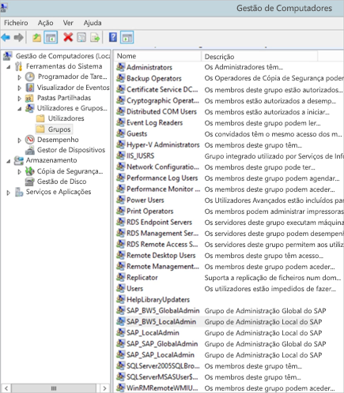

    1. Faça duplo clique no grupo Administrador Local e, em seguida, selecione **Adicionar** para adicionar o seu Utilizador de Serviço do BW ao grupo. Utilize o botão **Verificar Nomes** para garantir que escreveu o nome corretamente. Selecione **OK**.

1. Defina o Utilizador de Serviço do Servidor BW como o utilizador que inicia o serviço do Servidor BW na máquina do servidor BW.

    1. Abra o programa "Executar" e escreva "Services.msc". Procure o serviço correspondente à sua instância do BW Application Server. Clique com o botão direito do rato no mesmo e selecione **Propriedades**.

        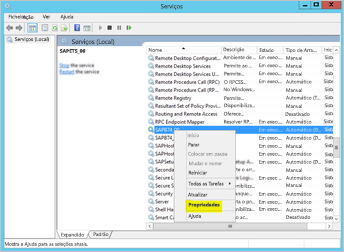

    1. Mude para o separador **Início de sessão** e altere o utilizador para o seu Utilizador de Serviço do BW, conforme especificado acima. Introduza a palavra-passe do utilizador e selecione **OK**.

1. Inicie sessão no seu servidor no SAP GUI/Logon e defina os parâmetros do seguinte perfil com a transação RZ10:

    1. Defina o SNC/identidade/como parâmetro de perfil como p:\<o utilizador de serviço do BW que criou\>, como p:BWServiceUser@MYDOMAIN.COM. Repare no p: que precede o UPN do Utilizador de Serviço.

    1. Defina o parâmetro de perfil snc/gssapi\_lib como caminho \< para gsskrb5.dll/gx64krb5.dll na máquina do servidor (a biblioteca que irá utilizar depende do número de bits do SO)\>. Lembre-se de colocar a biblioteca numa localização à qual o BW Application Server possa aceder.

    1. Além disso, defina os seguintes parâmetros de perfil adicionais, ao alterar os valores conforme exigido para satisfazer as suas necessidades. Tenha em atenção que as últimas cinco opções permitem que os clientes liguem ao servidor BW com o SAP Logon/GUI, sem ser necessário ter o SNC configurado.

        | **Definição** | **Valor** |
        | --- | --- |
        | snc/data\_protection/max | 3 |
        | snc/data\_protection/min | 1 |
        | snc/data\_protection/use | 9 |
        | snc/accept\_insecure\_cpic | 1 |
        | snc/accept\_insecure\_gui | 1 |
        | snc/accept\_insecure\_r3int\_rfc | 1 |
        | snc/accept\_insecure\_rfc | 1 |
        | snc/permit\_insecure\_start | 1 |

    1. Defina a propriedade snc/enable como 1.

1. Após definir estes parâmetros de perfil, abra a Consola de Gestão de SAP na máquina do servidor e reinicie a instância do BW. Se o servidor não iniciar, verifique novamente que configurou os parâmetros de perfil corretamente. Para saber mais sobre as definições de parâmetro de perfil, veja a [documentação do SAP](https://help.sap.com/saphelp_nw70ehp1/helpdata/en/e6/56f466e99a11d1a5b00000e835363f/frameset.htm). Também pode consultar a secção nas nossas informações de resolução de problemas mais adiante nesta secção se tiver problemas.

### <a name="map-azure-ad-users-to-sap-bw-users"></a>Mapear utilizadores do Azure AD a utilizadores do SAP BW

Mapeie um utilizador do Active Directory a um utilizador do SAP BW Application Server e teste a ligação do SSO no SAP GUI/Logon.

1. Inicie sessão no seu servidor BW através do SAP GUI/Logon. Execute a transação SU01.

1. Em **User** (Utilizador), introduza o utilizador do BW para o qual pretende ativar as ligações de SSO (na captura de ecrã acima estamos a configurar permissões para BIUSER). Selecione o ícone **Edit** (Editar) junto ao canto superior esquerdo da janela SAP Logon (a imagem de uma caneta).

    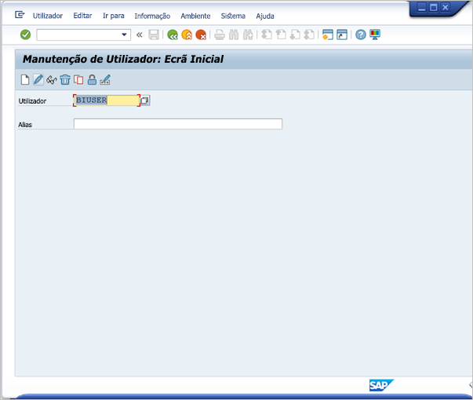

1. Selecione o separador **SNC**. Na caixa de entrada SNC Name (Nome do SNC), introduza p:\<o seu utilizador de diretório ativo\>@\<o seu domínio\>. Repare no p: obrigatório que tem de preceder o UPN do utilizador do Active Directory. O utilizador do Active Directory que especificar deve pertencer à pessoa ou organização para a qual pretende ativar o acesso de SSO ao BW Application Server. Por exemplo, se quiser ativar o acesso de SSO para o utilizador [testuser@TESTDOMAIN.COM](mailto:testuser@TESTDOMAIN.COM), introduza p:testuser@TESTDOMAIN.COM.

    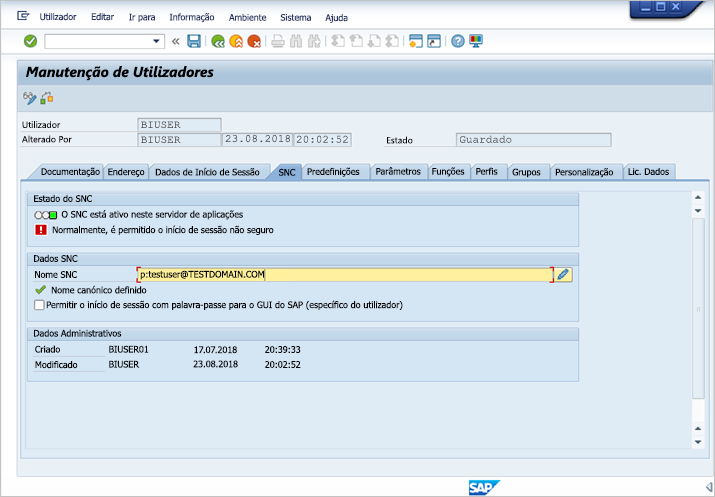

1. Selecione o ícone de guardar (a disquete junto ao canto superior esquerdo do ecrã).

### <a name="verify-sign-in-using-sso"></a>Verificar o início de sessão com o SSO

Verifique se pode iniciar sessão no servidor com o SAP Logon/SAP GUI através do SSO enquanto utilizador do Active Directory para o qual ativou o acesso de SSO.

1. Inicie sessão numa máquina na qual o SAP Logon esteja instalado *enquanto utilizador do Active Directory para o qual ativou o acesso de SSO* e inicie o SAP GUI/Logon. Crie uma nova ligação.

1. Na janela **Create New System Entry** (Criar Nova Entrada do Sistema), selecione **User Specified System** (Sistema Especificado pelo Utilizador) e selecione **Next** (Seguinte).

    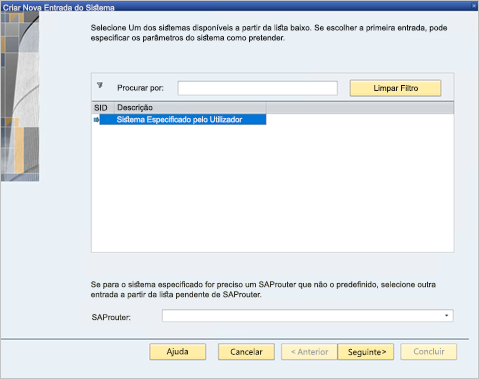

1. Preencha os detalhes adequados na página seguinte, incluindo o servidor da aplicação, número da instância e ID do sistema. Em seguida, selecione **Finish** (Concluir).

1. Clique com o botão direito do rato na nova ligação e selecione **Properties** (Propriedades). Selecione o separador **Network** (Rede). Na janela **SNC Name** (Nome do SNC), introduza p:\<o UPN do utilizador do serviço BW\>, como p:BWServiceUser@MYDOMAIN.COM.

    

1. Selecione **OK**. Faça duplo clique na ligação que criou para tentar fazer uma ligação de SSO ao serviço. Se a ligação for bem-sucedida, avance para o passo seguinte. Caso contrário, reveja os passos anteriores neste documento para se certificar de que estes foram concluídos corretamente ou reveja a secção de resolução de problemas abaixo. Tenha em atenção que se não conseguir ligar ao servidor BW através do SSO neste contexto, não poderá fazê-lo no contexto de gateways.

### <a name="troubleshoot-installation-and-connections"></a>Resolver problemas de instalação e ligações

Caso se depare com problemas, siga estes passos para resolver o problema da instalação de gsskrb5 e das ligações de SSO a partir do SAP GUI/Logon.

1. Ver os registos do servidor (…work\dev\_w0 na máquina do servidor) pode ser útil na resolução de quaisquer erros com os quais se depare na conclusão dos passos de configuração de gsskrb5, especialmente se o servidor BW não iniciar após os parâmetros de perfil serem alterados.

1. Se não conseguir iniciar o serviço BW devido a uma "falha de início de sessão", poderá ter fornecido a palavra-passe errada quando configurou o utilizador de início de sessão do BW. Verifique a palavra-passe ao iniciar sessão numa máquina no seu ambiente do Active Directory como um utilizador do serviço BW.

1. Se forem apresentados erros sobre as credenciais SQL impedirem o início do servidor, verifique que concedeu ao Utilizador do Serviço acesso à base de dados BW.

1. "(GSS-API) specified target is unknown or unreachable" ([GSS-API] o destino especificado é desconhecido ou não é alcançável): isto normalmente significa que especificou o SNC Name (Nome do SNC) errado. Certifique-se de que utiliza "p:" e não "p:CN=" ou qualquer outra coisa na aplicação cliente sem ser o UPN do Utilizador do Serviço.

1. "(GSS-API) An invalid name was supplied" ([GSS-API] Foi fornecido um nome inválido): certifique-se de que "p:" encontra-se no valor do parâmetro de perfil de identidade do SNC do servidor.

1. "(SNC error) the specified module could not be found" ([SNC error] o módulo especificado não foi encontrado): normalmente isto acontece quando coloca o gsskrb5.dll/gx64krb5.dll num local que exige privilégios elevados (direitos de administrador) para aceder.

### <a name="add-registry-entries"></a>Adicionar entradas de registo

Adicione as entradas de registo necessárias ao registo da máquina onde o gateway está instalado. Em seguida, defina os parâmetros de configuração do gateway necessários.

1. Execute os seguintes comandos numa janela cmd:

    1. REG ADD HKLM\SOFTWARE\Wow6432Node\SAP\gsskrb5 /v ForceIniCredOK /t REG\_DWORD /d 1 /f

    1. REG ADD HKLM\SOFTWARE\SAP\gsskrb5 /v ForceIniCredOK /t REG\_DWORD /d 1 /f

1. Abra o ficheiro de configuração de gateway principal, Microsoft.PowerBI.DataMovement.Pipeline.GatewayCore.dll. Por predefinição, este ficheiro está armazenado em C:\Programas\On-premises data gateway.

1. Defina o parâmetro **ADUserNameLookupProperty** para msDS-cloudExtensionAttribute1 e **ADUserNameReplacementProperty** para SAMAccountName. Guarde o ficheiro de configuração.

1. Reinicie o serviço de gateway através do separador **Serviços** do Gestor de Tarefas (clique com o botão direito do rato e em **Reiniciar**).

    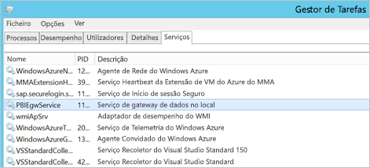

### <a name="set-azure-ad-properties"></a>Definir as propriedades do Azure AD

Defina a propriedade msDS-cloudExtensionAttribute1 do utilizador do Azure Directory que mapeou a um utilizador do BW (no passo "Mapear utilizadores do Azure AD a Utilizadores do SAP BW") para o utilizador do serviço Power BI para o qual pretende ativar o SSO do Kerberos. Uma forma de definir a propriedade msDS-cloudExtensionAttribute1 é através do snap-in da MMC de Computadores e Utilizadores do Active Directory (tenha em atenção que outros métodos também podem ser utilizados).

1. Inicie sessão numa máquina de Controlador de Domínio como utilizador Administrador.

1. Abra a pasta **Users** (Utilizadores) na janela do snap-in e faça duplo clique no utilizador do Active Directory que mapeou a um utilizador do BW.

1. Selecione o separador **Attribute Editor** (Editor de Atributos). Se não vir este separador, terá de procurar instruções sobre como ativá-lo ou utilizar outro método para definir a propriedade msDS-cloudExtensionAttribute1. Selecione um dos atributos e, em seguida, a chave "m" para navegar até às propriedades do Active Directory que comecem por "m". Localize a propriedade msDS-cloudExtensionAttribute1 e faça duplo clique na mesma. Defina o valor para o nome de utilizador que utiliza para iniciar sessão no Serviço Power BI. Selecione **OK**.

    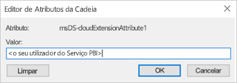

1. Selecione **Apply** (Aplicar). Verifique se o valor correto foi configurado na coluna Value (Valor).

### <a name="add-a-new-bw-application-server-data-source-to-the-power-bi-service"></a>Adicionar uma nova origem de dados do BW Application Server ao Serviço Power BI

Adicione a origem de dados do BW ao seu gateway: siga as instruções mencionadas anteriormente neste artigo sobre como [executar um relatório](#running-a-power-bi-report).

1. Na janela de configuração da origem de dados, introduza o **Nome do anfitrião**, **Número do Sistema** e **ID de cliente** do Application Server como faria ao iniciar sessão no seu servidor BW do Power BI Desktop. Para o **Método de Autenticação**, selecione **Windows**.

1. No campo **Nome do Parceiro SNC**, introduza o valor armazenado no SNC/identidade/como parâmetro de perfil do servidor *com SAP/ adicionado entre o p: e o resto da identidade.* Por exemplo, se a identidade SNC do servidor for p:BWServiceUser@MYDOMAIN.COM, deve introduzir p:SAP/BWServiceUser@MYDOMAIN.COM na caixa de entrada do Nome do Parceiro SNC.

1. Para a Biblioteca SNC, selecione SNC\_LIB ou SNC\_LIB\_64.

1. O **Nome de utilizador** e a **Palavra-passe** devem pertencer a um utilizador do Active Directory com permissão para iniciar sessão no servidor BW através do SSO (um utilizador do Active Directory que foi mapeado a um utilizador do BW através da transação SU01). Estas credenciais só serão utilizadas se a caixa **Utilizar SSO através de Kerberos para consultas de DirectQuery** *não* estiver selecionada.

1. Selecione a caixa **Utilizar SSO através de Kerberos para consultas de DirectQuery** e selecione **Aplicar**. Se a ligação do teste não for bem-sucedida, verifique se os passos da configuração anterior foram concluídos corretamente.

### <a name="test-your-setup"></a>Testar a sua configuração

Publique um relatório do DirectQuery do Power BI Desktop no serviço Power BI para testar a sua configuração. Certifique-se de que tem sessão iniciada no serviço Power BI como o utilizador para o qual definiu a propriedade msDS-cloudExtensionAttribute1. Se a configuração tiver sido concluída com êxito, deve poder criar um relatório com base no conjunto de dados publicados no Serviço Power BI e obter dados através dos elementos visuais no relatório.

### <a name="troubleshooting-gateway-connectivity-issues"></a>Resolver Problemas de Conectividade do Gateway

1. Verifique os registos do gateway. Abra a aplicação Configuração do Gateway, selecione **Diagnóstico** e **Exportar Registos**. Os erros mais recentes estarão na parte inferior de qualquer ficheiro de registo que examinar.

    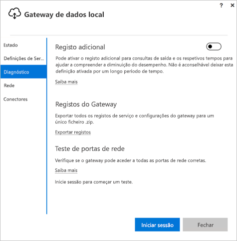

1. Ative o rastreio de BW e analise os ficheiros de registo gerados. Existem vários tipos diferentes de rastreio de BW disponíveis. Consulte a documentação do SAP para obter mais informações.

## <a name="errors-from-an-insufficient-kerberos-configuration"></a>Erros devidos a uma configuração de Kerberos insuficiente

Se o servidor de bases de dados subjacente e o gateway não estiverem configurados corretamente para **Delegação Restrita de Kerberos**, poderá receber a seguinte mensagem de erro:


Além disso, os detalhes técnicos associados à mensagem de erro (DM_GWPipeline_Gateway_ServerUnreachable) poderão ter o seguinte aspeto:

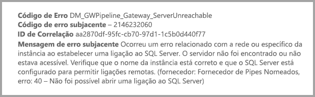

O resultado é que o gateway não conseguiu representar o utilizador de origem corretamente e a tentativa de ligação de base de dados falhou.

## <a name="next-steps"></a>Próximos passos

Para obter mais informações sobre o **Gateway de dados no local** e o **DirectQuery**, consulte os seguintes recursos:

* [Gateway de dados no local](service-gateway-onprem.md)
* [DirectQuery no Power BI](desktop-directquery-about.md)
* [Origens de dados suportadas pelo DirectQuery](desktop-directquery-data-sources.md)
* [DirectQuery e SAP BW](desktop-directquery-sap-bw.md)
* [DirectQuery and SAP HANA](desktop-directquery-sap-hana.md) (DirectQuery e SAP HANA)