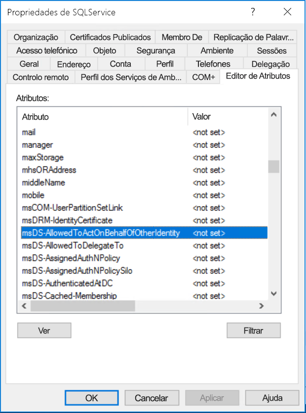

# <a name="configure-kerberos-based-sso-from-power-bi-service-to-on-premises-data-sources"></a>Configurar o SSO baseado no Kerberos a partir do serviço Power BI para as origens de dados no local

Ativar o SSO facilita a atualização de dados de origens no local em relatórios e dashboards do Power BI, ao mesmo tempo que respeita as permissões ao nível do utilizador configuradas nestas origens. Utilize a [delegação restrita de Kerberos](/windows-server/security/kerberos/kerberos-constrained-delegation-overview) para ativar a conectividade de SSO totalmente integrada. 

## <a name="prerequisites"></a>Pré-requisitos

Vários itens têm de ser configurados para que a delegação restrita de Kerberos funcione corretamente, incluindo os _Nomes dos Principais do Serviço (SPN)_ e as definições de delegação em contas de serviço.

### <a name="install-and-configure-the-microsoft-on-premises-data-gateway"></a>instalar e configurar o gateway de dados no local da Microsoft

O gateway de dados no local suporta uma atualização no local e o _controlo das definições_ dos gateways existentes.

### <a name="run-the-gateway-windows-service-as-a-domain-account"></a>Executar o serviço Windows do gateway como uma conta de domínio

Numa instalação padrão, o gateway é executado como a conta de serviço do computador local, **NT Service\PBIEgwService**.


Para ativar a delegação restrita de Kerberos, o gateway tem de ser executado como uma conta de domínio, a menos que a instância do Azure Active Directory (Azure AD) já esteja sincronizada com a instância do Active Directory local (através do Azure AD DirSync/Connect). Para mudar para uma conta de domínio, veja [Alterar a conta do serviço de gateway](/data-integration/gateway/service-gateway-service-account).

> [!NOTE]
> Se o Azure AD Connect estiver configurado e as contas de utilizador estiverem sincronizadas, o serviço de gateway não precisará de realizar pesquisas do Azure AD locais no runtime. Em alternativa, pode simplesmente utilizar o SID do serviço local para o serviço de gateway para concluir toda a configuração necessária no Azure AD. Os passos de configuração da delegação restrita de Kerberos descritos neste artigo são os mesmos que os passos de configuração necessários no contexto do Azure AD. São aplicados ao objeto do computador do gateway (conforme identificado pelo SID do serviço local) no Azure AD, em vez de à conta do domínio.

## <a name="obtain-domain-admin-rights-to-configure-spns-setspn-and-kerberos-constrained-delegation-settings"></a>Obter direitos de administrador de domínio para configurar as definições de delegação restrita de Kerberos e SPN (SetSPN)

Para configurar as definições de delegação de SPN e Kerberos, um administrador de domínio deve evitar conceder direitos a alguém que não tenha direitos de administrador de domínio. Na secção seguinte, abordamos mais detalhadamente os passos de configuração recomendados.

## <a name="configure-kerberos-constrained-delegation-for-the-gateway-and-data-source"></a>Configurar a delegação restrita de Kerberos para o gateway e a origem de dados

Se necessário, configure um SPN para a conta de domínio do serviço de gateway como um administrador de domínio e configure as definições de delegação na conta de domínio do serviço de gateway.

### <a name="configure-an-spn-for-the-gateway-service-account"></a>Configurar um SPN para a conta do serviço de gateway

Em primeiro lugar, determine se já foi criado um SPN para a conta de domínio utilizada como a conta do serviço de gateway:

1. Como administrador de domínio, inicie o snap-in **Utilizadores e Computadores do Active Directory** da Consola de Gestão da Microsoft (MMC).

2. No painel esquerdo, clique com o botão direito do rato no nome do domínio, selecione **Localizar** e escreva o nome da conta do serviço de gateway.

3. No resultado da pesquisa, clique com o botão direito do rato na conta do serviço de gateway e selecione **Propriedades**.

4. Se o separador **Delegação** for apresentado na caixa de diálogo **Propriedades**, significa que já foi criado um SPN e pode avançar para [Escolher o tipo de delegação restrita de Kerberos a utilizar](#decide-on-the-type-of-kerberos-constrained-delegation-to-use).

5. Se não existir um separador **Delegação**, na caixa de diálogo **Propriedades**, pode criar manualmente um SPN nessa conta para o ativar. Utilize a [ferramenta setspn](https://technet.microsoft.com/library/cc731241.aspx) fornecida com o Windows (precisa de direitos de administrador de domínio para criar o SPN).

   Por exemplo, suponha que a conta do serviço de gateway é **Contoso\GatewaySvc** e que o serviço de gateway está a ser executado no computador com o nome **MyGatewayMachine**. Para definir o SPN para a conta do serviço de gateway, execute o seguinte comando:

   ```setspn -a gateway/MyGatewayMachine Contoso\GatewaySvc```

   Pode também definir o SPN através do snap-in **Utilizadores e Computadores do Active Directory** da MMC.

### <a name="decide-on-the-type-of-kerberos-constrained-delegation-to-use"></a>Decidir o tipo de delegação restrita de Kerberos a utilizar

Pode configurar as definições de delegação quer para a delegação restrita de Kerberos padrão quer para a delegação restrita de Kerberos baseada em recursos. Utilize a delegação baseada em recursos (necessita do Windows Server 2012 ou posterior) se a origem de dados pertencer a um domínio diferente do gateway. Para obter mais informações sobre as diferenças entre as duas abordagens à delegação, veja a [descrição geral da delegação restrita de Kerberos](/windows-server/security/kerberos/kerberos-constrained-delegation-overview).

 Consoante a abordagem que pretenda utilizar, continue para uma das seguintes secções. Não conclua ambas as secções:
 - [Configurar a conta do serviço de gateway para a delegação restrita de Kerberos padrão](#configure-the-gateway-service-account-for-standard-kerberos-constrained-delegation)
- [Configurar a conta do serviço de gateway para a delegação restrita de Kerberos baseada em recursos](#configure-the-gateway-service-account-for-resource-based-kerberos-constrained-delegation) 

## <a name="configure-the-gateway-service-account-for-standard-kerberos-constrained-delegation"></a>Configurar a conta do serviço de gateway para a delegação restrita de Kerberos padrão

> [!NOTE]
> Conclua os passos nesta secção caso queira ativar a [delegação restrita de Kerberos padrão](/windows-server/security/kerberos/kerberos-constrained-delegation-overview). Caso contrário, se quiser ativar a delegação restrita de Kerberos baseada em recursos, conclua os passos em [Configurar a conta do serviço de gateway para a delegação restrita de Kerberos baseada em recursos](#configure-the-gateway-service-account-for-resource-based-kerberos-constrained-delegation).

Vamos configurar agora as definições de delegação para a conta do serviço de gateway. Pode utilizar várias ferramentas existentes para executar estes passos. Aqui, vamos utilizar o snap-in **Utilizadores e Computadores do Active Directory** da MMC, para administrar e publicar informações no diretório. Está disponível nos controladores de domínio por predefinição. Noutros computadores, pode ativá-lo através da configuração de funcionalidades do Windows.

Precisamos de configurar a delegação restrita de Kerberos com trânsito de protocolo. Com a delegação restrita, tem de ser explícito relativamente aos serviços aos quais o gateway pode apresentar credenciais delegadas. Por exemplo, apenas o SQL Server ou o seu servidor SAP HANA aceita chamadas de delegação da conta do serviço de gateway.

Esta secção pressupõe que já configurou os SPNs para as origens de dados subjacentes (como o SQL Server, SAP HANA, SAP BW, Teradata ou Apache Spark). Para saber como configurar esses SPN de servidor de origem de dados, consulte a documentação técnica do servidor de base de dados respetivo e veja a secção *What SPN does your app require?* (Qual o SPN exigido pela sua aplicação?) na publicação de blogue [My Kerberos Checklist](https://techcommunity.microsoft.com/t5/SQL-Server-Support/My-Kerberos-Checklist-8230/ba-p/316160) (A Minha Lista de Verificação de Kerberos).

Nos passos seguintes, utilizamos um ambiente no local com dois computadores no mesmo domínio: um computador do gateway e um servidor de base de dados com o SQL Server já configurado para o SSO baseado no Kerberos. Os passos podem ser adotados para uma das outras origens de dados suportadas, desde que a origem de dados já tenha sido configurada para o início de sessão único baseado no Kerberos. Neste exemplo, vamos utilizar as seguintes definições:

* Domínio do Active Directory (NetBIOS): **Contoso**
* Nome do computador do gateway: **MyGatewayMachine**
* Conta do serviço de gateway: **Contoso\GatewaySvc**
* Nome do computador da origem de dados do SQL Server: **TestSQLServer**
* Conta do serviço da origem de dados do SQL Server: **Contoso\SQLService**

Eis como configurar as definições de delegação:

1. Com direitos de administrador de domínio, abra o snap-in **Utilizadores e Computadores do Active Directory** da MMC.

2. Clique com o botão direito do rato na conta do serviço de gateway (**Contoso\GatewaySvc**) e selecione **Propriedades**.

3. Selecione o separador **Delegação**.

4. Selecione **Confiar neste computador apenas para delegação para serviços especificados** > **Utilizar qualquer protocolo de autenticação**.

5. Em **Serviços aos quais esta conta pode apresentar credenciais delegadas**, selecione **Adicionar**.

6. Na nova caixa de diálogo, selecione **Users or Computers** (Utilizadores ou Computadores).

7. Introduza a conta de serviço para a origem de dados e, em seguida, selecione **OK**.

   Por exemplo, uma origem de dados do SQL Server pode ter uma conta de serviço como *Contoso\SQLService*. Já devia ter definido um SPN adequado para a origem de dados nesta conta. 

8. Selecione o SPN que criou para o servidor de bases de dados. 

   No nosso exemplo, o SPN começa com *MSSQLSvc*. Se adicionou o FQDN e o SPN NetBIOS para o serviço de base de dados, irá selecionar ambos. Poderá ver apenas uma.

9. Selecione **OK**. 

   Agora, deve ver o SPN na lista de serviços em que a conta de serviço de gateway pode apresentar credenciais delegadas.

    

10. Para continuar o processo de configuração, avance para [Conceder os direitos da política local da conta de serviço de gateway no computador do gateway](#grant-the-gateway-service-account-local-policy-rights-on-the-gateway-machine).

## <a name="configure-the-gateway-service-account-for-resource-based-kerberos-constrained-delegation"></a>Configurar a conta do serviço de gateway para a delegação restrita de Kerberos baseada em recursos

> [!NOTE]
> Conclua os passos nesta secção caso queira ativar a [delegação restrita de Kerberos baseada em recursos](/windows-server/security/kerberos/kerberos-constrained-delegation-overview#resource-based-constrained-delegation-across-domains). Caso contrário, se quiser ativar a delegação restrita de Kerberos padrão, conclua os passos em [Configurar a conta do serviço de gateway para a delegação restrita de Kerberos padrão](#configure-the-gateway-service-account-for-standard-kerberos-constrained-delegation).

Utilize a [delegação restrita de Kerberos baseada em recursos](/windows-server/security/kerberos/kerberos-constrained-delegation-overview#resource-based-constrained-delegation-across-domains) para ativar a conectividade de início de sessão único para o Windows Server 2012 e versões posteriores. Este tipo de delegação permite que os serviços de front-end e back-end estejam em domínios diferentes. Para funcionar, o domínio do serviço de back-end tem de confiar no domínio do serviço de front-end.

Nos passos seguintes, utilizamos um ambiente no local com dois computadores em diferentes domínios: um computador do gateway e um servidor de base de dados com o SQL Server já configurado para o SSO baseado no Kerberos. Estes passos podem ser adotados para uma das outras origens de dados suportadas, desde que a origem de dados já tenha sido configurada para o início de sessão único baseado no Kerberos. Neste exemplo, vamos utilizar as seguintes definições:

* Domínio de front-end do Active Directory (NetBIOS): **ContosoFrontEnd**
* Domínio de back-end do Active Directory (NetBIOS): **ContosoBackEnd**
* Nome do computador do gateway: **MyGatewayMachine**
* Conta do serviço de gateway: **ContosoFrontEnd\GatewaySvc**
* Nome do computador da origem de dados do SQL Server: **TestSQLServer**
* Conta do serviço da origem de dados do SQL Server: **ContosoBackEnd\SQLService**

Conclua os seguintes passos de configuração:

1. Utilize o snap-in **Utilizadores e Computadores do Active Directory** da MMC no controlador do domínio **ContosoFrontEnd** e verifique que não são aplicadas definições de delegação para a conta do serviço de gateway.

    

2. Utilize **Utilizadores e Computadores do Active Directory** no controlador do domínio **ContosoBackEnd** e verifique que não são aplicadas definições de delegação para a conta do serviço de back-end.

    

3. No separador **Editor de Atributos** das propriedades da conta, verifique se o atributo **msDS-AllowedToActOnBehalfOfOtherIdentity** não está definido.

    

4. Em **Utilizadores e Computadores do Active Directory**, crie um grupo no controlador do domínio **ContosoBackEnd**. Adicione a conta de serviço de gateway **GatewaySvc** ao grupo **ResourceDelGroup**. 

    

5. Abra uma linha de comandos e execute os seguintes comandos no controlador do domínio **ContosoBackEnd** para atualizar o atributo **msDS-AllowedToActOnBehalfOfOtherIdentity** da conta do serviço de back-end:

    ```powershell
    $c = Get-ADGroup ResourceDelGroup
    Set-ADUser SQLService -PrincipalsAllowedToDelegateToAccount $c
    ```

6. Em **Utilizadores e Computadores do Active Directory**, verifique que a atualização é refletida no separador **Editor de Atributos** nas propriedades da conta do serviço de back-end. 

## <a name="grant-the-gateway-service-account-local-policy-rights-on-the-gateway-machine"></a>Conceder os direitos da política local da conta de serviço de gateway no computador do gateway

Por fim, no computador que executa o serviço de gateway (**MyGatewayMachine** no nosso exemplo), conceda à conta do serviço de gateway as políticas locais **Representar um cliente após autenticação** e **Atuar como parte do sistema operativo (SeTcbPrivilege)** . Efetue esta configuração com o Editor de Políticas de Grupo Local (**gpedit.msc**).

1. No computador do gateway, execute **gpedit.msc**.

2. Aceda a **Política de Computador Local** &gt; **Configuração de Computador** &gt; **Definições do Windows** &gt; **Definições de Segurança** &gt; **Políticas Locais** &gt; **Atribuição de Direitos de Utilizadores**.

    

3. Em **Atribuição de Direitos de Utilizadores**, na lista de políticas, selecione **Representar um cliente após autenticação**.

    
    
4. Clique com o botão direito do rato na política, abra as **Propriedades** e veja a lista de contas. 

    A lista tem de incluir a conta do serviço de gateway (**Contoso\GatewaySvc** ou **ContosoFrontEnd\GatewaySvc**, conforme o tipo de delegação restrita).

5. Em **Atribuição de Direitos de Utilizadores**, selecione **Atuar como parte do sistema operativo (SeTcbPrivilege)** na lista de políticas. Certifique-se de que a conta do serviço de gateway está incluída na lista de contas.

6. Reinicie o processo do serviço de **Gateway de dados no local**.

### <a name="set-user-mapping-configuration-parameters-on-the-gateway-machine-if-necessary"></a>Definir parâmetros de configuração do mapeamento de utilizador no computador do gateway (se necessário)

Se não tiver o Azure AD Connect configurado, siga estes passos para mapear um utilizador do serviço Power BI para um utilizador do Active Directory local. Cada utilizador do Active Directory mapeado deste modo necessita de ter permissões SSO para a origem de dados. Para obter mais informações, assista a este [vídeo do canal Guy in a Cube](https://www.youtube.com/watch?v=NG05PG9aiRw).

1. Abra o ficheiro de configuração de gateway principal, Microsoft.PowerBI.DataMovement.Pipeline.GatewayCore.dll. Por predefinição, este ficheiro está armazenado em C:\Programas\On-premises data gateway.

1. Defina **ADUserNameLookupProperty** como um atributo do Active Directory não utilizado. Vamos utilizar `msDS-cloudExtensionAttribute1` nos passos seguintes. Este atributo está disponível apenas no Windows Server 2012 e posterior. 

1. Defina **ADUserNameReplacementProperty** como `SAMAccountName` e, em seguida, guarde o ficheiro de configuração.

1. No separador **Serviços** do Gestor de Tarefas, clique com o botão direito do rato no serviço de gateway e selecione **Reiniciar**.

    

1. Para cada utilizador do serviço Power BI para o qual quer ativar o SSO do Kerberos, defina a propriedade `msDS-cloudExtensionAttribute1` de um utilizador do Active Directory local (com permissão SSO para a origem de dados) com o nome de utilizador completo (UPN) do utilizador do serviço Power BI. Por exemplo, caso inicie sessão no serviço Power BI como test@contoso.com e queira mapear este utilizador para um utilizador do Active Directory local com permissões SSO, como test@LOCALDOMAIN.COM, defina o atributo `msDS-cloudExtensionAttribute1` deste utilizador como test@contoso.com.

    Pode definir a propriedade `msDS-cloudExtensionAttribute1` com o snap-in Utilizadores e Computadores do Active Directory da MMC:
    
    1. Como administrador de domínio, inicie **Utilizadores e Computadores do Active Directory**.
    
    1. Clique com o botão direito do rato no nome do domínio, selecione **Localizar** e escreva o nome da conta do utilizador do Active Directory local a mapear.
    
    1. Selecione o separador **Attribute Editor** (Editor de Atributos).
    
        Localize a propriedade `msDS-cloudExtensionAttribute1` e faça duplo clique na mesma. Defina o valor para o nome de utilizador completo (UPN) que utiliza para iniciar sessão no serviço Power BI.
    
    1. Selecione **OK**.
    
        
    
    1. Selecione **Aplicar**. Verifique se o valor correto foi configurado na coluna **Valor**.

## <a name="complete-data-source-specific-configuration-steps"></a>Concluir os passos de configuração específicos da origem de dados

O SAP HANA e o SAP BW têm pré-requisitos e requisitos de configuração específicos da origem de dados adicionais que têm de ser cumpridos para poder estabelecer uma ligação SSO através do gateway a estas origens de dados. Para obter mais informações, veja a [página de configuração do SAP HANA](service-gateway-sso-kerberos-sap-hana.md) e a [página de configuração do SAP BW – CommonCryptoLib (sapcrypto.dll)](service-gateway-sso-kerberos-sap-bw-commoncryptolib.md). Embora seja possível [configurar o SAP BW para utilização com a biblioteca SNC gx64krb5](service-gateway-sso-kerberos-sap-bw-gx64krb.md), esta biblioteca não é recomendada porque já não é suportada pelo SAP. Deve utilizar CommonCryptoLib _ou_ gx64krb5 como a biblioteca SNC. Não conclua os passos de configuração para ambas as bibliotecas.

> [!NOTE]
> Embora outras bibliotecas SNC também possam funcionar para o SSO do BW, não são oficialmente suportadas pela Microsoft.

## <a name="run-a-power-bi-report"></a>Executar um relatório do Power BI

Depois de concluir todos os passos de configuração, utilize a página **Gerir Gateway** no Power BI para configurar a origem de dados a utilizar para o SSO. Se tiver vários gateways, confirme que seleciona o gateway que configurou para o SSO do Kerberos. Nas **Definições Avançadas** da origem de dados, confirme que a caixa de verificação **Utilizar SSO através de Kerberos para consultas de DirectQuery** está selecionada.


 Publique um relatório baseado no DirectQuery a partir do Power BI Desktop. Este relatório tem de utilizar dados que possam ser acedidos pelo utilizador mapeado para o utilizador do (Azure) Active Directory que inicia sessão no serviço Power BI. Devido à forma como a atualização funciona, tem de utilizar o DirectQuery em vez da importação. Quando o gateway atualiza os relatórios baseados em importações, utiliza as credenciais que introduziu nos campos **Nome de utilizador** e **Palavra-passe** no momento em que criou a origem de dados. Por outras palavras, o SSO do Kerberos *não* é utilizado. Ao publicar, selecione o gateway que configurou para o SSO, se tiver vários gateways. No serviço Power BI, já deverá conseguir atualizar o relatório ou criar um novo relatório com base no conjunto de dados publicado.

Esta configuração funciona na maioria dos casos. No entanto, com o Kerberos podem existir configurações diferentes, dependendo do seu ambiente. Se o relatório não carregar, contacte o administrador do domínio para uma investigação mais aprofundada. Se a origem de dados for o SAP BW, consulte as secções de resolução de problemas das páginas de configuração específicas da origem de dados para a [CommonCryptoLib](service-gateway-sso-kerberos-sap-bw-commoncryptolib.md#troubleshooting) e a [gx64krb5/gsskrb5](service-gateway-sso-kerberos-sap-bw-gx64krb.md#troubleshooting), conforme a biblioteca SNC que escolheu.

## <a name="next-steps"></a>Próximos passos

Para obter mais informações sobre o gateway de dados no local e o DirectQuery, veja os seguintes recursos:

* [What is an on-premises data gateway?](/data-integration/gateway/service-gateway-onprem) (O que é um gateway de dados no local?)
* [DirectQuery no Power BI](desktop-directquery-about.md)
* [Origens de dados suportadas pelo DirectQuery](desktop-directquery-data-sources.md)
* [DirectQuery e SAP BW](desktop-directquery-sap-bw.md)
* [DirectQuery and SAP HANA](desktop-directquery-sap-hana.md) (DirectQuery e SAP HANA)
