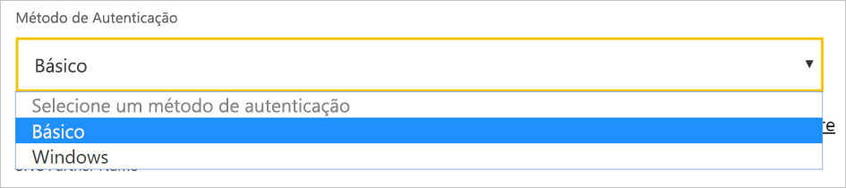

# <a name="use-kerberos-for-single-sign-on-sso-from-power-bi-to-on-premises-data-sources"></a>Utilizar o Kerberos para SSO (início de sessão único) a partir do Power BI para origens de dados no local

Utilize a [delegação restrita de Kerberos](/windows-server/security/kerberos/kerberos-constrained-delegation-overview) para ativar a conectividade de início de sessão único (SSO) totalmente integrada. Ativar o SSO facilita a atualização de dados de origens no local através de relatórios e dashboards do Power BI.

## <a name="supported-data-sources"></a>Supported data sources (Origens de dados suportadas)

Atualmente, suportamos as seguintes origens de dados:

* SQL Server
* SAP HANA
* SAP BW
* Teradata
* Spark
* Impala

Também suportamos SAP HANA com [Security Assertion Markup Language (SAML)](service-gateway-sso-saml.md).

### <a name="sap-hana"></a>SAP HANA

Para ativar o SSO para SAP HANA, siga primeiro estes passos:

* Certifique-se de que o servidor SAP HANA está a executar a versão mínima exigida, consoante o nível de plataforma do servidor SAP HANA:
  * [HANA 2 SPS 01 Rev 012.03](https://launchpad.support.sap.com/#/notes/2557386)
  * [HANA 2 SPS 02 Rev 22](https://launchpad.support.sap.com/#/notes/2547324)
  * [HANA 1 SP 12 Rev 122.13](https://launchpad.support.sap.com/#/notes/2528439)
* Na máquina do gateway, instale o controlador OBDC HANA mais recente do SAP.  A versão mínima é ODBC HANA, versão 2.00.020.00 de agosto de 2017.

Para obter mais informações sobre como configurar o SSO para o SAP HANA com o Kerberos, veja [Single Sign-on Using Kerberos](https://help.sap.com/viewer/b3ee5778bc2e4a089d3299b82ec762a7/2.0.03/1885fad82df943c2a1974f5da0eed66d.html) (Início de Sessão Único com o Kerberos) no Guia de Segurança do SAP HANA. Veja também as ligações nessa página, em particular, SAP Note 1837331 – HOWTO HANA DBSSO Kerberos/Active Directory.

## <a name="prepare-for-kerberos-constrained-delegation"></a>Preparar a delegação restrita de Kerberos

Tem de configurar vários itens para que a delegação restrita de Kerberos funcione corretamente, incluindo os *Nomes dos Principais do Serviço* (SPN) e as definições de delegação em contas de serviço.

### <a name="prerequisite-1-install-and-configure-the-microsoft-on-premises-data-gateway"></a>Pré-requisito 1: instalar e configurar o gateway de dados no local da Microsoft

Esta versão do gateway de dados no local suporta uma atualização no local, bem como o controlo das definições de gateways existentes.

### <a name="prerequisite-2-run-the-gateway-windows-service-as-a-domain-account"></a>Pré-requisito 2: Executar o serviço Windows do gateway como uma conta de domínio

Numa instalação padrão, o gateway é executado como uma conta de serviço da máquina local (especificamente, *NT Service\PBIEgwService*).


Para ativar a delegação restrita de Kerberos, o gateway tem de ser executado como uma conta de domínio, a menos que a instância do Azure Active Directory (Azure AD) já esteja sincronizada com a instância do Active Directory local (através do Azure AD DirSync/Connect). Para mudar para uma conta de domínio, veja [Change the gateway service account](/data-integration/gateway/service-gateway-service-account) (Alterar a conta do serviço de gateway).

> [!NOTE]
> Se o Azure AD Connect estiver configurado e as contas de utilizador estiverem sincronizadas, o serviço de gateway não precisará de realizar pesquisas do Azure AD locais no runtime. Pode utilizar o SID de serviço local (em vez de exigir uma conta de domínio) para o serviço de gateway. Os passos de configuração da delegação restrita de Kerberos descritos neste artigo são os mesmos dessa configuração. São simplesmente aplicados ao objeto do computador do gateway no Azure AD, em vez de à conta do domínio.

### <a name="prerequisite-3-have-domain-admin-rights-to-configure-spns-setspn-and-kerberos-constrained-delegation-settings"></a>Pré-requisito 3: ter direitos de administrador de domínio para configurar as definições de delegação restrita de Kerberos e SPN (SetSPN)

Não recomendamos que um administrador de domínio conceda direitos, temporária ou permanentemente, a outro utilizador para configurar SPNs e a delegação de Kerberos, sem serem necessários direitos de administração do domínio. Na secção seguinte, abordamos mais detalhadamente os passos de configuração recomendados.

## <a name="configure-kerberos-constrained-delegation-for-the-gateway-and-data-source"></a>Configurar a delegação restrita de Kerberos para o gateway e a origem de dados

Como administrador de domínio, configure um SPN para a conta de domínio do serviço de gateway e configure as definições de delegação na conta de domínio do serviço de gateway.

### <a name="configure-an-spn-for-the-gateway-service-account"></a>Configurar um SPN para a conta do serviço de gateway

Em primeiro lugar, determine se já foi criado um SPN para a conta de domínio utilizada como a conta do serviço de gateway:

1. Como administrador de domínio, abra **Utilizadores e Computadores do Active Directory**.

2. Clique com o botão direito no domínio, selecione **Localizar** e escreva o nome da conta do serviço de gateway.

3. No resultado da pesquisa, clique com o botão direito do rato na conta do serviço de gateway e selecione **Propriedades**.

4. Se o separador **Delegação** estiver visível na caixa de diálogo **Propriedades**, já foi criado um SPN. Pode avançar para a configuração das definições de delegação.

    Se não existir um separador **Delegação**, na caixa de diálogo **Propriedades**, pode criar manualmente um SPN nessa conta. Esta ação adiciona o separador **Delegação**. Utilize a [ferramenta setspn](https://technet.microsoft.com/library/cc731241.aspx) fornecida com o Windows (precisa de direitos de administrador de domínio para criar o SPN).

    Por exemplo, imagine que a conta do serviço de gateway é “PBIEgwTest\GatewaySvc” e que o nome da máquina que executa o serviço de gateway é **Machine1**. Para definir o SPN para a conta do serviço de gateway para essa máquina neste exemplo, execute o seguinte comando:

    

    Com esse passo concluído, podemos avançar para a configuração das definições de delegação.

### <a name="configure-delegation-settings-on-the-gateway-service-account"></a>Configurar as definições de delegação na conta do serviço de gateway

O segundo requisito de configuração são as definições de delegação na conta do serviço de gateway. Pode utilizar várias ferramentas existentes para executar estes passos. Aqui, vamos utilizar o Utilizadores e Computadores do Active Directory, que é um snap-in da Consola de Gestão da Microsoft (MMC), para administrar e publicar informações no diretório. Está disponível nos controladores de domínio por predefinição. Também pode ativá-lo através da configuração de Funcionalidades do Windows noutras máquinas.

Precisamos de configurar a delegação restrita de Kerberos com trânsito de protocolo. Com a delegação restrita, tem de ser explícito relativamente aos serviços que pretende delegar. Por exemplo, apenas o SQL Server ou o seu servidor SAP HANA aceita chamadas de delegação da conta do serviço de gateway.

Esta secção pressupõe que já configurou os SPNs para as suas origens de dados subjacentes (como o SQL Server, SAP HANA, Teradata e Spark). Para saber como configurar esses SPNs do servidor de origem de dados, consulte a documentação técnica do respetivo servidor de bases de dados. Também pode ver o título *What SPN does your app require?* (De que SPN precisa a sua aplicação?) na mensagem [My Kerberos Checklist](https://techcommunity.microsoft.com/t5/SQL-Server-Support/My-Kerberos-Checklist-8230/ba-p/316160) (A Minha Lista de Verificação do Kerberos) do blogue.

Nos passos seguintes, utilizamos um ambiente no local com duas máquinas: uma máquina de gateway e um servidor de base de dados com SQL Server. Para efeitos deste exemplo, vamos utilizar os seguintes nomes e definições:

* Nome do computador do gateway: **PBIEgwTestGW**
* Conta do serviço de gateway: **PBIEgwTestFrontEnd\GatewaySvc** (nome a apresentar da conta: Conector do Gateway)
* Nome do computador da origem de dados do SQL Server: **PBIEgwTestSQL**
* Conta do serviço da origem de dados do SQL Server: **PBIEgwTest\SQLService**

Eis como configurar as definições de delegação:

1. Com direitos de administrador de domínio, abra o **Utilizadores e Computadores do Active Directory**.

2. Clique com o botão direito do rato na conta do serviço de gateway (**PBIEgwTest\GatewaySvc**) e selecione **Propriedades**.

3. Selecione o separador **Delegação**.

4. Selecione **Confiar neste computador apenas para delegação para serviços especificados** > **Utilizar qualquer protocolo de autenticação**.

5. Em **Serviços aos quais esta conta pode apresentar credenciais delegadas**, selecione **Adicionar**.

6. Na nova caixa de diálogo, selecione **Users or Computers** (Utilizadores ou Computadores).

7. Introduza a conta de serviço da origem de dados. Por exemplo, uma origem de dados do SQL Server poderá ter a conta de serviço **PBIEgwTest\SQLService**. Depois de adicionar a conta, selecione **OK**.

8. Selecione o SPN que criou para o servidor de bases de dados. No nosso exemplo, o SPN começa com **MSSQLSvc**. Se adicionou o FQDN e o SPN NetBIOS para o serviço de base de dados, irá selecionar ambos. Poderá ver apenas um.

9. Selecione **OK**. Agora, deverá ver o SPN na lista.

    Opcionalmente, pode selecionar **Expanded** (Expandido) para mostrar o FQDN e o SPN NetBIOS. A caixa de diálogo terá um aspeto semelhante à seguinte, se selecionar **Expandido**. Selecione **OK**.

    

Por fim, na máquina que executa o serviço de gateway (**PBIEgwTestGW** no nosso exemplo), tem de conceder à conta do serviço de gateway as políticas locais **Representar um cliente após autenticação** e **Atuar como parte do sistema operativo (SeTcbPrivilege)** . Pode efetuar e verificar esta configuração com o Editor de Políticas de Grupo Local (**gpedit**).

1. Na máquina do gateway, execute: *gpedit.msc*.

1. Aceda a **Política de Computador Local**  > **Configuração do Computador** > **Definições do Windows** > **Definições de Segurança** > **Políticas Locais** > **Atribuição de Direitos de Utilizadores**.

    

1. Em **Atribuição de Direitos de Utilizadores**, na lista de políticas, selecione **Representar um cliente após autenticação**.

    

    Clique com o botão direito do rato e abra as **Propriedades**. Verifique a lista de contas. Tem de incluir a conta do serviço de gateway (**PBIEgwTest\GatewaySvc**).

1. Em **Atribuição de Direitos de Utilizadores**, na lista de políticas, selecione **Atuar como parte do sistema operativo (SeTcbPrivilege)** . Certifique-se de que a conta do serviço de gateway também está incluída na lista de contas.

1. Reinicie o processo do serviço de **Gateway de dados no local**.

Se estiver a utilizar o SAP HANA, recomendamos que siga estes passos adicionais, que podem resultar numa pequena melhoria no desempenho.

1. No diretório de instalação do gateway, localize e abra este ficheiro de configuração: *Microsoft.PowerBI.DataMovement.Pipeline.GatewayCore.dll.config*.

1. Localize a propriedade *FullDomainResolutionEnabled* e altere o respetivo valor para *True* (Verdadeiro).

    ```xml
    <setting name=" FullDomainResolutionEnabled " serializeAs="String">
          <value>True</value>
    </setting>
    ```

## <a name="run-a-power-bi-report"></a>Executar um relatório do Power BI

Depois de concluir todos os passos de configuração, pode utilizar a página **Gerir Gateway** no Power BI para configurar a origem de dados. Em seguida, nas **Definições Avançadas**, ative o SSO e publique relatórios e conjuntos de dados vinculados a essa origem de dados.


Esta configuração funciona na maioria dos casos. No entanto, com o Kerberos podem existir configurações diferentes, dependendo do seu ambiente. Se, ainda assim, o relatório não carregar, contacte o administrador do domínio para uma investigação mais aprofundada.

## <a name="configure-sap-bw-for-sso-using-commoncryptolib"></a>Configurar o SAP BW para SSO através da biblioteca CommonCryptoLib

Agora que já compreende como o Kerberos funciona com um gateway, pode configurar o SSO para o seu SAP BW (SAP Business Warehouse). Os passos seguintes pressupõem que já está [preparado para a delegação restrita de Kerberos](#prepare-for-kerberos-constrained-delegation), conforme descrito anteriormente neste artigo.

> [!NOTE]
> Estas instruções abordam a configuração do SSO para Servidores de **Aplicações** do SAP BW. Atualmente, a Microsoft não suporta ligações SSO aos Servidores de **Mensagens** do SAP BW.

1. Certifique-se de que o seu servidor BW está configurado corretamente para o SSO do Kerberos. Se estiver, deverá conseguir utilizar o SSO para aceder ao seu servidor BW com uma ferramenta SAP, como o SAP GUI. Para obter mais informações sobre os passos de configuração, veja [SAP Single Sign-On: Authenticate with Kerberos/SPNEGO](https://blogs.sap.com/2017/07/27/sap-single-sign-on-authenticate-with-kerberosspnego/) (Início de Sessão Único do SAP: autenticação com Kerberos/SPNEGO). O seu servidor BW deverá utilizar CommonCryptoLib como a respetiva Biblioteca SNC e ter um nome SNC que comece por "CN=", como "CN=BW1". Para obter mais informações sobre os requisitos de nomes SNC, veja [SNC Parameters for Kerberos Configuration](https://help.sap.com/viewer/df185fd53bb645b1bd99284ee4e4a750/3.0/en-US/360534094511490d91b9589d20abb49a.html) (Parâmetros SNC para Configuração do Kerberos [o parâmetro snc/identity/as]).

1. Se ainda não o tiver feito, conclua os passos descritos em [Preparar a delegação restrita de Kerberos](https://docs.microsoft.com/power-bi/service-gateway-sso-kerberos#prepare-for-kerberos-constrained-delegation). Certifique-se de que o Utilizador de Serviço do seu gateway está configurado para apresentar as credenciais delegadas ao Utilizador de Serviço que representa o Servidor de Aplicações do BW no seu ambiente do Active Directory.

1. Se ainda não o tiver feito, instale a versão x64 do [SAP .NET Connector](https://support.sap.com/en/product/connectors/msnet.html) no computador onde o gateway foi instalado. Pode verificar se o componente foi instalado ao tentar estabelecer ligação ao seu servidor BW no Power BI Desktop. Se não conseguir estabelecer ligação com a implementação 2.0, significa que o .NET Connector não está instalado.

1. Certifique-se de que o SAP Secure Login Client (SLC) não está em execução no computador onde o gateway está instalado. O SLC coloca os pedidos do Kerberos em cache de uma forma que pode interferir com a capacidade de o gateway utilizar o Kerberos para SSO. Se o SLC estiver instalado, desinstale-o ou certifique-se de que sai do SAP Secure Login Client: clique com o botão direito do rato no ícone do tabuleiro do sistema e selecione "Log Out" (Terminar Sessão) e "Exit" (Sair) antes de tentar estabelecer uma ligação SSO com o gateway. A utilização do SLC não é suportada em computadores com o Windows Server. Para obter mais informações, veja [SAP Note 2780475](https://launchpad.support.sap.com/#/notes/2780475) (Nota do SAP 2780475 [é necessário um utilizador S]).

    

    Se desinstalar o SLC ou selecionar **Log Out** (Terminar Sessão) e **Exit** (Sair), abra uma janela cmd e introduza `klist purge` para limpar os pedidos do Kerberos em cache existentes antes de tentar uma ligação SSO através do gateway.

1. Transfira a versão **8.5.25 ou superior** da CommonCryptoLib (sapcrypto.dll) a partir do SAP Launchpad e copie a mesma para uma pasta no computador do seu gateway. No mesmo diretório para onde copiou o ficheiro sapcrypto.dll, crie um ficheiro com o nome sapcrypto.ini com os seguintes conteúdos:

    ```
    ccl/snc/enable_kerberos_in_client_role = 1
    ```

    O ficheiro .ini contém informações de configuração de que a CommonCryptoLib precisa para ativar o SSO no cenário de gateway.

    > [!NOTE]
    > Estes ficheiros têm de ser armazenados na mesma localização. Por outras palavras, o parâmetro _/path/to/sapcrypto/_ deve conter os ficheiros sapcrypto.ini e sapcrypto.dll.

    O Utilizador de Serviço do gateway e o utilizador do Active Directory (AD) que será representado pelo Utilizador de Serviço necessitam de permissões de leitura e execução para ambos os ficheiros. Recomendamos que conceda permissões nos ficheiros .ini e .dll ao grupo Utilizadores Autenticados. Para fins de teste, também pode conceder explicitamente estas permissões ao Utilizador de Serviço do gateway e ao utilizador representado. Na captura de ecrã abaixo, concedemos permissões de **Leitura e execução** ao grupo Utilizadores Autenticados para o ficheiro sapcrypto.dll:

    

1. Se não tiver uma origem de dados do SAP Business Warehouse Server, adicione uma origem de dados na página **Gerir gateways** no serviço Power BI. Se já tiver associado uma origem de dados BW ao gateway pelo qual pretende que a ligação SSO flua, prepare-se para editá-la.

    Para **Biblioteca SNC**, selecione **Variável de ambiente SNC\_LIB ou SNC\_LIB\_64** ou **Personalizar**. Se selecionar a opção **SNC\_LIB**, terá de definir o valor da variável de ambiente SNC\_LIB\_64 no computador do gateway para o caminho absoluto da cópia do ficheiro sapcrypto.dll nesse computador, por exemplo C:\Users\Test\Desktop\sapcrypto.dll. Se selecionar **Personalizar**, cole o caminho absoluto no ficheiro sapcrypto.dll no campo Caminho da Biblioteca SNC Personalizado que aparece na página **Gerir gateways**.

    Em **Definições avançadas**, certifique-se de que a caixa de verificação **Utilizar SSO através de Kerberos para consultas de DirectQuery** está selecionada. O nome de utilizador que introduzir só precisa de ter permissão para ligar ao servidor BW e é utilizado principalmente para testar a ligação à origem de dados após ter criado a mesma. O utilizador também é utilizado para atualizar os relatórios criados a partir de conjuntos de dados baseados em importações, caso tenha um. Se selecionar o método de autenticação **Básico**, tem de fornecer um utilizador do BW. Se selecionar o método de autenticação **Windows**, tem de especificar um utilizador do Active Directory do Windows que esteja mapeado para um utilizador do BW através da transação SU01 no SAP GUI. O resto dos campos (**Número do Sistema **,** ID de Cliente **,** Nome do Parceiro SNC**, entre outros) tem de corresponder às informações que vier a introduzir no Power BI Desktop para ligar ao seu servidor BW através do SSO. Selecione **Aplicar** e certifique-se de que a ligação de teste é concluída com êxito.

    

1. Crie uma variável de ambiente de sistema CCL\_PROFILE e aponte-a para o ficheiro sapcrypto.ini:

    

    Lembre-se de que os ficheiros sapcrypto .dll e .ini têm de existir na mesma localização. No exemplo apresentado acima, onde o ficheiro sapcrypto.ini se encontra no ambiente de trabalho, o ficheiro sapcrypto.dll também deve estar localizado no ambiente de trabalho.

1. Reinicie o serviço de gateway:

    

1. Publique um relatório do BW **baseado no DirectQuery** a partir do Power BI Desktop. Este relatório tem de utilizar dados que possam ser acedidos pelo utilizador do BW mapeado para o utilizador do Azure Active Directory (AAD) que inicia sessão no serviço Power BI. Tem de utilizar o DirectQuery em vez da importação, devido à forma como a atualização funciona. Ao atualizar relatórios baseados em importações, o gateway utiliza as credenciais que introduziu nos campos **Nome de utilizador** e **Palavra-passe** no momento em que criou a origem de dados do BW. Por outras palavras, o SSO do Kerberos **não** é utilizado. Além disso, no momento da publicação, certifique-se de que seleciona o gateway que configurou para o SSO do BW, se tiver múltiplos gateways. Já deverá conseguir atualizar o relatório no serviço Power BI ou criar um novo relatório com base no conjunto de dados publicado.

### <a name="troubleshooting"></a>Resolução de problemas

Se não conseguir atualizar o relatório no serviço Power BI, pode utilizar o rastreio de gateways, o rastreio de CPIC e o rastreio de CommonCryptoLib para ajudar a diagnosticar o problema. O rastreio de CPIC e de CommonCryptoLib são produtos do SAP, pelo que a Microsoft não pode fornecer suporte direto para os mesmos. Para os utilizadores do Active Directory a quem for concedido acesso de SSO ao BW, algumas configurações do Active Directory poderão exigir que os utilizadores sejam membros do grupo Administradores no computador onde o gateway foi instalado.

1. **Registos do Gateway:** reproduza o problema, abra a [aplicação de gateway](https://docs.microsoft.com/data-integration/gateway/service-gateway-app), aceda ao separador **Diagnósticos** e selecione **Exportar registos**:

    

1. **Rastreio de CPIC:** para ativar o rastreio de CPIC, defina duas variáveis de ambiente: CPIC\_TRACE e CPIC\_TRACE\_DIR. A primeira variável define o nível de rastreio e a segunda variável define o diretório do ficheiro de rastreio. O diretório tem de ser uma localização na qual os membros do grupo Utilizadores Autenticados possam escrever. Defina a variável CPIC\_TRACE para 3 e a variável CPIC\_TRACE\_DIR para o diretório no qual pretende que os ficheiros de rastreio sejam escritos.

    

    Reproduza o problema e verifique se a variável CPIC\_TRACE\_DIR contém os ficheiros de rastreio.

1. **Rastreio de CommonCryptoLib:** Ative o rastreio de CommonCryptoLib ao adicionar duas linhas no ficheiro sapcrypto.ini que criou anteriormente:

    ```
    ccl/trace/level=5
    ccl/trace/directory=<drive>:\logs\sectrace
    ```

    Certifique-se de que altera a opção _ccl/trace/directory_ para uma localização na qual os membros do grupo Utilizadores Autenticados possam escrever. Em alternativa, crie um novo ficheiro .ini para alterar este comportamento. No mesmo diretório dos ficheiros sapcrypto.ini e sapcrypto.dll, crie um ficheiro com o nome sectrace.ini e com os seguintes conteúdos.  Substitua a opção DIRECTORY por uma localização no seu computador onde o Utilizador Autenticado possa escrever:

    ```
    LEVEL = 5
    
    DIRECTORY = <drive>:\logs\sectrace
    ```

    Agora, reproduza o problema e verifique se a localização apontada por DIRECTORY contém ficheiros de rastreio. Certifique-se de que desativa o rastreio de CPIC e CCL quando terminar.

    Para obter mais informações sobre o rastreio de CommonCryptoLib, veja [SAP Note 2491573](https://launchpad.support.sap.com/#/notes/2491573) (Nota do SAP 2491573 [é necessário um utilizador S]).

## <a name="configure-sap-bw-for-sso-using-gsskrb5gx64krb5"></a>Configurar o SAP BW para SSO através da biblioteca gsskrb5/gx64krb5

Se não conseguir utilizar CommonCryptoLib como a sua biblioteca SNC, pode utilizar a biblioteca gsskrb5/gx64krb5 em alternativa. No entanto, os passos de configuração para a biblioteca gsskrb5 são consideravelmente mais complexos e o SAP deixou de fornecer suporte para a mesma.

Este guia tenta ser tão abrangente quanto possível. Se já tiver concluído alguns destes passos, poderá ignorá-los. Por exemplo, poderá já ter criado um utilizador de serviço para o servidor do SAP BW e mapeado um SPN a este ou poderá já ter instalado a biblioteca `gsskrb5`.

### <a name="set-up-gsskrb5gx64krb5-on-client-machines-and-the-sap-bw-server"></a>Configurar a biblioteca gsskrb5/gx64krb5 nos computadores cliente e no servidor do SAP BW

> [!NOTE]
> A biblioteca `gsskrb5/gx64krb5` deixou de ser suportada ativamente pelo SAP. Para obter mais informações, veja [SAP Note 352295](https://launchpad.support.sap.com/#/notes/352295) (Nota SAP 352295). Além disso, tenha em atenção que a biblioteca `gsskrb5/gx64krb5` não permite ligações SSO do gateway de dados a Servidores de Mensagens do SAP BW. Apenas são possíveis ligações para Servidores Aplicacionais do SAP BW. Agora, é possível utilizar a sapcrypto/CommonCryptoLib como a Biblioteca SNC que simplifica o processo de configuração. 

A biblioteca `gsskrb5` tem de ser utilizada pelo cliente e pelo servidor para estabelecer uma ligação SSO através do gateway.

1. Transfira a `gsskrb5` ou a `gx64krb5`, consoante o número de bits pretendido, da [Nota SAP 2115486](https://launchpad.support.sap.com/) (necessário um utilizador S do SAP). Certifique-se de que tem, pelo menos, a versão 1.0.11.x.

1. Coloque a biblioteca numa localização na sua máquina do gateway que seja acessível pela sua instância de gateway (e pelo SAP GUI, se quiser testar a ligação SSO através do SAP Logon).

1. Coloque outra cópia na sua máquina do servidor do SAP BW numa localização acessível pelo servidor do SAP BW.

1. Nas máquinas do cliente e do servidor, defina as variáveis de ambiente `SNC_LIB` ou `SNC_LIB_64` para apontarem para as localizações do gsskrb5.dll ou do gx64krb5.dll, respetivamente. Tenha em atenção que só precisa de uma destas bibliotecas e não de ambas.

### <a name="create-a-sap-bw-service-user-and-enable-snc-communication"></a>Criar um utilizador do serviço SAP BW e permitir a comunicação com o SNC

Além da configuração do gateway que efetuou, existem mais alguns passos adicionais específicos do SAP BW. A secção [Configurar as definições de delegação na conta do serviço de gateway](#configure-delegation-settings-on-the-gateway-service-account) da documentação pressupõe que já configurou os SPNs para as suas origens de dados subjacentes. Para concluir esta configuração do SAP BW:

1. Num servidor do Controlador de Domínio do Active Directory, crie um utilizador de serviço (inicialmente só um utilizador do Active Directory simples) para o Servidor Aplicacional do SAP BW no seu ambiente do Active Directory. Em seguida, atribua um SPN ao mesmo.

    O SAP recomenda que se inicie o SPN com `SAP/`, mas também deve ser possível utilizar outros prefixos como `HTTP/`. O que se sucede ao `SAP/` fica ao seu critério. Uma opção é usar o nome de utilizador do utilizador do serviço do servidor do SAP BW. Por exemplo, se criar `BWServiceUser@\<DOMAIN\>` como o seu utilizador de serviço, pode utilizar o SPN `SAP/BWServiceUser`. Uma forma de definir o mapeamento do SPN é através do comando setspn. Por exemplo, para configurar o SPN no utilizador de serviço que criámos, iria executar o seguinte comando a partir de uma janela cmd numa máquina de Controlador de Domínio: `setspn -s SAP/ BWServiceUser DOMAIN\ BWServiceUser`. Para obter mais informações, veja a documentação do SAP BW.

1. Conceda ao utilizador de serviço acesso ao Servidor Aplicacional do SAP BW:

    1. Na máquina do servidor do SAP BW, adicione o utilizador de serviço ao grupo Administrador Local do servidor do SAP BW. Abra o programa Gestão de Computadores e faça duplo clique no grupo Administrador Local do seu servidor.

        

    1. Faça duplo clique no grupo Administrador Local e selecione **Adicionar** para adicionar o seu utilizador de serviço ao grupo. Selecione **Verificar Nomes** para garantir que introduziu o nome corretamente. Selecione **OK**.

1. Defina o utilizador de serviço do servidor do SAP BW como o utilizador que inicia o serviço do servidor do SAP BW na máquina do servidor do SAP BW.

    1. Abra **Executar** e introduza "Services.msc". Procure o serviço correspondente à sua instância do Servidor Aplicacional do SAP BW. Clique com o botão direito do rato no mesmo e selecione **Propriedades**.

        

    1. Mude para o separador **Início de sessão** e altere o utilizador para o seu utilizador do serviço SAP BW. Introduza a palavra-passe do utilizador e selecione **OK**.

1. Inicie sessão no seu servidor no SAP Logon e defina os parâmetros do seguinte perfil com a transação RZ10:

    1. Defina o parâmetro de perfil snc/identity/as para p:\<o utilizador do serviço SAP BW que criou\>, como p:BWServiceUser@MYDOMAIN.COM. Repare no p: que precede o UPN do utilizador de serviço. Não é p:CN= como quando a Common Crypto Library é utilizada como biblioteca SNC.

    1. Defina o parâmetro de perfil snc/gssapi\_lib como caminho \< para gsskrb5.dll/gx64krb5.dll na máquina do servidor (a biblioteca que irá utilizar depende do número de bits do SO)\>. Lembre-se de colocar a biblioteca numa localização à qual o Servidor Aplicacional do SAP BW possa aceder.

    1. Além disso, defina os seguintes parâmetros de perfil adicionais, ao alterar os valores conforme exigido para satisfazer as suas necessidades. Tenha em atenção que as últimas cinco opções permitem que os clientes liguem ao servidor do SAP BW com o SAP Logon, sem ser necessário ter o SNC configurado.

        | **Definição** | **Valor** |
        | --- | --- |
        | snc/data\_protection/max | 3 |
        | snc/data\_protection/min | 1 |
        | snc/data\_protection/use | 9 |
        | snc/accept\_insecure\_cpic | 1 |
        | snc/accept\_insecure\_gui | 1 |
        | snc/accept\_insecure\_r3int\_rfc | 1 |
        | snc/accept\_insecure\_rfc | 1 |
        | snc/permit\_insecure\_start | 1 |

    1. Defina a propriedade snc/enable como 1.

1. Após definir estes parâmetros de perfil, abra a Consola de Gestão de SAP na máquina do servidor e reinicie a instância do SAP BW. Se o servidor não iniciar, verifique que configurou os parâmetros de perfil corretamente. Para saber mais sobre as definições de parâmetro de perfil, veja a [documentação do SAP](https://help.sap.com/saphelp_nw70ehp1/helpdata/en/e6/56f466e99a11d1a5b00000e835363f/frameset.htm). Também pode consultar as informações de resolução de problemas mais adiante nesta secção se tiver problemas.

### <a name="map-a-sap-bw-user-to-an-active-directory-user"></a>Mapear um utilizador do SAP BW a um utilizador do Active Directory

Mapeie um utilizador do Active Directory a um utilizador do Servidor Aplicacional do SAP BW e teste a ligação SSO no SAP Logon.

1. Inicie sessão no seu servidor do SAP BW através do SAP Logon. Execute a transação SU01.

1. Em **User** (Utilizador), introduza o utilizador do SAP BW para o qual pretende ativar as ligações SSO (na captura de ecrã anterior estamos a configurar permissões para BIUSER). Selecione o ícone **Edit** (Editar) (a imagem de uma caneta) junto ao canto superior esquerdo da janela SAP Logon.

    

1. Selecione o separador **SNC**. Na caixa de entrada SNC Name (Nome do SNC), introduza p:\<o seu utilizador do Active Directory\>@\<o seu domínio\>. Repare no p: obrigatório que tem de preceder o UPN do utilizador do Active Directory. O utilizador do Active Directory que especificar deve pertencer à pessoa ou organização para a qual pretende ativar o acesso de SSO ao Servidor Aplicacional do SAP BW. Por exemplo, se quiser ativar o acesso de SSO para o utilizador testuser\@TESTDOMAIN.COM, introduza p:testuser@TESTDOMAIN.COM.

    

1. Selecione o ícone **Guardar** (a imagem de uma disquete) junto ao canto superior esquerdo do ecrã.

### <a name="test-sign-in-by-using-sso"></a>Testar o início de sessão com o SSO

Verifique se consegue iniciar sessão no servidor. Utilize o SAP Logon através do SSO enquanto utilizador do Active Directory para o qual ativou o acesso de SSO.

1. Enquanto utilizador do Active Directory para o qual ativou o acesso de SSO, inicie sessão numa máquina na qual o SAP Logon esteja instalado. Inicie o SAP Logon e crie uma nova ligação.

1. No ecrã **Create New System Entry** (Criar Nova Entrada do Sistema), selecione **User Specified System** (Sistema Especificado pelo Utilizador)  > **Next** (Seguinte).

    

1. Preencha os detalhes adequados no ecrã seguinte, incluindo o servidor da aplicação, número da instância e ID do sistema. Em seguida, selecione **Finish** (Concluir).

1. Clique com o botão direito do rato na nova ligação e selecione **Properties** (Propriedades). Selecione o separador **Network** (Rede). Na caixa de texto **SNC Name** (Nome do SNC), introduza p:\<o UPN do utilizador do serviço SAP BW\>, como p:BWServiceUser@MYDOMAIN.COM. Em seguida, selecione **OK**.

    

1. Faça duplo clique na ligação que criou para tentar efetuar uma ligação SSO ao servidor do SAP BW. Se a ligação for bem-sucedida, avance para o passo seguinte. Caso contrário, reveja os passos anteriores neste documento para se certificar de que estes foram concluídos corretamente ou reveja a secção de resolução de problemas abaixo. Tenha em atenção que se não conseguir ligar ao servidor do SAP BW através do SSO neste contexto, não poderá fazê-lo no contexto de gateways.

### <a name="troubleshoot-installation-and-connections"></a>Resolver problemas de instalação e ligações

Caso se depare com problemas, siga estes passos para resolver o problema da instalação de gsskrb5 e das ligações SSO a partir do SAP Logon.

* Ver os registos do servidor (…work\dev\_w0 na máquina do servidor) pode ser útil na resolução de erros com que se depare na conclusão dos passos de configuração do gsskrb5. Isto aplica-se especialmente se o servidor do SAP BW não iniciar após os parâmetros de perfil terem sido alterados.

* Se não conseguir iniciar o serviço SAP BW devido a uma falha de início de sessão, poderá ter fornecido a palavra-passe errada quando configurou o utilizador de início de sessão do SAP BW. Verifique a palavra-passe ao iniciar sessão numa máquina no seu ambiente do Active Directory como um utilizador do serviço SAP BW.

* Se forem apresentados erros sobre as credenciais do SQL impedirem que o servidor inicie, verifique que concedeu ao utilizador do serviço acesso à base de dados do SAP BW.

* Poderá receber a seguinte mensagem: "(GSS-API) specified target is unknown or unreachable" ([GSS-API] o destino especificado é desconhecido ou não é alcançável). Normalmente significa que especificou o nome do SNC errado. Certifique-se de que utiliza "p:" e não "p:CN=" ou qualquer outra coisa na aplicação cliente sem ser o UPN do utilizador do serviço.

* Poderá receber a seguinte mensagem: "(GSS-API) An invalid name was supplied" ([GSS-API] Foi fornecido um nome inválido). Certifique-se de que "p:" se encontra no valor do parâmetro de perfil de identidade do SNC do servidor.

* Poderá receber a seguinte mensagem: "(SNC error) the specified module could not be found" ([Erro SNC] o módulo especificado não foi encontrado). Normalmente isto acontece quando coloca o `gsskrb5.dll/gx64krb5.dll` num local que exige privilégios elevados (direitos de administrador) para aceder.

### <a name="add-registry-entries-to-the-gateway-machine"></a>Adicionar entradas de registo ao computador do gateway

Adicione entradas de registo necessárias ao registo do computador no qual o gateway está instalado, bem como em computadores destinados a ligar-se a partir do Power BI Desktop. Eis os comandos a executar:

1. REG ADD HKLM\SOFTWARE\Wow6432Node\SAP\gsskrb5 /v ForceIniCredOK /t REG\_DWORD /d 1 /f

1. REG ADD HKLM\SOFTWARE\SAP\gsskrb5 /v ForceIniCredOK /t REG\_DWORD /d 1 /f

### <a name="set-configuration-parameters-on-the-gateway-machine"></a>Definir parâmetros de configuração no computador do gateway

Existem duas opções para a definição dos parâmetros de configuração, que variam consoante se tiver ou não o Azure AD Connect configurado para que os utilizadores possam iniciar sessão no serviço Power BI como utilizadores do Azure AD.

Se tiver o Azure AD Connect configurado, siga estes passos.

1. Abra o ficheiro de configuração de gateway principal, `Microsoft.PowerBI.DataMovement.Pipeline.GatewayCore.dll`. Por predefinição, este ficheiro está armazenado em C:\Programas\On-premises data gateway.

1. Confirme que a propriedade **FullDomainResolutionEnabled** está definida como **True** (Verdadeiro) e **SapHanaSsoRemoveDomainEnabled** está definida como **False** (Falso).

1. Guarde o ficheiro de configuração.

1. No separador **Serviços** do Gestor de Tarefas, clique com o botão direito do rato no serviço de gateway e selecione **Reiniciar**.

    

Se não tiver o Azure AD Connect configurado, siga estes passos para cada utilizador do serviço Power BI que pretenda mapear a um utilizador do Azure AD. Estes passos ligam manualmente um utilizador do serviço Power BI a um utilizador do Active Directory com permissão para iniciar sessão no SAP BW.

1. Abra o ficheiro de configuração de gateway principal, `Microsoft.PowerBI.DataMovement.Pipeline.GatewayCore.dll`. Por predefinição, este ficheiro está armazenado em C:\Programas\On-premises data gateway.

1. Defina a propriedade **ADUserNameLookupProperty** como `msDS-cloudExtensionAttribute1` e a propriedade **ADUserNameReplacementProperty** como `SAMAccountName`. Guarde o ficheiro de configuração.

1. No separador **Serviços** do Gestor de Tarefas, clique com o botão direito do rato no serviço de gateway e selecione **Reiniciar**.

    

1. Defina a propriedade `msDS-cloudExtensionAttribute1` do utilizador do Active Directory. Este é o utilizador que mapeou a um utilizador do SAP BW. Defina a propriedade para o utilizador do serviço Power BI para o qual pretende ativar o SSO do Kerberos. Uma forma de definir a propriedade `msDS-cloudExtensionAttribute1` é utilizar o snap-in Utilizadores e Computadores do Active Directory da MMC. (Também pode utilizar outros métodos.)

    1. Inicie sessão numa máquina de Controlador de Domínio como utilizador Administrador.

    1. Abra a pasta **Utilizadores** na janela do snap-in e faça duplo clique no utilizador do Active Directory que mapeou a um utilizador do SAP BW.

    1. Selecione o separador **Attribute Editor** (Editor de Atributos).

        Se não vir este separador, terá de procurar instruções sobre como ativá-lo ou utilizar outro método para definir a propriedade. Selecione um dos atributos e, em seguida, a chave M para navegar até às propriedades do Active Directory que comecem com a letra m. Localize a propriedade `msDS-cloudExtensionAttribute1` e faça duplo clique na mesma. Defina o valor para o nome de utilizador que utiliza para iniciar sessão no Serviço Power BI, na forma YourUser@YourDomain.

    1. Selecione **OK**.

        

    1. Selecione **Aplicar**. Verifique se o valor correto foi configurado na coluna **Valor**.

### <a name="add-a-new-sap-bw-application-server-data-source-to-the-power-bi-service"></a>Adicionar uma nova origem de dados do Servidor Aplicacional do SAP BW ao serviço Power BI

Adicione a origem de dados do SAP BW ao seu gateway ao seguir as instruções mencionadas anteriormente neste artigo sobre como [executar um relatório](#run-a-power-bi-report).

1. Na janela de configuração da origem de dados, introduza o **Nome do anfitrião**, **Número do Sistema** e **ID de cliente** do Servidor Aplicacional como faria para iniciar sessão no seu servidor do SAP BW a partir do Power BI Desktop.

1. No campo **Nome do Parceiro SNC**, introduza p:\<o SPN que mapeou ao utilizador do serviço SAP BW\>. Por exemplo, se o SPN for SAP/BWServiceUser@MYDOMAIN.COM, deverá introduzir p:SAP/BWServiceUser@MYDOMAIN.COM no campo **Nome do Parceiro SNC**.

1. Para a Biblioteca SNC, selecione a variável **SNC_LIB** ou **SNC_LIB_64**. Utilize a **SNC_LIB** para cenários de 32 bits e a **SNC_LIB_64** para cenários de 64 bits. Certifique-se de que estas variáveis de ambiente apontam para o gsskrb5.dll ou para o gx64krb5.dll, respetivamente, consoante o seu número de bits.

1. Se tiver selecionado **Windows** para o **Método de Autenticação**, o **Nome de Utilizador** e a **Palavra-passe** deverão pertencer a um utilizador do Active Directory com permissão para iniciar sessão no servidor do SAP BW através do SSO. Por outras palavras, devem pertencer a um utilizador do Active Directory que foi mapeado a um utilizador do SAP BW através da transação SU01. Se tiver selecionado **Básico**, o **Nome de Utilizador** e a **Palavra-passe** deverão ser definidos como um nome de utilizador e uma palavra-passe do SAP BW, respetivamente. Estas credenciais só são utilizadas se a caixa **Utilizar SSO através de Kerberos para consultas do DirectQuery** não estiver selecionada.

1. Selecione a caixa **Utilizar SSO através de Kerberos para consultas do DirectQuery** e selecione **Aplicar**. Se a ligação do teste não for bem-sucedida, verifique se os passos da configuração anterior foram concluídos corretamente.

    O gateway utiliza sempre as credenciais introduzidas para estabelecer uma ligação de teste ao servidor e para fazer as atualizações agendadas dos relatórios baseados em importação. O gateway tentará apenas estabelecer uma ligação SSO se a opção **Utilizar SSO através de Kerberos para consultas do DirectQuery** estiver selecionada e se o utilizador estiver a aceder a um conjunto de dados ou a um relatório com base na consulta.

### <a name="test-your-setup"></a>Testar a sua configuração

Para testar a sua configuração, publique um relatório do DirectQuery do Power BI Desktop no serviço Power BI. Garanta que tem sessão iniciada no serviço Power BI como utilizador do Azure AD ou como utilizador que tenha mapeado à propriedade `msDS-cloudExtensionAttribute1` de um utilizador do Azure AD. Se a configuração tiver sido concluída com êxito, deverá conseguir criar um relatório a partir do conjunto de dados publicado no serviço Power BI. Também deverá conseguir obter dados através de elementos visuais no relatório.

### <a name="troubleshoot-gateway-connectivity-issues"></a>Resolver problemas de conectividade do gateway

1. Verifique os registos do gateway. Abra a aplicação Configuração do Gateway e selecione **Diagnóstico** > **Exportar registos**. Os erros mais recentes estão na parte inferior de qualquer ficheiro de registo que examinar.

    

1. Ative o rastreio do SAP BW e analise os ficheiros de registo gerados. Existem vários tipos diferentes de rastreio do SAP BW disponíveis. Consulte a documentação do SAP para obter mais informações.

## <a name="errors-from-an-insufficient-kerberos-configuration"></a>Erros devidos a uma configuração de Kerberos insuficiente

Se o servidor de bases de dados subjacente e o gateway não estiverem configurados corretamente para delegação restrita de Kerberos, poderá receber a seguinte mensagem de erro referente a uma falha ao carregar os dados:


Os detalhes técnicos associados à mensagem de erro (DM_GWPipeline_Gateway_ServerUnreachable) poderão ter o seguinte aspeto:


O resultado é que o gateway não consegue representar o utilizador de origem corretamente e a tentativa de ligação da base de dados falhou.

## <a name="next-steps"></a>Próximos passos

Para obter mais informações sobre o **gateway de dados no local** e o **DirectQuery**, consulte os seguintes recursos:

* [What is an on-premises data gateway?](/data-integration/gateway/service-gateway-onprem) (O que é um gateway de dados no local?)
* [DirectQuery no Power BI](desktop-directquery-about.md)
* [Origens de dados suportadas pelo DirectQuery](desktop-directquery-data-sources.md)
* [DirectQuery e SAP BW](desktop-directquery-sap-bw.md)
* [DirectQuery and SAP HANA](desktop-directquery-sap-hana.md) (DirectQuery e SAP HANA)
