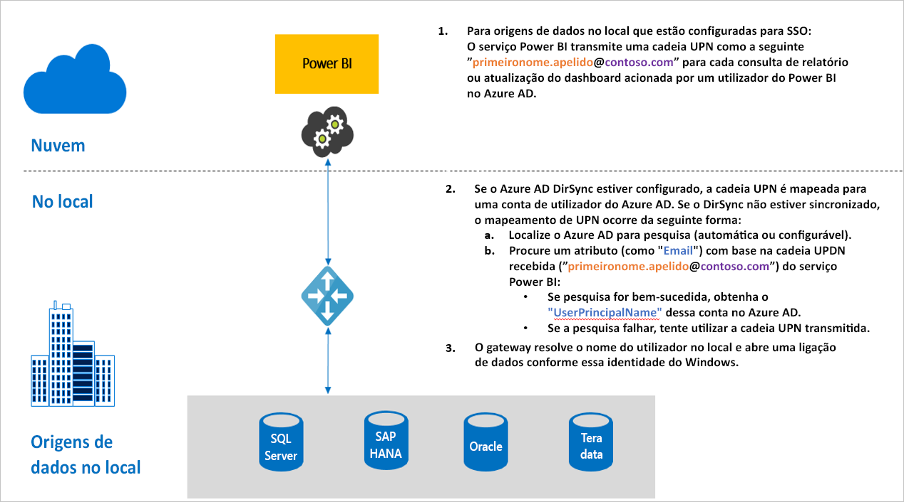

# Descrição geral do início de sessão único (SSO) para gateways no Power BI

Pode obter uma conectividade totalmente integrada de início de sessão único, permitindo a atualização de relatórios e dashboards do Power BI a partir de dados no local, ao configurar o seu Gateway de dados no local com a delegação restrita do Kerberos ou através de SAML (Security Assertion Markup Language). O Gateway de dados no local facilita o SSO com o DirectQuery, que é utilizado para ligar às origens de dados no local.

Atualmente, suportamos as seguintes origens de dados:

* SQL Server ([Kerberos](service-gateway-sso-kerberos.md))
* SAP HANA ([Kerberos](service-gateway-sso-kerberos.md) e [SAML](service-gateway-sso-saml.md))
* Teradata ([Kerberos](service-gateway-sso-kerberos.md))
* Spark ([Kerberos](service-gateway-sso-kerberos.md))

Quando um utilizador interage com um relatório do DirectQuery no serviço Power BI, cada filtro cruzado, setor, ordenação e operação de edição do relatório pode resultar em consultas que são executadas em direto com a origem de dados no local subjacente.  Quando o SSO é configurado para a origem de dados, as consultas são executadas sob a identidade do utilizador que interage com o Power BI (ou seja, através da experiência Web ou das aplicações móveis do Power BI). Assim, cada utilizador verá precisamente os dados para os quais tem permissões na origem de dados subjacente – com o início de sessão único configurado, não existe colocação em cache de dados partilhados com diferentes utilizadores.

## Passos de consulta ao executar o SSO

Uma consulta que é executada com o SSO consiste em três passos, conforme mostrado no diagrama seguinte.

> [!NOTE]
> O SSO para Oracle não está ativado ainda, mas está em desenvolvimento e ficará disponível em breve.

Seguem-se detalhes adicionais sobre esses passos:

1. Para cada consulta, o **serviço Power BI** inclui o *nome principal de utilizador* (UPN) ao enviar um pedido de consulta para o gateway configurado.

2. O gateway tem de mapear o UPN do Azure Active Directory para uma identidade do Active Directory local.

   a.  Se o Azure AD DirSync (também conhecido como *Azure AD Connect*) estiver configurado, o mapeamento funciona automaticamente no gateway.

   b.  Caso contrário, o gateway pode procurar e mapear o UPN do Azure AD para um utilizador local, efetuando uma pesquisa de domínio do Active Directory local.

3. O processo do serviço de gateway representa o utilizador local mapeado, abre a ligação à base de dados subjacente e envia a consulta. O gateway não tem de ser instalado na mesma máquina da base de dados.

## Próximos passos

Agora que já tem as noções básicas do SSO, leia informações mais detalhadas sobre o Kerberos e SAML:

* [Single sign-on (SSO) - Kerberos](service-gateway-sso-kerberos.md) (Início de sessão único (SSO) – Kerberos)
* [Single sign-on (SSO) - SAML](service-gateway-sso-saml.md) (Início de sessão único (SSO) – SAML)
