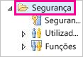
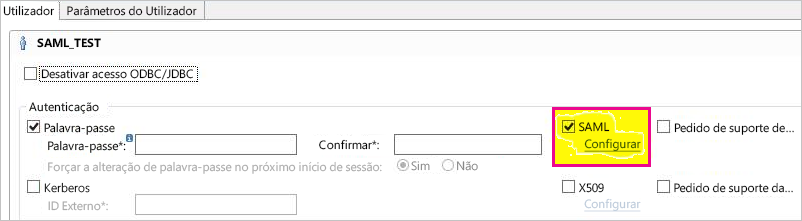
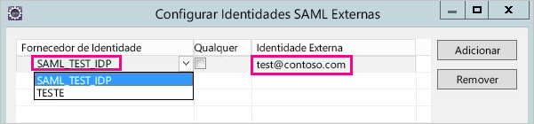
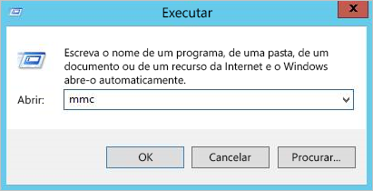
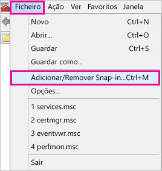
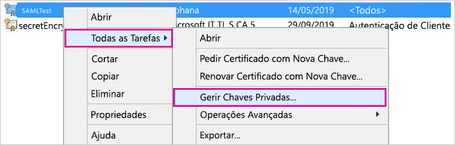
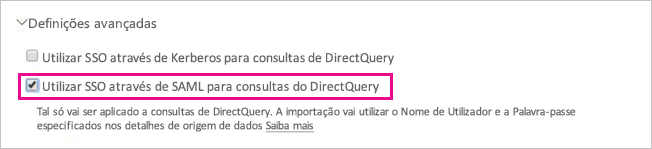

# <a name="use-security-assertion-markup-language-saml-for-sso-from-power-bi-to-on-premises-data-sources"></a>Utilizar o formato SAML (Security Assertion Markup Language) para SSO do Power BI em origens de dados no local

Utilize o formato [SAML (Security Assertion Markup Language)](https://www.onelogin.com/pages/saml) para permitir uma conectividade de início de sessão único totalmente integrado. Ativar o SSO facilita a atualização de dados de origens no local através de relatórios e dashboards do Power BI.

## <a name="supported-data-sources"></a>Supported data sources (Origens de dados suportadas)

Atualmente, suportamos a plataforma SAP HANA com SAML. Para obter mais informações sobre como configurar o início de sessão único na plataforma SAP HANA com SAML, veja o tópico [SAML SSO for BI Platform to HANA](https://wiki.scn.sap.com/wiki/display/SAPHANA/SAML+SSO+for+BI+Platform+to+HANA) (SSO em SAML entre a Plataforma do BI e a HANA) na documentação sobre SAP HANA.

Suportamos origens de dados adicionais com o [Kerberos](service-gateway-sso-kerberos.md).

Tenha em atenção que, para o HANA, recomendamos **vivamente** que a encriptação seja ativada antes de estabelecer uma ligação SSO no SAML (ou seja, deve configurar o servidor HANA para aceitar ligações encriptadas e configurar o gateway para utilizar encriptação ao comunicar com o seu servidor HANA). O controlador ODBC do HANA **não** consegue encriptar asserções do SAML por predefinição e, sem a encriptação ativada, a asserção do SAML assinada será enviada do Gateway para o servidor HANA "com luz verde" e estará vulnerável à interceção e reutilização por terceiros. Veja [Enable encryption for SAP HANA](/power-bi/desktop-sap-hana-encryption) (Ativar encriptação para o SAP HANA) para obter instruções sobre como ativar a encriptação para o HANA com a biblioteca OpenSSL.

## <a name="configuring-the-gateway-and-data-source"></a>Configurar o gateway e a origem de dados

Para utilizar o SAML, tem de estabelecer uma relação de confiança entre o servidor ou os servidores HANA para os quais pretende ativar o SSO e o gateway que representa o Fornecedor de Identidade (IdP) do SAML neste cenário. Existem várias maneiras de estabelecer esta relação, tal como importar o certificado X509 do IdP do gateway para o arquivo de confiança do servidor ou dos servidores HANA, ou utilizar uma Autoridade de Certificação (AC) de raiz em que o servidor ou os servidores HANA confiam para assinar o certificado X509 do gateway. Descrevemos esta abordagem mais adiante neste guia, mas pode utilizar outra, se lhe for mais conveniente.

Tenha em conta também que, apesar de este guia utilizar OpenSSL como o fornecedor criptográfico do servidor HANA, o SAP recomenda utilizar a Biblioteca Criptográfica do SAP (também conhecida como CommonCryptoLib ou sapcrypto) em vez de OpenSSL para concluir os passos de configuração em que estabelecemos a relação de confiança. Veja a documentação oficial do SAP para obter mais informações.

Os passos seguintes descrevem como estabelecer uma relação de confiança entre um servidor HANA e o IdP do gateway ao assinar o certificado X509 do IdP do gateway com uma AC de Raiz considerada de confiança pelo servidor HANA. Vai criar esta AC de Raiz.

1. Crie o certificado X509 e chave privada da AC de Raiz. Por exemplo, para criar o certificado X509 e a chave privada da AC de Raiz no formato .pem:

   ```
   openssl req -new -x509 -newkey rsa:2048 -days 3650 -sha256 -keyout CA_Key.pem -out CA_Cert.pem -extensions v3_ca
   ```

    Certifique-se de que o certificado da AC de Raiz está devidamente protegido, uma vez que, se for obtido por terceiros, poderá ser utilizado para ter acesso não autorizado ao servidor HANA. 

    Adicione o certificado (por exemplo, CA_Cert.pem) ao Arquivo de Confiança do servidor HANA para que o mesmo confie nos certificados assinados pela AC de Raiz que acabou de criar. Pode determinar a localização do Arquivo de Confiança do seu servidor HANA ao examinar a definição de configuração **ssltruststore**. Se seguiu a Documentação do SAP sobre como configurar OpenSSL, o seu servidor HANA poderá já confiar numa AC de Raiz que pode reutilizar. Veja [How to Configure Open SSL for SAP HANA Studio to SAP HANA Server](https://archive.sap.com/documents/docs/DOC-39571) (Como Configurar o OpenSSL entre o SAP HANA Studio e o Servidor SAP HANA) para obter detalhes. Se tiver múltiplos servidores HANA para os quais pretende ativar o SSO do SAML, certifique-se de que cada um confia nesta AC de Raiz.

1. Crie o certificado X509 do IdP do gateway. Por exemplo, para criar um pedido de assinatura de certificado (IdP_Key.pem) e uma chave privada (IdP_Key.pem) válidos por um ano, execute o seguinte comando:

   ```
   openssl req -newkey rsa:2048 -days 365 -sha256 -keyout IdP_Key.pem -out IdP_Req.pem -nodes
   ```

   Assine o pedido de assinatura de certificado com a AC de Raiz na qual o seu servidor ou servidores HANA confiam, de acordo com a sua configuração anterior. Por exemplo, para assinar IdP_Req.pem através de CA_Cert.pem e CA_Key.pem (o certificado e chave da AC de Raiz), execute o seguinte comando:

   ```
   openssl x509 -req -days 365 -in IdP_Req.pem -sha256 -extensions usr_cert -CA CA_Cert.pem -CAkey CA_Key.pem -CAcreateserial -out IdP_Cert.pem
   ```

O certificado de Idp resultante será válido por um ano (veja a opção -days). Agora, importe o certificado do seu Idp para o HANA Studio para criar um novo Fornecedor de Identidade em SAML.

1. No SAP HANA Studio, clique com o botão direito do rato no seu servidor SAP HANA e, em seguida, navegue até **Security** (Segurança)  > **Open Security Console** (Abrir Consola de Segurança)  > **SAML Identity Provider** (Fornecedor de Identidade de SAML)  > **OpenSSL Cryptographic Library** (Biblioteca Criptográfica OpenSSL).

    

1. Selecione **Import** (Importar), navegue até ao IdP_Cert.pem e importe o certificado.

1. No SAP HANA Studio, selecione a pasta **Security** (Segurança).

    

1. Expanda a secção **Users** (Utilizadores) e, em seguida, selecione o utilizador ao qual pretende mapear o utilizador do Power BI.

1. Selecione **SAML** e, em seguida, **Configure** (Configurar).

    

1. Selecione o fornecedor de identidade que criou no passo 2. Em **External Identity** (Identidade Externa), introduza o UPN do utilizador do Power BI (normalmente, o endereço de e-mail com o qual o utilizador inicia sessão no Power BI) e selecione **Add** (Adicionar). Tenha em atenção que, se tiver configurado o gateway para utilizar a opção de configuração *ADUserNameReplacementProperty*, deverá introduzir o valor que irá substituir o UPN original do utilizador do Power BI. Por exemplo, se definir *ADUserNameReplacementProperty* como **SAMAccountName**, deverá introduzir o atributo **SAMAccountName** do utilizador.

    

Agora que configurou o certificado e a identidade do Gateway, converta o certificado num formato pfx e configure a máquina do gateway para utilizar o certificado.

1. Converta o certificado no formato pfx ao executar o seguinte comando. Tenha em conta que este comando define "root" como a palavra-passe do ficheiro pfx.

    ```
    openssl pkcs12 -export -out samltest.pfx -in IdP_Cert.pem -inkey IdP_Key.pem -passin pass:root -passout pass:root
    ```

1. Copie o ficheiro pfx para a máquina do gateway:

    1. Faça duplo clique em samltest.pfx e, em seguida, selecione **Local Machine** (Máquina Local)  > **Next** (Seguinte).

    1. Introduza a palavra-passe e, em seguida, selecione **Next** (Seguinte).

    1. Selecione **Place all certificates in the following store** (Colocar todos os certificados no seguinte arquivo) e, em seguida, **Browse** (Procurar)  > **Personal** (Pessoal)  > **OK**.

    1. Selecione **Next** (Seguinte) e, em seguida, **Finish** (Concluir).

    

1. Permita que a conta do serviço de gateway aceda à chave privada do certificado:

    1. Na máquina do gateway, execute a Consola de Gestão da Microsoft (MMC).

        

    1. Em **Ficheiro**, selecione **Adicionar/Remover Snap-in**.

        

    1. Selecione **Certificados** > **Adicionar** e, em seguida, selecione **Conta de computador** > **Seguinte**.

    1. Selecione **Computador Local** > **Concluir** > **OK**.

    1. Expanda a secção **Certificados** > **Pessoais** > **Certificados** e localize o certificado.

    1. Clique com o botão direito do rato no certificado e navegue até **Todas as Tarefas** > **Gerir Chaves Privadas**.

        

    1. Adicione a conta do serviço de gateway à lista. Por predefinição, a conta é **NT SERVICE\PBIEgwService**. Pode descobrir a conta que está a executar o serviço de Gateway ao executar **services.msc** e ao localizar o **Serviço de gateway de dados no local**.

        

Por fim, siga estes passos para adicionar o thumbprint do certificado à configuração do gateway.

1. Execute o seguinte comando do PowerShell para listar os certificados no seu computador.

    ```powershell
    Get-ChildItem -path cert:\LocalMachine\My
    ```

1. Copie o thumbprint para o certificado que criou.

1. Navegue até ao diretório do Gateway que, por predefinição, é C:\Programas\On-premises data gateway.

1. Abra PowerBI.DataMovement.Pipeline.GatewayCore.dll.config e localize a secção *SapHanaSAMLCertThumbprint*. Cole o thumbprint que copiou.

1. Reinicie o serviço de gateway.

## <a name="running-a-power-bi-report"></a>Executar um relatório do Power BI

Agora pode utilizar a página **Gerir Gateways** no Power BI para configurar a origem de dados SAP HANA e ativar o SSO nas respetivas **Definições Avançadas**. Em seguida, pode publicar relatórios e conjuntos de dados vinculados a essa origem de dados.



## <a name="troubleshooting"></a>Resolução de problemas

Depois de configurar o SSO, poderá ver o erro seguinte no portal do Power BI: "Não pode utilizar as credenciais disponibilizadas para a origem SapHana." Este erro indica que a credencial SAML foi rejeitada pelo SAP HANA.

Os rastreios de autenticação do lado do servidor proporcionam informações detalhadas para a resolução de problemas de credenciais no SAP HANA. Siga estes passos para configurar o rastreio para o seu servidor SAP HANA.

1. No servidor SAP HANA, ative o rastreio de autenticação ao executar a consulta seguinte.

    ```
    ALTER SYSTEM ALTER CONFIGURATION ('indexserver.ini', 'SYSTEM') set ('trace', 'authentication') = 'debug' with reconfigure 
    ```

1. Reproduza o problema com o qual se depara.

1. No HANA Studio, abra a consola de administração e aceda ao separador **Ficheiros de Diagnóstico**.

1. Abra o rastreio indexserver mais recente e procure SAMLAuthenticator.cpp.

    Deve encontrar uma mensagem de erro detalhada que indica a causa raiz, tal como no exemplo seguinte.

    ```
    [3957]{-1}[-1/-1] 2018-09-11 21:40:23.815797 d Authentication   SAMLAuthenticator.cpp(00091) : Element '{urn:oasis:names:tc:SAML:2.0:assertion}Assertion', attribute 'ID': '123123123123123' is not a valid value of the atomic type 'xs:ID'.
    [3957]{-1}[-1/-1] 2018-09-11 21:40:23.815914 i Authentication   SAMLAuthenticator.cpp(00403) : No valid SAML Assertion or SAML Protocol detected
    ```

1. Assim que a resolução de problemas estiver concluída, desative o rastreio de autenticação ao executar a consulta seguinte.

    ```
    ALTER SYSTEM ALTER CONFIGURATION ('indexserver.ini', 'SYSTEM') UNSET ('trace', 'authentication');
    ```

## <a name="next-steps"></a>Próximos passos

Para obter mais informações sobre o **gateway de dados no local** e o **DirectQuery**, consulte os seguintes recursos:

* [What is an on-premises data gateway?](/data-integration/gateway/service-gateway-onprem) (O que é um gateway de dados no local?)
* [DirectQuery no Power BI](desktop-directquery-about.md)
* [Origens de dados suportadas pelo DirectQuery](desktop-directquery-data-sources.md)
* [DirectQuery e SAP BW](desktop-directquery-sap-bw.md)
* [DirectQuery and SAP HANA](desktop-directquery-sap-hana.md) (DirectQuery e SAP HANA)
