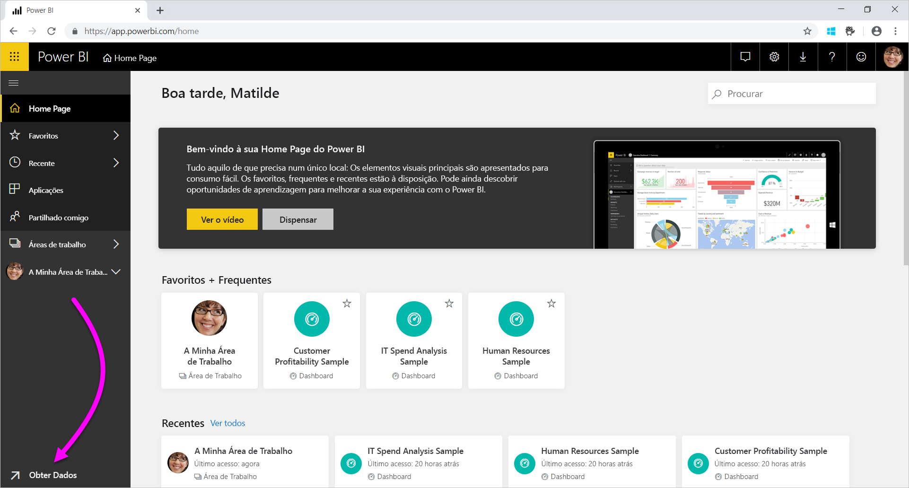
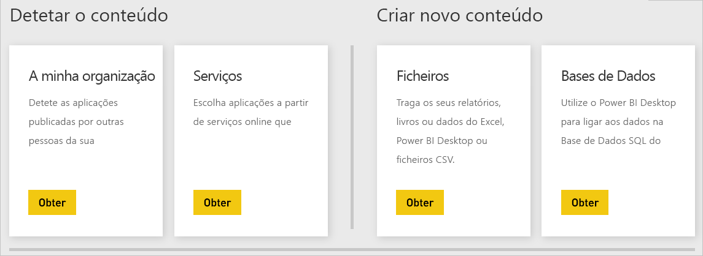

# Origens de dados para o serviço Power BI
Os dados são o coração do Power BI. Vamos supor que está a explorar os dados. Pode fazê-lo ao criar gráficos e dashboards, ou ao fazer perguntas com as **Perguntas e Respostas**. As visualizações e respostas que vê estão a extrair os dados subjacentes de um conjunto de dados. Mas de onde vem esse conjunto de dados? Vem de uma origem de dados.

Neste artigo, vamos abordar os tipos de origens de dados aos quais se pode ligar através do serviço Power BI. Tenha em consideração que há muitos outros tipos de origens de dados a partir dos quais pode obter dados. Se optar por estas origens de dados, primeiro poderá ter de utilizar o Power BI Desktop ou a consulta de dados avançada do Excel e as funcionalidades de modelação. Veremos mais detalhes sobre essas opções posteriormente. Por enquanto, vamos examinar os diferentes tipos de origens de dados disponíveis diretamente a partir do site do serviço Power BI.

Pode obter dados a partir de qualquer uma das origens de dados no Power BI ao selecionar **Obter Dados** no canto inferior esquerdo da página.

 

Depois de selecionar **Obter Dados**, pode escolher os dados aos quais pretende aceder.

## Detetar o conteúdo

A secção **Detetar o conteúdo** contém todos os dados e relatórios de que precisa já preparados. No Power BI, há dois tipos de pacotes de conteúdos: Organizacional e Serviços. 

**Organizacional**: se você e outros utilizadores na sua organização tiverem numa conta do Power BI Pro, podem criar, partilhar e utilizar pacotes de conteúdos. Para saber mais, veja [Introdução aos pacotes de conteúdos organizacionais](service-organizational-content-pack-introduction.md).

**Serviços**: existem dezenas de serviços com pacotes de conteúdos para o Power BI e estamos sempre a adicionar mais. A maioria dos serviços exigem que tenha uma conta. Para saber mais, veja [Ligar-se a serviços que utiliza com o Power BI](service-connect-to-services.md).

## Criar novo conteúdo

A secção **Criar novo conteúdo** contém opções para criar e importar você mesmo os conteúdos. No Power BI, existem duas formas de criar ou importar os seus próprios conteúdos: Ficheiros e Bases de Dados. 

### Ficheiros

**Excel** ( *.xlsx*, *.xlsm*) – no Excel, um livro pode incluir diferentes tipos de dados. Por exemplo, pode incluir dados introduzidos por si em folhas de cálculo. Também pode incluir dados que tenha consultado e carregado a partir de origens de dados externas através do Power Query. O Power Query está disponível através da funcionalidade **Obter e Transformar** no Excel 2016 ou Power Pivot. Pode importar dados de tabelas nas folhas de cálculo ou importar dados de um modelo de dados. Para saber mais, veja [Obter dados de ficheiros para o Power BI](service-get-data-from-files.md).

**Power BI Desktop** ( *.pbix*) – pode utilizar o Power BI Desktop para consultar e carregar dados a partir de origens de dados externas e criar relatórios. Também pode expandir o seu modelo de dados com medidas e relações, ou importar o ficheiro do Power BI Desktop para o site do Power BI. O Power BI Desktop é melhor para utilizadores mais avançados. Normalmente, estes utilizadores são aqueles que têm um bom entendimento das suas origens de dados. Compreendem também conceitos de modelação de dados e transformação, e de consulta de dados. Para saber mais, veja [Ligar-se a dados no Power BI Desktop](desktop-connect-to-data.md).

**Valores Separados por Vírgulas** ( *.csv*) – são ficheiros de texto simples com linhas de dados. Cada linha pode conter um ou mais valores, cada um separado por uma vírgula. Por exemplo, um *.csv* que contém dados de nome e endereço pode ter muitas linhas. Cada linha pode ter valores para nome próprio, apelido, endereço, cidade, distrito e assim por diante. Não é possível importar dados para um ficheiro *.csv*, mas muitas aplicações, como o Excel, podem guardar dados de tabela simples como um ficheiro *.csv*.

Para outros tipos de ficheiro, como as tabelas XML ( *.xml*) ou ficheiros de texto ( *.txt*), pode utilizar a funcionalidade **Obter e Transformar** para consultar, transformar e carregar dados num ficheiro do Excel ou do Power BI Desktop. Pode importar o ficheiro do Excel ou do Power BI Desktop para o Power BI.

O local onde armazena os ficheiros também faz uma diferença significativa. O OneDrive para Empresas fornece maior nível de flexibilidade e integração com o Power BI. Não há problema em manter os ficheiros na sua unidade local. No entanto, se precisar de atualizar os dados, existem alguns passos adicionais. Para obter mais informações, veja as seguintes ligações de artigos.

### Bases de Dados

**Bases de Dados na Cloud** – a partir do serviço Power BI, pode ligar em tempo real a:

* Base de Dados SQL do Azure
* Azure SQL Data Warehouse
* Spark no Azure HDInsight

As ligações do Power BI a estas bases de dados são em tempo real. Suponhamos que se liga a uma Base de Dados SQL do Azure. Começa então a explorar os respetivos dados através da criação de relatórios no Power BI. Sempre que divide os seus dados ou adiciona outro campo a uma visualização, o Power BI faz uma consulta direta à base de dados. Para saber mais, veja [Azure e Power BI](service-azure-and-power-bi.md).

**Bases de dados no local** – a partir do serviço Power BI, pode ligar-se diretamente às bases de dados de modelo em tabela do SQL Server Analysis Services. Para tal, precisará de um gateway do Power BI Enterprise. Se não tiver a certeza de como se ligar à base de dados de modelo em tabela da organização, consulte o seu administrador ou departamento de TI. Para saber mais, veja [Dados dinâmicos do SQL Server Analysis Services no Power BI](sql-server-analysis-services-tabular-data.md).

Para outros tipos de bases de dados na organização, terá de utilizar o Power BI Desktop ou o Excel para se ligar, consultar e carregar dados para um modelo de dados. Pode importar o ficheiro para o Power BI, onde existe um conjunto de dados. Se configurar uma atualização agendada, o Power BI utilizará essa configuração e informações de ligação do ficheiro para se ligar diretamente à origem de dados e consultar atualizações. Em seguida, o Power BI carrega essas atualizações para o conjunto de dados. Para saber mais, veja [Ligar-se a dados no Power BI Desktop](desktop-connect-to-data.md).

## E se os dados vierem de uma origem diferente?
Há centenas de origens de dados diferentes que pode utilizar com o Power BI. De onde quer que obtenha os dados, estes têm de estar num formato que possa ser utilizado pelo serviço Power BI. Com dados consumíveis, o serviço Power BI pode criar relatórios e dashboards, responder a perguntas com as **Perguntas e Respostas** e assim por diante.

Algumas origens de dados já têm dados formatados para o serviço Power BI. Estas origens são como pacotes de conteúdos de fornecedores de serviços, como o Google Analytics e o Twilio. As bases de dados de modelos em tabela do SQL Server Analysis Services também estão prontas a utilizar. Também pode ligar-se em tempo real a bases de dados na cloud, como a Base de Dados SQL do Azure e o Spark no HDInsight.

Noutros casos, pode ser necessário consultar e carregar os dados num ficheiro. Por exemplo, imaginemos que tem dados de logística na sua organização. Esses dados são armazenados numa base de dados de armazém de dados num servidor. No serviço Power BI, não pode ligar-se a essa base de dados e começar a explorar os dados da mesma, a menos que se trate de uma base de dados de modelo em tabela. Contudo, pode utilizar o Power BI Desktop ou o Excel para consultar e carregar dados de logística num modelo de dados que guarda como um ficheiro. Depois, pode importar esse ficheiro para o Power BI, onde existe um conjunto de dados.

Deve estar a pensar: "Mas os dados de logística nessa base de dados são alterados diariamente. Como posso atualizar o meu conjunto de dados do Power BI?" Quando importa os dados para o conjunto de dados, também pode importar as informações de ligação do Power BI Desktop ou do ficheiro do Excel.

Digamos que configura uma atualização agendada ou efetua uma atualização manual no conjunto de dados. O Power BI utiliza as informações de ligação do conjunto de dados, juntamente com algumas outras definições, para se ligar diretamente à base de dados. Em seguida, consulta atualizações e carrega essas atualizações para o conjunto de dados. Como nota adicional, provavelmente será necessário um gateway do Power BI para proteger qualquer transferência de dados entre o servidor no local e o Power BI. Quando a transferência for concluída, as visualizações nos relatórios e dashboards serão atualizadas automaticamente.

Apesar de não poder ligar-se à origem de dados diretamente a partir do serviço Power BI, pode inserir esses dados no Power BI. Simplesmente serão necessários alguns passos a mais e, talvez, alguma ajuda do departamento de TI. Veja [Origens de dados no Power BI Desktop](desktop-data-sources.md) para saber mais.

## Mais alguns detalhes
Verá os termos utilizados pelo conjunto de dados e origem de dados com muita frequência no Power BI. Muitas vezes, são utilizados como sinónimos. No entanto, são duas coisas diferentes, embora relacionadas.

Cria um **conjunto de dados** automaticamente no Power BI quando utiliza a opção **Obter Dados**. Com a opção **Obter Dados**, pode ligar-se a e importar dados de um pacote de conteúdos ou ficheiro, ou ligar-se a uma origem de dados em tempo real. Um conjunto de dados contém informações sobre a origem de dados e as credenciais da origem de dados. Em muitos casos, inclui também um subconjunto de dados copiados da origem de dados. Quando cria visualizações em relatórios e dashboards, muitas vezes está a analisar dados no conjunto de dados.

Uma **origem de dados** é o local do qual os dados de um conjunto de dados são recebidos. Por exemplo, os dados podem ser provenientes de:

* Um serviço online, como o Google Analytics ou QuickBooks
* Uma base de dados na cloud, como a Base de Dados SQL do Azure
* Uma base de dados ou ficheiro num computador ou servidor local na sua organização

## Atualização de dados
Talvez guarde os ficheiros na unidade local ou numa unidade em algum lugar na sua organização. Poderá precisar de um gateway do Power BI, para que possa atualizar o conjunto de dados no Power BI. O computador que armazena o ficheiro tem de estar ligado quando ocorre uma atualização. Pode importar novamente o ficheiro ou utilizar a publicação do Excel ou do Power BI Desktop, mas estas opções não são processos automatizados.

Se guardar os ficheiros no OneDrive para Empresas ou em Sites de Equipa do SharePoint, pode, em seguida, ligar-se aos dados ou importá-los para o Power BI. Assim, o conjunto de dados, os relatórios e os dashboards estarão sempre atualizados. Como o OneDrive e o Power BI estão na cloud, o Power BI pode ligar-se diretamente ao ficheiro guardado. Liga-se cerca de uma vez por hora e verifica se há atualizações. O conjunto de dados e todas as visualizações são atualizados automaticamente se existirem atualizações.

Os pacotes de conteúdo de serviços são atualizados automaticamente. Na maioria dos casos, são atualizados uma vez por dia. Pode atualizar manualmente, embora a apresentação dos dados atualizados dependa do fornecedor de serviços. As atualizações aos pacotes de conteúdos de pessoas na sua organização dependerão das origens de dados utilizadas. Irão também depender da forma como a pessoa que criou o pacote de conteúdos configurou a atualização.

A Base de Dados SQL do Azure, o Azure SQL Data Warehouse e o Spark no Azure HDInsight são origens de dados na cloud. O serviço Power BI também está na cloud, por isso, o Power BI pode ligar-se a essas origens de dados em tempo real, com o **DirectQuery**. O que vê no Power BI está sempre sincronizado e não é necessário configurar uma atualização agendada.

Ao ligar-se ao SQL Server Analysis Services a partir do Power BI, há uma ligação em tempo real, como uma base de dados do Azure na cloud. A diferença é que a base de dados em si está num servidor na sua organização. Este tipo de ligação necessita de um gateway do Power BI, configurado por um departamento de TI.

A atualização de dados é uma parte muito importante do Power BI e é muito profunda para ser abordada aqui. Se quiser compreendê-la, veja [Atualizar Dados no Power BI](refresh-data.md).

## Considerações e limitações
Para todas as origens de dados utilizadas no serviço Power BI, considere as seguintes limitações. Embora existam outras limitações que se aplicam a funcionalidades específicas, a seguinte lista aplica-se ao serviço Power BI completo:

* **Limite de tamanho do conjunto de dados** – existe um limite de 1 GB para os conjuntos de dados armazenados nas Capacidades partilhadas no serviço Power BI. Se precisar de conjuntos de dados maiores, poderá utilizar o [Power BI Premium](service-premium-what-is.md).

* **Valores distintos numa coluna** – ao armazenar em cache os dados num conjunto de dados do Power BI (por vezes, denominado modo “Importar”), existe um limite de 1.999.999.997 no número de valores distintos que podem ser armazenados numa coluna.

* **Limite de linhas** – ao utilizar o **DirectQuery** , o Power BI impõe um limite aos resultados da consulta que são enviados para a origem de dados subjacente. Se a consulta enviada para a origem de dados devolver mais de um milhão linhas, será apresentado um erro e a consulta falhará. Os dados subjacentes ainda podem conter mais de um milhão de linhas. É pouco provável que se depare com este limite, pois a maioria dos relatórios agregam os dados em conjuntos de resultados menores.

* **Limite de colunas** – o número máximo de colunas permitido no conjunto de dados, em todas as tabelas, é de 16 000 colunas. Este limite aplica-se ao serviço Power BI e aos conjuntos de dados utilizados no Power BI Desktop. O Power BI monitoriza o número de colunas e de tabelas no conjunto de dados desta forma, o que significa que o número máximo de colunas é de 16 000, menos uma para cada tabela no conjunto de dados.

