# Tutorial: Introdução ao serviço Power BI
Este tutorial é uma introdução a algumas das funcionalidades do *serviço Power BI*. Aqui, irá aprender a ligar-se aos dados, a criar um relatório e um dashboard, e a fazer perguntas sobre os seus dados. As várias funcionalidades do serviço Power BI permitem-lhe fazer muito mais. Este tutorial é só o começo. Para saber como o serviço Power BI se encaixa nas restantes ofertas do Power BI, recomendamos que leia [O que é o Power BI?](fundamentals/power-bi-overview.md).

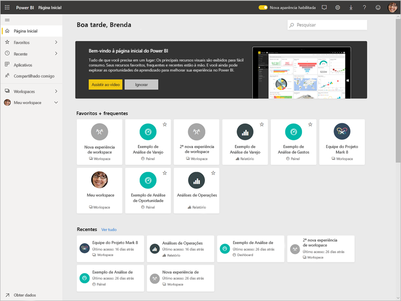

Neste tutorial, irá concluir os seguintes passos:

> [!div class="checklist"]
> * Iniciar sessão na sua conta do Power BI online ou inscrever-se, se ainda não tiver uma conta.
> * Abrir o serviço Power BI.
> * Obter alguns dados e abri-los na vista de relatório.
> * Utilizar esses dados para criar visualizações e guardá-las como um relatório.
> * Criar um dashboard ao afixar mosaicos do relatório.
> * Adicionar outra visualização ao dashboard com a ferramenta de linguagem natural Perguntas e Respostas.
> * Redimensionar, reorganizar e a interagir com os mosaicos no dashboard.
> * Limpar recursos ao eliminar conjuntos de dados, relatórios e dashboards.

> [!TIP]
> Prefere um curso gratuito de formação autónoma? [Inscreva-se no nosso curso Analyzing and Visualizing Data (Analisar e Visualizar Dados) no EdX](https://aka.ms/edxpbi).

## Inscreva-se no serviço do Power BI
Se não tiver uma conta no Power BI, [inscreva-se numa avaliação gratuita do Power BI Pro](https://app.powerbi.com/signupredirect?pbi_source=web) antes de começar.

Quando tiver uma conta, introduza *app.powerbi.com* no browser para abrir o serviço Power BI. 

## Passo 1: Obter dados

Geralmente, quando quer criar um relatório do Power BI, começa no Power BI Desktop. Desta vez, vamos começar do zero ao criar um relatório no serviço Power BI.

Neste tutorial, vamos obter os dados de um ficheiro CSV. Quer acompanhar? [Transfira o ficheiro CSV de Exemplo Financeiro](https://go.microsoft.com/fwlink/?LinkID=521962).

1. [Inicie sessão no Power BI](https://www.powerbi.com/). Não tem uma conta? Não se preocupe. Pode inscrever-se numa avaliação gratuita.
2. O Power BI é aberto no seu browser. Selecione **Obter dados** na parte inferior do painel de navegação.

    É aberta a página **Obter Dados**.   

3. Na secção **Criar novo conteúdo**, selecione **Ficheiros**. 
   
   
4.  Selecione **Ficheiro local**.
   
    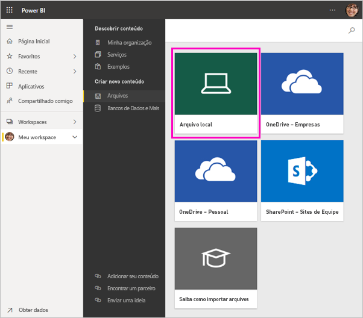

5. Procure o ficheiro no computador e selecione **Abrir**.

5. Neste tutorial, vamos selecionar **Importar** para adicionar o ficheiro do Excel como um conjunto de dados que podemos utilizar para criar relatórios e dashboards. Se selecionar **Carregar**, todo o livro do Excel será carregado para o Power BI, onde poderá abrir e editar o mesmo no Excel online.
   
   
6. Quando o seu conjunto de dados estiver pronto, selecione **Conjuntos de dados** e, junto ao conjunto de dados **Exemplo financeiro**, selecione **Criar relatório** para abrir o editor de relatórios. 

    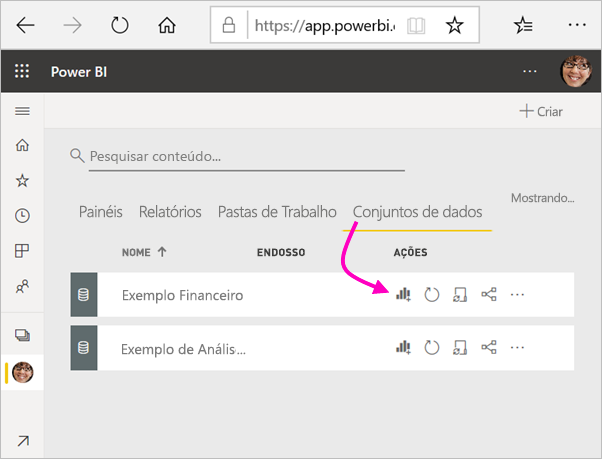

    A tela do relatório está em branco. No lado direito, podemos ver os painéis **Filtros**, **Visualizações** e **Campos**.

    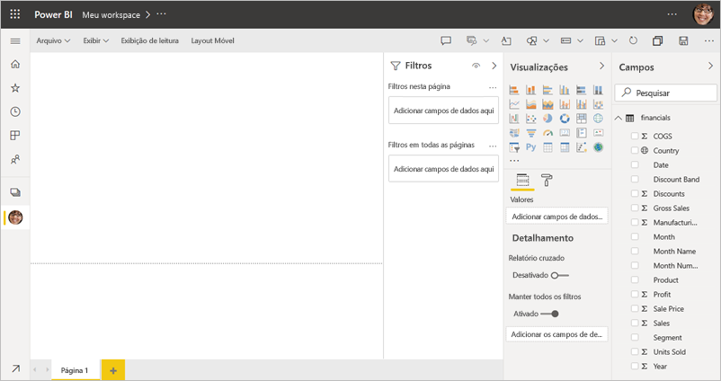

7. Repare que há uma opção de **Vista de leitura** no painel de navegação superior. Como tem esta opção, significa que está atualmente na Vista de edição. Uma excelente forma de se familiarizar com o editor de relatórios é [fazer uma visita](create-reports/service-the-report-editor-take-a-tour.md).

    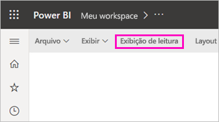

    Enquanto está na Vista de edição, pode criar e modificar os relatórios porque é o *proprietário* do relatório. Significa que é um *criador*. Quando partilha o relatório com os colegas, eles só poderão interagir com o relatório na Vista de leitura; os seus colegas são *consumidores*. Saiba mais sobre as [Vistas de leitura e de edição](consumer/end-user-reading-view.md).

## Passo 2: Criar um gráfico num relatório
Agora que já está ligado aos dados, pode começar a explorar.  Quando encontrar algo interessante, pode criar um dashboard para monitorizá-lo e ver a forma como se altera ao longo do tempo. Vamos ver como funciona.
    
1. No editor de relatórios, começamos pelo painel **Campos**, no lado direito da página, para criar uma visualização. Selecione as caixas de verificação **Gross Sales** (Vendas Brutas) e **Date** (Data).
   
   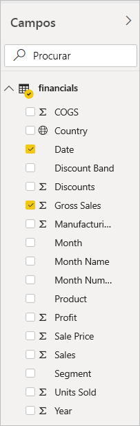

    O Power BI analisa os dados e cria uma visualização. Se tiver selecionado **Date** (Data) primeiro, verá uma tabela. Se tiver selecionado **Gross Sales** (Vendas Brutas) primeiro, verá um gráfico de colunas. 

2. Mude para uma forma diferente de apresentação dos dados. Vamos ver estes dados como um gráfico de linhas. No painel **Visualizações**, selecione o ícone do gráfico de linhas.
   
   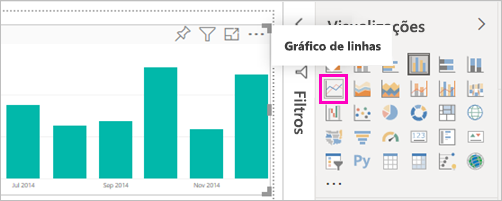

3. Este gráfico parece ser interessante, por isso, vamos *afixá-lo* a um dashboard. Passe o cursor sobre a visualização e selecione o ícone de afixar. Quando afixar esta visualização, esta é armazenada no dashboard e mantida atualizada para que possa acompanhar rapidamente o valor mais recente.
   
   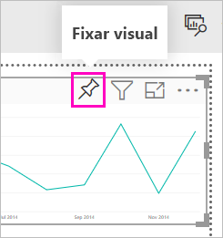

4. Como este relatório é novo, será pedido que o guarde antes de poder afixar uma visualização num dashboard. Dê um nome ao relatório (por exemplo, *Vendas ao longo do tempo*) e selecione **Guardar**. 

5. Selecione **Novo dashboard** e dê-lhe o nome *Exemplo financeiro para o tutorial*. 
   
   
   
6. Selecione **Afixar**.
   
    Uma mensagem de êxito (perto do canto superior direito) informa que a visualização foi adicionada como um mosaico ao dashboard.
   
    

7. Selecione **Aceder ao dashboard** para ver o novo dashboard com o gráfico de linhas afixado como um mosaico. 
   
   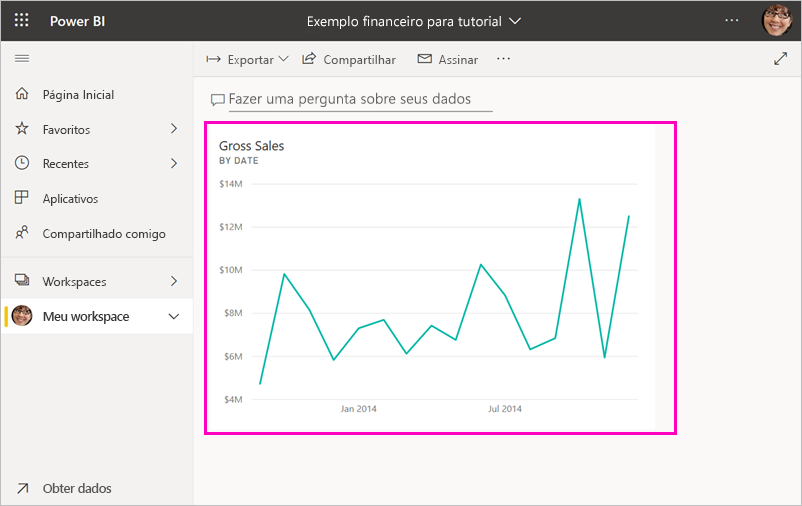
   
8. Selecione o novo mosaico no seu dashboard para regressar ao relatório. O Power BI regressa ao relatório na Vista de leitura. 

1. Para mudar novamente para a Vista de edição, selecione **Mais opções** (...) no painel de navegação superior > **Editar**. Quando voltar à Vista de edição, pode continuar a explorar e a afixar mosaicos.

    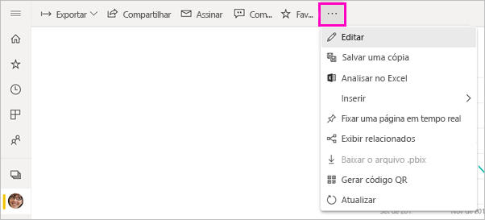

## Passo 3: Explorar através da caixa Perguntas e Respostas

Para explorar os dados rapidamente, experimente fazer uma pergunta na caixa de Perguntas e Respostas. A caixa Perguntas e Respostas permite-lhe fazer consultas com uma linguagem natural sobre os seus dados. Nos dashboards, a caixa Perguntas e Respostas está na parte superior (**Fazer uma pergunta sobre os dados**). Nos relatórios, essa caixa está no painel de navegação superior (**Fazer uma pergunta**).

1. Para voltar ao dashboard, selecione **A minha área de trabalho** na barra preta do **Power BI**.

    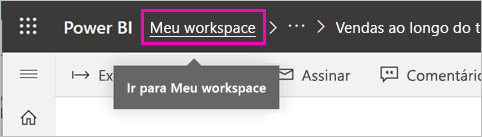

1. No separador **Dashboards**, selecione o seu dashboard.

    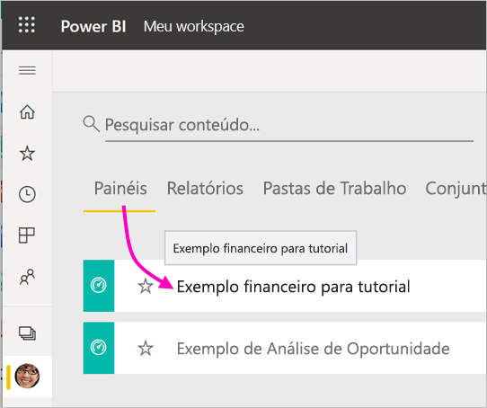

1. Selecione **Fazer uma pergunta sobre os dados**. A caixa Perguntas e Respostas oferece automaticamente várias sugestões.

    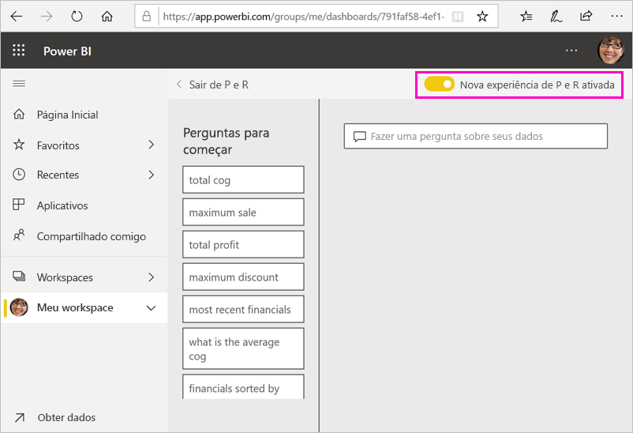

    > [!NOTE]
    > Se não vir as sugestões, ative a **Nova experiência de Perguntas e Respostas**.

2. Algumas das sugestões devolvem um valor único. Por exemplo, selecione **maximum sale** (venda máxima).

    A caixa Perguntas e Respostas procura uma resposta e apresenta-a sob a forma de uma visualização de *cartão*.

    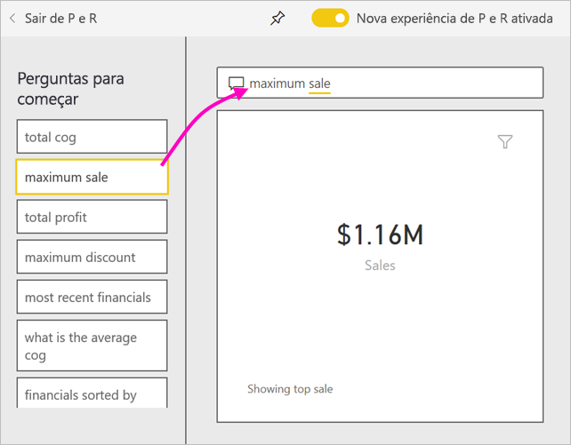

3. Selecionar o ícone afixar  para mostrar esta visualização no dashboard Exemplo financeiro para o tutorial.

1. Desloque-se para baixo na lista **Perguntas para começar** e selecione **average cog for each month** (média de CMV por cada mês). 

    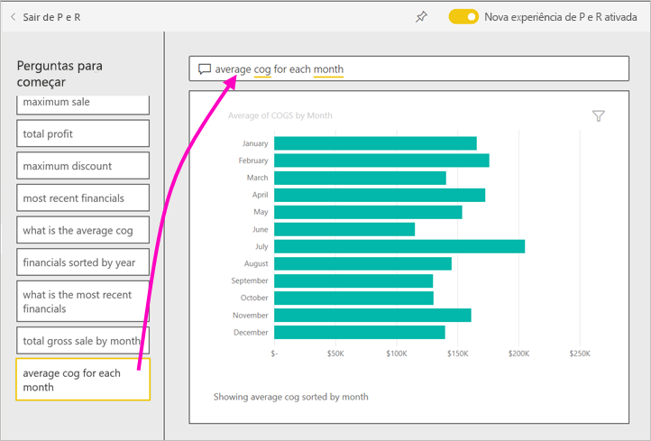

1. Afixe também o gráfico de barras no dashboard **Exemplo Financeiro para o tutorial**.

1. Coloque o cursor depois de *by month* (por mês) na caixa Perguntas e Respostas e escreva *como linha*. Selecione **linha (Tipo de Visualização)** . 

    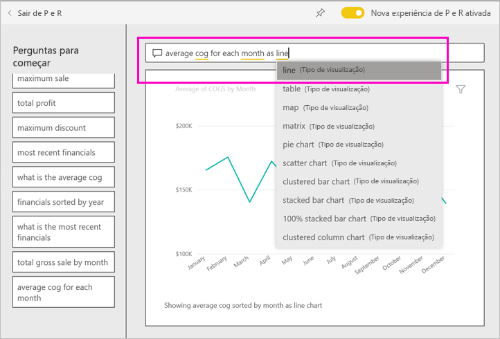

4. Selecione **Sair das Perguntas e Respostas** e regresse ao seu dashboard, onde verá os novos mosaicos que criou. 

   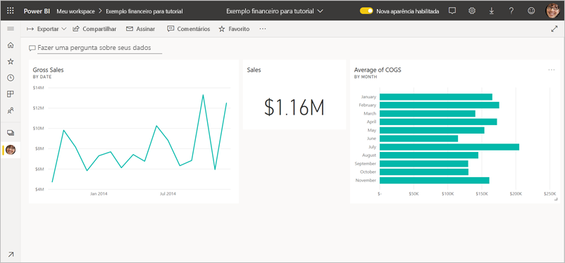

   Verá que, apesar de ter alterado o gráfico para um gráfico de linhas, o mosaico permaneceu um gráfico de barras porque, quando o afixou, tinha esse formato. 

## Step 4: Reposicionar os mosaicos

O dashboard é largo. Podemos reorganizar os mosaicos para garantir uma melhor utilização do espaço do dashboard.

1. Arraste o canto inferior direito do mosaico do gráfico de linhas *Vendas Brutas* para cima, até que fique à mesma altura do mosaico Vendas, e depois solte-o.

    

    Agora, os dois mosaicos têm a mesma altura.

    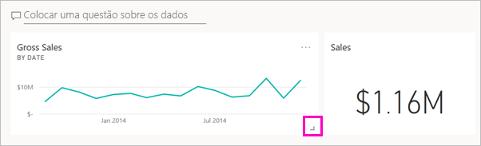

1. Arraste o mosaico do gráfico de barras *Average of COGS* (Média de CMV) até que este se encaixe no gráfico de linhas *Gross Sales* (Vendas Brutas).

    Assim está melhor.

    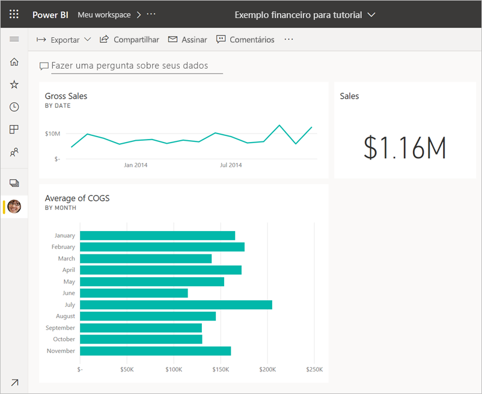

## Step 5: Interagir com os mosaicos

Antes de começar a criar os seus próprios dashboards e relatórios, eis uma última interação que deve ser observada. Se selecionar diferentes mosaicos, obterá resultados diferentes. 

1. Primeiro, selecione o mosaico do gráfico de linhas *Gross Sales* (Vendas Brutas) que afixou do relatório. 

    O Power BI abrirá o relatório na Vista de leitura. 

2. Selecione o botão Anterior do browser. 

1. Agora, selecione o mosaico do gráfico de barras *Average of COGS* (Média de CMV). 

    O Power BI não abrirá o relatório. Em vez disso, será aberta a caixa Perguntas e Respostas, visto que este gráfico foi lá criado.

## Limpar recursos
Agora que concluiu o tutorial, pode eliminar o conjunto de dados, o relatório e o dashboard. 

1. No painel de navegação, confirme que está em **A Minha Área de Trabalho**.
2. Selecione o separador **Conjuntos de Dados** e procure o conjunto de dados que importou para este tutorial.  
3. Selecione **Mais opções** (...) > **Eliminar**.

    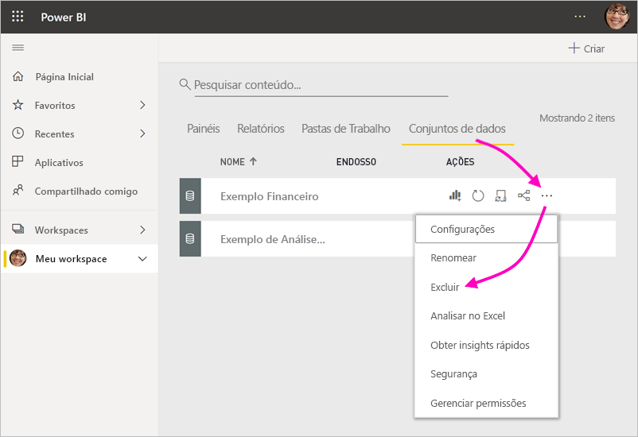

    Ao eliminar o conjunto de dados, verá um aviso a indicar que **Todos os mosaicos de dashboard e relatórios que contêm dados deste conjunto de dados também serão eliminados**.

4. Selecione **Eliminar**.

## Próximos passos

Melhore ainda mais o aspeto dos dashboards ao adicionar mais mosaicos de visualização e ao [mudar o nome, redimensionar, ligar e reposicionar mosaicos](create-reports/service-dashboard-edit-tile.md).
