# Tutorial: Introdução ao serviço Power BI (app.powerbi.com)
Este tutorial ajuda-o a começar a utilizar o ***serviço Power BI***. Para saber como o serviço Power BI se encaixa nas restantes ofertas do Power BI, recomendamos vivamente que comece por ler [O que é o Power BI?](power-bi-overview.md).

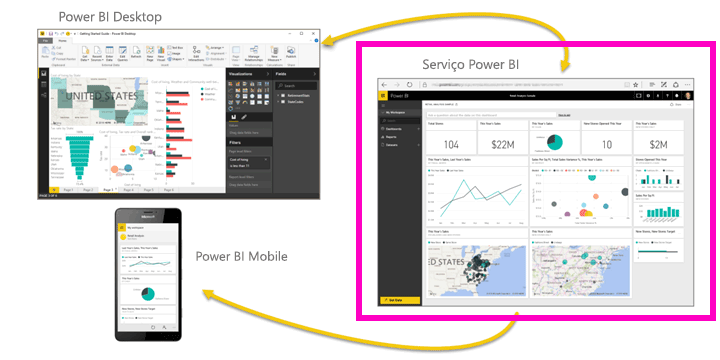

Neste tutorial, irá concluir os seguintes passos:

> [!div class="checklist"]
> * Localizar outros conteúdos de introdução do serviço Power BI
> * Iniciar sessão na sua conta do Power BI Online ou inscrever-se, se ainda não tiver uma
> * Abrir o serviço Power BI
> * Obter alguns dados e abri-los na vista de relatório
> * Utilizar esses dados para criar visualizações e guardar como um relatório
> * Criar um dashboard ao afixar mosaicos do relatório
> * Adicionar outra visualização ao dashboard com a ferramenta de linguagem natural Perguntas e Respostas
> * Limpar recursos ao eliminar conjuntos de dados, relatórios e dashboards

## Inscrever-se no serviço Power BI
Se não estiver inscrito no Power BI, [inscreva-se numa avaliação gratuita do Power BI Pro](https://app.powerbi.com/signupredirect?pbi_source=web) antes de começar.

Se já tiver uma conta, abra um browser e escreva app.powerbi.com para abrir o serviço Power BI. 

Se estiver à procura de ajuda para o Power BI Desktop, consulte [Introdução ao Desktop](desktop-getting-started.md). Se procura ajuda no Power BI Mobile, consulte [Aplicações do Power BI para dispositivos móveis](consumer/mobile/mobile-apps-for-mobile-devices.md).

> [!TIP]
> Prefere um curso gratuito de formação autónoma? [Inscreva-se no nosso curso Analyzing and Visualizing Data (Analisar e Visualizar Dados) no EdX](http://aka.ms/edxpbi).

Consulte a nossa [lista de reprodução no YouTube](https://www.youtube.com/playlist?list=PL1N57mwBHtN0JFoKSR0n-tBkUJHeMP2cP). Um bom vídeo de partida é a Introdução ao serviço Power BI:
> 
> <iframe width="560" height="315" src="https://www.youtube.com/embed/B2vd4MQrz4M" frameborder="0" allowfullscreen></iframe>
> 

## O que é o serviço Power BI?
O serviço Microsoft Power BI é por vezes referido como Power BI Online ou app.powerbi.com. O Power BI ajuda-o a manter-se atualizado em relação às informações importantes para si.  Com o serviço Power BI, os ***dashboards*** ajudam-no a controlar com um clique o ritmo da sua empresa.  Os seus dashboards mostram ***mosaicos*** nos quais pode clicar para abrir ***relatórios*** para explorar mais detalhadamente.  Ligue-se a vários ***conjuntos de dados*** para juntar todos os seus dados relevantes num único local. Precisa de ajuda para compreender os blocos modulares que compõem o Power BI?  Veja [Power BI – Conceitos básicos](service-basic-concepts.md).

Se tem dados importantes em ficheiros do Excel ou CSV, é possível criar um dashboard do Power BI para manter-se informado em qualquer lugar e partilhar informações com outras pessoas.  Tem uma subscrição de uma aplicação SaaS como o Salesforce?  Comece por se ligar ao Salesforce para criar automaticamente um dashboard com base nesses dados ou [descubra todas as outras aplicações SaaS](service-get-data.md) às quais se pode ligar. Se fizer parte de uma organização, veja se há [aplicações](service-create-distribute-apps.md) já publicadas para si.

Leia sobre todas as outras formas de [obter dados para o Power BI](service-get-data.md).

## Passo 1: obter dados
Veja um exemplo de como obter dados de um ficheiro CSV. Deseja acompanhar este tutorial? [Transfira este ficheiro CSV de exemplo](http://go.microsoft.com/fwlink/?LinkID=521962).

1. [Inicie sessão no Power BI](http://www.powerbi.com/). Não tem uma conta? Não se preocupe. Pode inscrever-se numa avaliação gratuita.
2. O Power BI é aberto no seu browser. Selecione **Obter Dados** na parte inferior da barra de navegação esquerda.
   
   
3. Selecione **Ficheiros**. 
   
   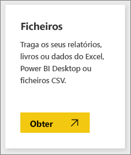
4. Procure o ficheiro no computador e selecione **Abrir**. Se o tiver guardado no OneDrive para Empresas, selecione essa opção. Se o tiver guardado localmente, selecione **Ficheiro Local**. 
   
   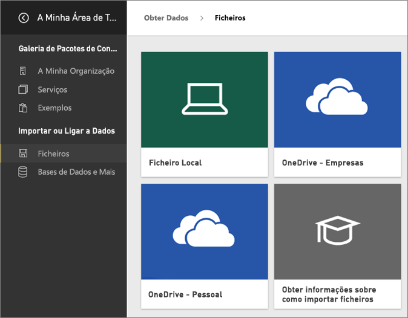
5. Neste tutorial, vamos selecionar **Importar** para adicionar o ficheiro Excel como um conjunto de dados que podemos utilizar para criar relatórios e dashboards. Se selecionar **Carregar**, todo o livro do Excel será carregado para o Power BI, onde poderá abrir e editar o mesmo no Excel online.
   
   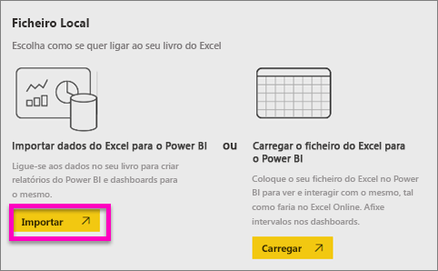
6. Quando o seu conjunto de dados, estiver pronto, selecione **Ver conjunto de dados** para o abrir no editor de relatórios. 

    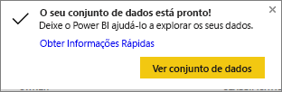

    Como ainda não criamos nenhuma visualização, a tela de relatórios estará em branco.

    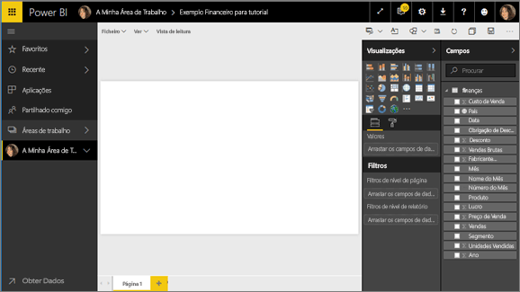

6. Observe a barra de menus superior e repare que existe uma opção para **Vista de leitura**. Uma vez que tem uma opção para a Vista de leitura, significa que está atualmente na **Vista de edição**. 

    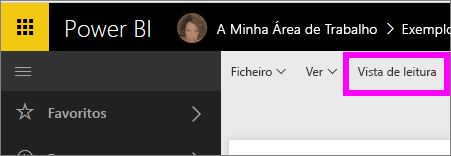

    Enquanto está na Vista de edição, pode criar e modificar os relatórios porque é o *proprietário* do relatório; é um *criador*. Quando partilha o relatório com os colegas, eles só poderão interagir com o relatório na Vista de leitura; são *consumidores*. Saiba mais sobre as [Vistas de leitura e de edição](service-reading-view-and-editing-view.md).
    
    Uma excelente forma de se familiarizar com o editor de relatórios é [fazer uma visita](service-the-report-editor-take-a-tour.md)
   > 
 

## Passo 2: começar a explorar o conjunto de dados
Agora que já está ligado aos dados, pode começar a explorar.  Quando encontrar algo interessante, pode criar um dashboard para monitorizá-lo e ver a forma como se altera ao longo do tempo. Vamos ver como funciona.
    
1. No editor de relatórios, vamos utilizar o painel **Campos**, no lado direito da página, para criar uma visualização.  Selecione a caixa de verificação de **Gross Sales** (Vendas Brutas) e  **Date** (Data).
   
   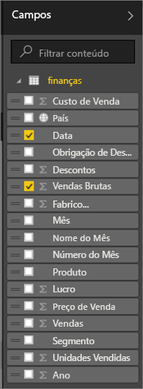

2. O Power BI analisa os dados e cria uma visualização.  Se tiver selecionado **Date** (Data) primeiro, verá uma tabela.  Se tiver selecionado **Gross Sales** (Vendas Brutas) primeiro, verá um gráfico. Mude para uma forma diferente de apresentação dos dados. Vamos ver estes dados como um gráfico de linhas. Selecione o ícone do gráfico de linhas (também conhecido como modelo) no painel **Visualizações**.
   
   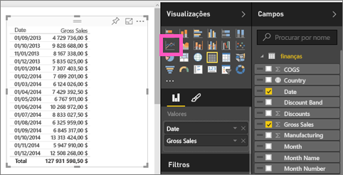

3. Este conteúdo parece ser interessante, por isso, vamos *afixá-lo* a um dashboard. Passe o cursor sobre a visualização e selecione o ícone **Afixar**.  Quando afixar esta visualização, esta é armazenada no dashboard e mantida atualizada para que possa acompanhar rapidamente o valor mais recente.
   
   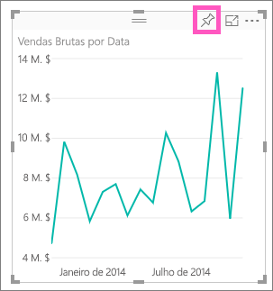

4. Como este é um novo relatório, deverá guardá-lo para poder afixar uma visualização num dashboard. Dê um nome ao relatório (por exemplo, *Vendas ao longo do tempo*) e selecione **Guardar e Continuar**. 
   
   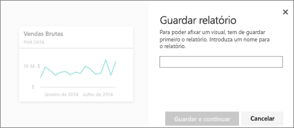
   
5. Vamos afixar o gráfico de linhas no novo dashboard e dar-lhe o nome “Exemplo financeiro para o tutorial”. 
   
   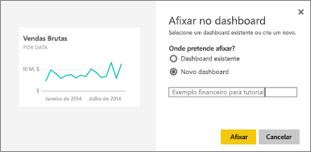
   
1. Selecione **Afixar**.
   
    Uma mensagem de Êxito (perto do canto superior direito) informa que a visualização foi adicionada, como um mosaico, ao dashboard.
   
    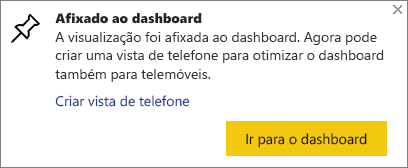

6. Selecione **Aceder ao dashboard** para ver o gráfico de linhas afixado, como um mosaico, no novo dashboard. Melhore ainda mais o aspeto do dashboard ao adicionar mais mosaicos de visualização e ao [mudar o nome, redimensionar, ligar e reposicionar mosaicos](service-dashboard-edit-tile.md).
   
   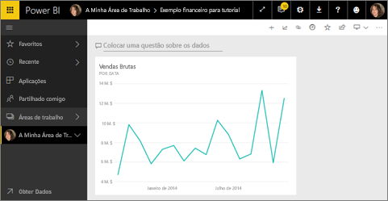
   
   Selecione o novo mosaico no seu dashboard para regressar ao relatório a qualquer altura. O Power BI volta para o editor de relatórios na Vista de leitura. Para mudar novamente para a Vista de edição, selecione **Editar relatório** na barra de menus superior. Quando estiver na Vista de edição, pode continuar a explorar e a afixar mosaicos. 

## Passo 3: continuar a exploração com as perguntas e respostas (consulta em linguagem natural)
1. Para explorar os dados rapidamente, tente fazer uma pergunta na caixa de perguntas e respostas. A caixa de perguntas e respostas está localizada na parte superior do dashboard (**Fazer uma pergunta sobre os dados**) e na barra de menus superior do relatório (**Fazer uma pergunta**). Por exemplo, experimente escrever “que segmento obteve mais receita”.
   
   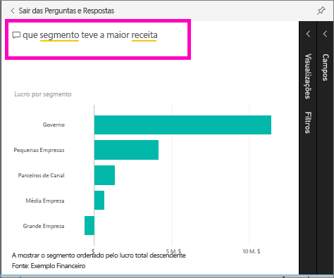

2. A caixa Perguntas e Respostas procura uma resposta e apresenta-a sob a forma de uma visualização. Selecionar o ícone afixar  para mostrar esta visualização no dashboard também.
3. Afixe a visualização no dashboard “Exemplo Financeiro para o tutorial”.
   
    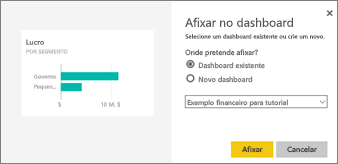

4. Regresse ao dashboard onde verá o novo mosaico.

   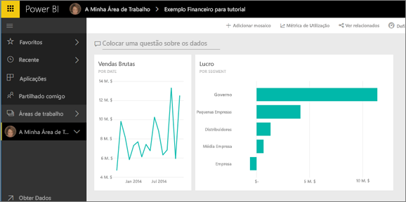

## Limpar recursos
Agora que concluiu o tutorial, pode eliminar o conjunto de dados, o relatório e o dashboard. 

1. Na barra de navegação à esquerda, selecione **A Minha Área de Trabalho**.
2. Selecione o separador **Conjuntos de Dados** e procure o conjunto de dados que importou para este tutorial.  
3. Selecione as reticências (...) > **Eliminar**.

    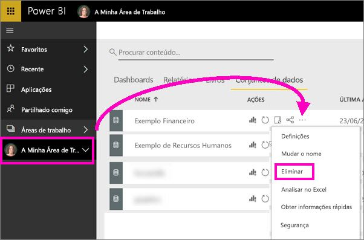

    Eliminar o conjunto de dados também irá eliminar o relatório e o dashboard. 

## Próximos passos
Pronto para experimentar mais?  Veja a seguir algumas formas interessantes de explorar o Power BI.

> [!div class="nextstepaction"]
> [Ligar aos serviços online que utiliza](./service-connect-to-services.md)

