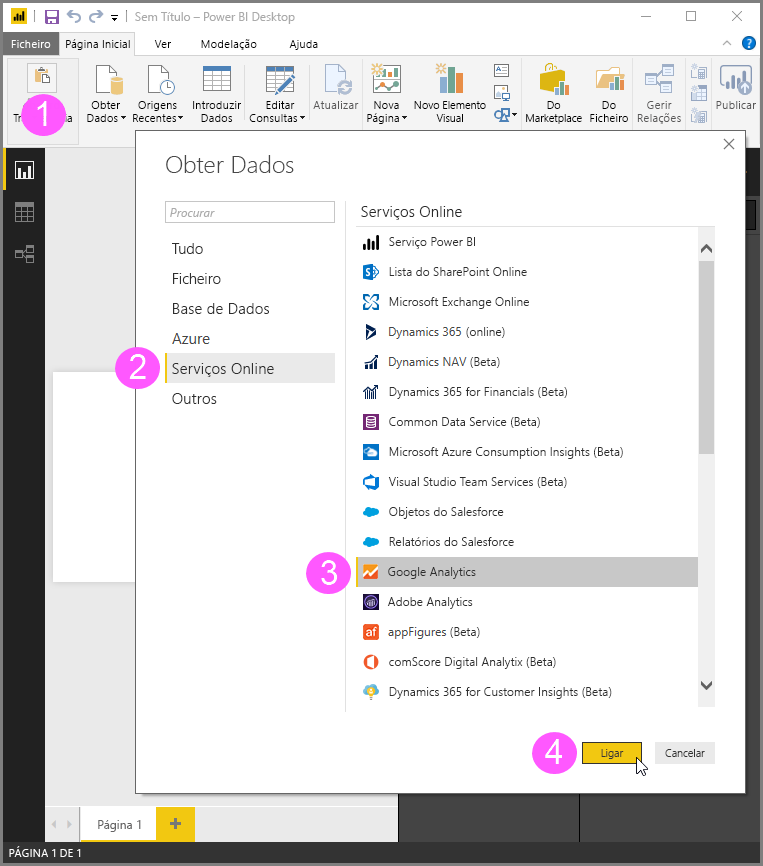
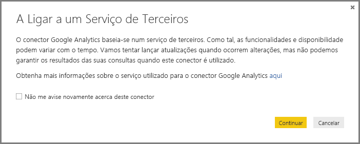
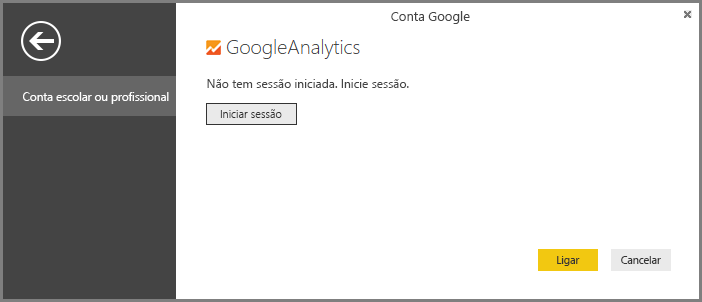
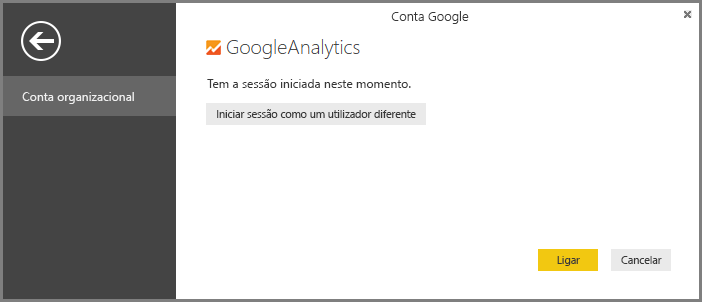
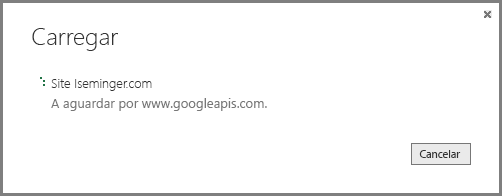

# Conector do Google Analytics para Power BI Desktop
> [!NOTE]
> O pacote de conteúdos do Google Analytics e o conector no Power BI Desktop contam com a API do Google Analytics Core Reporting. Como tal, as funcionalidades e a disponibilidade podem variar ao longo do tempo.
> 
> 

Pode ligar-se aos dados do Google Analytics utilizando o conector do **Google Analytics**. Para se ligar, siga estes passos:

1. No **Power BI Desktop**, selecione **Obter Dados** na faixa de separadores **Início**.
2. Na janela **Obter Dados**, selecione **Serviços Online** nas categorias do painel esquerdo.
3. Selecione **Google Analytics** a partir das seleções no painel à direita.
4. Na parte inferior da janela, selecione **Ligar**.  
   

Verá uma caixa de diálogo que explica que o conector é um Serviço de Terceiros e avisa sobre como as funcionalidades e a disponibilidade podem ser alteradas com o tempo, bem como outros esclarecimentos.  

Ao selecionar **Continuar**, ser-lhe-á pedido que inicie sessão no Google Analytics.  

Ao escrever as suas credenciais, será notificado de que o Power BI gostaria de ter acesso offline. É de esta forma que utiliza o **Power BI Desktop** para aceder aos dados do Google Analytics.  

Depois de aceitar, o **Power BI Desktop** mostra que já tem sessão iniciada.  

Selecione **Ligar** e os dados do Google Analytics será ligado ao **Power BI Desktop** e os dados carregados.  

## Alterações na API
Embora procuremos lançar atualizações de acordo com as alterações, a API pode ser alterada de forma que afeta os resultados das consultas que geramos. Nalguns casos, determinadas consultas podem já não ser suportadas. Devido a esta dependência não podemos garantir os resultados das suas consultas ao usar este conector.

Mais detalhes sobre alterações à API do Google Analytics podem ser encontrados no [changelog](https://developers.google.com/analytics/devguides/changelog).

