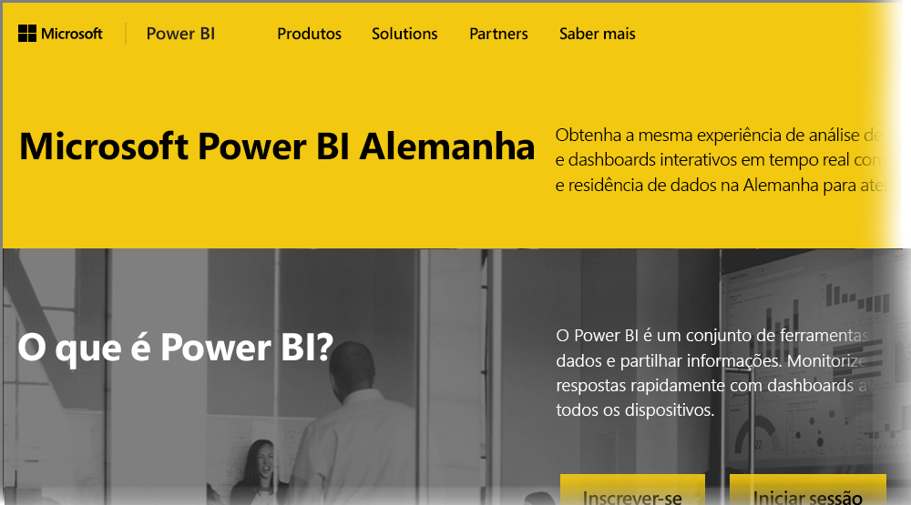

# Perguntas frequentes do Power BI para clientes Germany Cloud
O **serviço Power BI** têm uma versão disponível para clientes da União Europeia/Acordo de Comércio Livre da Europa (UE/EFTA), normalmente conhecida como Microsoft Cloud Deutschland (MCD). A versão do **serviço Power BI** falada neste artigo é específica para clientes da UE/EFTA, sendo separada e diferente da versão comercial do **serviço Power BI** ou serviços Power BI fornecidos a clientes da administração pública.

## Perguntas e respostas

As seguintes perguntas e respostas fornecem informações importantes sobre o Serviço Power BI Pro no Microsoft Cloud Deutschland (MCD), que é a cloud do serviço Power BI especificamente fornecida para clientes da UE/EFTA.

1. **O que é o serviço Power BI para Germany Cloud?**
   
   O serviço Power BI para clientes na UE/EFTA, também conhecido como Microsoft Cloud Deutschland (MCD), é uma cloud em conformidade com a UE/EFTA com o serviço Power BI proporcionado desde centros de dados alemães. Todos os dados de clientes no serviço Power BI para a cloud da UE/EFTA é armazenada em repouso na Alemanha, com a T-Systems a trabalhar como administrador fidedigno de dados alemão, com acesso físico e lógico aos dados regidos pela legislação alemã. O serviço Power BI para a cloud na UE/EFTA requer uma conta diferente e separada da versão comercial do serviço Power BI. Saiba mais sobre o Microsoft Cloud Deutschland [aqui](https://www.microsoft.com/trustcenter/cloudservices/nationalcloud).
2. **Onde posso encontrar informações de preços e inscrição para o Power BI Germany Cloud?**
   
   Pode encontrar diversas informações na [página inicial do Power BI Germany Cloud](https://powerbi.microsoft.com/power-bi-germany/), incluindo informações de preços. Nesta página, há também uma ligação para se inscrever na versão de avaliação de 30 dias do **serviço Power BI Pro** com 25 licenças de utilizadores. Como parte da inscrição de avaliação, tem a opção de comprar ou adicionar mais licenças, conforme necessário. Também oferecemos preços para Enterprise Agreement (EA), Administração Pública e organizações sem fins lucrativos. Entre em contacto com o seu representante de cliente da Microsoft para obter mais detalhes.
3. **Tenho um inquilino do Germany Cloud como parte de subscrições do Azure Germany e/ou Office 365 Germany. Posso utilizar o inquilino existente para me inscrever no Power BI Germany?**
   
   Yes. Como parte do processo de inscrição, terá a opção de iniciar sessão com uma conta de administrador de inquilino Germany Cloud existente e adicionar as licenças de serviço do Power BI Pro ao seu inquilino existente no Germany Cloud. Note que as contas de utilizador e inquilinos do Germany Cloud são diferentes do serviço Power BI para Germany Cloud.
4. **Existe um serviço gratuito no serviço Power BI para Germany Cloud?**
   
   Não. Não disponibilizamos versões de licenças gratuitas no serviço Power BI para Germany Cloud. No entanto, encorajamo-lo a inscrever-se na [oferta gratuita do Power BI na nossa cloud pública](https://powerbi.microsoft.com/get-started/) se as suas necessidades empresariais forem cumpridas com uma oferta gratuita do Power BI.
5. **Posso utilizar o Power BI Desktop, o Power BI Mobile, o Gateway de dados no local e o Publisher para Excel com o serviço Power BI para Germany Cloud?**
   
   Yes. Atualizámos os nossos produtos de cliente do Power BI para funcionarem de forma integrada com o serviço Power BI para Germany Cloud. Inicie sessão com a sua conta de serviço Power BI Germany Cloud para começar a utilizar os mesmos produtos de cliente com o serviço Power BI para Germany Cloud. Pode transferir a versão mais recente dos produtos de cliente dos seguintes locais:
   
   * [Power BI Desktop](https://powerbi.microsoft.com/desktop/)
   * [Power BI Mobile](https://powerbi.microsoft.com/mobile/)
   * [Gateway de dados no local](https://powerbi.microsoft.com/gateway/)
   * [Power BI Publisher para Excel](https://powerbi.microsoft.com/excel-dashboard-publisher/)
6. **Existem limitações de funcionalidades do serviço Power BI para Germany Cloud?**
   
   As seguintes funcionalidades de serviço não estão atualmente disponíveis no serviço Power BI para Germany Cloud:
   
   * Publicar na Web
   * Mapas ArcGIS da Esri
   * Power BI Embedded (licenciamento ISV medido separado, será oferecido futuramente através do [Microsoft Azure Alemanha](https://azure.microsoft.com/overview/clouds/germany/))
7. **Onde posso encontrar informações específicas de configuração do serviço Power BI para Germany Cloud para utilização e integração nas minhas aplicações?**
   
   Atualizámos os nossos [Exemplos do programador de Incorporação SaaS](https://github.com/Microsoft/PowerBI-Developer-Samples) com informações de configuração específicas do Germany Cloud e outras Clouds do Power BI. Veja a pasta **Cloud Configs** nos exemplos para pontos finais de configuração específicos da cloud. A tabela seguinte lista diversos pontos finais de configuração para o serviço Power BI do Germany Cloud (e Cloud Pública para referência cruzada).

| **Nome e/ou Utilização de Ponto Final** | **URL do serviço Power BI para Germany Cloud** | **URL equivalente na Cloud Pública (para referência cruzada)** |
| --- | --- | --- |
| Página Inicial, Inscrição e Início de Sessão |[https://powerbi.microsoft.com/power-bi-germany/](https://powerbi.microsoft.com/power-bi-germany/) |[https://powerbi.microsoft.com/](https://powerbi.microsoft.com/) |
| Início de sessão direto do Serviço Power BI |[https://app.powerbi.de/?noSignUpCheck=1](https://app.powerbi.de/?noSignUpCheck=1) |[https://app.powerbi.com/?noSignUpCheck=1](https://app.powerbi.com/?noSignUpCheck=1) |
| API de Serviço |[https://api.powerbi.de/](https://api.powerbi.de/) |[https://api.powerbi.com/](https://api.powerbi.com/) |
| Portal do Office para gestão de licenças de utilizador, estado de funcionamento do serviço e pedidos de suporte por parte de administradores |[https://portal.office.de/](https://portal.office.de/) |[https://portal.office.com/](https://portal.office.com/) |
| URI do AAD Authority |[https://login.microsoftonline.de/common/oauth2/authorize/](https://login.microsoftonline.de/common/oauth2/authorize/) |[https://login.microsoftonline.com/common/oauth2/authorize/](https://login.microsoftonline.com/common/oauth2/authorize/) |
| URI de Recurso do Serviço Power BI |[https://analysis.cloudapi.de/powerbi/api](https://analysis.cloudapi.de/powerbi/api) |[https://analysis.windows.net/powerbi/api](https://analysis.windows.net/powerbi/api) |
| Biblioteca de Visuais Personalizados |[https://app.powerbi.de/visuals/](https://app.powerbi.de/visuals/) |[https://app.powerbi.com/visuals/](https://app.powerbi.com/visuals/) |
| Registar uma Aplicação para Power BI (para Embedded) |[https://app.powerbi.de/apps](https://app.powerbi.de/apps) |[https://app.powerbi.com/apps](https://app.powerbi.com/apps) |
| Portal do Azure (Para Embedded) |[https://portal.microsoftazure.de/](https://portal.microsoftazure.de/) |[https://portal.azure.com/](https://portal.azure.com/) |
| Comunidade |[https://community.powerbi.com/](https://community.powerbi.com/) |[https://community.powerbi.com/](https://community.powerbi.com/) |

## Próximos passos
Pode fazer muitas coisas com o Power BI. Para obter mais informações e aprendizagem, incluindo um artigo que mostra como se inscrever no serviço, consulte os seguintes recursos:

* [Aprendizagem Guiada para o Power BI](guided-learning/gettingstarted.yml?tutorial-step=1)
* [Introdução ao serviço Power BI](service-get-started.md)
* [O que é o Power BI Desktop?](desktop-what-is-desktop.md)

