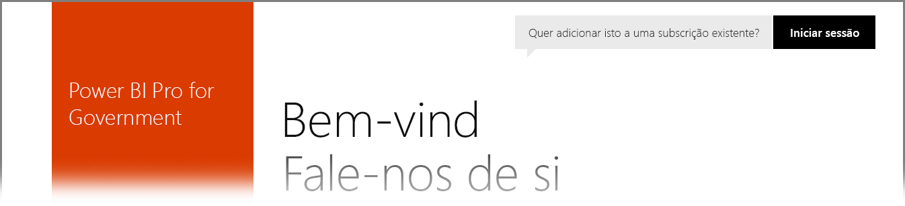

# Power BI para clientes da Administração Pública dos EUA
O **serviço Power BI** tem uma versão disponível para clientes da Administração Pública dos EUA como parte das subscrições do **Office 365 US Government Community**. A versão do **serviço Power BI** abordada neste artigo foi concebida especificamente para clientes da Administração Pública dos EUA e é separada e diferente da versão comercial do **serviço Power BI**.

As seguintes secções descrevem as *funcionalidades* disponíveis para a versão do **serviço Power BI** para a Administração Pública dos EUA, esclarece algumas *limitações*, lista Perguntas Frequentes (**FAQ**) e respetivas respostas (incluindo como se inscrever) e fornece ligações para mais informações.

## Funcionalidades do Power BI para a Administração Pública dos EUA
É importante ter em conta que o **Power BI para a Administração Pública dos EUA** está disponível apenas como **licença Pro** e não está disponível como licença Gratuita. Determinadas funcionalidades do serviço Power BI estão disponíveis na versão **Power BI para a Administração Pública** do serviço.

As seguintes funcionalidades estão disponíveis para clientes do **Power BI para a Administração Pública**, pois aplicam-se ao funcionamento da licença **Pro**:

* Criar e ver dashboards e relatórios
* [Limites de capacidade de dados](service-admin-manage-your-data-storage-in-power-bi.md)
* [Atualização de dados agendada](refresh-data.md)
* Dashboards de equipa atualizáveis
* Grupos do Active Directory para partilhar e gerir o controlo de acesso
* [Importar dados](service-get-data.md) e relatórios de ficheiros do Excel, CSV e Power BI Desktop
* Data Management Gateway
* Todos os dados são encriptados no Azure SQL e no Armazenamento de Blobs para Power BI
* Ligar-se a serviços com [pacotes de conteúdos](service-connect-to-services.md)

## Conectividade entre os serviços Cloud do Azure Público e de Administração Pública 

O Azure é distribuído entre várias clouds. Por predefinição, os inquilinos podem abrir as regras de firewall para uma instância específica da cloud, mas a rede entre clouds é diferente e requer a abertura de regras de firewall específicas para comunicar entre os serviços. Se for um cliente do Power BI e tiver instâncias do SQL Server existentes na cloud pública que precisa de acesso, tem de abrir regras específicas de firewall no SQL para o espaço de IP da Cloud do Azure Government, para os datacenters seguintes:

* USGov Iowa
* USGov Virginia
* USGov Texas
* USGov Arizona

Os espaços IP estão disponíveis na cloud pública, mas para a cloud da administração pública, tem de abrir um Pedido de suporte do Azure para pedir os intervalos de IP para os datacenters listados acima. 

## Limitações do Power BI para a Administração Pública dos EUA
Algumas das funcionalidades disponíveis na versão comercial do **serviço Power BI** *não* estão disponíveis no **serviço Power BI** para clientes da Administração Pública dos EUA. A equipa do Power BI está a trabalhar ativamente no sentido de disponibilizar estas funcionalidades para clientes da administração pública dos EUA e irá atualizar este artigo quando estas funcionalidades forem disponibilizadas.

* **Incorporar no SharePoint Online**: não é possível incorporar o conteúdo no SharePoint Online com a peça Web do Power BI.
* O **Power BI para a Administração Pública dos EUA** está disponível apenas na licença **Pro**. Todas as referências a licenças do Power BI (Gratuito) num portal de administração (ou como utilizadores) são executadas numa cloud de serviço comercial do Power BI.
* **Auditoria**: desde junho de 2018 que a auditoria está disponível através do portal de Segurança e Conformidade do Office 365.
* **Conteúdo do Power BI no Cortana** - os resultados do Power BI não irão aparecer nos resultados de pesquisa do Cortana, que inclui os resultados dos seus conteúdos do Power BI (dashboards, relatórios, aplicações), bem como resultados que mostram as páginas de relatório com otimização do Cortana para palavras-chave específicas.
* **Partilha com utilizadores externos**: a partilha é permitida num inquilino do Power BI e desde junho de 2018 que é também permitida com utilizadores fora do seu inquilino do Power BI.
* **Métrica de utilização para dashboards e relatórios**: as métricas de utilização não estão disponíveis para relatórios e dashboards. Os clientes podem utilizar dados do registo de auditoria para obter informações de utilização para conteúdos na sua organização.

Se tem licenças do **Power BI** Gratuito atribuídas à sua conta, estas contas estão a ser executadas numa versão comercial do serviço **Power BI** e não fazem parte da oferta do **Power BI para a Administração Pública dos EUA**. Para estas contas Gratuitas, pode encontrar os seguintes problemas:

* Não é possível autenticar o Gateway, as aplicações Móveis e o Desktop
* Não é possível aceder às origens de dados comerciais do Azure
* Os ficheiros PBIX têm de ser carregados manualmente do serviço comercial
* As aplicações móveis do Power BI não estão disponíveis

Para resolver problemas, contacte o seu representante de conta.

## Perguntas Frequentes (FAQ) sobre a versão para a Administração Pública dos EUA do serviço Power BI
As seguintes perguntas (e respostas) são-lhe fornecidas para o ajudar a obter rapidamente as informações de que precisa sobre o serviço.

**Pergunta:** Como posso migrar os meus dados comerciais do **Power BI** para o **serviço Power BI** para a Administração Pública dos EUA?

**Resposta:** O seu administrador tem de criar uma nova instância do **Power BI** numa subscrição separada e específica para a Administração Pública dos EUA. Depois, poderá replicar os seus dados comerciais no **serviço Power BI** para a Administração Pública dos EUA, remover a sua licença comercial e associar o seu domínio existente ao novo serviço específico da Administração Pública dos EUA.

**Pergunta:** Por que não me consigo ligar a um pacote de conteúdos específico?

**Resposta:** Tem de garantir que a sua subscrição é ativada antes de se ligar a esse pacote de conteúdos.

**Pergunta:** Estou interessado em obter o **Power BI** para a minha organização da Administração Pública dos EUA. Como faço para começar?

**Resposta:** A inscrição (normalmente intitulada *inclusão*) pode ser diferente consoante a sua licença e subscrição existentes. Consulte o artigo [Inscrever-se no Power BI para a Administração Pública dos EUA](service-govus-signup.md) para obter mais informações.

**Pergunta:** O URL para ligação ao **Power BI** para a Administração Pública dos EUA difere do URL comercial do **Power BI**?

**Resposta:** Sim, os URLs são diferentes. A seguinte tabela mostra cada URL:

| URL da versão comercial | URL da versão da Administração Pública dos EUA |
| --- | --- |
| https://app.powerbi.com/ |[https://app.powerbigov.us](https://app.powerbigov.us) |

## Passos seguintes
Pode fazer muitas coisas com o Power BI. Para mais informações e aprendizagem, incluindo um artigo que mostra como se inscrever no serviço, consulte os seguintes recursos:

* [Inscrever-se no Power BI para a Administração Pública dos EUA](service-govus-signup.md)
* <a href="https://channel9.msdn.com/Blogs/Azure/Cognitive-Services-HDInsight-and-Power-BI-on-Azure-Government">Demonstração do Power BI para a Administração Pública dos EUA</a>
* [Aprendizagem Guiada para o Power BI](guided-learning/gettingstarted.yml?tutorial-step=1)
* [Introdução ao serviço Power BI](service-get-started.md)
* [Introdução ao Power BI Desktop](desktop-getting-started.md)

