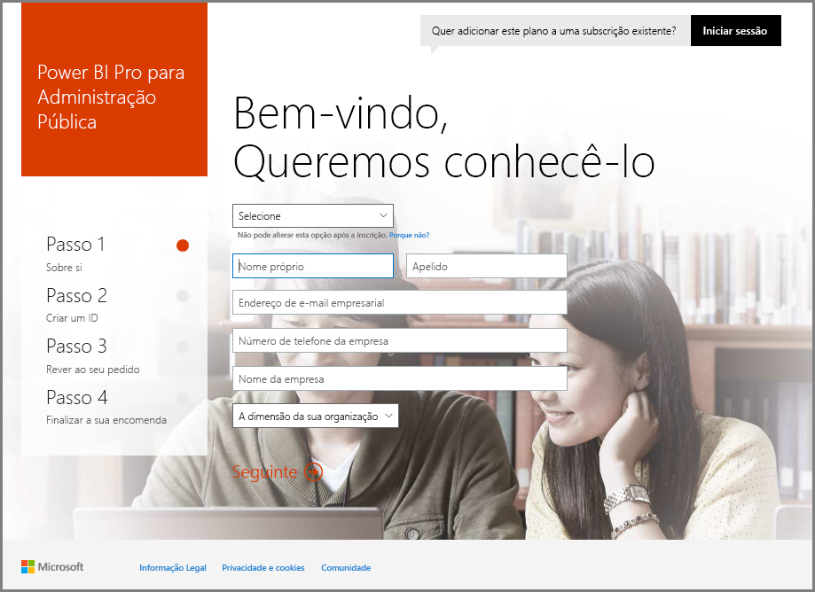
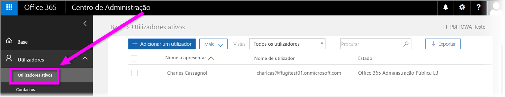

# Inscrever a sua organização do Governo dos EUA no serviço Power BI
O **serviço Power BI** tem uma versão disponível para clientes do Governo dos EUA como parte das subscrições do **Office 365 US Government Community**. A versão do **serviço Power BI** abordada neste artigo foi concebida especificamente para clientes do Governo dos EUA e é separada e diferente da versão comercial do **serviço Power BI**.

Para obter mais informações sobre o **serviço Power BI** para o Governo dos EUA, incluindo as respetivas funcionalidades e limitações, veja [Power BI para clientes do Governo dos Estados Unidos – Descrição geral](service-govus-overview.md).

> [!NOTE]
> Este artigo destina-se a administradores com autoridade para inscrever a respetiva organização do Governo dos EUA no Power BI. Se for um utilizador final, contacte o seu administrador sobre como obter uma subscrição do Power BI para o Governo dos EUA.
> 
> 

## Selecione o processo de inscrição correto para a sua organização do Governo dos EUA
A sua organização do Governo dos EUA pode ser um novo cliente do **Office Government Cloud** ou já ter uma subscrição. As secções seguintes detalham os passos de inscrição com base nos seus conhecimentos do Office Government Cloud e do Power BI, sendo diferentes relativamente à subscrição existente.

Depois de se ter inscrito no Power BI US Government, algumas funcionalidades podem não funcionar até que o representante de vendas ou suporte conclua o processo de integração. Para obter informações sobre estas funcionalidades, veja [Power BI para clientes do Governo dos Estados Unidos – Descrição geral](service-govus-overview.md). Para concluir o processo de integração para ativar estas funcionalidades, contacte o representante de vendas ou suporte.

### Organizações do Governo dos EUA que são novos clientes do Office Cloud
Se a sua organização for um novo cliente do **Office Government Cloud**, siga estes passos:

> [!NOTE]
> Estes passos devem ser efetuados pelo administrador do portal.
>

1. Aceda a [https://products.office.com/en-us/government/office-365-web-services-for-government](https://products.office.com/en-us/government/office-365-web-services-for-government).

>[!NOTE]
>Se não se quiser inscrever no Office Government Cloud neste momento, contacte o representante de vendas.
>

2. Selecione Office G3 e preencha o formulário para obter uma versão de avaliação do Office
3. Assim que for um cliente do Office Cloud, avance para os passos abaixo para "Clientes do Office Government Cloud existentes"

### Clientes do Office Government Cloud existentes
Se a sua organização for um cliente do **Office Government Cloud** existente, mas não tiver uma subscrição do **Power BI** (Gratuita ou de outro tipo), siga estes passos:

> [!NOTE]
> Estes passos devem ser efetuados pelo administrador do portal.
> 
> 

1. Inicie sessão na conta do Office Government Cloud existente e aceda ao portal de administração
2. Selecione **Faturação**.
3. Selecione **Serviço de Compra**.
4. Selecione a opção Power BI Pro Government e escolha entre **Experimentar** e **Comprar Agora**
5. Conclua a encomenda
6. Atribua utilizadores à conta.
   
   
7. Inicie sessão no **serviço Power BI** para os clientes do Governo dos EUA em [https://app.powerbigov.us](https://app.powerbigov.us)

## Informações de Inscrição Adicionais
Seguem-se informações adicionais para a inscrição no **Power BI US Government** em vários casos de migração de licenciamento.

### Direcionar a Versão de Avaliação do Power BI para o Pro Customer Onboarding
* Clique e siga para Faturação > Serviço de Compra > Power BI Pro Gov e selecione Compra e não Versão de Avaliação
* Preencher as informações necessárias e obter as licenças
* Remover a Versão de Avaliação do Power BI Pro ou as licenças antigas e atribuir as novas aos utilizadores
* Iniciar sessão em [https://app.powerbigov.us](https://app.powerbigov.us)

### Revenda da Versão de Avaliação do Power BI para o Pro Customer Onboarding
Aceda a **Faturação > Subscrições** e selecione a subscrição **Power BI Pro for Government**. Aí, verá:

* Disponível
* Atribuído
* Atribuir a ligações de utilizadores
* Se ainda tiver a Versão de Avaliação atribuída:
  * Clique em **Atribuído** na subscrição Versão de Avaliação e remova os utilizadores que quer adicionar à subscrição Paga
  * Aceda à subscrição Paga e atribua os utilizadores

### Instruções para Adicionar à Lista de Permissões
*Adicionar à Lista de Permissões* é um processo utilizado pela equipa de engenharia do Power BI para mover os clientes do ambiente cloud comercial para o ambiente cloud governamental seguro. Isto assegura que as funcionalidades disponíveis na cloud Governo dos EUA funcionam conforme esperado. Todos os clientes do Governo dos EUA existentes (ou novos) que comprem os serviços **Power BI** para o Governo dos EUA pela primeira vez *têm* de iniciar o processo de adição à lista de permissões seguinte. O processo tem de ser efetuado antes da configuração ou da migração para os serviços **Power BI** do Governo dos EUA. 

Para adicionar o seu inquilino à *lista de permissões* da cloud do Governo dos EUA, contacte a equipa da conta Microsoft para obter ajuda com a adição à lista de permissões. Tenha em atenção que apenas os administradores podem efetuar este pedido. O processo de *adição à lista de permissões* demora cerca de três semanas, período durante o qual a equipa de engenharia do Power BI faz alterações adequadas para garantir que o seu inquilino funciona corretamente na cloud do Governo dos EUA.

Os clientes que estejam a migrar de licenças **Gratuitas** do Power BI para o **Power BI US Government** (e, por definição, a migrar para a licença **Pro** associada descrita anteriormente neste artigo) irão ter os problemas descritos na secção seguinte deste artigo, até que o inquilino seja *adicionado à lista de permissões* pela equipa de engenharia do Power BI.

### Licenças Gratuitas e Pro combinadas em inquilinos do Governo dos EUA
Se tiver licenças Gratuitas e Pro do Governo dos EUA no inquilino, estas permanecem presentes, mas um ou o outro tipo de licença não funcionará corretamente. Se o inquilino concluir com êxito o processo de *adição à lista de permissões*, ocorre o seguinte:

* Todos os utilizadores de licenças Gratuitas deixarão de conseguir iniciar sessão no Power BI através do **Power BI Desktop** e ocorrerão as falhas de funcionalidade descritas na secção seguinte.
* Todos os clientes atribuídos a licenças Pro do Governo dos EUA irão usufruir de um funcionamento conforme esperado, incluindo a utilização de gateways, do Power BI Desktop e das aplicações Móveis.

Quando utilizar uma combinação de licenças Gratuitas e Pro num inquilino do Governo dos EUA e efetuar o processo de *adição à lista de permissões*, pode ocorrer o seguinte:

**Antes da *adição à lista de permissões***:

* Os utilizadores com licenças Gratuitas estão a utilizar a cloud comercial
* As licenças Pro do Governo dos EUA são apresentadas no portal e o administrador pode atribui-las aos utilizadores. Os utilizadores Pro do Governo dos EUA não irão perder os dados das licenças Gratuitas depois de o administrador atribuir uma licença Pro do Governo dos EUA. Os utilizadores atribuídos têm acesso às funcionalidades do Power BI Pro para clientes do Governo dos EUA, mas ocorrerão as seguintes falhas de funcionalidade indicadas na lista com marcas até o inquilino ser *adicionado à lista de permissões* com êxito:
  
  * Não é possível autenticar o Gateway, as aplicações Móveis e o Power BI Desktop
  * Não é possível aceder às origens de dados comerciais do Azure
  * Os ficheiros PBIX têm de ser carregados manualmente do serviço Power BI comercial
  * As aplicações móveis do Power BI não estão disponíveis

**Após a *adição à lista de permissões***:

* Os utilizadores gratuitos com o serviço Power BI comercial podem continuar a utilizá-lo, mas deixarão de autenticar conforme esperado.
* Os utilizadores Pro na cloud do Governo dos EUA podem utilizar o serviço **Power BI para clientes do Governo dos EUA** conforme esperado.

Para identificar os utilizadores no inquilino que têm a licença Gratuita do Power BI, os administradores podem executar o relatório de licenciamento, após o qual os utilizadores da licença Gratuita aparecem como **Power BI Standard**.

## Passos seguintes
Pode fazer muitas coisas com o Power BI. Para obter mais informações e aprendizagem, incluindo um artigo que mostra como se inscrever no serviço, consulte os seguintes recursos:

* [Descrição Geral do Power BI para o Governo dos EUA](service-govus-overview.md)
* [Aprendizagem Guiada para o Power BI](guided-learning/gettingstarted.yml?tutorial-step=1)
* [Introdução ao serviço Power BI](service-get-started.md)
* [O que é o Power BI Desktop?](desktop-what-is-desktop.md)

