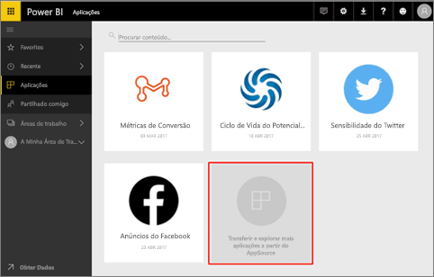
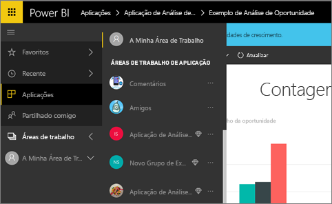
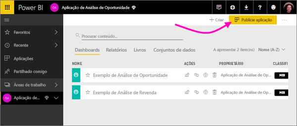
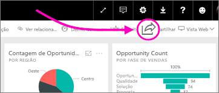
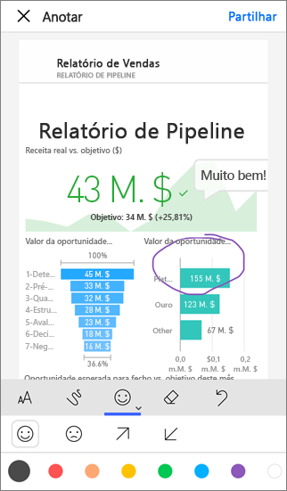

# Como devo colaborar e partilhar no Power BI?

Acabou de criar dashboards e relatórios. Pode até colaborar com os seus colegas nos mesmos. Depois, quer que outras pessoas tenham acesso. Qual é a melhor forma de distribuí-los?

Neste artigo, vamos comparar estas opções de colaboração e partilha no Power BI: 

* Colabore com colegas de trabalho para criar relatórios e dashboards significativos nas *áreas de trabalho de aplicações*.
* Agrupar esses dashboards e relatórios em *aplicações* e publicá-los para um grupo maior ou para toda a organização.
* Partilhar dashboards ou relatórios com algumas pessoas, a partir do serviço ou das aplicações móveis do Power BI.
* Publicar na Web, onde qualquer pessoa pode ver e interagir com os mesmos.
* Impressão. 

Seja qual for a sua escolha, para partilhar um dashboard, precisa de uma [licença do Power BI Pro](service-free-vs-pro.md) ou o conteúdo precisa de estar numa [capacidade Premium](service-premium.md). Os requisitos de licença variam para os colegas que veem os seus dashboards, consoante a opção que selecionar. As secções seguintes indicam detalhes. 

*Aplicações no serviço Power BI*

## Colaborar com colegas para criar uma aplicação
Suponhamos que quer publicar, juntamente com os seus colegas de equipa, as suas informações do Power BI na sua organização. A melhor forma de o fazer é criar uma *aplicação*. Uma aplicação é uma coleção de dashboards e relatórios criados para proporcionar métricas importantes à sua organização. 

Para criar uma aplicação, precisa de uma *área de trabalho de aplicações*, tendo como membros os seus colegas de equipa. Pense na área de trabalho de aplicações como uma área de teste onde o utilizador e outros membros podem colaborar nos seus dashboards e relatórios do Power BI. Todos podem criar relatórios no Power BI Desktop e publicar esses relatórios na área de trabalho de aplicações, e todos precisam de licenças do Power BI Pro.

**Se pretende apenas partilhar uma área de trabalho terminada com clientes, não os adicione à área de trabalho de aplicação.** Em alternativa, [crie o dashboard numa área de trabalho de aplicação](service-create-distribute-apps.md) e publique a aplicação para eles. 

## Publicar a aplicação para um público alargado
Suponhamos que pretende distribuir a sua área de trabalho para um público alargado. O utilizador e os seus colegas criaram uma *área de trabalho de aplicação* e, em seguida, criaram e refinaram dashboards, relatórios e conjuntos de dados na área de trabalho de aplicação. Agora, selecione os dashboards e relatórios que pretende e publique-os como uma aplicação &#151; seja para membros de um grupo de segurança ou lista de distribuição ou para toda a organização. 

É fácil encontrar e instalar aplicações no serviço Power BI ([https://powerbi.com](https://powerbi.com)). Pode enviar aos seus utilizadores empresariais uma ligação direta para a aplicação, ou estes podem pesquisá-la no AppSource. Se o seu administrador do Power BI lhe der permissões, pode instalar uma aplicação automaticamente nas contas do Power BI dos seus colegas de trabalho. Leia mais sobre [publicar as suas aplicações](service-create-distribute-apps.md#publish-your-app). 

Após estes instalarem uma aplicação, podem vê-la no browser ou dispositivo móvel.

Para que os seus utilizadores vejam a sua aplicação, precisam de ter também uma licença do Power BI Pro, ou a aplicação precisa de ser armazenada numa capacidade do Power BI Premium. Para obter informações, consulte [O que é o Power BI Premium?](service-premium.md).

## Partilhar dashboards e relatórios
Imaginemos que finalizou um dashboard e um relatório em A minha área de trabalho ou numa área de trabalho de aplicação e pretende que outras pessoas tenham acesso ao mesmo. Uma forma de o conseguir é *partilhá-lo*. 

Necessita de uma licença do Power BI Pro para partilhar os seus conteúdos, assim como precisam aquelas com quem os partilhar, ou os conteúdos precisam de estar numa [capacidade Premium](service-premium.md). Ao partilhar um dashboard ou relatório, as outras pessoas podem ver e interagir com o mesmo, mas não o podem editar. Podem ver os mesmos dados que vê no dashboard e nos relatórios, a menos que seja aplicada RLS (Segurança em nível de linha) ao conjunto de dados subjacente. Os funcionários com quem o partilhar também o podem partilhar com os respetivos colegas, se assim o permitir. 

Pode também partilhar com pessoas fora da sua organização. Estas podem ver e interagir com o dashboard também, mas não o podem partilhar. 

Saiba mais sobre como [partilhar dashboards e relatórios](service-share-dashboards.md) do serviço Power BI. Pode também adicionar um filtro a uma ligação e [partilhar uma vista filtrada do relatório](service-share-reports.md).

## Anotar e partilhar a partir das aplicações móveis do Power BI
Nas aplicações móveis do Power BI para dispositivos iOS e Android, pode anotar um mosaico, relatório ou visual e, em seguida, partilhá-lo com qualquer pessoa através de e-mail. 

Está a partilhar um instantâneo do mosaico, relatório ou visual e os seus destinatários veem-no exatamente da mesma forma que quando enviou o e-mail. O e-mail também contém uma ligação para o dashboard ou relatório. Se os destinatários tiverem uma licença do Power BI Pro ou se os conteúdos estiverem numa [capacidade Premium](service-premium.md) e já tiver partilhado o objeto com eles, estes poderão abri-los. Pode enviar instantâneos de mosaicos para qualquer pessoa, não apenas para colegas de trabalho no mesmo domínio de e-mail.

Mais informações sobre [anotar e partilhar mosaicos, relatórios e visuais](mobile-annotate-and-share-a-tile-from-the-mobile-apps.md) das aplicações móveis para iOS e Android.

Também pode [partilhar um instantâneo de um mosaico](mobile-share-tile-windows-10-phone-app.md) da aplicação Power BI para dispositivos Windows 10.

## Publicar na Web
Pode publicar relatórios do Power BI para toda a Internet ao incorporar visualizações interativas em publicações de blogue, sites, redes sociais e outras comunicações online em qualquer dispositivo. Qualquer pessoa na Internet pode ver os seus relatórios e o utilizador não pode controlar quem vê o que publicou. As pessoas não precisam de uma licença do Power BI. A publicação na Web só está disponível para relatórios que o utilizador pode editar. Não pode publicar relatórios na Web se estes forem partilhados consigo ou se estiverem numa aplicação. Mais informações sobre [publicar na Web](service-publish-to-web.md).

## Imprimir ou guardar como PDF ou outro ficheiro estático
Pode imprimir ou guardar como PDF (ou outro formato de ficheiro estático) todo um dashboard, mosaico de dashboard, página de relatório ou visualização a partir do serviço do Power BI. Os relatórios só podem ser impressos a uma página de cada vez. Não pode imprimir todo o relatório de uma vez. Mais informações sobre [imprimir ou guardar como um ficheiro estático](service-print.md).

## Próximos passos
* Tem comentários? Aceda ao [site da Comunidade do Power BI](https://community.powerbi.com/) e envie as suas sugestões.
* [Partilhar dashboards com colegas e outras pessoas](service-share-dashboards.md)
* [Criar e publicar uma aplicação no Power BI](service-create-distribute-apps.md)
* Mais perguntas? [Experimente a Comunidade do Power BI](http://community.powerbi.com/).

