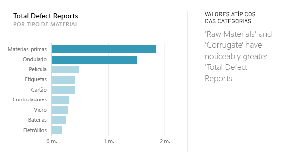
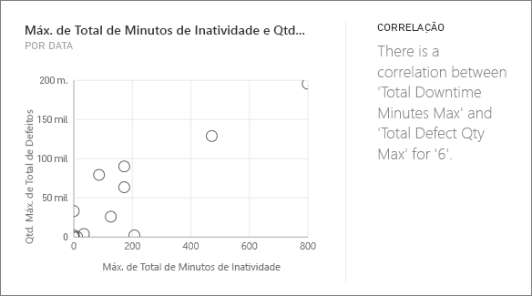
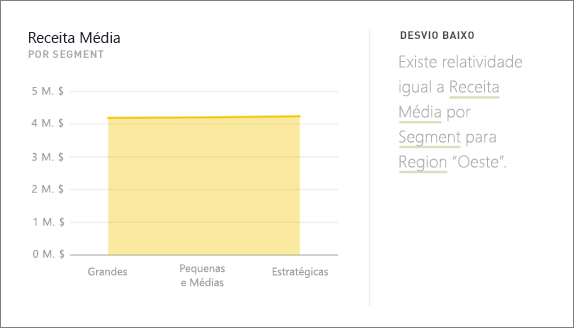
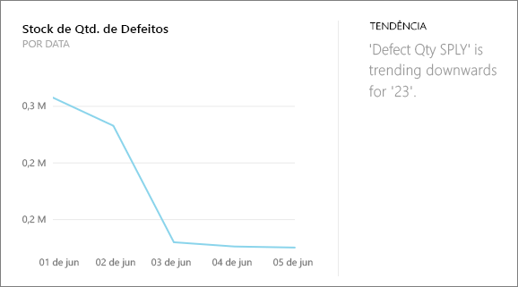
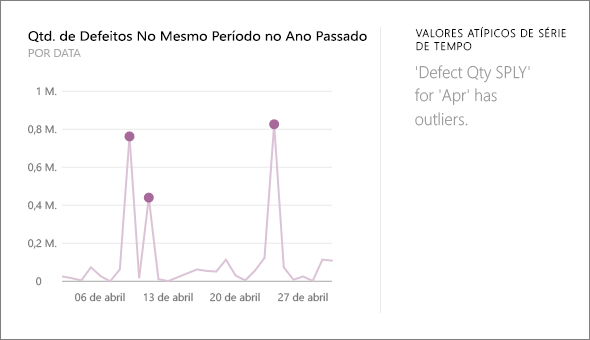

# Tipos de informações suportados pelo Power BI
## Como funcionam as Informações?
O Power BI procura rapidamente diferentes subconjuntos do conjunto de dados enquanto aplica um grupo de algoritmos sofisticados para detetar informações potencialmente interessantes. O Power BI analisa o máximo de um conjunto de dados possível num período de tempo atribuído.

Pode executar as informações para um conjunto de dados ou um mosaico do dashboard.   

## Que tipos de informações é possível encontrar?
Estes são alguns dos algoritmos que usamos:

## Valores Atípicos das Categorias (superior/inferior)
Realça os casos em que, para uma medida no modelo, um ou dois membros de uma dimensão têm valores muito mais altos do que outros membros da dimensão.  

## Alterar os pontos numa série de tempo
Realça os casos em que há alterações significativas nas tendências numa série de tempo de dados.

## Correlação
Deteta os casos em que várias medidas mostram uma correlação entre si quando representadas numa dimensão no conjunto de dados.

## Desvio Baixo
Deteta casos em que os pontos de dados não estão longe da média.

## Maioria (Principais fatores)
Encontra casos em que a maioria de um valor total pode ser atribuída a um único fator quando dividida por outra dimensão.  

## Tendências gerais na série de tempo
Deteta as tendências ascendentes ou descendentes em dados de série de tempo.

## Sazonalidade na série de tempo
Encontra padrões periódicos nos dados de série de tempo, como a sazonalidade semanal, mensal ou anual.

## Partilha constante
Realça os casos em que há uma correlação de pai-filho entre a partilha de um valor do filho em relação ao valor geral do pai numa variável contínua.

## Valores atípicos de série de tempo
Para dados numa série de tempo, deteta quando há datas ou horas específicas com valores significativamente diferentes dos outros valores de data/hora.

## Próximas etapas
[Informações do Power BI](service-insights.md)

Se for o proprietário de um conjunto de dados, [otimize-o para as informações](service-insights-optimize.md)

Mais perguntas? [Experimente a Comunidade do Power BI](http://community.powerbi.com/)

