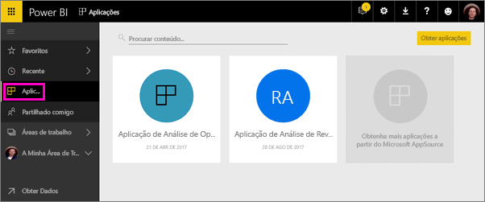
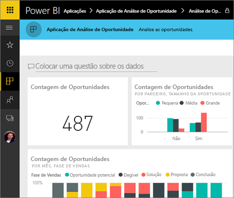
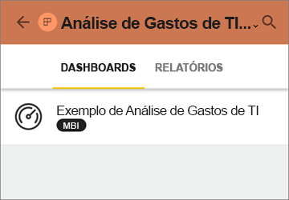
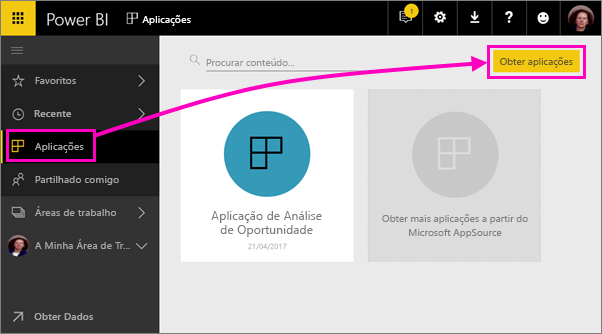
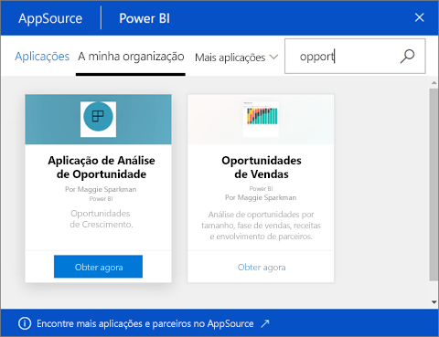
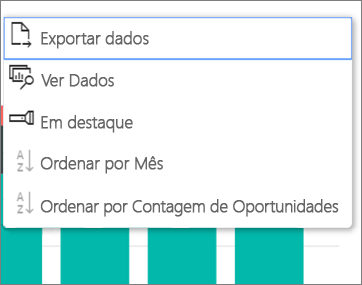

# Instalar e utilizar aplicações com dashboards e relatórios no Power BI
No Power BI, as *aplicações* juntam dashboards e relatórios num único lugar. As pessoas na sua organização podem criar e distribuir aplicações com informações comerciais importantes. Os [Serviços externos](service-connect-to-services.md) que pode já utilizar, como o Google Analytics e o Microsoft Dynamics CRM, também disponibilizam aplicações do Power BI. 

É fácil encontrar e instalar aplicações no serviço Power BI ([https://powerbi.com](https://powerbi.com)) e no seu dispositivo móvel. Depois de instalar uma aplicação, não terá de memorizar os nomes de vários dashboards, uma vez que estes estão juntos numa aplicação, tanto no seu browser como no dispositivo móvel.

Com as aplicações, sempre que o autor da aplicação lançar atualizações, o utilizador pode vê-las automaticamente. O autor também controla quantas vezes os dados são agendados para atualização, para que não se tenha de preocupar em atualizá-los. 

Planeia criar uma aplicação? Veja [Criar e publicar aplicações no Power BI](service-create-distribute-apps.md) para obter mais informações.

## Obter uma nova aplicação
Pode obter aplicações de várias formas diferentes. O autor da aplicação pode instalar a aplicação automaticamente na sua conta do Power BI ou enviar-lhe uma ligação direta para uma aplicação, ou pode pesquisá-la no AppSource, onde se veem todas as aplicações às quais pode aceder. No Power BI no seu dispositivo móvel, só pode instalá-lo de uma ligação direta e não do AppSource. Se o autor instalar a aplicação automaticamente, irá vê-la na sua lista de aplicações.

### Instalar uma aplicação de uma ligação direta
A forma mais fácil de instalar uma nova aplicação de forma autónoma é receber uma ligação direta do autor da aplicação. O Power BI cria uma ligação de instalação, que o autor lhe pode enviar.

**No computador** 

Ao clicar na ligação no e-mail, o serviço Power BI ([https://powerbi.com](https://powerbi.com)) é aberto num browser. Confirme que pretende instalar a aplicação e será aberta a página de destino da aplicação.

**No dispositivo móvel iOS ou Android** 

Quando clicar na ligação no e-mail no seu dispositivo móvel, a aplicação é instalada automaticamente e é aberta a lista de conteúdos da aplicação. 

### Obter a aplicação a partir do Microsoft AppSource
Pode também encontrar e instalar aplicações às quais tenha acesso do Microsoft AppSource. 

1. Selecione **Aplicações**  > **Obter aplicações**. 
   
     
2. No AppSource, em **A minha organização**, pode procurar para filtrar os resultados e encontrar a aplicação que procura.
   
     
3. Selecione **Obter agora** para adicioná-la à sua página Aplicações. 

## Interagir com os dashboards e relatórios na aplicação
Agora, pode explorar os dados nos dashboards e relatórios na aplicação. Tem acesso a todas as interações padrão do Power BI, como a filtragem, o realce, a ordenação e a desagregação. Saiba mais sobre [interagir com relatórios no Power BI](service-reading-view-and-editing-view.md). 

Não pode guardar alterações efetuadas por si, mas pode sempre [exportar os dados para Excel ](power-bi-visualization-export-data.md) de uma tabela ou outro visual num relatório.

## Próximos passos
* [Criar e publicar aplicações no Power BI](service-create-distribute-apps.md)
* [Aplicações do Power BI para serviços externos](service-connect-to-services.md)
* Perguntas? [Experimente perguntar à Comunidade do Power BI](http://community.powerbi.com/)

