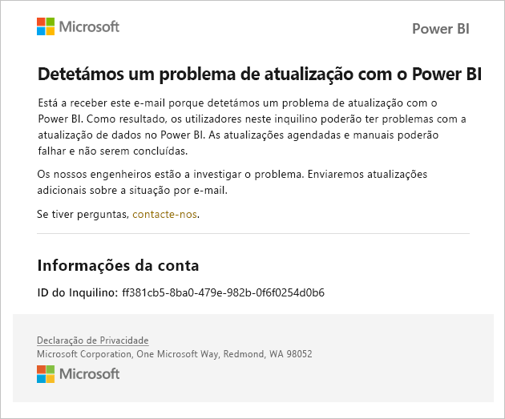
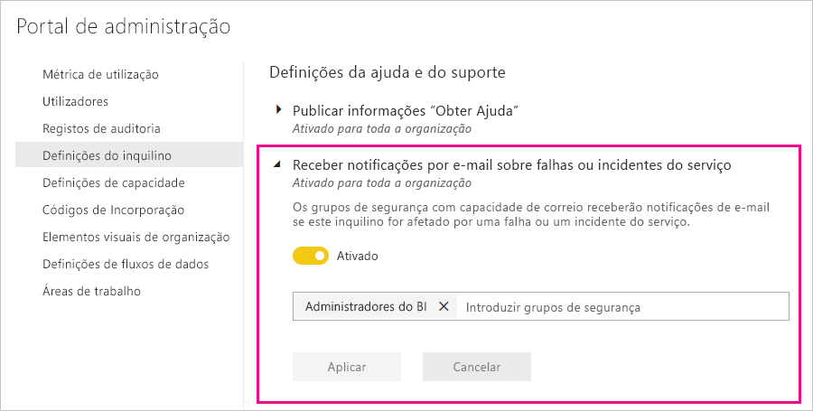

# Service interruption notifications (Notificações de interrupção do serviço)

É fundamental ter informações sobre a disponibilidade das aplicações empresariais essenciais para a sua atividade. O Power BI fornece notificações de incidentes para que possa, opcionalmente, receber e-mails em caso de interrupção ou degradação do serviço. Apesar de o SLA (Contrato de Nível de Serviço) de 99,9% do Power BI faça com que estas ocorrências sejam raras, queremos garantir que se mantém informado. A seguinte captura de ecrã mostra o tipo de e-mail que receberá se ativar as notificações:

De momento, enviamos e-mails relativos aos seguintes _cenários de fiabilidade_:

- Fiabilidade da abertura dos relatórios
- Fiabilidade das atualizações dos modelos
- Fiabilidade das atualizações das consultas

As notificações são enviadas quando houver um _atraso maior_ em operações, tais como: abertura de relatórios, atualização de conjuntos de dados ou execuções de consultas. Após a resolução de um incidente, receberá um e-mail de seguimento.

> [!NOTE]
> De momento, esta funcionalidade só está disponível para capacidades dedicadas no Power BI Premium. Não está disponível para capacidade partilhada ou incorporada.

## Ativar notificações

Os administradores de inquilinos do Power BI têm de seguir os passos abaixo para ativar notificações no portal de administração.

1. Identifique ou crie o grupo de segurança com o e-mail ativado que deve receber notificações.

1. No portal de administração, selecione **Definições de inquilino**. Em **Definições de ajuda e suporte**, expanda **Receber notificações por e-mail se ocorrerem falhas ou incidentes de serviço**.

1. Ative as notificações, insira um grupo de segurança e selecione **Aplicar**.

    

> [!NOTE]
> O Power BI envia notificações da conta no-reply-powerbi@microsoft.com. Certifique-se de que essa conta está na lista de permissões para que as notificações não acabem numa pasta de spamou de lixo.

## Próximos passos

[Opções de suporte para o Power BI Pro e Power BI Premium](service-support-options.md)

Mais perguntas? [Pergunte à Comunidade do Power BI](https://community.powerbi.com/)
