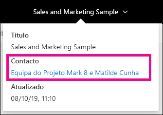
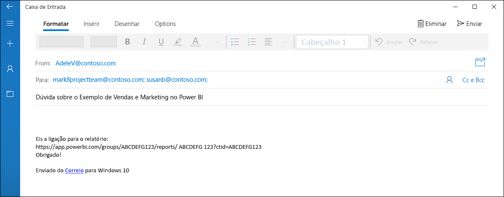
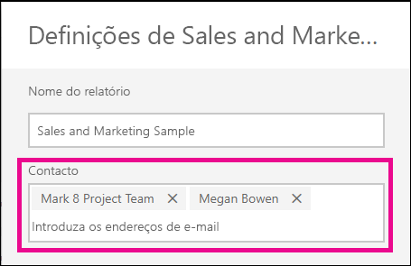
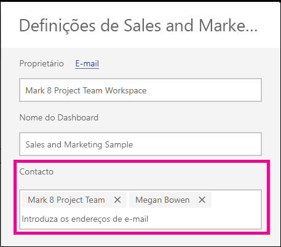

# Definir as informações de contacto dos relatórios e dos dashboards no serviço Power BI
Este artigo ensina a definir as informações de contacto num dashboard ou relatório no serviço Power BI.

> [!NOTE]
> As informações de contacto podem ser definidas para os itens numa área de trabalho clássica ou nova. Não pode definir as informações de contacto para os itens em A Minha Área de Trabalho. O cartão de informações é mostrado quando visualiza um relatório ou dashboard no [novo aspeto](service-new-look.md).

Pode adicionar vários utilizadores ou grupos ao contacto de um item. Estes podem ser:
* Uma pessoa
* Um Grupo do Office 365
* Um grupo de segurança com e-mail
* Uma lista de distribuição

Por predefinição, a pessoa que cria um novo relatório ou dashboard é a pessoa de contacto. Se definir um valor, a predefinição será substituída. Obviamente, pode remover todas as pessoas ou grupos da lista de contactos. Ao fazer isso, nas áreas de trabalho clássicas, será mostrado o Grupo do Office 365 da área de trabalho. Nas áreas de trabalho da nova experiência, será utilizada a [lista de contactos da área de trabalho](service-create-the-new-workspaces.md#workspace-contact-list). Se a lista de contactos da área de trabalho não estiver defina, serão mostrados os administradores da área de trabalho.

As informações de contacto são mostradas às pessoas que veem o item. 

 

Quando clica na lista de contactos, é criado um e-mail para que possa colocar perguntas ou obter ajuda. 

 
 
As informações da lista de contactos também são utilizadas noutros locais. Por exemplo, são mostradas em alguns cenários de erro, na caixa de diálogo do erro. As mensagens de e-mail automatizadas relacionadas com o item, como pedidos de acesso, são enviadas para a lista de contactos. 

> [!NOTE]
> Ao publicar uma aplicação, as informações de contacto definidas nos itens individuais serão definidas para a pessoa que publicou ou atualizou a aplicação. Pode definir o URL de suporte da aplicação para que os utilizadores da aplicação possam obter a ajuda necessária.

## Definir as informações de contacto de um relatório
1. Na sua área de trabalho, selecione o separador **Relatórios**.
2. Localize o relatório pretendido e selecione o ícone **Definições**.
3. Localize o campo de entrada **Contacto** e defina um valor.

     

## Definir s informações de contacto de um dashboard
1. Na sua área de trabalho, selecione o separador **Dashboards**.
2. Localize o dashboard pretendido e selecione o ícone **Definições**
3. Localize o campo de entrada **Contacto** e defina um valor.

     

## Limitações e considerações
* O contacto é definido automaticamente para os novos itens criados no serviço Power BI. Os itens existentes mostrarão a predefinição da área de trabalho.
* Pode definir qualquer utilizador ou grupo na lista de contactos, mas não lhes será concedida a permissão para o item automaticamente. Utilize a partilha ou conceda ao utilizador que necessita do acesso à área de trabalho através de uma função. 
* A lista de contactos ao nível do item não é emitida por push para as aplicações quando são publicadas. A nova experiência de navegação de aplicações disponibiliza um URL de suporte que pode configurar para ajudar a gerir os comentários de um grande número de utilizadores de aplicações.

## Próximos passos

Mais perguntas? [Pergunte à Comunidade do Power BI](https://community.powerbi.com/)
