# Machine Learning automatizada no Power BI (Pré-visualização)

O machine learning automatizado (AutoML) dos fluxos de dados permite que os analistas de negócios preparem, validem e invoquem modelos de Machine Learning diretamente no Power BI. Inclui uma experiência simples para criar um novo modelo de ML, em que os analistas podem utilizar os fluxos de dados para especificar os dados de entrada para a preparação do modelo. O serviço extrai automaticamente os recursos mais relevantes, seleciona um algoritmo apropriado, bem como ajusta e valida o modelo de ML. Após a preparação de um modelo, o Power BI gera automaticamente um relatório que inclui os resultados de validação que explica o desempenho e os resultados aos analistas. O modelo pode ser invocado em todos os dados novos ou atualizados no fluxo de dados.

O machine learning automatizado está disponível para fluxos de dados alojados apenas nas capacidades do Power BI Premium e Embedded. Nesta pré-visualização, o AutoML permite-lhe preparar modelos de machine learning para modelos de Predição Binária, de Classificação e de Regressão.

## Trabalhar com o AutoML

Os [Fluxos de dados do Power BI](service-dataflows-overview.md) oferecem uma preparação de dados personalizada para macrodados. O AutoML permite-lhe tirar partido do esforço de preparação de dados para criar modelos de machine learning diretamente no Power BI.

O AutoML no Power BI permite que os analistas de dados utilizem os fluxos de dados para criar modelos de machine learning com uma experiência simplificada através das competências do Power BI. A maioria da ciência de dados subjacente à criação dos modelos de ML é automatizada pelo Power BI, com proteções para garantir que o modelo produzido tem uma boa qualidade e visibilidade para lhe fornecer informações completas sobre o processo utilizado para criar o modelo de ML.

O AutoML suporta a criação de modelos de **Predição Binária**, de **Classificação** e de **Regressão** para os fluxos de dados. Estes são tipos de modelos de machine learning supervisionados, o que significa que aprendem com os resultados conhecidos das observações anteriores para prever os resultados de outras observações. O conjunto de dados de entrada para a preparação de um modelo de AutoML é um conjunto de registos **etiquetados** com os resultados conhecidos.

O AutoML no Power BI integra o [ML automatizado](https://docs.microsoft.com/azure/machine-learning/service/concept-automated-ml) do [serviço Azure Machine Learning](https://docs.microsoft.com/azure/machine-learning/service/overview-what-is-azure-ml) para criar os modelos de ML. No entanto, não é necessária uma subscrição do Azure para utilizar o AutoML no Power BI. O processo de preparação e de alojamento dos modelos de ML é completamente gerido pelo serviço Power BI.

Após a preparação de um modelo de ML, o AutoML gera automaticamente um relatório do Power BI que explica o desempenho provável do modelo de ML. O AutoML realça a explicabilidade ao destacar os principais influenciadores entre as entradas que influenciam as predições devolvidas pelo modelo. O relatório também inclui as principais métricas do modelo, dependendo do tipo de modelo de ML.

Outras páginas do relatório gerado apresentam o resumo estatístico do modelo e os detalhes de preparação. O resumo estatístico é de interesse para os utilizadores que queiram ver as medidas de desempenho da ciência de dados padrão do modelo. Os detalhes de preparação resumem todas as iterações que foram executadas para criar o modelo, com os parâmetros de modelação associados. Além disso, descreve como cada entrada foi utilizada para criar o modelo de ML.

Em seguida, pode aplicar o modelo de ML aos dados para classificação. Quando o fluxo de dados é atualizado, as predições do modelo de ML são aplicadas automaticamente aos dados. O Power BI também inclui uma explicação individualizada para cada classificação de predição específica produzida pelo modelo de ML.

## Criar um modelo de machine learning

Esta secção descreve como criar um modelo de aprendizagem de AutoML. 

### Preparação de dados para criar um modelo de ML

Para criar um modelo de machine learning no Power BI, em primeiro lugar, deve criar um fluxo de dados para os dados com as informações dos resultados históricos, utilizadas para a preparação do modelo de ML. Para obter detalhes sobre como configurar o fluxo de dados, veja [Preparação de dados personalizada no Power BI](service-dataflows-overview.md).

Na versão atual, o Power BI utiliza dados de uma única entidade para preparar o modelo de ML. Por conseguinte, caso os seus dados históricos consistam em várias entidades, deve associar manualmente os dados numa única entidade de fluxo de dados. Além disso, deve adicionar colunas calculadas para quaisquer métricas de negócios que possam ser fortes previsões para o resultado que está a tentar prever.

O AutoML tem requisitos de dados específicos para a preparação de um modelo de machine learning. Esses requisitos são descritos nas secções a seguir, com base nos tipos de modelo.

### Configurar as entradas do modelo de ML

Para criar um modelo de AutoML, selecione o ícone de ML na coluna **Ações** da entidade de fluxo de dados com os dados históricos e selecione **Adicionar um modelo de machine learning**.

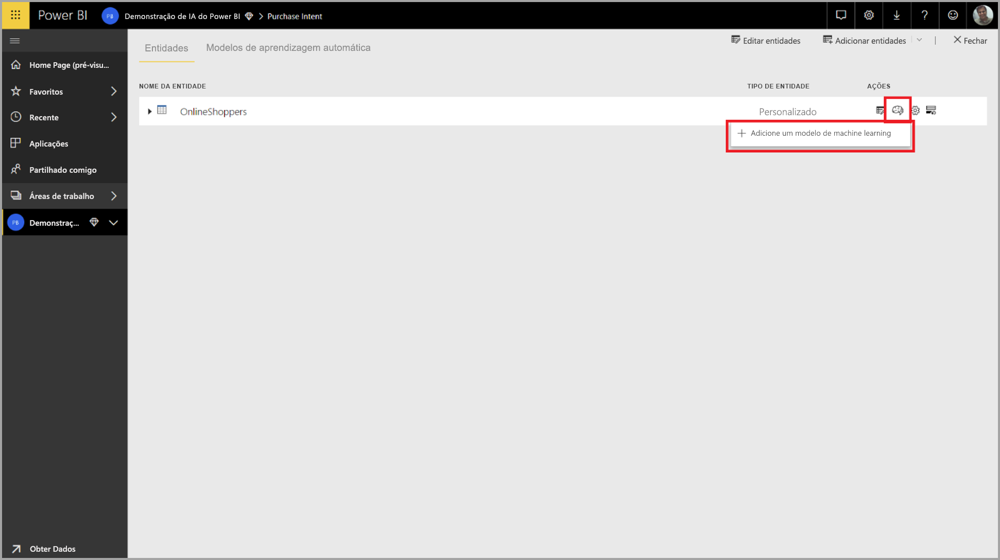

É iniciada uma experiência simplificada que consiste num assistente que o orienta ao longo do processo de criação do modelo de ML. O assistente inclui os seguintes passos simples.

1. Selecionar a entidade com os dados dos resultados históricos e o campo para o qual quer uma predição
2. Escolher um tipo de modelo com base no tipo de predição que quer ver
3. Selecionar as entradas que quer que o modelo utilize como sinais preditivos
4. Atribuir um nome ao modelo e guardar a configuração

O campo de resultados históricos identifica o atributo de etiqueta para a preparação do modelo de ML, apresentado na imagem seguinte.

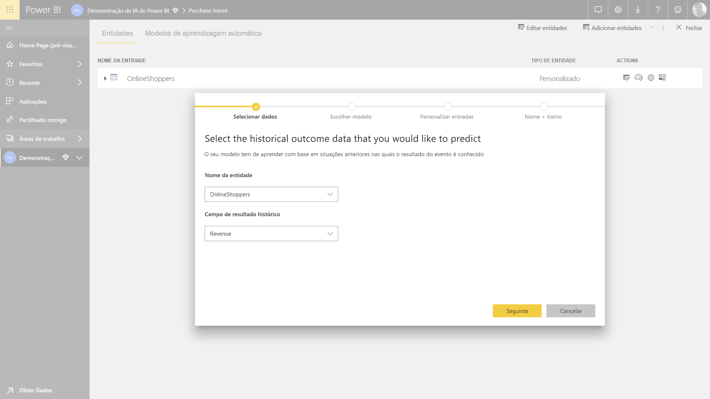

Quando especifica o campo de resultados históricos, o AutoML analisa os dados das etiquetas para identificar os tipos de modelos de ML que podem ser preparados para esses dados e sugere o tipo de modelo de ML mais provável que pode ser preparado. 

> [!NOTE]
> Alguns tipos de modelos podem não ser suportados para os dados que selecionou.

O AutoML também analisa todos os campos na entidade selecionada para sugerir as entradas que podem ser utilizadas para a preparação do modelo de ML. Este processo é aproximado e baseia-se numa análise estatística, pelo que deve rever as entradas utilizadas. As entradas que dependem do campo de resultados históricos (ou do campo de etiquetas) não devem ser utilizadas para a preparação do modelo de ML, uma vez que afetarão o desempenho.

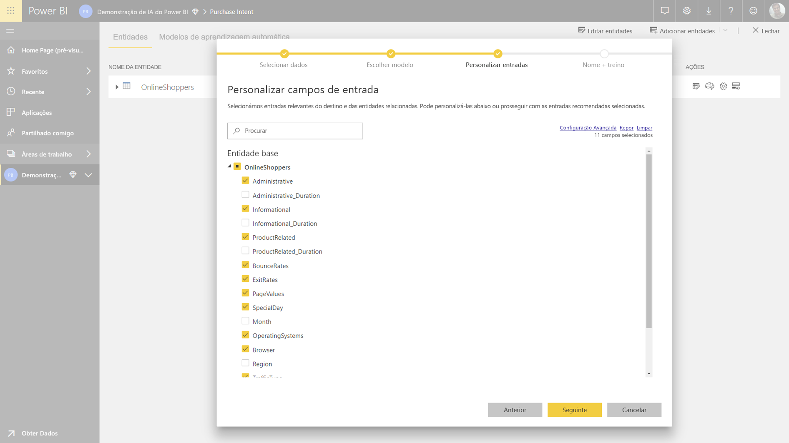

No passo final, pode atribuir um nome ao modelo e guardar as definições.

Nesta fase, é-lhe pedido que atualize o fluxo de dados, o que inicia o processo de preparação do modelo de ML.

### Preparação do modelo de ML

A preparação de modelos de AutoML faz parte da atualização do fluxo de dados. O AutoML prepara, em primeiro lugar, os dados para a preparação.

O AutoML divide os dados históricos fornecidos pelo utilizador em conjuntos de dados de preparação e de teste. O conjunto de dados de teste é um conjunto de exclusão utilizado para validar o desempenho do modelo após a preparação. Estes são reconhecidos como entidades de **Preparação e Teste** no fluxo de dados. O AutoML utiliza uma validação cruzada para a validação do modelo.

Em seguida, cada campo de entrada é analisado e uma imputação é aplicada, o que substitui quaisquer valores em falta por valores substituídos. O AutoML utiliza algumas estratégias de imputação diferentes. Em seguida, qualquer amostragem e normalização necessárias são aplicadas aos dados.

O AutoML aplica várias transformações e baseia cada campo de entrada selecionado no tipo de dados e nas propriedades estatísticas. O AutoML utiliza essas transformações para extrair recursos para utilização na preparação do modelo de ML.

O processo de preparação dos modelos de AutoML consiste num máximo de 50 iterações com diferentes algoritmos de modelação e definições de hiperparâmetros para localizar o modelo com o melhor desempenho. O desempenho de cada um destes modelos é avaliado por uma validação com o conjunto de dados de teste de exclusão. Durante este passo da preparação, o AutoML cria vários pipelines para a preparação e a validação destas iterações. O processo de avaliação do desempenho dos modelos pode demorar algum tempo, desde vários minutos até algumas horas, dependendo do tamanho do conjunto de dados e dos recursos de capacidade dedicados disponíveis.

Em alguns casos, o modelo final gerado pode utilizar a aprendizagem conjunta, em que vários modelos são utilizados para fornecer o melhor desempenho preditivo.

### Explicabilidade do modelo de AutoML

Após a preparação do modelo, o AutoML analisa a relação entre os recursos de entrada e a saída do modelo. Avalia a magnitude e a direção da alteração à saída do modelo para o conjunto de dados de teste de exclusão para cada recurso de entrada. Tal é conhecido como a *importância do recurso*.

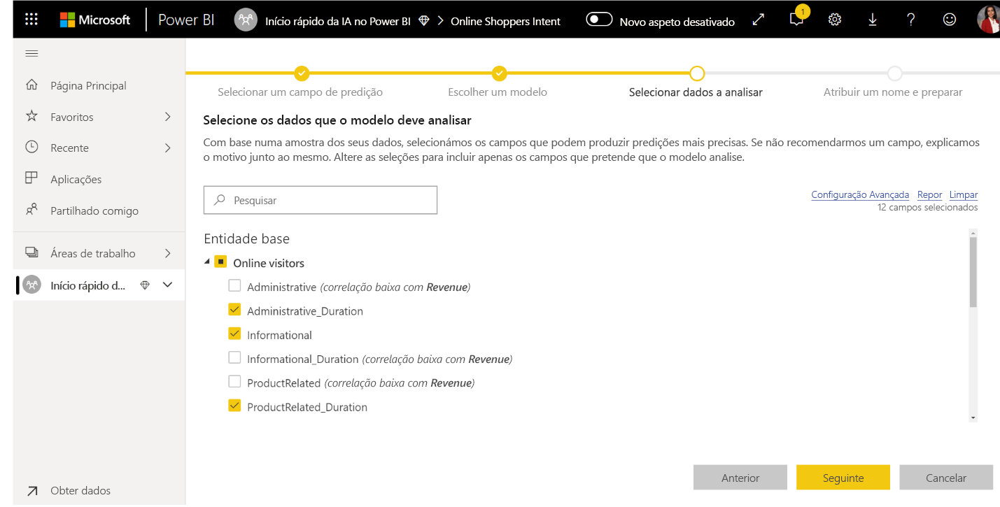

### Relatório de modelo de AutoML

O AutoML gera um relatório do Power BI que resume o desempenho do modelo durante a validação, em conjunto com a importância do recurso global. O relatório resume os resultados da aplicação do modelo de ML para os dados de teste de exclusão e da comparação das predições com os valores de resultado conhecidos.

Pode rever o relatório de modelo para compreender o seu desempenho. Além disso, pode validar se os principais influenciadores do modelo estão alinhados com as informações de negócios no que diz respeito aos resultados conhecidos.

As medidas e os gráficos utilizados para descrever o desempenho do modelo no relatório dependem do tipo de modelo. Tais medidas e gráficos de desempenho são descritos nas secções a seguir.

Páginas adicionais do relatório podem descrever as medidas estatísticas sobre o modelo de uma perspetiva da ciência de dados. Por exemplo, o relatório **Predição Binária** inclui um gráfico de ganhos e a curva ROC para o modelo.

Os relatórios também incluem uma página **Detalhes da Preparação**, que inclui uma descrição da preparação do modelo e um gráfico que descreve o desempenho do modelo em cada uma das execuções de iterações.

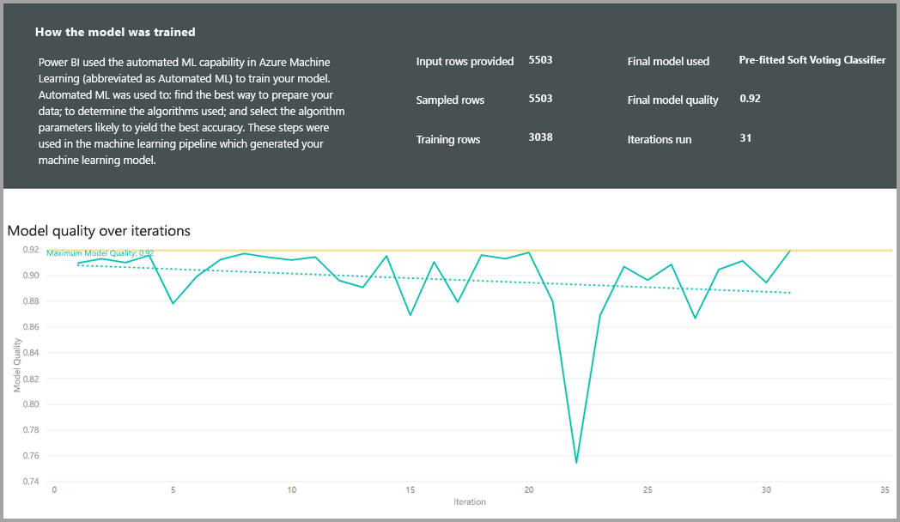

Outra secção desta página descreve o método de imputação utilizado para preencher os valores em falta para os campos de entrada e o modo como cada campo de entrada foi transformado para extrair os recursos utilizados no modelo. Além disso, inclui os parâmetros utilizados pelo modelo final.

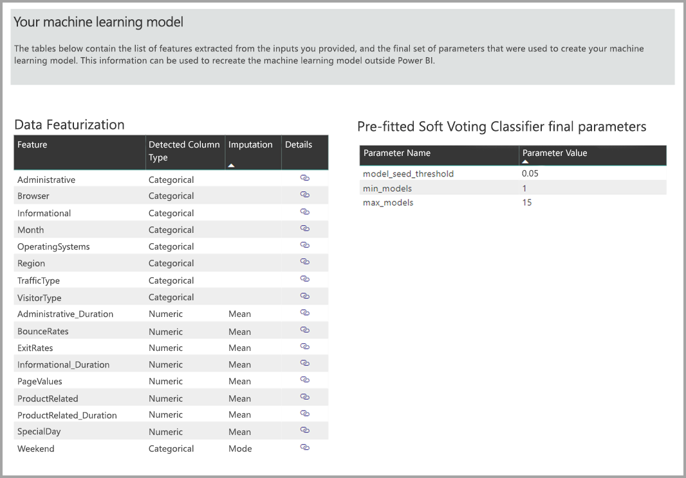

Se o modelo produzido utilizar a aprendizagem conjunta, a página **Detalhes da Preparação** também incluirá uma secção que descreve a importância de cada modelo de constituinte no conjunto e os seus parâmetros.

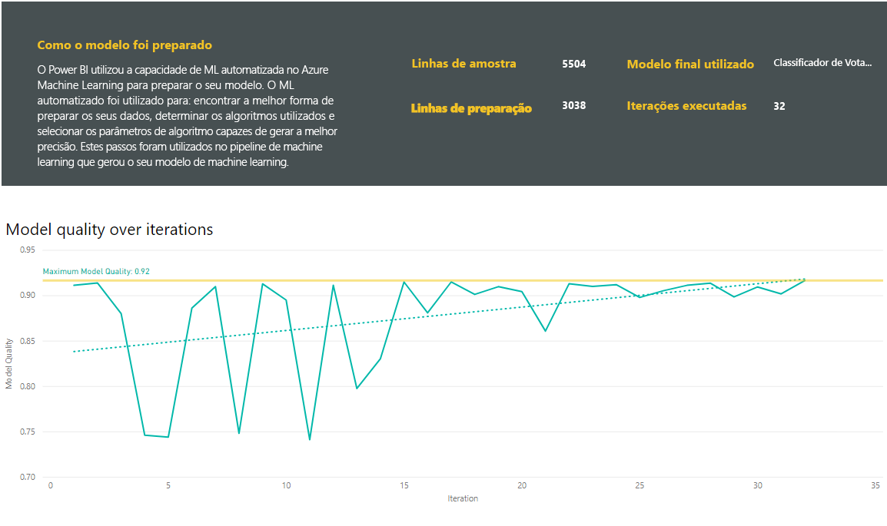

## Aplicar o modelo de AutoML

Caso esteja satisfeito com o desempenho do modelo de ML criado, pode aplicá-lo aos dados novos ou atualizados quando o fluxo de dados for atualizado. Para tal, no relatório de modelo, selecione o botão **Aplicar** no canto superior direito.

Para aplicar o modelo de ML, deve especificar o nome da entidade à qual deve ser aplicado e um prefixo para as colunas que serão adicionadas a essa entidade para a saída do modelo. O prefixo predefinido para os nomes das colunas é o nome do modelo. A função *Aplicar* pode incluir parâmetros adicionais específicos do tipo de modelo.

A aplicação do modelo de ML cria uma nova entidade de fluxo de dados com o sufixo **enriched <nome_modelo>** . Por exemplo, se aplicar o modelo _PurchaseIntent_ à entidade _OnlineShoppers_, a saída gerará **OnlineShoppers enriched PurchaseIntent**.

Atualmente, a entidade de saída não pode ser utilizada para pré-visualizar os resultados do modelo de ML no editor do Power Query. As colunas de saída apresentam sempre nulo como resultado. Para ver os resultados, uma segunda entidade de saída com o sufixo **enriched <nome_modelo> Preview** é criada quando o modelo é aplicado.

Deve atualizar o fluxo de dados para pré-visualizar os resultados no Editor de Consultas.

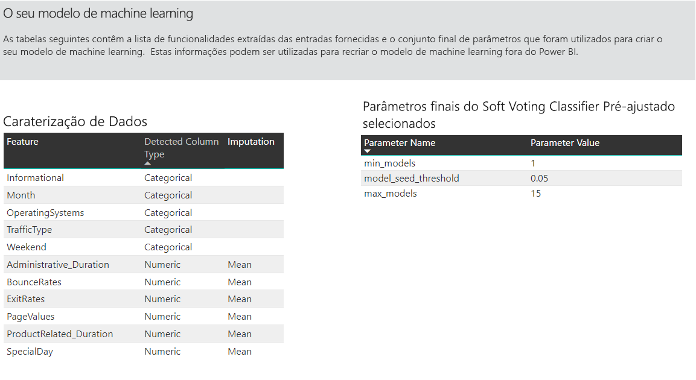

Quando aplica o modelo, o AutoML mantém sempre as predições atualizadas quando o fluxo de dados é atualizado.

Além disso, o AutoML inclui uma explicação individualizada para cada linha que classifica na entidade de saída.

Para utilizar as informações e as predições do modelo de ML num relatório do Power BI, pode ligar à entidade de saída do Power BI Desktop com o conector de **fluxos de dados**.

## Modelos de Predição Binária

Os modelos de Predição Binária, mais formalmente conhecidos como **modelos de classificação binária**, são utilizados para classificar um conjunto de dados em dois grupos. São utilizados para prever eventos que podem ter um resultado binário, tal como se uma oportunidade de vendas será convertida, uma conta será abandonada, uma fatura será paga pontualmente, uma transação é fraudulenta, entre outros.

Uma vez que o resultado é binário, o Power BI espera que a etiqueta de um modelo de predição binária seja um Booleano, com os resultados conhecidos etiquetados como **verdadeiro** ou **falso**. Por exemplo, num modelo de conversão de oportunidades de vendas, as oportunidades de vendas ganhas são etiquetadas como verdadeiras, as oportunidades de vendas perdidas são etiquetadas como falsas e as oportunidades de vendas abertas são etiquetadas como nulas.

A saída de um modelo de Predição Binária é uma classificação de probabilidade, que identifica a probabilidade de o resultado correspondente ao valor de etiqueta verdadeiro ser alcançado.

### Preparar um modelo de Predição Binária

Para criar um modelo de Predição Binária, a entidade de entrada com os dados de preparação deve ter um campo Booleano como o campo de resultados históricos para identificar os últimos resultados conhecidos.

Pré-requisitos:

* Um campo Booleano deve ser utilizado como o campo de resultados históricos
* São necessárias, no mínimo, 50 linhas de dados históricos para cada classe de resultados

Em geral, caso os últimos resultados sejam identificados por campos de um tipo de dados diferente, pode adicionar uma coluna calculada para transformá-los num Booleano com o Power Query.

O processo de criação de um modelo de Predição Binária segue os mesmos passos de outros modelos de AutoML, descritos na secção **Configurar as entradas do modelo de ML** acima.

### Relatório do modelo de Predição Binária

O modelo de Predição Binária produz como uma saída uma probabilidade de que um registo alcance o resultado definido pelo valor de etiqueta Booleano como verdadeiro. O relatório inclui uma segmentação de dados para o limite de probabilidade, que influencia o modo como as pontuações superiores e inferiores ao limite de probabilidade são interpretadas.

O relatório descreve o desempenho do modelo em termos de *Verdadeiros Positivos*, *Falsos Positivos*, *Verdadeiros Negativos* e *Falsos Negativos*. Os Verdadeiros Positivos e os Verdadeiros Negativos são resultados previstos corretamente para as duas classes nos dados de resultado. Os Falsos Positivos são resultados que tinham a etiqueta Booleano real de valor Falso, mas que foram previstos como Verdadeiro. Por outro lado, os Falsos Negativos são resultados em que o valor de etiqueta Booleano real era Verdadeiro, mas que foram previstos como Falso.

As medidas, tais como Precisão e Revocação, descrevem o efeito do limite de probabilidade nos resultados previstos. Pode utilizar a segmentação de dados de limite de probabilidade para selecionar um limite que alcance um compromisso equilibrado entre Precisão e Revocação.

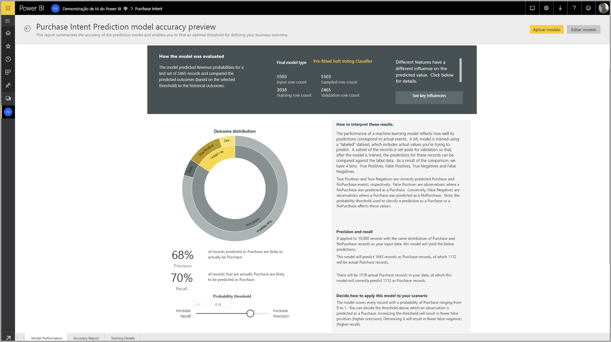

A página **Relatório de Precisão** do relatório de modelo inclui o gráfico *Ganhos Cumulativos* e a curva ROC para o modelo. Estas são medidas estatísticas de desempenho do modelo. Os relatórios incluem descrições dos gráficos apresentados.

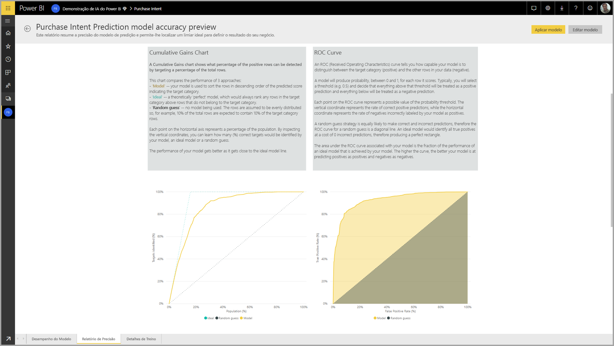

### Aplicar um modelo de Predição Binária

Para aplicar um modelo de Predição Binária, deve especificar a entidade com os dados aos quais quer aplicar as predições do modelo de ML. Outros parâmetros incluem o prefixo de nome da coluna de saída e o limite de probabilidade para a classificação do resultado previsto.

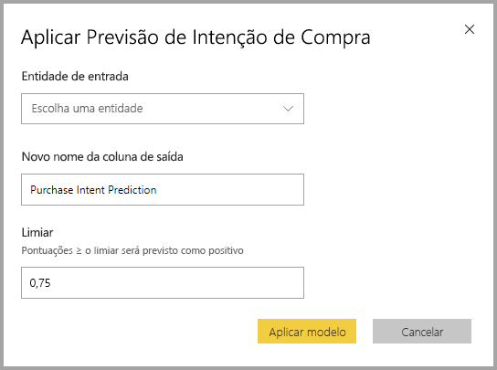

Quando um modelo de Predição Binária é aplicado, adiciona três colunas de saída à entidade de saída melhorada. Essas colunas são **PredictionScore**, **PredictionOutcome** e **PredictionExplanation**. Os nomes das colunas na entidade têm o prefixo especificado quando o modelo é aplicado.

A coluna **PredictionOutcome** contém a etiqueta de resultado previsto. Os registos com probabilidades superiores ao limite são previstos como prováveis de alcançar o resultado e os registos inferiores são previstos como improváveis de alcançar o resultado.

A coluna **PredictionExplanation** contém uma explicação com a influência específica que os recursos de entrada tiveram na coluna **PredictionScore**. Esta é uma coleção com formatação JSON da importância dos recursos de entrada para a predição.

## Modelos de classificação

Os modelos de classificação são utilizados para classificar um conjunto de dados em vários grupos ou classes.  Além disso, são utilizados para prever eventos que podem ter um de vários resultados possíveis, tais como se um cliente tem provavelmente um valor de duração muito elevado, elevado, médio ou reduzido, o risco de incumprimento é elevado, moderado, reduzido ou muito reduzido, entre outros.

A saída de um Modelo de classificação é uma pontuação de probabilidade, que identifica a probabilidade de um registo alcançar os critérios para uma determinada classe.

### Preparar um modelo de classificação

A entidade de entrada com os dados de preparação para um Modelo de classificação deve ter um campo numérico ou uma cadeia como o campo de resultados históricos, que identifica os últimos resultados conhecidos.

Pré-requisitos:

* São necessárias, no mínimo, 50 linhas de dados históricos para cada classe de resultados

O processo de criação de um modelo de classificação segue os mesmos passos de outros modelos de AutoML, descritos na secção **Configurar as entradas do modelo de ML** acima.

### Relatório do Modelo de classificação

O relatório do Modelo de classificação é produzido através da aplicação do modelo de ML aos dados de teste de exclusão e da comparação da classe prevista para um registo com a classe conhecida real.

O relatório de modelo inclui um gráfico no qual consta a divisão dos registos correta e incorretamente classificados para cada classe conhecida.

Um aprofundamento adicional específico de classe permite uma análise de como as predições para uma classe conhecida são distribuídas. Tal inclui as outras classes nas quais os registos dessa classe conhecida serão, provavelmente, classificados de modo incorreto.

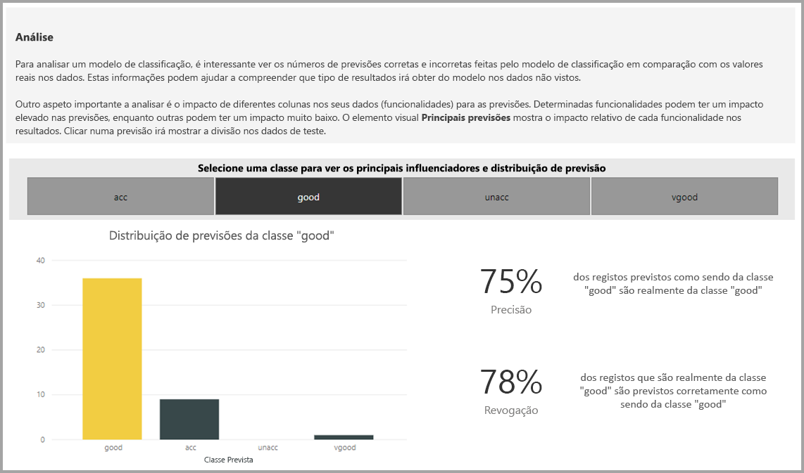

A explicação do modelo no relatório também inclui as principais previsões para cada classe.

O relatório do Modelo de classificação também inclui uma página Detalhes da Preparação semelhante às páginas de outros tipos de modelo, conforme descrito na secção **Relatório do modelo de AutoML** acima neste artigo.

### Aplicar um modelo de classificação

Para aplicar um Modelo de ML de classificação, deve especificar a entidade com os dados de entrada e o prefixo de nome da coluna de saída.

Quando um Modelo de classificação é aplicado, adiciona três colunas de saída à entidade de saída melhorada. Essas colunas são **PredictionScore**, **PredictionClass** e **PredictionExplanation**. Os nomes das colunas na entidade têm o prefixo especificado quando o modelo é aplicado.

A coluna **PredictionClass** contém a classe prevista mais provável para o registo. A coluna **PredictionScore** contém a lista de pontuações de probabilidade para o registo de cada classe possível.

A coluna **PredictionExplanation** contém uma explicação com a influência específica que os recursos de entrada tiveram na coluna **PredictionScore**. Esta é uma coleção com formatação JSON da importância dos recursos de entrada para a predição.

## Modelos de regressão

Os Modelos de regressão são utilizados para prever um valor, tal como a receita que provavelmente será obtida de um negócio de vendas, o valor de duração de uma conta, o montante de uma fatura a receber que será provavelmente pago, a data em que uma fatura poderá ser paga, entre outros.

A saída de um Modelo de regressão é o valor previsto.

### Preparar um Modelo de regressão

A entidade de entrada com os dados de preparação para um Modelo de regressão deve ter um campo numérico como o campo de resultados históricos, que identifica os últimos resultados conhecidos.

Pré-requisitos:

* São necessárias, no mínimo, 100 linhas de dados históricos para um modelo de regressão

O processo de criação de um Modelo de regressão segue os mesmos passos de outros modelos de AutoML, descritos na secção **Configurar as entradas do modelo de ML** acima.

### Relatório do Modelo de regressão

Tal como os outros relatórios de modelo de AutoML, o Relatório de regressão baseia-se nos resultados da aplicação do modelo aos dados de teste de exclusão.

O relatório de modelo inclui um gráfico que compara os valores previstos com o valor real. Neste gráfico, a distância da diagonal indica o erro na predição.

O gráfico de erro residual apresenta a distribuição da percentagem de erro médio para diferentes valores no conjunto de dados de teste de exclusão. O eixo horizontal representa a média do valor real do grupo, com o tamanho da bolha a apresentar a frequência ou a contagem de valores nesse intervalo. O eixo vertical é o erro residual médio.

O relatório do Modelo de regressão também inclui uma página Detalhes da Preparação semelhante aos relatórios de outros tipos de modelo, conforme descrito na secção **Relatório do Modelo de AutoML** acima.

### Aplicar um modelo de regressão

Para aplicar um Modelo de ML de regressão, deve especificar a entidade com os dados de entrada e o prefixo de nome da coluna de saída.

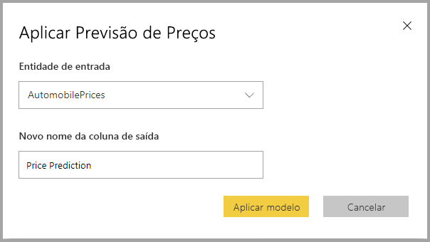

Quando um Modelo de regressão é aplicado, adiciona duas colunas de saída à entidade de saída melhorada. Essas colunas são **PredictionValue** e **PredictionExplanation**. Os nomes das colunas na entidade têm o prefixo especificado quando o modelo é aplicado.

A coluna **PredictionValue** contém o valor previsto para o registo com base nos campos de entrada. A coluna **PredictionExplanation** contém uma explicação com a influência específica que os recursos de entrada tiveram na coluna **PredictionValue**. Esta é uma coleção com formatação JSON da importância dos recursos de entrada.

## Próximos passos

Este artigo forneceu uma descrição geral do Machine Learning Automatizado para os fluxos de dados no serviço Power BI. Os seguintes artigos também podem ser úteis.

* [Tutorial: Criar um modelo de Machine Learning no Power BI (Pré-visualização)](service-tutorial-build-machine-learning-model.md)
* [Tutorial: Utilizar os Serviços Cognitivos no Power BI](service-tutorial-use-cognitive-services.md)
* [Tutorial: Invocar um modelo do Machine Learning Studio no Power BI (Pré-visualização)](service-tutorial-invoke-machine-learning-model.md)
* [Serviços Cognitivos no Power BI (Pré-visualização)](service-cognitive-services.md)
* [Integração do Azure Machine Learning no Power BI (Pré-visualização)](service-machine-learning-integration.md)

Para obter mais informações sobre fluxos de dados, leia estes artigos:
* [Criar e utilizar fluxos de dados no Power BI](service-dataflows-create-use.md)
* [Utilizar entidades calculadas no Power BI Premium](service-dataflows-computed-entities-premium.md)
* [Utilizar fluxos de dados com origens de dados no local](service-dataflows-on-premises-gateways.md)
* [Recursos para programadores para fluxos de dados do Power BI](service-dataflows-developer-resources.md)
* [Fluxos de dados e integração do Azure Data Lake (Pré-visualização)](service-dataflows-azure-data-lake-integration.md)

