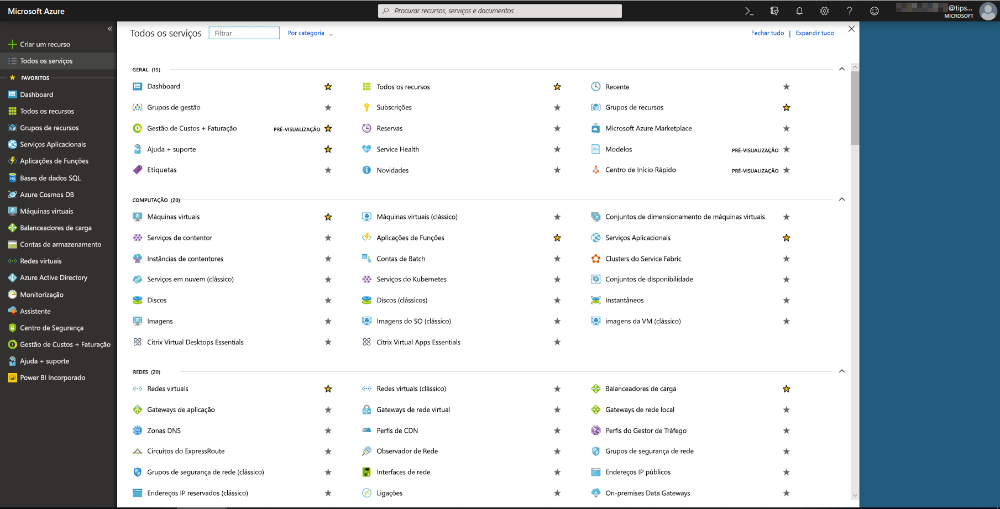
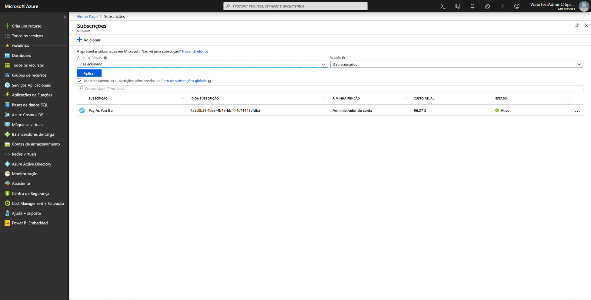
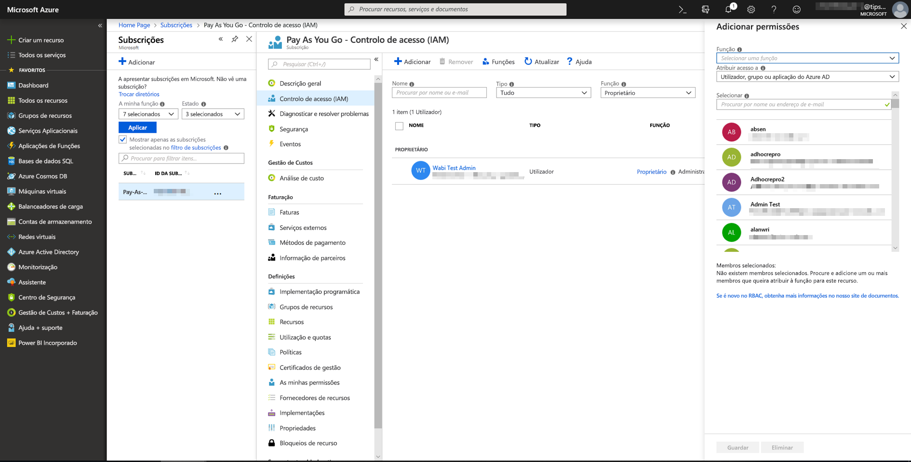
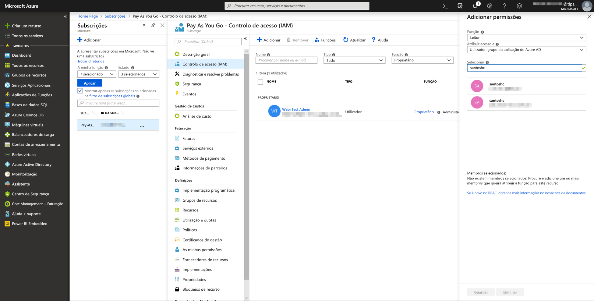
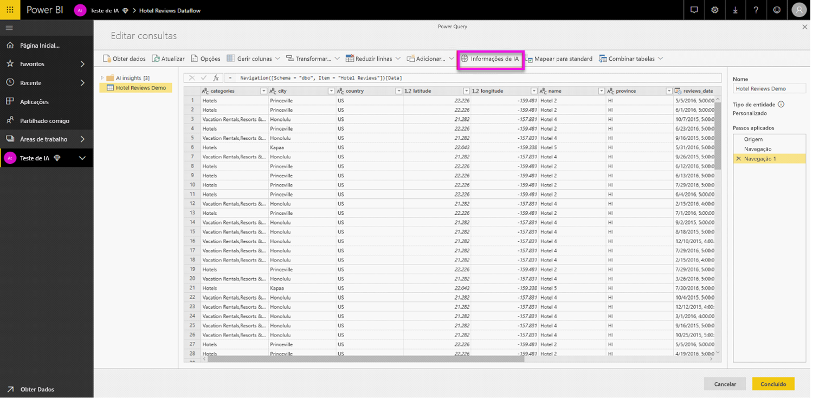
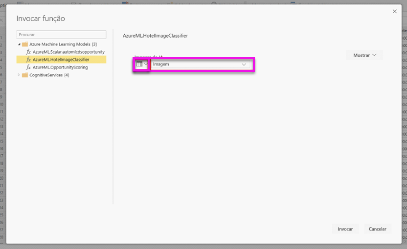
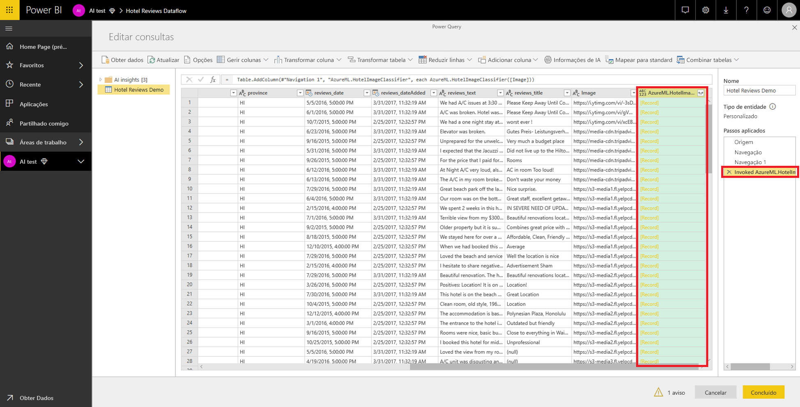
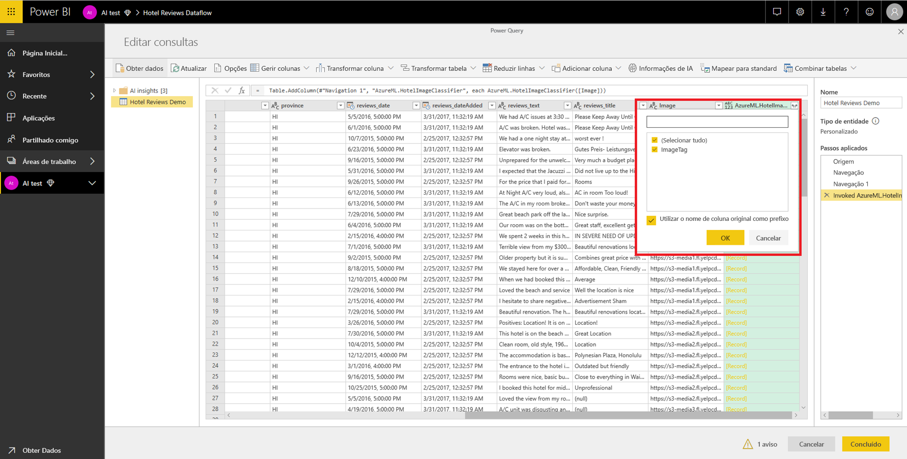

# Integração do Azure Machine Learning no Power BI (Pré-visualização)

Muitas organizações utilizam os modelos do **Machine Learning** para obter melhores informações e previsões sobre os seus negócios. A capacidade de visualizar e invocar informações a partir destes modelos, nos seus relatórios, dashboards e outras análises, pode ajudar a disseminar estas informações junto dos utilizadores empresariais que mais precisam delas.  Agora, o Power BI simplifica a incorporação de informações de modelos alojados no serviço Azure Machine Learning, através de gestos simples de apontar e clicar.

Para utilizar esta capacidade, basta que um cientista de dados conceda acesso ao modelo do Azure ML ao analista de BI através do portal do Azure.  Em seguida, no início de cada sessão, o Power Query deteta todos os modelos do Azure ML aos quais o utilizador tem acesso e expõe-nos como funções dinâmicas do Power Query.  Por sua vez, o utilizador pode invocar essas funções ao aceder às mesmas a partir do friso no Editor do Power Query ou ao invocar diretamente a função M. O Power BI também agrupa automaticamente os pedidos de acesso ao invocar o modelo do Azure ML para um conjunto de linhas de modo a obter um melhor desempenho.

Atualmente, esta funcionalidade só é suportada para fluxos de dados do Power BI e para o Power Query online no serviço Power BI.

Para saber mais sobre fluxos de dados, veja [Preparação personalizada de dados no Power BI](service-dataflows-overview.md).

Para saber mais sobre o Azure Machine Learning, veja:

- Descrição Geral:  [O que é o serviço Azure Machine Learning?](https://docs.microsoft.com/azure/machine-learning/service/overview-what-is-azure-ml)
- Guias de Introdução e Tutoriais para o Azure Machine Learning:  [Documentação do Azure Machine Learning](https://docs.microsoft.com/azure/machine-learning/)

## Conceder acesso ao modelo do Azure ML a um utilizador do Power BI

Para aceder a um modelo do Azure ML a partir do Power BI, o utilizador tem de ter acesso de **Leitura** à subscrição do Azure.  Além disso:

- Para modelos do Machine Learning Studio, tem de ter acesso de **Leitura** ao serviço Web Machine Learning Studio
- Para modelos do Serviço do Machine Learning, tem de ter acesso de **Leitura** à área de trabalho do serviço do Machine Learning

Os passos indicados neste artigo descrevem como conceder acesso a um utilizador do Power BI a um modelo alojado no serviço do Azure ML, para que possam aceder a este modelo como uma função do Power Query.  Para obter mais detalhes, veja [Gerir o acesso com o RBAC e o portal do Azure](https://docs.microsoft.com/azure/role-based-access-control/role-assignments-portal).

1. Inicie sessão no [portal do Azure](https://portal.azure.com).

2. Vá para a página **Subscrições**. Pode encontrar a página **Subscrições** através da lista **Todos os Serviços** no menu de navegação esquerdo do portal do Azure.

    

3. Selecione a sua subscrição.

    

4. Selecione **Controlo de Acesso (IAM)** e, em seguida, selecione o botão **Adicionar**.

    

5. Selecione **Leitor** como Função. Selecione o utilizador do Power BI ao qual quer conceder acesso ao modelo do Azure ML.

    

6. Selecione **Guardar**.

7. Repita os passos três a seis para conceder acesso de **Leitor** ao utilizador para o serviço Web Machine Learning Studio específico *ou* para a área de trabalho do serviço do Machine Learning que aloja o modelo.

## Deteção de esquema para modelos de Serviço do Machine Learning

Os cientistas de dados utilizam o Python sobretudo para desenvolver e, inclusivamente, implementar os respetivos modelos de aprendizagem automática no Serviço do Machine Learning.  Ao contrário do Machine Learning Studio, que ajuda a automatizar a tarefa de criação de um ficheiro de esquema para o modelo, no caso do Serviço do Machine Learning, o cientista de dados tem de gerar explicitamente o ficheiro de esquema com o Python.

Este ficheiro de esquema tem de estar incluído no

## Invocar o modelo do Azure ML no Power BI

Pode invocar qualquer modelo do Azure ML ao qual lhe foi concedido acesso diretamente a partir do Editor do Power Query no seu fluxo de dados. Para aceder aos modelos do Azure ML, selecione o botão **Editar** para a entidade que pretende enriquecer com informações do modelo do Azure ML, conforme mostrado na imagem seguinte.

Se selecionar o botão **Editar**, abre o Editor do Power Query para as entidades no seu fluxo de dados.

Selecione o botão **Informações de IA** no friso e, em seguida, selecione a pasta _Modelos do Azure Machine Learning_ no menu de navegação esquerdo. Todos os modelos do Azure ML aos quais tem acesso estão listados aqui como funções do Power Query. Além disso, os parâmetros de entrada para o modelo do Azure ML são mapeados automaticamente como parâmetros da função de Power Query correspondente.

Para invocar um modelo do Azure ML, pode especificar qualquer uma das colunas da entidade selecionada como uma entrada da lista pendente. Também pode especificar um valor constante a utilizar como entrada, ao mudar o ícone de coluna para a esquerda da caixa de diálogo de entrada.

Selecione **Invocar** para ver a pré-visualização da saída do modelo do Azure ML como uma nova coluna na tabela de entidades. Também irá ver a invocação do modelo como um passo aplicado da consulta.

Se o modelo devolver vários parâmetros de saída, estes são agrupados como um registo na coluna de saída. Pode expandir a coluna para produzir parâmetros de saída individuais em colunas separadas.

Depois de guardar o fluxo de dados, o modelo será invocado automaticamente quando o fluxo de dados for atualizado em linhas novas ou atualizadas na tabela de entidades.

## Próximos Passos

Este artigo forneceu uma descrição geral da integração do Machine Learning no serviço Power BI. Os artigos que se seguem também podem ser úteis e interessantes. 

* [Tutorial: Invocar um modelo do Machine Learning Studio no Power BI (Pré-visualização)](service-tutorial-invoke-machine-learning-model.md)
* [Tutorial: Utilizar os Serviços Cognitivos no Power BI](service-tutorial-use-cognitive-services.md)
* [Serviços Cognitivos no Power BI (Pré-visualização)](service-cognitive-services.md)

Para obter mais informações sobre fluxos de dados, leia estes artigos:
* [Criar e utilizar fluxos de dados no Power BI](service-dataflows-create-use.md)
* [Usando entidades calculadas no Power BI Premium](service-dataflows-computed-entities-premium.md)
* [Utilizar fluxos de dados com origens de dados no local](service-dataflows-on-premises-gateways.md)
* [Recursos para desenvolvedores de fluxos de dados do Power BI](service-dataflows-developer-resources.md)
* [Fluxos de dados e integração do Azure Data Lake (Pré-visualização)](service-dataflows-azure-data-lake-integration.md)

