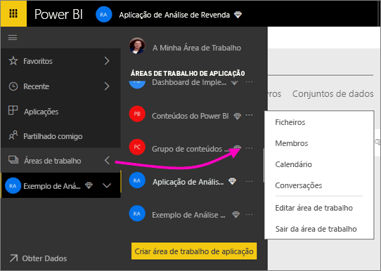
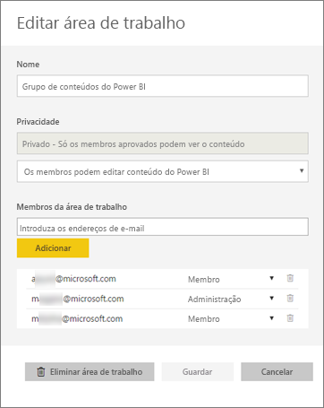
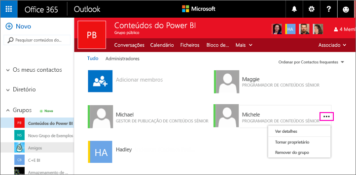
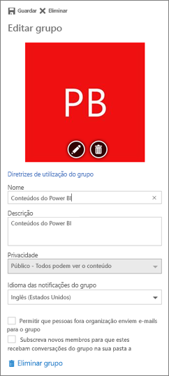

# Gerir a área de trabalho da aplicação no Power BI e no Office 365
Como criador ou administrador de uma [área de trabalho de aplicação no Power BI](service-install-use-apps.md) ou no Office 365, gere alguns aspetos da área de trabalho no Power BI. Outros aspetos que gere no Office 365. 

**No Power BI**, pode:

* Adicionar ou remover membros da área de trabalho da aplicação, incluindo tornar um membro da área de trabalho administrador.
* Editar o nome da área de trabalho da aplicação.
* Eliminar a área de trabalho da aplicação.

**No Office 365**, pode:

* Adicionar ou remover membros do grupo da área de trabalho da aplicação, incluindo tornar um membro administrador.
* Editar o nome, a imagem e a descrição do grupo, bem como outras definições.
* Ver o endereço de e-mail do grupo.
* Eliminar o grupo.

É preciso uma licença do [Power BI Pro](service-free-vs-pro.md) para ser administrador ou membro de uma área de trabalho da aplicação. Os utilizadores da aplicação também precisam de uma licença do Power BI Pro, a menos que a sua área de trabalho da aplicação esteja numa capacidade Premium do Power BI. Neste caso, os utilizadores empresariais podem aceder à aplicação com uma licença gratuita do Power BI. Para mais detalhes, leia [O que é o Power BI Premium?](service-premium.md).

## Editar a área de trabalho da aplicação no Power BI
1. No serviço Power BI, selecione a seta junto a **Áreas de trabalho** > selecione as reticências (**…**) junto ao nome da sua área de trabalho > **Editar área de trabalho**. 
   
   
   
   > [!NOTE]
   > Só verá a opção **Editar área de trabalho** se for administrador da área de trabalho da aplicação.
   > 
   > 
2. Aqui, pode mudar o nome, adicionar ou remover membros, ou eliminar a área de trabalho da aplicação. 
   
   
3. Selecione **Guardar** ou **Cancelar**.

## Editar propriedades da área de trabalho da aplicação no Office 365
1. No serviço Power BI, selecione a seta junto a **Áreas de trabalho** > selecione as reticências (**…**) junto ao nome da sua área de trabalho > **Membros**. 
   
   
   
   Esta ação abre a vista de grupo do Outlook para o Office 365 da sua área de trabalho da aplicação.
   
   Poderá ter de iniciar sessão na sua conta empresarial.
2. Toque no botão de reticências (**…**) junto ao nome de um membro para tornar o membro administrador ou eliminar o membro da área de trabalho da aplicação. 
   
   

## Adicionar uma imagem e definir outras propriedades da área de trabalho no grupo do Office 365
Quando distribuir a aplicação a partir da área de trabalho da aplicação, a imagem que adicionar aqui será a imagem da sua aplicação. Veja a secção [Adicionar uma imagem à sua aplicação](service-create-distribute-apps.md#add-an-image-to-your-app-optional) do artigo [Criar e distribuir uma aplicação no Power BI](service-create-distribute-apps.md).

1. Na vista do Outlook para Office 365 da sua área de trabalho da aplicação, selecione a imagem do grupo para editar as propriedades da área de trabalho do grupo.
   
   
2. Aqui, pode editar o nome, a descrição e o idioma, adicionar uma imagem e definir outras propriedades.
   
   
3. Selecione **Guardar** ou **Eliminar**.

## Próximos passos
* [O que são aplicações no Power BI?](service-install-use-apps.md)
* [Criar aplicações e áreas de trabalho de aplicação no Power BI](service-create-distribute-apps.md)
* Mais perguntas? [Pergunte à Comunidade do Power BI](http://community.powerbi.com/)

