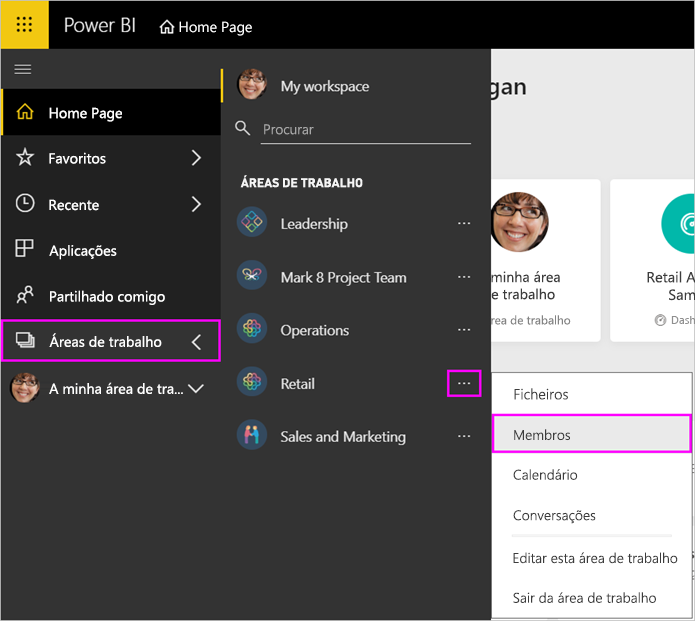

# Gerir a área de trabalho da aplicação no Power BI e no Office 365

Como criador ou administrador de uma [área de trabalho de aplicação no Power BI](service-create-distribute-apps.md) ou no Office 365, gere alguns aspetos da área de trabalho no Power BI. Outros aspetos que gere no Office 365.

> [!NOTE]
> A pré-visualização da nova experiência de área de trabalho vai mudar a relação entre as áreas de trabalho do Power BI e os grupos do Office 365. Não irá criar automaticamente um grupo do Office 365 sempre que criar uma das novas áreas de trabalho. Leia mais sobre como [criar as novas áreas de trabalho](service-create-the-new-workspaces.md).

No **Power BI**, pode:

* Adicionar ou remover membros da área de trabalho da aplicação, incluindo tornar um membro da área de trabalho administrador.
* Editar o nome da área de trabalho da aplicação.
* Eliminar a área de trabalho da aplicação.

No **Office 365**, pode:

* Adicionar ou remover membros do grupo da área de trabalho da aplicação, incluindo tornar um membro proprietário.
* Editar o nome, a imagem e a descrição do grupo, bem como outras definições.
* Ver o endereço de e-mail do grupo.
* Eliminar o grupo.

É preciso uma licença do [Power BI Pro](service-features-license-type.md) para ser administrador ou membro de uma área de trabalho da aplicação. Os utilizadores da aplicação também precisam de uma licença do Power BI Pro, a menos que a sua área de trabalho da aplicação esteja numa capacidade Premium do Power BI. Para mais detalhes, leia [O que é o Power BI Premium?](service-premium-what-is.md).

## Editar a área de trabalho da aplicação no Power BI

1. No serviço Power BI, selecione a seta junto a **Áreas de Trabalho** > selecione as reticências (…) junto ao nome da sua área de trabalho > **Editar esta área de trabalho**.

   

   > [!NOTE]
   > Só verá a opção **Editar esta área de trabalho** se for administrador da área de trabalho da aplicação.

1. Aqui, pode mudar o nome da área de trabalho, adicionar ou remover membros, ou eliminar a área de trabalho.

   

1. Selecione **Guardar** ou **Cancelar**.

## Editar propriedades da área de trabalho da aplicação no Office 365

Também pode editar aspetos de uma área de trabalho de aplicação diretamente no Outlook para Office 365.

### Editar os membros do grupo da área de trabalho da aplicação

1. No serviço Power BI, selecione a seta junto a **Áreas de trabalho** > selecione as reticências (…) junto ao nome da sua área de trabalho > **Membros**.

   

   Esta ação abre a vista de grupo do Outlook para o Office 365 da sua área de trabalho da aplicação. Poderá ter de iniciar sessão na sua conta empresarial.

1. Selecione a função junto ao nome de um colega de equipa para tornar essa pessoa um **Membro** ou **Proprietário**. Selecione o **X** para remover a pessoa do grupo.

   

### Adicionar uma imagem e definir outras propriedades da área de trabalho

Quando distribuir a aplicação a partir da área de trabalho da aplicação, a imagem que adicionar aqui será a imagem da sua aplicação. Veja [Adicionar uma imagem à área de trabalho da aplicação do Office 365](service-create-workspaces.md#add-an-image-to-your-office-365-workspace-optional) no artigo **Criar as novas áreas de trabalho**.

1. Na vista do Outlook para Office 365 da sua área de trabalho de aplicação, aceda ao separador **Acerca de** e selecione **Editar**.

    
1. Pode editar o nome, a descrição e o idioma das notificações de grupos. Também pode adicionar uma imagem e definir outras propriedades aqui.

   

1. Selecione **Guardar** ou **Eliminar**.

## Próximos passos

* [Publicar uma aplicação no Power BI](service-create-distribute-apps.md)

* Mais perguntas? [Pergunte à Comunidade do Power BI](http://community.powerbi.com/)
