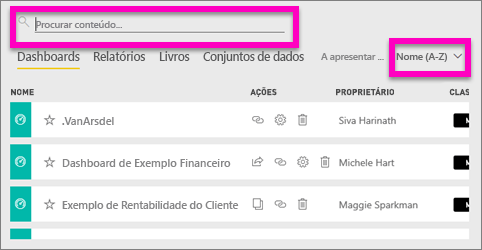
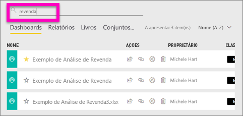
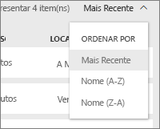
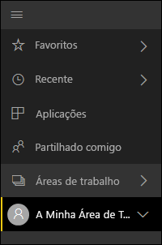
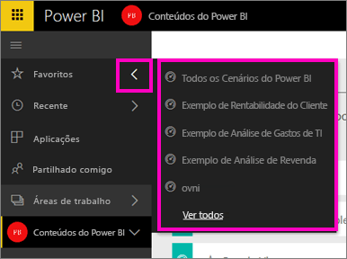

# Navegação: pesquisar, localizar e ordenar conteúdo no serviço Power BI
Existem várias formas de navegar no conteúdo no serviço Power BI. O conteúdo está organizado por tipos nas áreas de trabalhos: dashboards, relatórios, livros e conjuntos de dados.  O conteúdo também está organizado por utilização: favoritos, recentes, aplicações, partilhados comigo e em destaque. Estes diferentes caminhos no conteúdo permitem-lhe localizar rapidamente o que precisa no serviço Power BI.  

>[!NOTE] 
>Este artigo aplica-se ao serviço Power BI (app.powerbi.com) e não ao Power BI Desktop.

## Navegação nas áreas de trabalho

O serviço Power BI separa o conteúdo da área de trabalho por tipo: dashboards, relatórios, livros e conjuntos de dados. Verá esta organização quando seleciona uma área de trabalho. Neste exemplo, a área de trabalho da aplicação tem o nome “Exemplo de aplicação de vendas e marketing” e contém dois dashboards, seis relatórios, um livro e cinco conjuntos de dados.

________________________________________

## Pesquisar e ordenar em áreas de trabalho
Uma área de trabalho tem quatro separadores de conteúdo: Dashboards, Relatórios, Livros e Conjuntos de Dados.  Cada um destes separadores contém um campo de pesquisa e um botão de ordenação.  Quando estiver a começar a utilizar o serviço Power BI, poderá não considerá-los úteis porque terá apenas um ou dois itens por separador.  No entanto, ao longo do tempo poderá ficar com longas listas de conteúdo.  Utilize a pesquisa e ordenação para localizar facilmente o que precisa.

* Introduza um termo de pesquisa para encontrar uma correspondência no ecrã atual
  
   
* Selecione o botão de ordenação para apresentar as opções para a página atual. As opções são ordenar por nome ou por proprietário.
  
   

## Navegação com a barra de navegação esquerda
O painel de navegação esquerdo classifica o conteúdo de forma a que seja ainda mais fácil encontrar o que precisa, rapidamente.  

O conteúdo que cria para utilização própria está disponível em **A Minha Área de Trabalho**, o conteúdo que cria e partilha com um grupo está disponível numa área de trabalho **Aplicações**, o conteúdo partilhado consigo está disponível em **Partilhado comigo** e o último conteúdo visualizado também está disponível em **Recentes**.

Além disso, pode sinalizar conteúdo como [favorito](service-dashboard-favorite.md) e [em destaque](service-dashboard-featured.md). Escolha o dashboard que espera ver com mais frequência e defina-o como o dashboard *em destaque*. Sempre que abrir o serviço Power BI, este é o dashboard que será apresentado primeiro. Tem vários dashboards e aplicações que visita mais frequentemente? Se os definir como favoritos, estarão sempre disponíveis na barra de navegação esquerda.

.

## Considerações e resolução de problemas
* Para conjuntos de dados, a opção **Ordenar por** não está disponível por proprietário.

## Próximos passos
[Power BI - Conceitos Básicos](service-basic-concepts.md)

Mais perguntas? [Pergunte à Comunidade do Power BI](http://community.powerbi.com/)