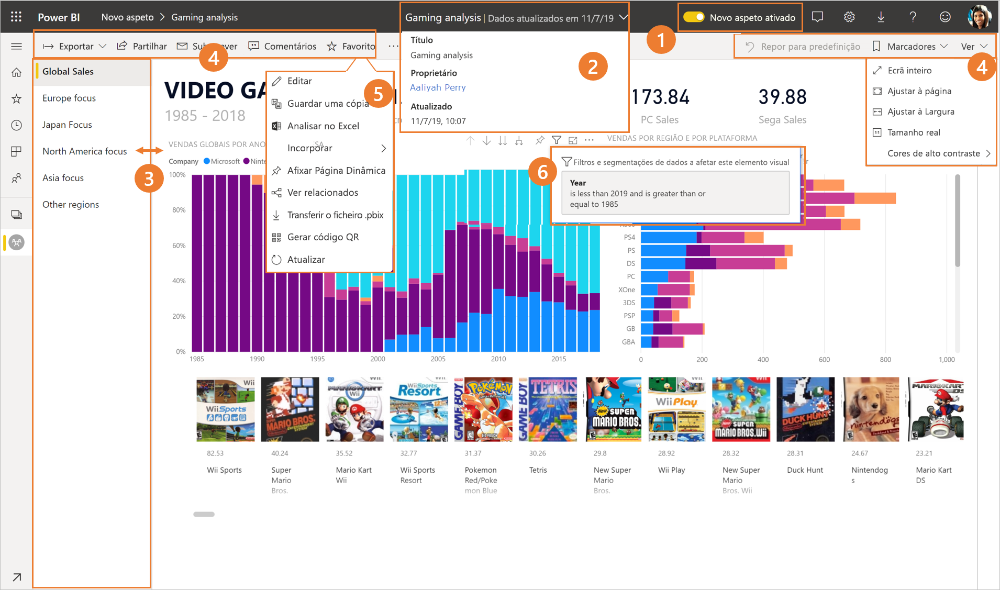
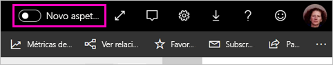
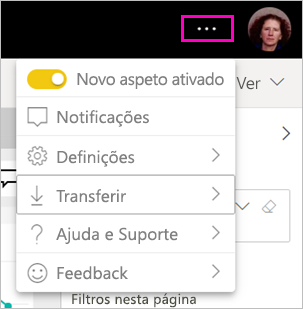
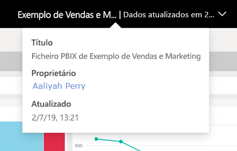
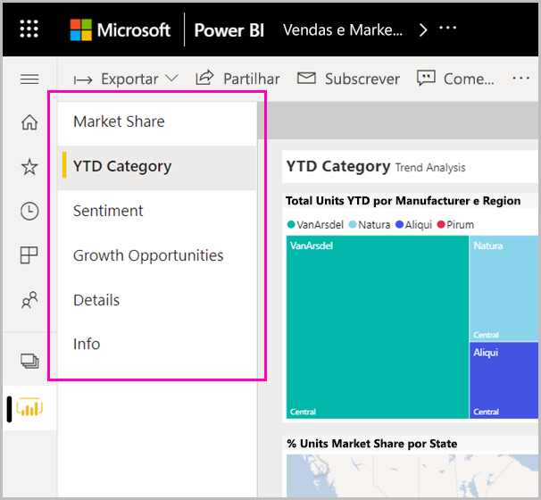
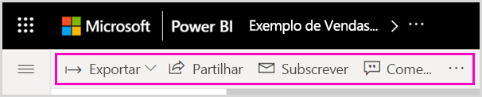
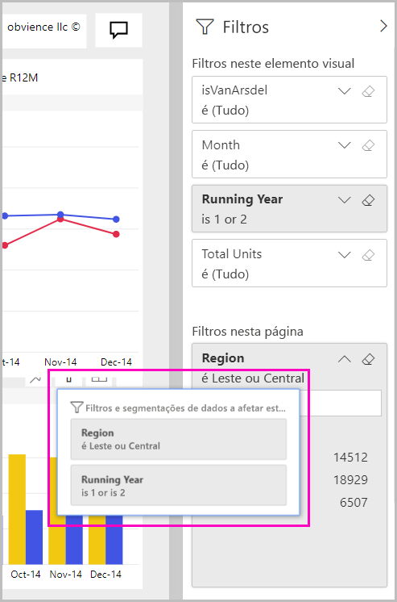

# O "novo aspeto" do serviço Power BI

O serviço Power BI (app.powerbi.com) tem um novo aspeto que facilita a visualização dos seus relatórios e a interação com os mesmos. O novo aspeto é mais simples e baseia-se na sua familiaridade com outros produtos da Microsoft. Fizemos dos conteúdos dos relatórios o principal foco do serviço Power BI, ao atualizarmos os ícones e mudarmos para um tema de cores mais claro. 

Procura informações sobre o novo aspeto do **Power BI Desktop**? Veja [Utilizar o friso atualizado no Power BI Desktop](desktop-ribbon.md).

Eis uma descrição geral das alterações do novo aspeto. Veja as secções numeradas para obter mais detalhes:

Procura uma ação específica? Veja [The "new look": onde se encontram as ações?](service-new-look-where-actions.md).

## Breve apresentação das alterações

Esta animação demonstra as alterações ao aspeto de um relatório.

## 1. Ativar o novo aspeto

Qualquer utilizador do serviço Power BI pode utilizar o novo aspeto. Basta clicar em **Novo aspeto desligado** para a opção mudar para **Novo aspeto ligado**.

Se precisar de regressar ao aspeto antigo, **desative** o novo aspeto ao clicar em . Se esta opção não for apresentada, selecione o menu de reticências no canto superior direito.

## 2. Ver detalhes do relatório 

Veja rapidamente detalhes, como a data da última atualização e as informações de contacto, diretamente na faixa superior.  Abra o menu para ver detalhes adicionais sobre o relatório. Até pode enviar um e-mail ao proprietário do relatório.

## 3. Lista vertical de páginas 
Os nomes das páginas do relatório estão agora incluídos numa lista num painel vertical. Encontram-se destacados para que possa reparar neles facilmente e a navegação é semelhante à do Word ou PowerPoint. Pode redimensionar o painel vertical para aumentar ou diminuir a restante área do relatório.

## 4. Barra de ação simplificada 

A barra de ação simplificada na parte superior da página apresenta os comandos mais relevantes para os consumidores de relatórios numa posição destacada. Agora é mais fácil exportar, subscrever, colaborar e explorar através de filtros e marcadores.

## 5. Onde estão os comandos do relatório?

Não removemos nenhuma das funcionalidades do antigo aspeto. Poderá encontrar os comandos adicionais, como Editar, Guardar uma cópia, entre outros, ao expandir o menu de reticências (...) na barra de ação. Além disso, pode aceder às métricas de utilização na lista de conteúdos.

### Onde estão as ações do menu Ficheiro?

Está à procura das ações do menu **Ficheiro**? As ações que estavam no menu **Ficheiro** também estão agora no menu **Mais opções** (...). 

## 6. Nova experiência de filtro

As atualizações recentes, como a capacidade de ver os filtros aplicados e o novo painel de filtros, estão disponíveis por predefinição com o novo aspeto. Mesmo que o Report Designer não tenha sido atualizado para a nova experiência de filtros, poderá ver o novo painel de filtros.

## A experiência do "novo aspeto" do dashboard 

Os dashboards também têm uma barra de ação simplificada, como os relatórios e as aplicações, de modo a garantir uma experiência consistente que mantenha as diferenças funcionais. Veja onde se encontram agora as ações num dashboard.
 

## Não fizemos alterações ao modo de edição 

Mantivemos a experiência de criação semelhante à experiência do Desktop. As alterações do novo aspeto aplicam-se apenas à vista de leitura.

## Próximos passos

- [Utilizar o friso atualizado no Power BI Desktop](desktop-ribbon.md)
- [Aceitar o “novo aspeto” da área de trabalho](collaborate-share/service-workspaces-new-look.md)
- [Power BI para consumidores](consumer/end-user-consumer.md)
