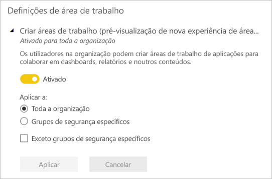
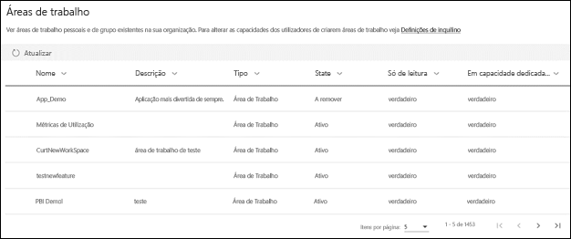

# Organizar o trabalho nas novas áreas de trabalho no Power BI

 As *áreas de trabalho* são locais onde pode colaborar com colegas para criar coleções de dashboards, relatórios e relatórios paginados. A nova experiência de área de trabalho ajuda a gerir melhor o acesso ao conteúdo. Este artigo descreve as novas áreas de trabalho e como diferem das áreas de trabalho clássicas.  Tal como acontece com as áreas de trabalho clássicas, ainda as utilizar para criar e distribuir aplicações. Leia mais sobre como [criar uma nova experiência de área de trabalho](service-create-the-new-workspaces.md).

A nova experiência de área de trabalho atingiu a disponibilidade geral (GA) e é agora a área de trabalho predefinida. Pode continuar a criar e utilizar [áreas de trabalho clássicas](service-create-workspaces.md) com base em Grupos do Office 365. 

> [!NOTE]
> Para impor segurança ao nível da linha (RLS) aos utilizadores que procuram conteúdos numa área de trabalho, utilize a função Visualizador. Para impor a RLS sem dar acesso à área de trabalho, publique uma aplicação do Power BI para estes utilizadores ou utilize a partilha para distribuir conteúdos.

Com as novas áreas de trabalho, pode:

- Atribuir funções de área de trabalho a grupos de utilizadores: grupos de segurança, listas de distribuição, grupos do Office 365 e utilizadores individuais.
- Criar uma área de trabalho no Power BI sem criar um grupo do Office 365.
- Utilizar funções de áreas de trabalho mais avançadas para uma gestão de permissões mais flexível numa área de trabalho.
- O administrador do Power BI pode controlar quem tem autorização para criar áreas de trabalho no Power BI.

Ao criar uma das novas áreas de trabalho, não está a criar um grupo do Office 365 subjacente associado. Todas as tarefas de administração da área de trabalho são efetuadas no Power BI, não no Office 365. Na nova experiência de área de trabalho, pode adicionar um grupo do Office 365 na lista de acesso da área de trabalho para continuar a gerir o acesso dos utilizadores aos conteúdos através de grupos do Office 365.

## Administrar áreas de trabalho da nova experiência
Como a administração das áreas de trabalho da nova experiência é agora feita no Power BI, os administradores do Power BI decidem quem na organização as pode criar. Também podem gerir e recuperar áreas de trabalho, recorrendo apenas ao portal de administração do Power BI ou a CmdLets do PowerShell. No caso das áreas de trabalho clássicas com base em Grupos do Office 365, a administração continua a ocorrer no portal de administração do Office 365 e no Azure Active Directory.

Em **Definições da área de trabalho** no portal de administração, os administradores podem utilizar a definição Criar áreas de trabalho (nova experiência de área de trabalho) para permitir a criação de áreas de trabalho da nova experiência por todas as pessoas ou por ninguém numa organização. Também podem limitar a criação a membros de grupos de segurança específicos.

> [!NOTE]
> Por predefinição, a definição Criar áreas de trabalho (nova experiência de área de trabalho) permite apenas que os utilizadores que podem criar Grupos do Office 365 possam criar novas áreas de trabalho no Power BI. Certifique-se de que define um valor no portal de administração do Power BI para garantir que os utilizadores apropriados podem criar áreas de trabalho da nova experiência.

A [lista de áreas de trabalho está disponível](service-admin-portal.md#workspaces) no portal de administração do Power BI. 

## Novas áreas de trabalho lado a lado com áreas de trabalho clássicas

As áreas de trabalho novas e atualizadas coexistem lado a lado com as áreas de trabalho clássicas existentes e pode criar qualquer um dos dois tipos. A nova experiência de área de trabalho é o tipo de área de trabalho predefinido. O Power BI continua a apresentar uma lista de todos os Grupos do Office 365 a que um utilizador pertence no Power BI para evitar a alteração de fluxos de trabalho existentes. Para saber como criar uma nova área de trabalho, leia [Create new workspaces](service-create-the-new-workspaces.md) (Criar novas áreas de trabalho). Para saber como criar uma área de trabalho clássica, leia [Create the classic workspaces](service-create-workspaces.md) (Criar áreas de trabalho clássicas).

## Funções nas novas áreas de trabalho

Para conceder acesso a uma nova área de trabalho, adicione grupos de utilizadores ou indivíduos a uma das funções da área de trabalho: visualizadores, membros, contribuidores ou administradores. Todas as pessoas num grupo de utilizadores obtêm a função que definiu. Se um utilizador estiver em vários grupos de utilizadores, recebe o nível de permissão mais elevado concedido pelas funções que lhe estão atribuídas.

As funções permitem-lhe gerir as ações de cada utilizador numa área de trabalho, para que as equipas possam colaborar. As novas áreas de trabalho permitem-lhe atribuir funções a utilizadores individuais e a grupos de utilizadores: grupos de segurança, grupos do Office 365 e listas de distribuição. 

Quando atribui funções a um grupo de utilizadores, os utilizadores nesse grupo têm acesso aos conteúdos. Se aninhar grupos de utilizadores, todos os utilizadores incluídos nos mesmos têm permissão.

Eis as capacidades das quatro funções: administradores, membros, contribuidores e visualizadores. Todas estas funcionalidades, exceto visualizar e interagir, exigem uma licença do Power BI Pro.

|Capacidade   | Administrador  | Membro  | Contribuidor  | Visualizador |
|---|---|---|---|---|
| Atualizar e eliminar a área de trabalho.  | X  |   |   |   | 
| Adicionar/remover pessoas, incluindo outros administradores.  | X  |   |   |   |
| Adicionar membros ou outras pessoas com permissões mais baixas.  |  X | X  |   |   |
| Publicar e atualizar uma aplicação. |  X | X  |   |   |
| Partilhar um item ou uma aplicação. |  X | X  |   |   |
| Permitir que outras pessoas voltem a partilhar itens. |  X | X  |   |   |
| Criar, editar e eliminar conteúdos na área de trabalho.  |  X | X  | X  |   |
| Publicar relatórios na área de trabalho, eliminar conteúdos.  |  X | X  | X  |   |
| Criar um relatório noutra área de trabalho com base num conjunto de dados desta área de trabalho.1 |  X | X  | X  |   |
| Copiar um relatório.1 | X | X | X |  |
| Ver e interagir com um item.2 |  X | X  | X  | X  |

1. Para copiar um relatório, bem como para criar um relatório noutra área de trabalho com base num conjunto de dados nessa área de trabalho, tem de cumprir critérios adicionais:
    - Precisa de uma licença do Power BI Pro. Veja a próxima secção, [Licenciamento](#licensing), para obter mais informações.
    - Precisa de permissão de Compilação para o conjunto de dados. Para conjuntos de dados nesta área de trabalho, as pessoas com as funções Administrador, Membro e Contribuidor têm permissão de Compilação através da função da área de trabalho.
2. Mesmo que não tenha uma licença do Power BI Pro, pode ver e interagir com itens no serviço Power BI se estes estiverem na área de trabalho de uma capacidade Premium.

## Licensing
Todas as pessoas que adiciona a uma área de trabalho na capacidade partilhada precisam de ter uma licença do Power BI Pro. Na área de trabalho, estes utilizadores podem colaborar nos dashboards e relatórios que planear publicar para um vasto público ou mesmo para toda a organização. 

Se quiser distribuir conteúdos para outras pessoas na sua organização, pode atribuir licenças do Power BI Pro a esses utilizadores ou colocar a área de trabalho numa capacidade do Power BI Premium.

Quando a área de trabalho está numa capacidade do Power BI Premium, os utilizadores com a função Visualizador podem aceder à área de trabalho, mesmo que não tenham uma licença do Power BI Pro. No entanto, se atribuir a esses utilizadores uma função superior, como Administrador, Membro ou Contribuidor, ser-lhes-á pedido que iniciem uma Versão de Avaliação do Pro quando tentarem aceder à área de trabalho. Para tirar partido da capacidade de Visualizador para utilizadores sem licenças do Pro, confirme que não estão atribuídas outras funções da área de trabalho aos utilizadores com a função Visualizador, individualmente ou através de um grupo de utilizadores. 

> [!NOTE]
> As regras de licenciamento existentes são impostas com maior rigor à publicação de relatórios na nova experiência de área de trabalho. Os utilizadores que tentarem publicar a partir do Power BI Desktop ou de outras ferramentas cliente sem uma licença do Pro verão o erro "Apenas utilizadores com licenças do Power BI Pro podem publicar nesta área de trabalho".

## As diferenças das novas áreas de trabalho

Reestruturámos algumas funcionalidades nas novas áreas de trabalho. Eis as alterações que podem ser permanentes. 

* A criação destas áreas de trabalho não irá criar grupos do Office 365, ao contrário do que acontece nas áreas de trabalho clássicas. No entanto, agora pode utilizar um grupo do Office 365 para conceder aos utilizadores acesso à área de trabalho ao atribuir-lhes uma função. 
* Nas áreas de trabalho clássicas, só pode adicionar utilizadores individuais à lista de membros e administradores. Nas novas áreas de trabalho, pode adicionar múltiplos grupos de segurança do AD, listas de distribuição ou grupos do Office 365 a estas listas para uma gestão de utilizadores mais fácil. 
- Pode criar um pacote de conteúdos organizacionais a partir de uma área de trabalho clássica. Não pode criar um pacote a partir das novas áreas de trabalho.
- Pode utilizar um pacote de conteúdos organizacionais a partir de uma área de trabalho clássica. Não pode utilizar um pacote a partir das novas áreas de trabalho.

## Lista de contactos da área de trabalho
A nova funcionalidade **Lista de contactos** permite-lhe especificar os utilizadores que recebem notificações sobre problemas que afetam a área de trabalho. Por predefinição, qualquer utilizador ou grupo especificado como administrador da área de trabalho é notificado, mas pode personalizar a lista. Os utilizadores ou grupos incluídos na lista de contactos serão apresentados na interface de utilizador (IU) para ajudar os utilizadores a obterem ajuda relacionada com a área de trabalho. 

Leia mais sobre a [definição da lista de contactos da área de trabalho](service-create-the-new-workspaces.md#workspace-contact-list).

## OneDrive da área de trabalho
A funcionalidade OneDrive da área de trabalho permite-lhe configurar um Grupo do Office 365 cujo armazenamento de ficheiros da Biblioteca de Documentos do SharePoint está disponível para os utilizadores da área de trabalho. É preciso criar o grupo fora do Power BI. 

O Power BI não sincroniza as permissões de utilizadores ou grupos que estão configurados para terem acesso à área de trabalho com a associação ao Grupo do Office 365. A melhor prática consiste em gerir o acesso à área de trabalho através do mesmo Grupo do Office 365 cujo armazenamento de ficheiros configurar nesta definição. 

Leia mais sobre como [definir e aceder ao OneDrive da área de trabalho](service-create-the-new-workspaces.md#workspace-onedrive).  
   
## Auditoria
O Power BI faz a auditoria das seguintes atividades para as áreas de trabalho da nova experiência.

| Nome amigável |   Nome da operação |
|---|---|
| Pasta do Power BI criada | CreateFolder |
| Pasta do Power BI eliminada | DeleteFolder |
| Pasta do Power BI atualizada | UpdateFolder |
| Acesso à pasta do Power BI atualizado| UpdateFolderAccess |

Leia mais sobre a [auditoria do Power BI](service-admin-auditing.md#activities-audited-by-power-bi).

## Limitações e considerações

Limitações a ter em consideração:

- As áreas de trabalho podem conter um máximo de 1000 conjuntos de dados ou 1000 relatórios por conjunto de dados. 
- Uma pessoa com uma licença do Power BI Pro pode ser membro de um máximo de 1000 áreas de trabalho.
- O Power BI Publisher para Excel não é suportado.

## Funcionalidades da área de trabalho que funcionam de forma diferente

Algumas funcionalidades funcionam de forma diferente das áreas de trabalho atuais nas novas áreas de trabalho. Estas diferenças são intencionais, baseiam-se no feedback que recebemos dos clientes e permitem uma abordagem mais flexível à colaboração com áreas de trabalho:

- Imposição de licenciamento: a publicação de relatórios na nova experiência de área de trabalho impõe as regras de licenciamento existentes que exigem uma licença do Power BI Pro para os utilizadores que colaborem em áreas de trabalho ou partilhem conteúdos para outras pessoas no serviço Power BI. Os utilizadores sem uma licença do Pro veem o erro "Apenas os utilizadores com licenças do Power BI Pro podem publicar nesta área de trabalho".
- Os membros podem ou não podem voltar a partilhar: esta opção foi substituída pela função Contribuidor
- Áreas de trabalho só de leitura: em vez de conceder aos utilizadores acesso só de leitura a uma área de trabalho, atribua os utilizadores à função Visualizador, que permite um acesso só de leitura semelhante ao conteúdo numa área de trabalho.
- Quando a área de trabalho está numa capacidade do Power BI Premium, os utilizadores sem uma licença do Pro podem aceder à mesma, mesmo que tenham apenas a função Visualizador.
- Para permitir aos utilizadores com a função Visualizador exportar dados, confirme que têm permissão de Compilação nos conjuntos de dados da área de trabalho. Saiba mais sobre as [Permissões de compilação para conjuntos de dados](service-datasets-build-permissions.md).
- O botão **Sair da área de trabalho** não existe.

## Perguntas frequentes

**As ligações para conteúdo existente são afetadas pela disponibilidade geral da nova experiência de área de trabalho?**

Não. As ligações para itens existentes nas áreas de trabalho clássicas não são afetadas pela nova experiência de área de trabalho. A disponibilidade geral (GA) da nova experiência de área de trabalho altera a área de trabalho predefinida que cria, mas não altera as áreas de trabalho existentes. 

**As áreas de trabalho existentes são atualizadas para a nova experiência de área de trabalho com a disponibilidade geral?**

Não. A disponibilidade geral da nova experiência de área de trabalho apenas altera o tipo de área de trabalho predefinido para a nova experiência de área de trabalho. As áreas de trabalho clássicas existentes que se baseiam em Grupos do Office 365 permanecem inalteradas.

**Continuam a ser criadas automaticamente áreas de trabalho para os Grupos do Office 365?**

Yes. Uma vez que suportamos ambos os tipos de áreas de trabalho lado a lado, continuamos a apresentar todos os Grupos do Office 365 a que o utilizador tem acesso na lista de áreas de trabalho.

## Próximos passos
* [Create the new workspaces in Power BI](service-create-the-new-workspaces.md) (Criar as novas áreas de trabalho no Power BI)
* [Create the classic workspaces](service-create-workspaces.md) (Criar as áreas de trabalho clássicas)
* [Instalar e utilizar aplicações no Power BI](service-create-distribute-apps.md)
* Perguntas? [Experimente perguntar à Comunidade do Power BI](https://community.powerbi.com/)
