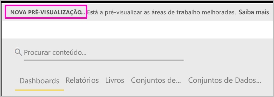

# Organizar o trabalho nas novas áreas de trabalho (pré-visualização) – Power BI

As áreas de trabalho são locais onde pode colaborar com colegas para criar coleções de dashboards e relatórios. Depois poderá agrupá-las em *aplicações* e distribuí-las por toda a organização ou por um conjunto de pessoas ou grupo específico. O Power BI está a apresentar uma nova experiência de área de trabalho em modo de pré-visualização. 

Com a pré-visualização das novas áreas de trabalho, pode:

- Atribuir funções de área de trabalho a grupos de utilizadores: grupos de segurança, listas de distribuição, grupos do Office 365 e utilizadores individuais.
- Criar uma área de trabalho no Power BI sem criar um grupo do Office 365.
- Utilizar funções de áreas de trabalho mais avançadas para uma gestão de permissões mais flexível numa área de trabalho.

Leia mais sobre como [criar uma das novas áreas de trabalho](service-create-the-new-workspaces.md).
 
Ao criar uma das novas áreas de trabalho, não está a criar um grupo do Office 365 subjacente associado. Todas as tarefas de administração da área de trabalho são efetuadas no Power BI, não no Office 365. Ainda pode adicionar um grupo do Office 365 à área de trabalho para continuar a gerir o acesso dos utilizadores aos conteúdos através de grupos do Office 365. No entanto, também pode utilizar grupos de segurança, listas de distribuição e adicionar utilizadores individuais diretamente no Power BI, o que lhe permite gerir de forma flexível o acesso à área de trabalho. Como a administração da área de trabalho é agora feita no Power BI, os administradores do Power BI decidem quem na organização pode criar áreas de trabalho. Nas **Definições de área de trabalho** no portal de administração, os administradores podem permitir que todas as pessoas ou nenhuma pessoa numa organização crie áreas de trabalho. Também podem limitar a criação a membros de grupos de segurança específicos.

Saiba mais sobre o [portal de administração do Power BI](service-admin-portal.md).

## Implementar novas áreas de trabalho

Durante o período de pré-visualização, as antigas e novas áreas de trabalho podem coexistir lado a lado e pode criar qualquer uma delas. Quando a pré-visualização das novas áreas de trabalho terminar e estas estiverem disponíveis para o público, as áreas de trabalho antigas podem continuar a existir durante algum tempo. Não poderá criá-las e terá de se preparar para migrar as suas áreas de trabalho para a nova infraestrutura de áreas de trabalho. Não se preocupe, terá vários meses para concluir a migração.

## Funções nas novas áreas de trabalho

Pode adicionar grupos de utilizadores ou utilizadores individuais às novas áreas de trabalho como membros, contribuidores ou administradores. Todas as pessoas num grupo de utilizadores obtêm a função que definiu. Se um utilizador estiver em vários grupos de utilizadores, este recebe o nível de permissão mais elevado concedido pela função.

Todas as pessoas que adicionar à área de trabalho precisam de ter uma licença do Power BI Pro. Na área de trabalho, estes utilizadores podem colaborar nos dashboards e relatórios que planear publicar para um vasto público ou mesmo para toda a organização. Se quiser distribuir conteúdos para outras pessoas na sua organização, pode atribuir licenças do Power BI Pro a esses utilizadores ou colocar a área de trabalho numa capacidade do Power BI Premium.

As funções permitem-lhe gerir as ações de cada utilizador numa área de trabalho, para que as equipas possam colaborar. As novas áreas de trabalho permitem-lhe atribuir funções a utilizadores individuais e a grupos de utilizadores: grupos de segurança, grupos do Office 365 e listas de distribuição. 

Quando atribui funções a um grupo de utilizadores, os utilizadores nesse grupo têm acesso aos conteúdos. Se aninhar grupos de utilizadores, todos os utilizadores incluídos nos mesmos têm permissão. Um utilizador que esteja em vários grupos de utilizadores com diferentes funções obtém o nível mais elevado de permissão concedida. 

As novas áreas de trabalho dispõem de três funções: administradores, membros e contribuidores.

**Os administradores podem:**

- Atualizar e eliminar a área de trabalho. 
- Adicionar/remover pessoas, incluindo outros administradores.
- Fazer tudo o que os membros podem fazer.

**Os membros podem:** 

- Adicionar membros ou outras pessoas com permissões mais baixas.
- Publicar e atualizar uma aplicação.
- Partilhar um item ou uma aplicação.
- Permitir que outras pessoas voltem a partilhar itens.
- Fazer tudo o que os contribuidores podem fazer.

**Os contribuidores podem:** 

- Criar, editar e eliminar conteúdos na área de trabalho. 
- Publicar relatórios na área de trabalho, eliminar conteúdos.
- Não podem conceder a novas pessoas acesso aos conteúdos. Não podem partilhar novos conteúdos, mas podem partilhar com alguém com quem já é partilhada a área de trabalho, o item ou a aplicação. 
- Não podem modificar os membros do grupo.
 
Estamos a criar fluxos de trabalho Pedir Acesso no serviço para que os utilizadores que não têm acesso possam pedi-lo. Os fluxos de trabalho Pedir Acesso estão atualmente disponíveis para dashboards, relatórios e aplicações.

## Converter as áreas de trabalho antigas em novas áreas de trabalho

Durante o período de pré-visualização, não pode converter automaticamente as suas áreas de trabalho antigas em novas. No entanto, pode criar uma nova área de trabalho e publicar os seus conteúdos numa nova localização. 

Quando as novas áreas de trabalho ficarem disponíveis para o público (GA), pode optar ativamente por migrar as áreas de trabalho antigas automaticamente. No futuro, após a experiência ficar disponível para o público, terá de migrar as mesmas.

## Como é que as novas áreas de trabalho diferem das áreas de trabalho atuais?

Com as novas áreas de trabalho, estamos a reestruturar algumas funcionalidades. Eis as alterações que podem ser permanentes na pré-visualização. 

* A criação de áreas de trabalho não irá criar entidades correspondentes no Office 365, tal como acontece nas áreas de trabalho atuais. (Ainda pode adicionar um grupo do Office 365 à sua área de trabalho ao atribuir uma função ao mesmo.) 
* Nas áreas de trabalho atuais, só pode adicionar utilizadores individuais à lista de membros e administradores. Nas novas áreas de trabalho, pode adicionar múltiplos grupos de segurança do AD, listas de distribuição ou grupos do Office 365 a estas listas para uma gestão de utilizadores mais fácil. 
- Pode criar um pacote de conteúdos organizacionais a partir de uma área de trabalho atual. Não pode criar um pacote a partir das novas áreas de trabalho.
- Pode utilizar um pacote de conteúdos organizacionais a partir de uma área de trabalho atual. Não pode utilizar um pacote a partir das novas áreas de trabalho.
- Durante o período de pré-visualização, algumas funcionalidades ainda não estão ativadas para as novas áreas de trabalho. Veja a próxima secção, [Funcionalidades previstas na nova área de trabalho](service-new-workspaces.md#planned-new-workspace-preview-features), para obter detalhes.

## Limitações e considerações

Limitações a ter em consideração:

- As áreas de trabalho podem conter um máximo de 1000 conjuntos de dados ou 1000 relatórios por conjunto de dados. 
- Uma pessoa com uma licença do Power BI Pro pode ser um membro de um máximo de 250 áreas de trabalho.

## Funcionalidades de pré-visualização previstas na nova área de trabalho

No momento do lançamento da pré-visualização, algumas outras funcionalidades da pré-visualização da nova área de trabalho de aplicação ainda se encontram em desenvolvimento, mas ainda não estão disponíveis:

- O botão **Sair da área de trabalho** não existe.
- As métricas de utilização ainda não são suportadas.
- Como funciona o Premium: pode atribuir e criar áreas de trabalho numa capacidade Premium, mas para mover uma área de trabalho entre capacidades, tem de aceder às definições da mesma.
- A incorporação da peça Web do SharePoint ainda não é suportada.
- O botão **OneDrive** para grupos do Office 365 em Obter Dados/Ficheiros não existe.

## Funcionalidades da área de trabalho que funcionam de forma diferente

Algumas funcionalidades funcionam de forma diferente das áreas de trabalho atuais nas novas áreas de trabalho. Estas diferenças são intencionais, baseadas no feedback que recebemos dos clientes e irão permitir uma abordagem mais flexível à colaboração com as áreas de trabalho:

- Os membros podem ou não podem voltar a partilhar: esta opção foi substituída pela função Contribuidor
- Áreas de trabalho só de leitura: em vez de conceder aos utilizadores acesso só de leitura a uma área de trabalho, terá de atribuir os utilizadores a uma futura função de Visualizador, que permite um semelhante acesso só de leitura ao conteúdo numa área de trabalho.

## Problemas conhecidos

Como esta é uma funcionalidade de pré-visualização, existem algumas limitações que deve conhecer. Os seguintes problemas são conhecidos e as correções estão em desenvolvimento:

- Os utilizadores ou grupos de utilizadores gratuitos que são adicionados como destinatários de subscrições a e-mails podem não receber os e-mails que deviam receber. O problema ocorre quando uma das novas áreas de trabalho se encontra numa capacidade Premium, mas A Minha Área de Trabalho do utilizador que está a criar a subscrição não se encontra numa capacidade Premium. Se A Minha Área de Trabalho se encontrar numa capacidade Premium, os utilizadores e grupos de utilizadores gratuitos receberão os e-mails.
- Depois de uma área de trabalho ser movida de uma capacidade Premium para uma capacidade partilhada, os utilizadores e grupos de utilizadores gratuitos continuarão, em alguns casos, a receber e-mails que não deveriam receber. O problema ocorre quando A Minha Área de Trabalho do utilizador que está a criar a subscrição se encontra numa capacidade Premium.

## Próximos passos
* [Criar as novas áreas de trabalho (pré-visualização) no Power BI](service-create-the-new-workspaces.md)
* [Criar as áreas de trabalho atuais](service-create-workspaces.md)
* [Instalar e utilizar aplicações no Power BI](service-create-distribute-apps.md)
* Perguntas? [Experimente perguntar à Comunidade do Power BI](http://community.powerbi.com/)
