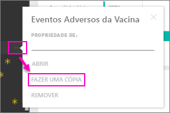

# Pacotes de conteúdos organizacionais: copiar, atualizar e obter acesso
> [!NOTE]
> Já conhece as novas *aplicações*? As aplicações são a nova forma de distribuir conteúdos a grandes públicos no Power BI. Crie aplicações em *áreas de trabalho de aplicações*, que substituem os grupos e as áreas de trabalho de grupo. Recomendamos a utilização de aplicações em vez de pacotes de conteúdos organizacionais ou áreas de trabalho só de leitura. Saiba [mais sobre aplicações](service-install-use-apps.md).
> 
> 

Quando um pacote de conteúdos organizacionais é publicado, todos os destinatários veem o mesmo dashboard, os mesmos relatórios, os mesmos livros do Excel, conjuntos de dados e dados (a menos que seja uma origem de dados SQL Server Analysis Services [SSAS]).  [Apenas o criador do pacote de conteúdos pode editar e publicar novamente](service-organizational-content-pack-manage-update-delete.md) o pacote de conteúdos.  No entanto, todos os destinatários podem guardar uma cópia do pacote de conteúdos, que pode permanecer junto do original.

Criar pacotes de conteúdos é diferente de partilhar dashboards ou colaborar nos mesmos num grupo. Leia [Como devo colaborar e partilhar os meus dashboards e relatórios?](service-how-to-collaborate-distribute-dashboards-reports.md) para decidir qual a opção mais adequada à sua situação.

## Criar uma cópia de um pacote de conteúdos organizacionais
Crie a sua cópia do pacote de conteúdos, que não é visível para outras pessoas.

1. Selecione as reticências (…) junto ao dashboard do pacote de conteúdos > Fazer uma cópia.
   
    
2. Selecione **Guardar**.  

Tem agora uma cópia que pode alterar. Ninguém estará autorizado a visualizar as alterações que fizer.

## Ajuda!  Já não consigo aceder ao pacote de conteúdos
Isto pode ocorrer por diversos motivos:

* **Alterações de associação:** os pacotes de conteúdos são publicados em grupos de distribuição de e-mail, grupos de segurança e nos [grupos do Power BI baseados no Office 365](https://support.office.com/article/Create-a-group-in-Office-365-7124dc4c-1de9-40d4-b096-e8add19209e9).  Se for removido do grupo, deixará de ter acesso ao pacote de conteúdos.
* **Alterações de distribuição:** o criador do pacote de conteúdos altera a distribuição. Por exemplo, se o pacote de conteúdos foi publicado originalmente para toda a organização, mas o criador o publicou novamente para um público menor, poderá já não estar incluído.
* **Alterações às configurações de segurança:** se o dashboard e os relatórios ligarem a origens de dados SSAS locais e forem feitas alterações às configurações de segurança, as suas permissões para esse servidor poderão ser revogadas.

## Como são atualizados os pacotes de conteúdos organizacionais?
Quando o pacote de conteúdos é criado, as configurações de atualização são herdadas com o conjunto de dados.  Quando cria uma cópia do pacote de conteúdos, a nova versão mantém a ligação ao conjunto de dados original e ao agendamento de atualização. 

Veja [Gerir, atualizar e eliminar pacotes de conteúdos organizacionais](service-organizational-content-pack-manage-update-delete.md).

## Passos seguintes
* [Introdução aos pacotes de conteúdos organizacionais](service-organizational-content-pack-introduction.md)
* [Criar um grupo no Power BI](service-create-distribute-apps.md)
* Mais perguntas? [Pergunte à Comunidade do Power BI](http://community.powerbi.com/)

