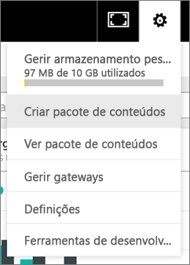
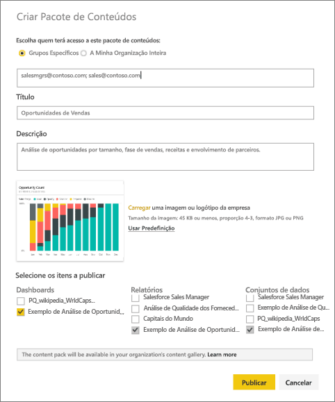
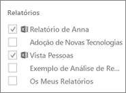
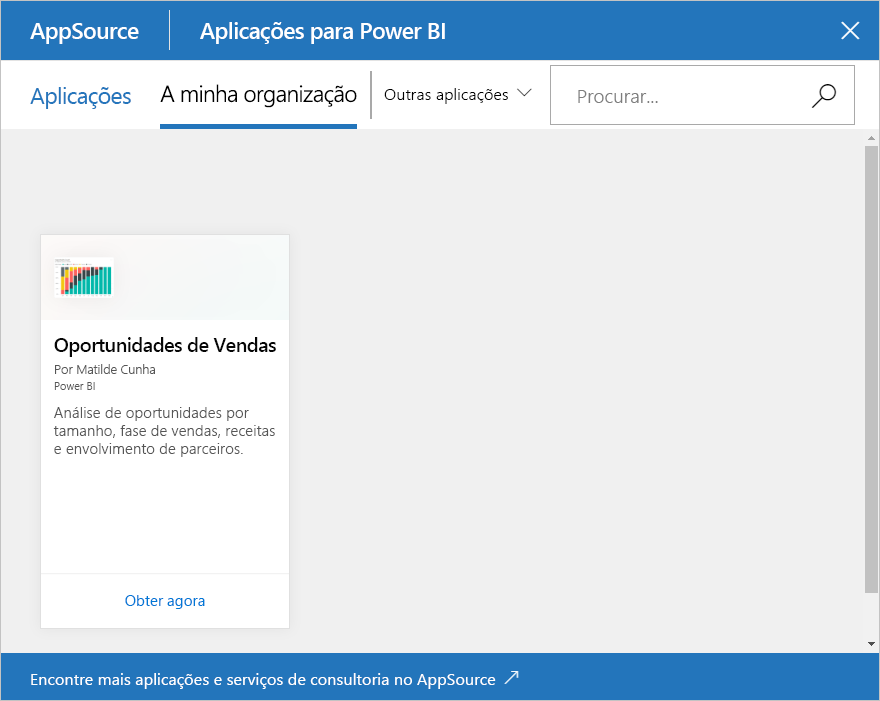

# Criar e publicar um pacote de conteúdos organizacionais do Power BI (tutorial)

Neste tutorial, vai criar um pacote de conteúdos organizacionais, conceder acesso a um grupo específico e publicá-lo na biblioteca de pacotes de conteúdos da sua organização no Power BI.

Criar pacotes de conteúdos é diferente de partilhar dashboards ou colaborar nos mesmos num grupo. Consulte [Como devo colaborar e partilhar os meus dashboards e relatórios?](service-how-to-collaborate-distribute-dashboards-reports.md) para decidir a opção mais adequada à sua situação.

Criar um pacote de conteúdos organizacionais requer uma [conta do Power BI Pro](https://powerbi.microsoft.com/pricing) para si e para os seus colegas. 

> [!NOTE]
> Não pode criar nem instalar pacotes de conteúdos organizacionais na nova pré-visualização das experiências de áreas de trabalho. Agora é uma boa altura para atualizar os seus pacotes de conteúdos para aplicações, se ainda não tiver começado. Saiba [mais sobre a nova experiência de área de trabalho](service-create-the-new-workspaces.md).
> 

Imagine que é o Gestor de Versão da Contoso e está a preparar-se para o lançamento de um novo produto.  Criou um dashboard com relatórios que gostaria de partilhar com outros funcionários que estão a gerir o lançamento. Pretende ter uma forma de formatar o dashboard e os relatórios como uma solução para utilização por parte dos seus colegas. 

Quer acompanhar? No [serviço Power BI](https://powerbi.com), aceda a **Obter Dados > Exemplos > Exemplo de Análise de Oportunidade** > **Ligar** para obter a sua cópia. 

1. No painel de navegação à esquerda, selecione o dashboard **Exemplo de Análise de Oportunidade**.
2. Na barra de navegação superior, selecione o ícone de engrenagem  > **Criar pacote de conteúdos**.    
   
3. Na janela **Criar Pacote de Conteúdos**, introduza as seguintes informações.  
   
   Tenha em mente que a biblioteca de pacotes de conteúdos da sua organização pode acabar com centenas de pacotes de conteúdos publicados para a organização ou para grupos. Reserve um tempo para dar um nome significativo ao seu pacote de conteúdos, adicionar uma boa descrição e selecionar o público certo.  Utilize palavras que tornarão o seu pacote de conteúdos fácil de encontrar através da pesquisa.
   
   1. Selecione **Grupos Específicos** e introduza os endereços de e-mail completos para pessoas, [grupos do Office 365](https://support.office.com/article/Create-a-group-in-Office-365-7124dc4c-1de9-40d4-b096-e8add19209e9), grupos de distribuição ou grupos de segurança. Por exemplo:
      
        salesmgrs@contoso.com; sales@contoso.com
      
      Para este tutorial, experimente utilizar o seu próprio endereço de e-mail ou o do seu grupo.
   
   2. Dê o nome **Oportunidades de Vendas** ao pacote de conteúdos.
   
      > [!TIP]
      > Considere incluir o nome do dashboard no nome do pacote de conteúdos. Dessa forma, os seus colegas podem encontrar o seu dashboard mais facilmente após ligarem-se ao seu pacote de conteúdos.
      > 
      > 
   
   3. Recomendado: adicione uma **descrição**. Isto ajuda os colegas de trabalho a encontrarem mais facilmente os pacotes de conteúdos que precisam. Além de uma descrição, adicione palavras-chave que os seus colegas de trabalho possam usar para procurar este pacote de conteúdos. Inclua informações de contacto, caso os seus colegas de trabalho tenham alguma dúvida ou precisem de ajuda.
   
   4. **Carregue uma imagem ou um logótipo** para facilitar a localização do pacote de conteúdos pelos membros do grupo. É mais rápido procurar uma imagem do que encontrar texto. Utilizámos uma imagem do mosaico de gráfico de coluna 100% da Contagem de Oportunidades.
   
   5. Selecione o dashboard **Exemplo de Análise de Oportunidades** para adicioná-lo ao pacote de conteúdos.  O Power BI adiciona automaticamente o relatório associado e um conjunto de dados. Se pretender, pode adicionar outros.
   
      > [!NOTE]
      >  São listados apenas os dashboards, relatórios, conjuntos de dados e pastas de trabalho que o utilizador pode editar. Desta forma, qualquer um que tenha sido partilhado consigo não está na lista.
      > 
      > 
   
       
   
   6. Se tiver livros do Excel, veja-os em Relatórios, com um ícone do Excel. Também pode adicioná-los ao pacote de conteúdos.
   
      
   
      > [!NOTE]
      > Se os membros do grupo não conseguirem ver o livro do Excel, talvez precise de [partilhar o livro com eles no OneDrive para Empresas](https://support.office.com/article/Share-documents-or-folders-in-Office-365-1fe37332-0f9a-4719-970e-d2578da4941c).
      > 
      > 
4. Selecione **Publicar** para adicionar o pacote de conteúdos à biblioteca de pacotes de conteúdos organizacionais do grupo.  
   
   Vê uma mensagem de êxito quando é publicado com êxito. 
5. Quando os membros do seu grupo acederem a **Obter Dados > A Minha Organização**, eles tocam na caixa de pesquisa e escrevem "Oportunidades de Vendas".
   
    
6. Eles veem o seu pacote de conteúdos.  
    
   
   > [!TIP]
   > O URL mostrado no browser é um endereço exclusivo para este pacote de conteúdos.  Quer contar aos seus colegas de trabalho sobre este novo pacote de conteúdos?  Cole o URL num e-mail.
   > 
   > 
7. Eles selecionam **Ligar** e poderão agora [ver e trabalhar com o seu pacote de conteúdos](service-organizational-content-pack-copy-refresh-access.md). 

### Próximos passos
* [Introdução aos pacotes de conteúdos organizacionais](service-organizational-content-pack-introduction.md)  
* [Gerir, atualizar e eliminar pacotes de conteúdos organizacionais](service-organizational-content-pack-manage-update-delete.md)  
* [Criar um grupo no Power BI](service-create-distribute-apps.md)  
* [O que é o OneDrive para Empresas?](https://support.office.com/article/What-is-OneDrive-for-Business-187f90af-056f-47c0-9656-cc0ddca7fdc2)
* Mais perguntas? [Pergunte à Comunidade do Power BI](http://community.powerbi.com/)

