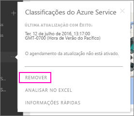

# Remover a ligação a um pacote de conteúdos organizacionais do Power BI

> [!NOTE]
> Não pode criar nem instalar pacotes de conteúdos organizacionais nas novas experiências de áreas de trabalho. Agora é uma boa altura para atualizar os seus pacotes de conteúdos para aplicações, se ainda não tiver começado. Saiba [mais sobre a nova experiência de área de trabalho](service-create-the-new-workspaces.md).
> 

Um colega de trabalho criou um pacote de conteúdos. Descobriu-o no AppSource e adicionou-o à sua área de trabalho do Power BI. Mas já não precisa mais dele.  Como pode removê-lo?

Para remover um pacote de conteúdos, remova o respetivo conjunto de dados.  

* No painel de navegação, selecione o botão de reticências à direita do conjunto de dados e selecione **Remover\> Sim**.  
  
  

Remover o conjunto de dados também remove todos os relatórios e dashboards associados. Contudo, a remoção da ligação ao pacote de conteúdos não elimina o pacote de conteúdos do AppSource da sua organização.  Pode sempre voltar ao AppSource e adicionar o pacote de conteúdos à sua área de trabalho. Só pode [eliminar um pacote de conteúdos do AppSource](service-organizational-content-pack-manage-update-delete.md) se foi quem o criou.

## Próximos passos
* [Introdução aos pacotes de conteúdos organizacionais](service-organizational-content-pack-introduction.md) 
* [Create and distribute an app in Power BI](service-create-distribute-apps.md) (Criar e distribuir uma aplicação no Power BI) 
* [Conceitos básicos para designers no serviço Power BI](service-basic-concepts.md)  
* Mais perguntas? [Pergunte à Comunidade do Power BI](https://community.powerbi.com/)

