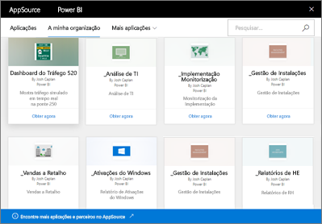

# Introdução aos pacotes de conteúdos organizacionais no Power BI
> [!NOTE]
> Não pode criar nem instalar pacotes de conteúdos organizacionais nas novas experiências de áreas de trabalho. Agora é uma boa altura para atualizar os seus pacotes de conteúdos para aplicações, se ainda não tiver começado. Saiba [mais sobre a nova experiência de área de trabalho](service-create-the-new-workspaces.md).
> 

Distribui regularmente relatórios por e-mail à sua equipa? Em alternativa, experimente fazer isto: empacote os dashboards, os relatórios, os livros do Excel e os conjuntos de dados e publique-os para a sua equipa como um *pacote de conteúdos organizacionais*. A sua equipa pode encontrar facilmente os pacotes de conteúdos que criar &#151; estão todos no AppSource. Como fazem parte do Power BI, tiram partido de todas as funcionalidades do Power BI, incluindo a exploração interativa de dados, novos elementos visuais, Perguntas e Respostas, integração com outras origens de dados, atualização de dados e muito mais.

Criar pacotes de conteúdos é diferente de partilhar dashboards ou colaborar nos mesmos numa área de trabalho. Leia [Como devo colaborar e partilhar os meus dashboards e relatórios?](service-how-to-collaborate-distribute-dashboards-reports.md) para decidir qual a opção mais adequada à sua situação. 

No AppSource, pode pesquisar ou procurar pacotes de conteúdos publicados em toda a organização, nos grupos de distribuição ou de segurança e nos [grupos do Office 365 aos quais pertence](https://support.office.com/article/Create-a-group-in-Office-365-7124dc4c-1de9-40d4-b096-e8add19209e9). Se não é membro de um grupo específico, não verá os pacotes de conteúdos partilhados com esse grupo. Todos os membros do grupo têm o mesmo acesso só de leitura aos dados, relatórios, livros e dashboards do pacote de conteúdos (a menos que se trate de uma origem de dados do SQL Server Analysis Services (SSAS); nesse caso, os privilégios são herdados com a origem de dados).

Os dashboards, relatórios e livros do Excel são só de leitura, mas pode copiar e utilizar os dashboards e relatórios como um ponto de partida para criar a sua versão personalizada do pacote de conteúdos.

> [!NOTE]
> Os pacotes de conteúdos organizacionais só estão disponíveis quando o utilizador e os seus colegas têm licenças do [Power BI Pro](service-features-license-type.md).
> 
> 

## O que é o *AppSource*?
A publicação de um pacote de conteúdos organizacional adiciona-o ao AppSource.  Este repositório centralizado facilita aos membros navegar e descobrir dashboards, relatórios e conjuntos de dados publicados para eles.  

* Para ver o AppSource, selecione **Obter Dados** > **A minha organização** > **Obter**.

## O ciclo de vida de um pacote de conteúdos organizacional
Qualquer utilizador do Power BI Pro pode criar, publicar e aceder a pacotes de conteúdos organizacionais. Apenas o criador do pacote de conteúdos pode modificar o livro e o conjunto de dados, agendar a atualização e eliminá-la.

O ciclo de vida é parecido com este:

1. No Power BI Pro, o João cria um pacote de conteúdos e publica-o no grupo de distribuição Marketing. As definições de atualização são herdadas com o conjunto de dados e só podem ser alteradas pela Nate.
   
   > [!NOTE]
   > Se o João criar o pacote de conteúdos a partir de uma [área de trabalho do Power BI](service-create-distribute-apps.md) à qual pertence, mesmo que ele deixe a área de trabalho, as outras pessoas na área de trabalho do Power BI podem assumir a propriedade.
   > 
   > 
2. O João envia uma mensagem de e-mail ao grupo de distribuição, informando-o sobre o novo pacote de conteúdos.
3. No Power BI Pro, a Júlia, membro do grupo de distribuição Marketing, procura e liga a um pacote de conteúdos no AppSource. Agora, a Júlia tem uma cópia só de leitura. Ela sabe que é só de leitura porque, no Painel de Navegação esquerdo, existe um ícone de partilha à esquerda do nome do dashboard e do nome do relatório. E quando ela seleciona o dashboard, um ícone de cadeado informa-a de que está a ver um dashboard do pacote de conteúdos. 
4. Suponhamos que ela decide personalizá-lo. Agora, ela tem a sua própria cópia do dashboard e dos relatórios. O trabalho dela não afeta a origem, o pacote de conteúdos original, nem os outros membros do grupo de distribuição. Agora está a trabalhar na sua própria cópia do dashboard e do relatório.
5. O João faz atualizações ao dashboard e, quando está pronto, publica uma nova versão do pacote de conteúdos.
   
   * O Júlio, outro membro do grupo de distribuição, não personalizou o pacote de conteúdos original. As novas alterações são aplicadas automaticamente à versão do Júlio do pacote de conteúdos.  
   * A Jane personalizou o pacote de conteúdos. Ela recebe uma notificação de que existe uma nova versão.  Ela pode aceder ao AppSource e obter o pacote de conteúdos atualizado sem perder a sua versão personalizada. A Júlia tem agora as duas versões: a versão personalizada e o pacote de conteúdos atualizado.
6. Suponhamos que a Nate altera as definições de segurança. O Julio e a Jane deixam de ter acesso ao conteúdo. Ou suponhamos que foram removidos do grupo de distribuição Marketing.
   
   * O Julio não personalizou o pacote de conteúdos original, pelo que o conteúdo é removido automaticamente. 
   * A Jane personalizou o pacote de conteúdos. Da próxima vez que ela abrir o dashboard, todos os mosaicos do pacote de conteúdos original terão desaparecido, mas os mosaicos que afixou a partir de outros relatórios (que ainda tem permissão para utilizar) continuam a ser apresentados. Os relatórios e o conjunto de dados associados já não estão disponíveis (e não são apresentados no painel de navegação à esquerda).
7. Ou então, a Nate elimina o pacote de conteúdos.
   
   * O Julio não personalizou o pacote de conteúdos original, pelo que o conteúdo é removido automaticamente. 
   * A Jane personalizou o pacote de conteúdos. Da próxima vez que ela abrir o dashboard, todos os mosaicos do pacote de conteúdos original terão desaparecido, mas os mosaicos que afixou a partir de outros relatórios continuam a ser apresentados. Os relatórios e o conjunto de dados associados já não estão disponíveis (e não são apresentados no painel de navegação à esquerda).

## Segurança de dados
Todos os membros do grupo de distribuição têm as mesmas permissões para os dados que o criador do pacote de conteúdos. A única exceção são os conjuntos de dados de tabela no local do SQL Server Analysis Services (SSAS). Como os relatórios e dashboards estão a ligar em direto ao modelo SSAS no local, as credenciais de cada membro individual do grupo de distribuição são utilizadas para determinar os dados aos quais pode aceder.

## Próximos passos
* [Criar e publicar um pacote de conteúdos organizacional](service-organizational-content-pack-create-and-publish.md)
* [Create and distribute an app in Power BI](service-create-distribute-apps.md) (Criar e distribuir uma aplicação no Power BI) 
* [Conceitos básicos para designers no serviço Power BI](service-basic-concepts.md)
* Mais perguntas? [Pergunte à Comunidade do Power BI](http://community.powerbi.com/)

