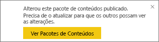
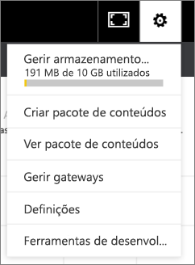

# Gerir, atualizar e excluir pacotes de conteúdos organizacional
> [!NOTE]
> Não pode criar nem instalar pacotes de conteúdos organizacionais nas novas experiências de áreas de trabalho. Agora é uma boa altura para atualizar os seus pacotes de conteúdos para aplicações, se ainda não tiver começado. Saiba [mais sobre a nova experiência de área de trabalho](service-create-the-new-workspaces.md).
> 

Pode empacotar e partilhar os seus próprios dashboards, relatórios, livros do Excel e conjuntos de dados com os seus colegas como [pacotes de conteúdos organizacionais](service-organizational-content-pack-introduction.md). Os seus colegas podem utilizá-los conforme estão ou podem criar as suas próprias cópias.

Criar pacotes de conteúdos é diferente de partilhar dashboards ou colaborar nos mesmos num grupo. Leia [Como devo colaborar e partilhar os meus dashboards e relatórios?](service-how-to-collaborate-distribute-dashboards-reports.md) para decidir a opção mais adequada à sua situação.

Apenas o criador do pacote de conteúdos pode fazer algumas tarefas de pacotes de conteúdos organizacionais:

* Republicar.
* Restringir ou expandir o acesso ao pacote de conteúdos.
* Definir e alterar a atualização agendada.
* Eliminar o pacote de conteúdos.

## Modificar e republicar um pacote de conteúdos organizacional
Se fizer alterações no dashboard original do pacote de conteúdos, do relatório ou da pasta de trabalho do Excel, o Power BI irá pedir que publique novamente. Além disso, como criador do pacote de conteúdos, pode atualizar qualquer uma das opções selecionadas na janela de Criação do Pacote de Conteúdos, ao criar o pacote de conteúdos original. 

## Republicar com novo conteúdo
Ao fazer ou guardar uma alteração no dashboard incluído num pacote de conteúdos, o Power BI lembra-o de atualizá-lo para que as outras pessoas possam ver as alterações. Por exemplo, se afixar um novo mosaico ou simplesmente alterar o nome do dashboard.

1. Selecione **Ver Pacotes de Conteúdos** na mensagem.
   
   
2. Ou selecione o ícone de engrenagem no canto superior direito  e selecione **Ver Pacote de Conteúdos**.
   
   
   
   Veja o ícone de aviso .  Desta forma, sabe que modificou o pacote de conteúdos de alguma forma e já não coincide com o que foi publicado.
3. Selecione **Editar**.  
4. Faça as alterações necessárias na janela **Atualizar Pacote de Conteúdos** e selecione **Atualizar**. Será apresentada uma mensagem de **Êxito**.
   
   * Para membros do grupo que não personalizaram o pacote de conteúdos, a atualização é aplicada automaticamente.
   * Os membros do grupo que personalizaram o pacote de conteúdos recebem uma notificação de que há uma nova versão.  Podem aceder ao AppSource e obter o pacote de conteúdos atualizado sem perder a respetiva versão personalizada.  Eles terão agora as duas versões: a versão personalizada e o pacote de conteúdos atualizado.  Na versão personalizada, todos os mosaicos do pacote de conteúdos original serão eliminados.  Mas os mosaicos afixados de outros relatórios ainda serão renderizados. No entanto, se o proprietário do pacote de conteúdos elimina o conjunto de dados em que o pacote de conteúdos se baseia, todo o relatório será eliminado.  

## Atualizar o público: expandir ou restringir o acesso
Outra modificação para criadores de pacotes de conteúdos está a expandir e a restringir o acesso ao pacote de conteúdos.  Talvez tenha publicado um pacote de conteúdos para um público amplo e decidido restringir o acesso a um grupo mais pequeno.  

1. Selecione o ícone de engrenagem  e selecione **Ver Pacotes de Conteúdos**.
2. Selecione **Editar**. 
3. Faça as alterações necessárias na janela **Atualizar Pacote de Conteúdos** e selecione **Atualizar**. Por exemplo, elimine o grupo de distribuição original no campo **Grupos Específicos** e substitua-o por um grupo de distribuição diferente (com menos membros).
   
   Será apresentada uma mensagem de Êxito.
   
   Para qualquer colaborador que não faça parte do novo alias:
   
   * Para os membros do grupo que não personalizaram o pacote de conteúdos, o dashboard e os relatórios associados a esse pacote de conteúdos já não estarão disponíveis e o pacote de conteúdos não será apresentado no Painel de Navegação.
   * Para os membros do grupo que personalizaram o pacote de conteúdos, a próxima vez que abrirem o dashboard personalizado, todos os mosaicos do pacote de conteúdos original desaparecerão.  Mas os mosaicos afixados de outros relatórios ainda serão renderizados. Os relatórios e o conjunto de dados do pacote de conteúdos original deixarão de estar disponíveis, e o pacote de conteúdos não aparecerá no painel de Navegação.   

## Atualizar um pacote de conteúdos organizacional
Como criador do pacote de conteúdos, pode [agendar a atualização dos conjuntos de dados](refresh-data.md).  Quando cria e carrega o pacote de conteúdos, essa agenda de atualização é carregada com os conjuntos de dados. Se alterar a agenda de atualização, precisará de publicar novamente o pacote de conteúdos (veja acima).

## Eliminar um pacote de conteúdos organizacional do AppSource
Só pode eliminar um pacote de conteúdos do AppSource se o tiver criado. Se tiver criado um pacote de conteúdos organizacional numa área de trabalho da aplicação e optar depois por eliminar essa área de trabalho, certifique-se de que elimina primeiro o pacote de conteúdos. Se eliminar a área de trabalho sem eliminar primeiro o pacote de conteúdos, poderá perder o acesso a esses pacotes de conteúdos e terá de contactar o Suporte da Microsoft para obter ajuda. 

> [!TIP]
> Pode [eliminar a ligação a um pacote de conteúdos](service-organizational-content-pack-disconnect.md) que não criou. Isso não elimina o pacote de conteúdos do AppSource.
> 
> 

1. Para eliminar um pacote de conteúdos do AppSource, aceda à área de trabalho de aplicação onde criou o pacote de conteúdos, selecione o ícone de engrenagem  e selecione **Ver Pacotes de Conteúdos**.
2. Selecione **Eliminar \> Eliminar**. 
   
   * Para os membros do grupo que não personalizaram o pacote de conteúdos, o dashboard e os relatórios associados a esse pacote de conteúdos serão removidos automaticamente. Eles deixarão de estar disponíveis, e o pacote de conteúdos não aparecerá no Painel de Navegação.
   * Para os membros do grupo que personalizaram o pacote de conteúdos, a próxima vez que abrirem o dashboard personalizado, todos os mosaicos do pacote de conteúdos original desaparecerão.  Mas os mosaicos afixados de outros relatórios ainda serão renderizados. Os relatórios e o conjunto de dados do pacote de conteúdos original deixarão de estar disponíveis, e o pacote de conteúdos não aparecerá no painel de Navegação.   

## Próximos passos
* [Introdução aos pacotes de conteúdos organizacionais](service-organizational-content-pack-introduction.md)
* [Criar e distribuir uma aplicação no Power BI](service-create-distribute-apps.md) 
* Mais perguntas? [Pergunte à Comunidade do Power BI](http://community.powerbi.com/)

