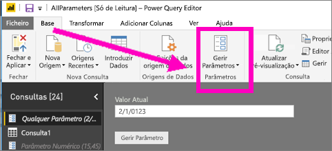
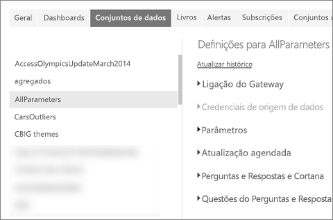
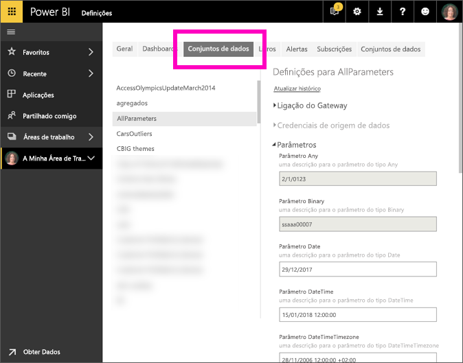

# O que é um parâmetro de consulta?
Os parâmetros de consulta são adicionados ao Power BI Desktop por criadores de relatórios. Os parâmetros permitem-lhes fazer com que certas partes dos relatórios dependam de um ou mais *valores* de parâmetro. Por exemplo, um criador de relatórios pode criar um parâmetro que restrinja os dados a um único país/região ou um parâmetro que defina os formatos de campo aceitáveis, tais como datas, hora e texto.

## Rever e editar parâmetros no serviço Power BI

Assim que os parâmetros forem definidos no Power BI Desktop, quando esse [relatório for publicado no serviço Power BI](desktop-upload-desktop-files.md), as definições e seleções de parâmetros são movidos juntamente com o relatório. Algumas definições de parâmetros podem ser revistas e editadas no serviço Power BI: não os parâmetros que restringem os dados disponíveis, mas aqueles que definem e descrevem os valores aceitáveis.

1. No serviço Power BI, selecione o ícone de engrenagem  para abrir as **Definições**.

2. Selecione o separador **Conjuntos de Dados** e realce um conjunto de dados na lista. 
    
    

3. Expanda a secção **Parâmetros**.  Se o conjunto de dados selecionado não tiver parâmetros, verá uma mensagem com uma ligação para Saber mais sobre parâmetros de consulta. No entanto, se o conjunto de dados tiver parâmetros, expandir a secção **Parâmetros** irá revelar esses parâmetros. 

    

    Reveja as definições de parâmetros e faça alterações, se necessário. Os campos a cinzento não são editáveis. 

## Próximos passos
Uma forma ad-hoc de adicionar parâmetros simples é ao [modificar o URL](service-url-filters.md).