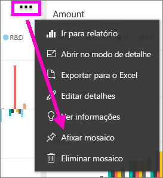
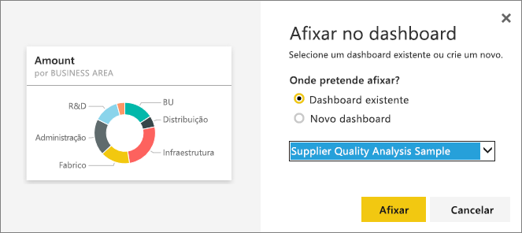
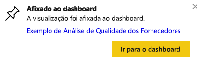

# Afixar um mosaico de um dashboard noutro dashboard
Uma forma de adicionar um novo [mosaico de dashboard](consumer/end-user-tiles.md) é copiando-o de outro dashboard. Ao clicar em cada um destes mosaicos, haverá uma ligação para onde foi criado – nas Perguntas e Respostas ou num relatório. 

> [!NOTE]
> Não é possível fixar mosaicos de dashboards partilhados.

## Fixar um mosaico a outro dashboard
1. [Obter dados](service-get-data.md). Este exemplo utiliza a [amostra de IT Spend Analysis](sample-it-spend.md).
2. Abrir um [dashboard](consumer/end-user-dashboards.md).
3. Passe o rato sobre o mosaico que quer afixar, selecione as reticências (...) e escolha **Afixar mosaico**.  
   
   
4. Afixe o mosaico num dashboard existente ou num novo dashboard. 
   
   * **Dashboard existente**: selecione o nome do dashboard no menu pendente.
   * **Novo dashboard**: introduza o nome do novo dashboard.
   
   
5. Selecione **Afixar**.
   Uma mensagem de êxito (junto ao canto superior direito) informa que a visualização foi adicionada, como um mosaico, ao dashboard selecionado.
   
   
6. Selecione **Ir para o dashboard** para ver o mosaico afixado. Deste modo, pode [renomear, redimensionar, associar e mover](service-dashboard-edit-tile.md) a visualização afixada.

## Próximos passos
[Mosaicos no Power BI](consumer/end-user-tiles.md)  
[Dashboards no Power BI](consumer/end-user-dashboards.md)  
Mais perguntas? [Pergunte à Comunidade do Power BI](http://community.powerbi.com/)

