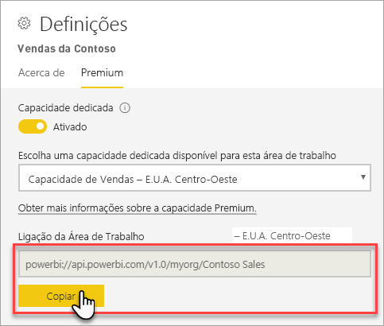

# Ligar aos conjuntos de dados com ferramentas e aplicações cliente (Pré-visualização)

As áreas de trabalho e os conjuntos de dados do Power BI Premium suportam ligações *só de leitura* da Microsoft e ferramentas e aplicações cliente de terceiros. 

> [!NOTE]
> O único objetivo deste artigo é apresentar a conectividade só de leitura às áreas de trabalho e conjuntos de dados do Power BI Premium. O artigo *não* se destina a fornecer informações aprofundadas sobre programação, aplicações e ferramentas específicas, arquitetura e gestão de área de trabalho e de conjunto de dados. Os assuntos aqui descritos requerem uma compreensão sólida da administração e arquitetura de base de dados de modelo em tabela do Analysis Services.

## Protocolo

O Power BI Premium utiliza o protocolo [XML for Analysis](https://docs.microsoft.com/bi-reference/xmla/xml-for-analysis-xmla-reference) (XMLA) para comunicações entre as aplicações cliente e o motor que gere as suas áreas de trabalho e conjuntos de dados. Estas comunicações são geralmente feitas através daquilo a que chamamos pontos finais XMLA. O XMLA é o mesmo protocolo de comunicação utilizado pelo motor da Microsoft Analysis Services que, nos bastidores, executa a modelagem semântica, a governação, o ciclo de vida e a gestão de dados do Power BI. 

A grande maioria das ferramentas e aplicações cliente não comunica explicitamente com o motor ao utilizar pontos finais XMLA. Em vez disso, utilizam bibliotecas de cliente, como a MSOLAP, ADOMD e AMO, como intermediários entre a aplicação cliente e o motor, que comunica exclusivamente através de XMLA.

## Ferramentas suportadas

Estas ferramentas suportam o acesso só de leitura a áreas de trabalho e conjuntos de dados do Power BI Premium:

**SQL Server Management Studio (SSMS)** – suporta consultas DAX, MDX, XMLA e TraceEvent. É necessária a versão 18.0. Transfira-a [aqui](https://docs.microsoft.com/sql/ssms/download-sql-server-management-studio-ssms). 

**SQL Server Profiler** – incluída com o SSMS 18.0 (Pré-visualização), esta ferramenta fornece rastreamento e depuração de eventos do servidor. Pode capturar e guardar dados sobre cada evento num ficheiro ou tabela para analisar mais tarde. Embora oficialmente preterido para o SQL Server, o Profiler continua a ser incluído no SSMS e continua a ser suportado para o Analysis Services e agora também para o Power BI Premium. Para saber mais, veja [SQL Server Profiler](https://docs.microsoft.com/sql/tools/sql-server-profiler/sql-server-profiler).

**DAX Studio** – ferramenta comunitária open source para a execução e análise de consultas DAX com o Analysis Services. É necessária a versão 2.8.2 ou superior. Para saber mais, veja [daxstudio.org](https://daxstudio.org/).

**Tabelas dinâmicas do Excel** – é necessária a versão 16.0.11326.10000 do Clique-e-Use do Office ou superior.

**Terceiros** – inclui aplicações e ferramentas de visualização de dados do cliente que se podem ligar a, consultar e consumir conjuntos de dados no Power BI Premium. A maioria das ferramentas exige as versões mais recentes das bibliotecas de cliente MSOLAP, mas alguns podem utilizar ADOMD.

## Bibliotecas de cliente

As bibliotecas de cliente são necessárias para que as ferramentas e aplicações cliente se liguem às áreas de trabalho do Power BI Premium. As mesmas bibliotecas de cliente utilizadas para ligar ao Analysis Services também são suportadas no Power BI Premium. As aplicações cliente da Microsoft, como o Excel, o SQL Server Management Studio (SSMS) e o SQL Server Data Tools (SSDT) instalam as três bibliotecas de cliente e atualizam-nas juntamente com as atualizações habituais de aplicações. Em alguns casos, especialmente com aplicações e ferramentas de terceiros, poderá ter de instalar as versões mais recentes das bibliotecas de cliente. As bibliotecas de cliente são atualizadas mensalmente. Para saber mais, veja [Bibliotecas de cliente para ligar ao Analysis Services](https://docs.microsoft.com/azure/analysis-services/analysis-services-data-providers).

## Ligar a uma área de trabalho Premium

Pode ligar-se a áreas de trabalho atribuídas a capacidades Premium dedicadas. As áreas de trabalho atribuídas a uma capacidade dedicada têm uma cadeia de ligação no formato de URL. 

Para obter a cadeia de ligação de área de trabalho, no Power BI, em **Definições de Área de Trabalho**, no separador **Premium**, em **Ligação da Área de Trabalho**, clique em **Copiar**.

As ligações de área de trabalho utilizam o seguinte formato de URL para endereçar uma área de trabalho, como se fosse um nome de servidor do Analysis Services:   
`powerbi://api.powerbi.com/v1.0/[tenant name]/[workspace name]` 

Por exemplo, `powerbi://api.powerbi.com/v1.0/contoso.com/Sales Workspace`

### Para se ligar no SSMS

Em **Ligar ao Servidor** > **Tipo de Servidor**, selecione **Analysis Services**. Em **Nome do servidor**, introduza o URL. Em **Autenticação**, selecione **Active Directory 16.0.11326.10000 Universal com o suporte de Multi-Factor Authentication (MFA)** e, em seguida, em **Nome de utilizador**, introduza o seu ID organizacional do utilizador. 

Uma vez estabelecida a ligação, a área de trabalho será apresentada como um servidor do Analysis Services e os conjuntos de dados na área de trabalho serão apresentados como bases de dados.  

### Catálogo inicial

Em algumas ferramentas, como o SQL Server Profiler, pode ter de especificar um *Catálogo Inicial*. Especifique um conjunto de dados (base de dados) na sua área de trabalho. Em **Ligar ao Servidor**, clique em **Opções**. Na caixa de diálogo **Ligar ao Servidor**, no separador **Propriedades da Ligação** em**Ligar à base de dados**, introduza o nome do conjunto de dados.

### Duplicar o nome da área de trabalho

Ao ligar a uma área de trabalho com o mesmo nome de outra área de trabalho, poderá ocorrer o seguinte erro: **Não é possível ligar a powerbi://api.powerbi.com/v1.0/[nome do inquilino]/[nome da área de trabalho].**

Para resolver este erro, além do nome de área de trabalho, especifique o ObjectIDGuid, que pode ser copiado do objectID de área de trabalho no URL. Anexe o objectID ao URL de ligação. Por exemplo, "powerbi://api.powerbi.com/v1.0/myorg/Contoso Sales - 9d83d204-82a9-4b36-98f2-a40099093830'

### Duplicar o nome do conjunto de dados

Ao ligar a um conjunto de dados com o mesmo nome de outro conjunto de dados na mesma área de trabalho, anexe o GUID de conjunto de dados ao nome do conjunto de dados. Pode obter os nomes de conjunto de dados *e* do GUID quando estiver ligado à área de trabalho no SSMS. 

### Atraso nos conjuntos de dados apresentados

Ao ligar-se a um espaço de trabalho, as alterações de conjuntos de dados novos, excluídos e renomeados podem demorar até cinco minutos a aparecer. 

### Conjuntos de dados não suportados

Os seguintes conjuntos de dados não estão acessíveis ao utilizar pontos finais XMLA. Estes conjuntos de dados *não* aparecerão na área de trabalho no SSMS ou noutras ferramentas: 

- Conjuntos de dados com uma ligação em direto a modelos de Analysis Services. 
- Conjuntos de dados com envio de dados via Push através da API REST.
- Conjuntos de dados de livros do Excel. 

Os seguintes conjuntos de dados não são suportados no serviço Power BI:   

- Conjuntos de dados com Ligação em Direto para um conjunto de dados do Power BI.

### Funções e associações de funções

Atualmente, as funções de modelo e as associações de funções não são detetáveis nem apresentadas ao utilizar pontos finais XMLA.

## Registos de auditoria 

Quando as ferramentas e aplicações cliente se ligam a uma área de trabalho, o acesso através de pontos finais XMLA é registado nos registos de auditoria do Power BI na operação **GetWorkspaces** Para saber mais, veja a [Auditoria do Power BI](service-admin-auditing.md).

## Veja também

[Referências do Analysis Services](https://docs.microsoft.com/bi-reference/#pivot=home&panel=home-all)   
[SQL Server Management Studio](https://docs.microsoft.com/sql/ssms/sql-server-management-studio-ssms)   
[Protocolo em tabela do SQL Server Analysis Services](https://docs.microsoft.com/openspecs/sql_server_protocols/ms-ssas-t/b98ed40e-c27a-4988-ab2d-c9c904fe13cf)   
[Vistas de Gestão Dinâmica (DMVs)](https://docs.microsoft.com/sql/analysis-services/instances/use-dynamic-management-views-dmvs-to-monitor-analysis-services)   

Mais perguntas? [Experimente perguntar à Comunidade do Power BI](https://community.powerbi.com/)
