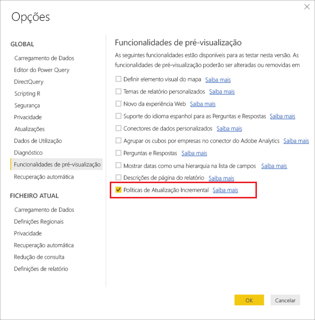
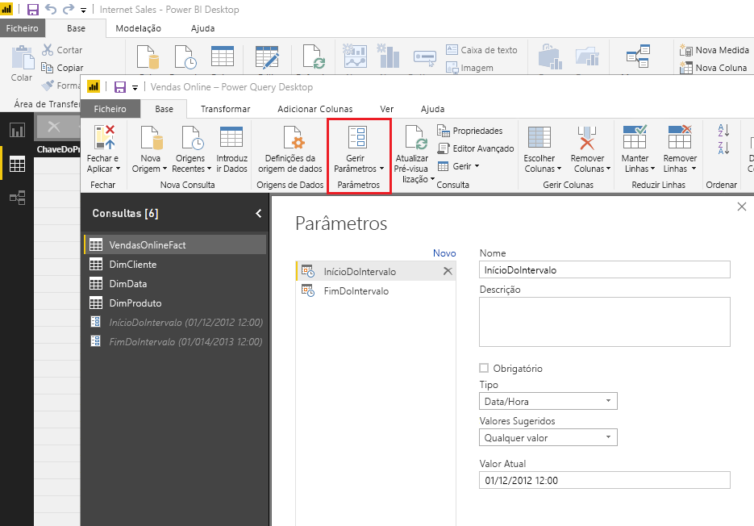
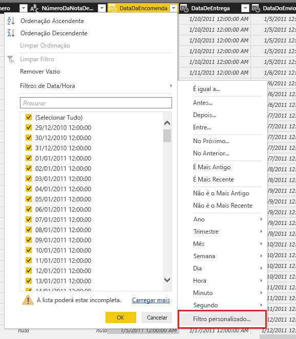
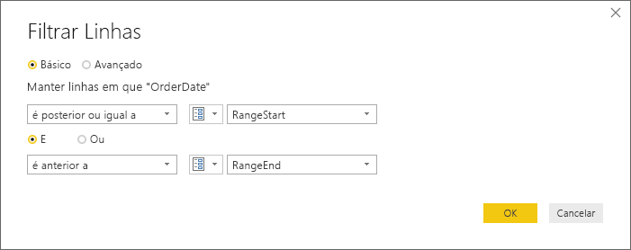
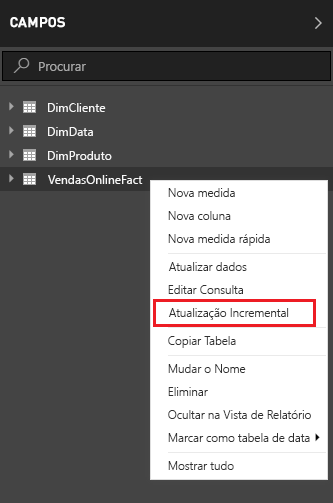
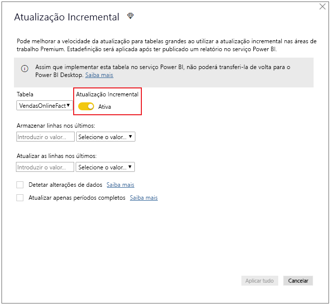
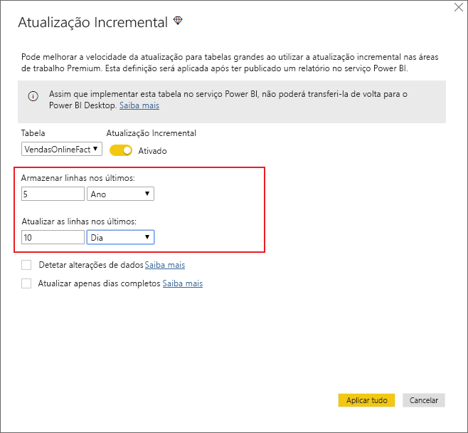
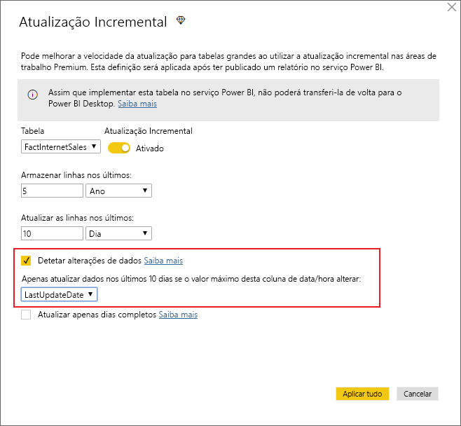
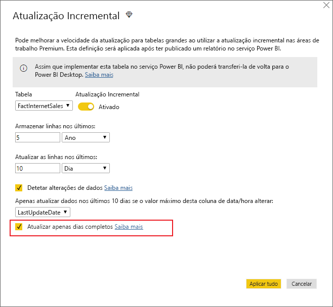
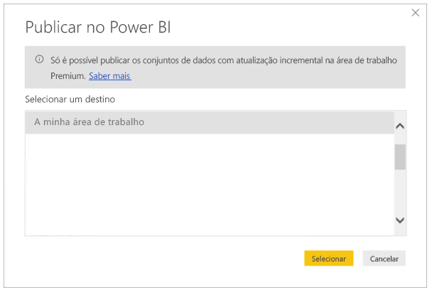

# <a name="incremental-refresh-in-power-bi-premium"></a>Atualização incremental no Power BI Premium

A atualização incremental permite utilizar conjuntos de dados muito grandes no serviço Power BI Premium, com as seguintes vantagens:

- **As atualizações são mais rápidas.** Apenas os dados que sofreram alterações precisam de ser atualizados. Por exemplo, atualize apenas os últimos 5 dias de um conjunto de dados de 10 anos.

- **As atualizações são mais fiáveis.** Por exemplo, não é necessário manter ligações de longa duração a sistemas de origem voláteis.

- **O consumo de recursos é reduzido.** Uma quantidade menor de dados a atualizar reduz o consumo geral de memória e de outros recursos.

## <a name="how-to-use-incremental-refresh"></a>Como utilizar a atualização incremental

As políticas de atualização incremental são definidas no Power BI Desktop e aplicadas assim que são publicadas no serviço Power BI.

Comece por ativar a atualização incremental nas funcionalidades de pré-visualização.



### <a name="filter-large-datasets-in-power-bi-desktop"></a>Filtrar conjuntos de dados grandes no Power BI Desktop

Os conjuntos de dados grandes, provavelmente com milhares de milhões de linhas, podem não caber no Power BI Desktop porque normalmente são limitados pelos recursos disponíveis no PC do utilizador. Por conseguinte, estes conjuntos de dados são geralmente filtrados durante a importação para caberem no Power BI Desktop. Isto continua a acontecer quer utilize a atualização incremental ou não.

#### <a name="rangestart-and-rangeend-parameters"></a>Parâmetros RangeStart e RangeEnd

Para utilizar a atualização incremental no serviço Power BI, a filtragem tem de ser feita através dos parâmetros de data/hora do Power Query, com os nomes reservados e sensíveis às maiúsculas e minúsculas **RangeStart** e **RangeEnd**.

No Editor do Power Query, selecione **Gerir Parâmetros** para definir os parâmetros com valores predefinidos.



Com os parâmetros definidos, pode aplicar o filtro ao selecionar a opção do menu **Filtro Personalizado** de uma coluna.



Certifique-se de que as linhas são filtradas onde o valor da coluna *é posterior ou igual a* **RangeStart** e *anterior a* **RangeEnd**.



> [!TIP]
> Embora o tipo de dados dos parâmetros tenha de ser data/hora, é possível convertê-lo de modo a corresponder aos requisitos da origem de dados. Por exemplo, a seguinte função do Power Query converte um valor de data/hora para que se assemelhe a uma chave de substituição de número inteiro no formato *aaaammdd*, o que é comum em armazéns de dados. A função pode ser invocada pelo passo de filtragem.
>
> `(x as datetime) => Date.Year(x)*10000 + Date.Month(x)*100 + Date.Day(x)`

Selecione **Fechar e Aplicar** no Editor do Power Query. Deve ter um subconjunto do conjunto de dados no Power BI Desktop.

> [!NOTE]
> Uma vez publicados, os valores de parâmetro são substituídos automaticamente pelo serviço Power BI. Não é necessário defini-los nas definições de conjuntos de dados.

### <a name="define-the-refresh-policy"></a>Definir a política de atualização

A atualização incremental está disponível no menu de contexto para tabelas, exceto para modelos Ligação em Direto.



#### <a name="incremental-refresh-dialog"></a>Caixa de diálogo Atualização Incremental

A caixa de diálogo Atualização Incremental é apresentada. Utilize o botão para ativar a caixa de diálogo.



> [!NOTE]
> Se a expressão do Power Query da tabela não fizer referência aos parâmetros com nomes reservados, o botão será desativado.

O texto de cabeçalho explica o seguinte:

-   A atualização incremental só é suportada em áreas de trabalho com a capacidade Premium. As políticas de atualização são definidas no Power BI Desktop e são aplicadas por operações de atualização no serviço.

-   Se conseguir transferir o ficheiro PBIX com uma política de atualização incremental a partir do serviço Power BI, o ficheiro não irá abrir no Power BI Desktop. Em breve, deixará de conseguir transferi-lo por completo. Embora esta operação possa vir a ser suportada no futuro, tenha em atenção que estes conjuntos de dados podem tornar-se muito grandes e deixarem de ser práticos para transferir e abrir num PC normal.

#### <a name="refresh-ranges"></a>Intervalos de atualização

O seguinte exemplo define uma política de atualização para armazenar 5 anos de dados no total e para atualizar incrementalmente 10 dias de dados. Se o conjunto de dados for atualizado diariamente, cada operação de atualização irá fazer o seguinte.

-   Adicionar um novo dia de dados.

-   Atualizar 10 dias até à data atual.

-   Remover os anos de calendário com mais de 5 anos antes da data atual. Por exemplo, se a data atual for 1 de janeiro de 2019, o ano 2013 será removido.

A primeira atualização no serviço Power BI poderá demorar mais tempo para importar esses 5 anos. As atualizações posteriores poderão ser concluídas numa fração do tempo.



**Poderá apenas ter de definir estes intervalos. Se for esse o caso, pode avançar para o passo de publicação abaixo. As listas pendentes adicionais aplicam-se a funcionalidades avançadas.**

#### <a name="detect-data-changes"></a>Detetar alterações de dados

Uma atualização incremental de 10 dias é, obviamente, muito mais eficiente do que uma atualização completa de 5 anos. No entanto, é possível que haja uma opção ainda melhor. Se selecionar a caixa de verificação **Detetar alterações de dados**, pode selecionar uma coluna de data/hora utilizada para identificar e atualizar apenas os dias em que os dados foram alterados. Isto pressupõe a existência de uma coluna deste tipo no sistema de origem, que normalmente serve para efeitos de auditoria. O valor máximo desta coluna é avaliado para cada um dos períodos no intervalo incremental. Se não tiver sido alterado desde a última atualização, não é necessário atualizar o período. Neste exemplo, isto poderia reduzir os dias atualizados incrementalmente de 10 para 2.



> [!TIP]
> O design atual requer que os dados da coluna onde se pretende detetar alterações sejam persistentes e estejam em cache na memória. Poderá optar por umas das seguintes técnicas para reduzir a cardinalidade e o consumo de memória.
>
> Mantenha apenas o valor máximo desta coluna no momento da atualização com, por exemplo, uma função do Power Query.
>
> Reduza a precisão a um nível aceitável, consoante os seus requisitos de frequência de atualização.
>
> Planeamos permitir a definição de consultas personalizadas para a deteção de alterações de dados posteriormente. Isto poderá ser utilizado para evitar manter o valor da coluna na sua totalidade.

#### <a name="only-refresh-complete-periods"></a>Atualizar apenas períodos completos

Imaginemos que a sua atualização foi agendada para começar todas as manhãs, às 04:00. Se os dados forem apresentados no sistema de origem durante essas 4 horas, é possível que não pretenda considerá-los. Algumas métricas de negócio (como os barris por dia no setor petrolífero) não fazem sentido com dias parciais.

Outro exemplo é a atualização de dados de um sistema financeiro em que os dados do mês anterior são aprovados no 12.º dia do mês. Pode definir o intervalo incremental para 1 mês e agendar a atualização para o 12.º dia do mês. Por exemplo, com esta opção selecionada, os dados de janeiro seriam atualizados a 12 de fevereiro.



> [!NOTE]
> As operações de atualização no serviço são executadas na hora UTC. Isto pode determinar a data efetiva e afetar períodos completos. Planeamos adicionar a capacidade de substituir a data efetiva para uma operação de atualização.

## <a name="publish-to-the-service"></a>Publicar no serviço

Uma vez que a atualização incremental é uma funcionalidade exclusivamente Premium, a caixa de diálogo de publicação só permite selecionar uma área de trabalho na capacidade Premium.



Já pode atualizar o modelo. A primeira atualização poderá demorar mais tempo a importar os dados do histórico. As atualizações posteriores poderão ser muito mais rápidas, dado que utilizam a atualização incremental.

## <a name="query-timeouts"></a>Tempos limite de consulta

O artigo de [resolução de problemas de atualização](https://docs.microsoft.com/power-bi/refresh-troubleshooting-refresh-scenarios) explica que as operações de atualização no serviço Power BI estão sujeitas a tempos limite. As consultas também podem ser limitadas pelo tempo limite predefinido da origem de dados. A maioria das origens relacionais permite a substituição de tempos limite na expressão M. Por exemplo, a expressão abaixo utiliza a [função de acesso a dados do SQL Server](https://msdn.microsoft.com/query-bi/m/sql-database) para definir o tempo limite para 2 horas. Cada período definido pelos intervalos da política envia uma consulta que segue a definição de tempo limite do comando.

```
let
    Source = Sql.Database("myserver.database.windows.net", "AdventureWorks", [CommandTimeout=#duration(0, 2, 0, 0)]),
    dbo_Fact = Source{[Schema="dbo",Item="FactInternetSales"]}[Data],
    #"Filtered Rows" = Table.SelectRows(dbo_Fact, each [OrderDate] >= RangeStart and [OrderDate] < RangeEnd)
in
    #"Filtered Rows"
```
