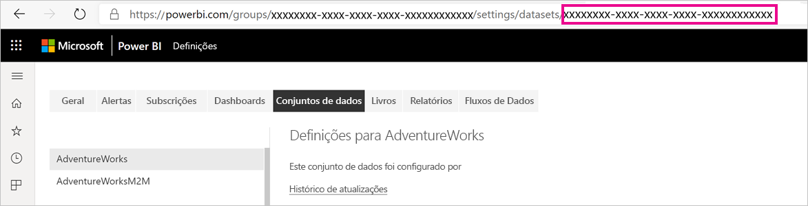
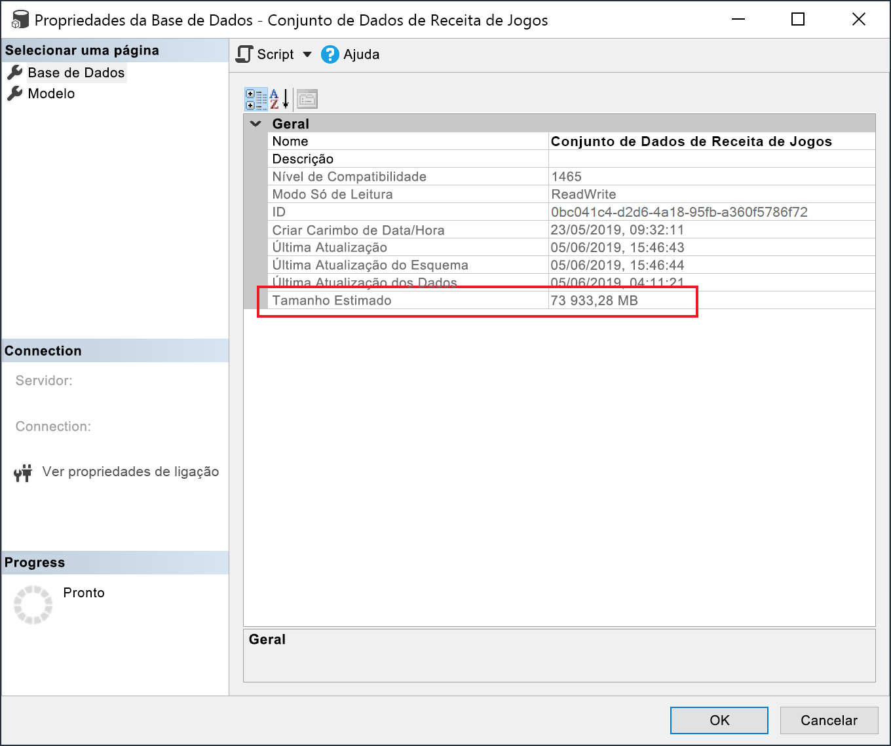

# <a name="large-models-in-power-bi-premium-preview"></a>Modelos grandes no Power BI Premium (pré-visualização)

Os conjuntos de dados do Power BI podem armazenar dados numa cache dentro da memória altamente comprimida, para um desempenho de consultas otimizado. Isto permite uma rápida interatividade de utilizadores em conjuntos de dados grandes. A funcionalidade de modelos grandes permite aos conjuntos de dados no Power BI Premium expandir-se para um tamanho superior a 10 GB. O tamanho do conjunto de dados é limitado pelo tamanho de capacidade do Power BI Premium. É semelhante à forma como o Azure Analysis Services funciona, em termos de limitações de tamanho de modelos. Para mais informações sobre os tamanhos de capacidades no Power BI Premium, consulte os nós de Capacidade. Pode configurar modelos grandes para todos os SKUs Premium P e SKUs Embedded A; no entanto, apenas funcionam com [novas áreas de trabalho](service-create-the-new-workspaces.md).

Os modelos grandes não afetam o tamanho de carregamento do PBIX, o qual continua limitado a 10 GB. Os conjuntos de dados expandem-se para além dos 10 GB no serviço ao atualizar. Pode utilizar a atualização incremental para configurar um conjunto de dados para se expandir para além dos 10 GB.

## <a name="enable-large-models"></a>Ativar modelos grandes

Para criar um conjunto de dados que se expanda para além dos 10 GB, siga estes passos:

1. Crie um conjunto de dados no Power BI Desktop e configure uma [atualização incremental](service-premium-incremental-refresh.md).

1. Publique o conjunto de dados no serviço Power BI Premium.

1. Ative o conjunto de dados para modelos grandes executando os seguintes cmdlets do PowerShell. Estes cmdlets fazem com que o Power BI armazene o conjunto de dados em Ficheiros Premium do Azure, não se impondo o limite de 10 GB.

1. Invoque uma atualização para carregar dados históricos com base na política de atualização incremental. A primeira atualização pode demorar algum tempo para carregar o histórico. As atualizações subsequentes deverão ser mais rápidas porque são incrementais.

### <a name="powershell-cmdlets"></a>Cmdlets do PowerShell

Na versão atual dos modelos grandes, ative o conjunto de dados para armazenamento de Ficheiros Premium através de cmdlets do PowerShell. Tem de ter privilégios de administrador de capacidade e administrador de áreas de trabalho para executar cmdlets do PowerShell.

1. Localize o ID de conjunto de dados (GUID). No separador **Conjuntos de dados** da área de trabalho, nas definições de conjuntos de dados, pode ver o ID no URL.

    

1. Num pedido de informação de administrador do PowerShell, instale o módulo [MicrosoftPowerBIMgmt](/powershell/module/microsoftpowerbimgmt.data/).

    ```powershell
    Install-Module -Name MicrosoftPowerBIMgmt
    ```

1. Execute os seguintes cmdlets para iniciar sessão e verificar o modo de armazenamento do conjunto de dados.

    ```powershell
    Login-PowerBIServiceAccount

    (Get-PowerBIDataset -Scope Organization -Id <Dataset ID> -Include actualStorage).ActualStorage
    ```

    A resposta deve ser a seguinte. O modo de armazenamento é ABF (ficheiro de cópia de segurança do Analysis Services), a predefinição.

    ```
    Id                   StorageMode

    --                   -----------

    <Dataset ID>         Abf
    ```

1. Execute os seguintes cmdlets para definir o modo de armazenamento como Ficheiros Premium e verifique-o. Poderão ser necessários alguns segundos para converter em Ficheiros Premium.

    ```powershell
    Set-PowerBIDataset -Id <Dataset ID> -TargetStorageMode PremiumFiles

    (Get-PowerBIDataset -Scope Organization -Id <Dataset ID> -Include actualStorage).ActualStorage
    ```

    A resposta deve ser a seguinte. O modo de armazenamento está agora definido como Ficheiros Premium.

    ```
    Id                   StorageMode
    
    --                   -----------
    
    <Dataset ID>         PremiumFiles
    ```

Pode agora verificar o estado das conversões de conjuntos de dados de e para Ficheiros Premium através do cmdlet [Get-PowerBIWorkspaceMigrationStatus](/powershell/module/microsoftpowerbimgmt.workspaces/get-powerbiworkspacemigrationstatus).

## <a name="dataset-eviction"></a>Expulsão de conjuntos de dados

O Power BI utiliza a gestão de memória dinâmica para expulsar conjuntos de dados inativos da memória. O Power BI expulsa conjuntos de dados para que possa carregar outros conjuntos de dados e dar resposta a consultas de utilizadores. A gestão de memória dinâmica permite que a soma dos tamanhos de conjuntos de dados seja significativamente superior à memória disponível na capacidade, mas é necessário que um conjunto de dados individual caiba na memória. Para mais informações sobre gestão de memória dinâmica, consulte [Como funcionam as capacidades](service-premium-what-is.md#how-capacities-function).

Deve ter em consideração o impacto da expulsão em modelos grandes. Apesar dos tempos de carregamento de conjuntos de dados relativamente rápidos, ainda pode haver um atraso percetível para os utilizadores, se tiverem de aguardar que conjuntos de dados expulsos grandes sejam atualizados. Por este motivo, na forma atual, a funcionalidade de modelos grandes é recomendada sobretudo para capacidades dedicadas a requisitos BI empresariais, e não para as misturadas com requisitos de BI de gestão personalizada. As capacidades dedicadas aos requisitos de BI empresariais têm menores probabilidades de acionar expulsões frequentemente e precisar de atualizar conjuntos de dados. As capacidades de BI de gestão personalizada, por outro lado, podem ter muitos conjuntos de dados pequenos, que são carregados mais frequentemente dentro e fora da memória.

## <a name="checking-dataset-size"></a>Verificar o tamanho de conjuntos de dados

Após carregar dados históricos, pode utilizar [SSMS](https://docs.microsoft.com/sql/ssms/download-sql-server-management-studio-ssms) através do [ponto final XMLA](service-premium-connect-tools.md) para verificar o tamanho estimado do conjunto de dados na janela das propriedades de modelo.



Pode também verificar o tamanho do conjunto de dados ao executar as seguintes consultas DMV a partir do SSMS. Some as colunas DICTIONARY\_SIZE e USED\_SIZE do resultado para ver o tamanho do conjunto de dados em bytes.

```sql
SELECT * FROM SYSTEMRESTRICTSCHEMA
($System.DISCOVER_STORAGE_TABLE_COLUMNS,
 [DATABASE_NAME] = '<Dataset Name>') //Sum DICTIONARY_SIZE (bytes)

SELECT * FROM SYSTEMRESTRICTSCHEMA
($System.DISCOVER_STORAGE_TABLE_COLUMN_SEGMENTS,
 [DATABASE_NAME] = '<Dataset Name>') //Sum USED_SIZE (bytes)
```

## <a name="current-feature-restrictions"></a>Restrições de funcionalidades atuais

Tenha em conta as seguintes restrições ao utilizar modelos grandes:

- **Encriptação Bring your own key (BYOK)** : os conjuntos de dados compatíveis com Ficheiros Premium não são encriptados por [BYOK](service-encryption-byok.md).
- **Suporte de Multi-geo**: os conjuntos de dados ativados para os Ficheiros Premium irão falhar em capacidades nas quais o [multi-geo](service-admin-premium-multi-geo.md) esteja também ativado.

- **Transferir o Power BI Desktop**: se um conjunto de dados for armazenado em Ficheiros Premium, a [transferência como um ficheiro .pbix](service-export-to-pbix.md) irá falhar.
- **Regiões suportadas**: os modelos grandes são suportados pelas seguintes regiões.
  - Leste da Austrália
  - Sudeste da Austrália
  - E.U.A. Central
  - Ásia Oriental
  - E.U.A. Leste
  - E.U.A. Leste 2
  - Leste do Japão
  - Oeste do Japão
  - Coreia do Sul Central
  - Sul da Coreia do Sul
  - E.U.A. Centro-Norte
  - Europa do Norte
  - E.U.A. Centro-Sul
  - Sudeste Asiático
  - Sul do Reino Unido
  - Oeste do Reino Unido
  - Europa Ocidental
  - E.U.A. Oeste
  - E.U.A. Oeste 2