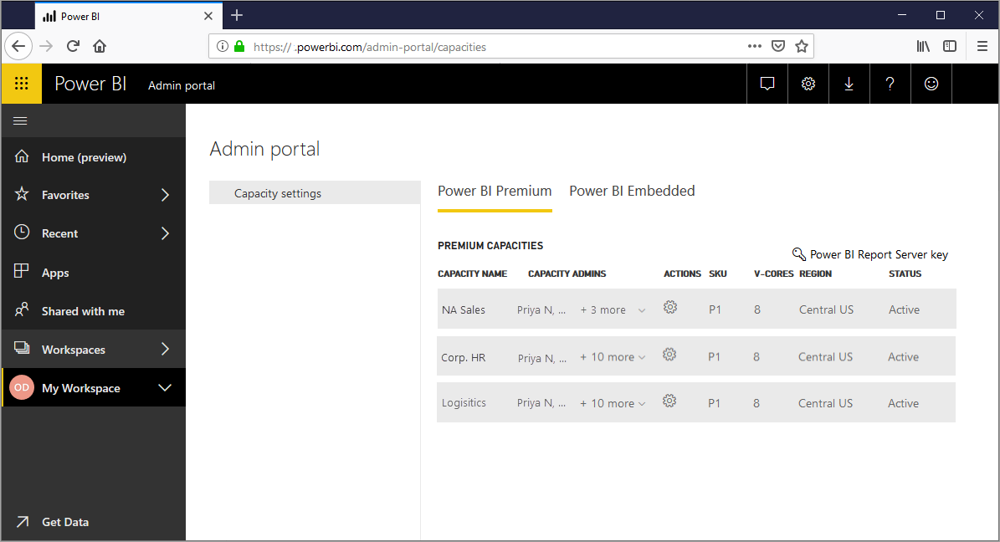
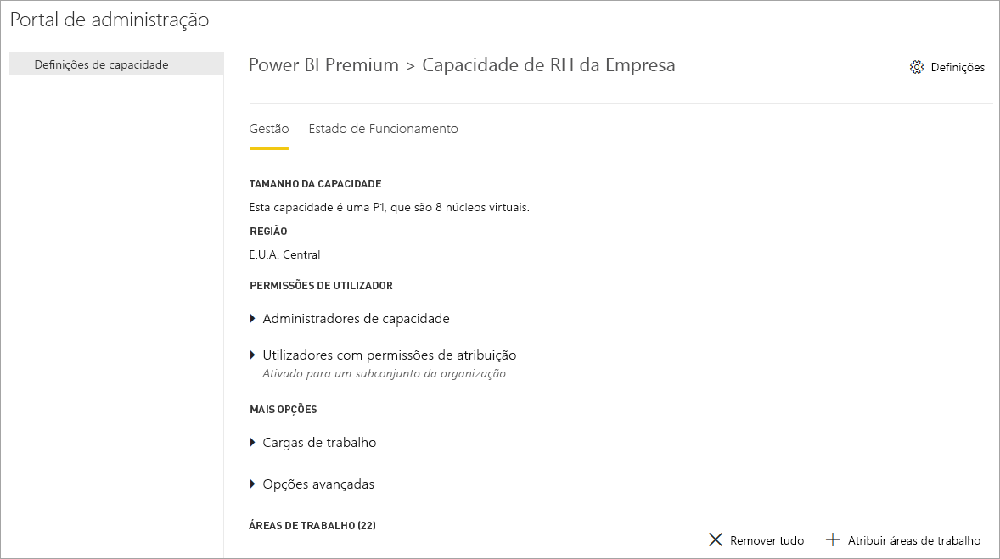
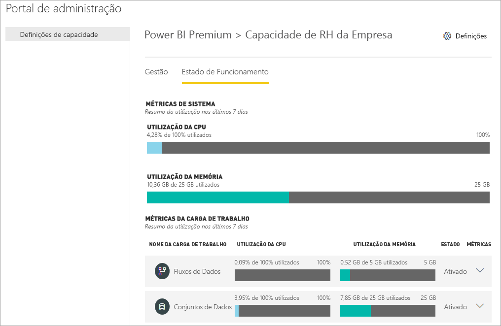
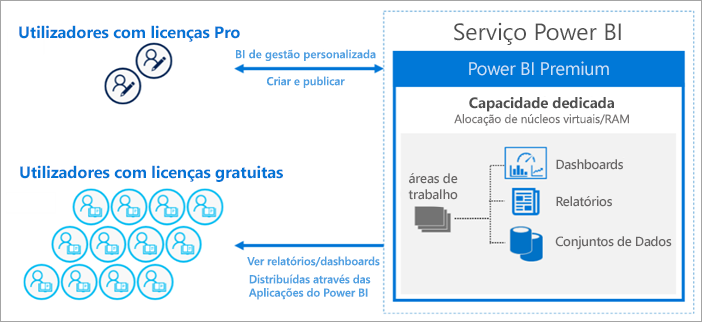
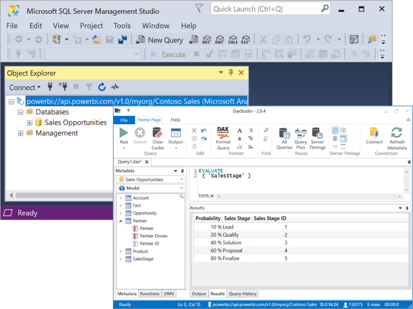

# O que é o Power BI Premium?

O Power BI Premium fornece recursos dedicados e melhorados para executar o serviço Power BI para a sua organização. Por exemplo:

> [!div class="checklist"]
> * Maior dimensionamento e desempenho
> * Flexibilidade de licenciar por capacidade
> * Unificar o BI de gestão personalizada e empresarial
> * Expandir o BI no local com o Power BI Report Server
> * Suporte para residência dos dados por região (Multi-Geo)
> * Partilhar dados com qualquer pessoa sem comprar uma licença por utilizador

Este artigo apresenta as principais funcionalidades do Power BI Premium. Sempre que necessário, são fornecidas ligações para artigos adicionais com mais informações detalhadas.

## Subscrições e licenciamento

O Power BI Premium é uma subscrição do Office 365 ao nível do inquilino disponível em duas famílias de SKUs (Stock Keeping Unit):

- Os SKUs **EM** (EM1-EM3) para incorporar necessitam de uma fidelização anual e são faturados mensalmente. Os SKUs EM1 e EM2 estão disponíveis apenas através de planos de licenciamento em volume. Não pode comprá-los diretamente.
- Os SKUs **P** (P1-P3) para funcionalidades empresariais e de incorporação necessitam de fidelização mensal ou anual, são faturados mensalmente e incluem uma licença para instalar o Power BI Report Server no local.

Uma abordagem alternativa é comprar uma subscrição do **Azure Power BI Embedded**, que tem uma única família de SKUs **A**  (A1-A6) apenas para incorporar e testar capacidades. Todos os SKUs fornecem núcleos virtuais para criar capacidades, mas os SKUs EM são restritos para incorporação em menor escala. Os SKUs EM1, EM2, A1 e A2 com menos de quatro núcleos virtuais não são executados na infraestrutura dedicada.

Embora o foco deste artigo sejam os SKUs P, a maior parte do que é descrito também é relevante para os SKUs A. Em contraste com os SKUs da subscrição Premium, os SKUs do Azure não necessitam de fidelização e são faturados à hora. Fornecem elasticidade total e permitem aumentar verticalmente, reduzir verticalmente, colocar em pausa, retomar e eliminar. 

O Azure Power BI Embedded está fora do âmbito deste artigo, mas é descrito na secção [Abordagens de Teste](service-premium-capacity-optimize.md#testing-approaches) do artigo Otimizar as capacidades Premium como uma opção prática e económica para testar e medir cargas de trabalho. Para saber mais sobre os SKUs do Azure, veja a [Documentação do Azure Power BI Embedded](https://azure.microsoft.com/services/power-bi-embedded/).

### Compras

As subscrições do Power BI Premium são compradas por administradores no centro de administração do Microsoft 365. Apenas os Administradores de Faturação ou Administradores Globais do Office 365 podem comprar SKUs. Quando forem comprados, o inquilino recebe um número correspondente de núcleos virtuais para atribuir a capacidades, conhecido como *agrupamento de núcleos virtuais*. Por exemplo, a compra de um SKU P3 fornece ao inquilino 32 núcleos virtuais. Para saber mais, veja [Como comprar o Power BI Premium](service-admin-premium-purchase.md).

## Capacidades dedicadas

Com o Power BI Premium, obtém *capacidades dedicadas*. Em contraste com a capacidade partilhada, em que as cargas de trabalho são executadas em recursos computacionais partilhados com outros clientes, uma capacidade dedicada é para utilização exclusiva de uma organização. Tem recursos computacionais dedicados que fornecem um desempenho consistente e fiável para os conteúdos alojados. 

As áreas de trabalho residem nas capacidades. Cada utilizador do Power BI tem uma área de trabalho pessoal conhecida como **A Minha Área de Trabalho**. As áreas de trabalho adicionais conhecidas como **áreas de trabalho** podem ser criadas para permitir a colaboração. Por predefinição, as áreas de trabalho, incluindo as áreas de trabalho pessoais, são criadas na capacidade partilhada. Quando tem capacidades Premium, As Minhas Áreas de Trabalho e áreas de trabalho podem ser atribuídas a capacidades Premium.

### Nós de capacidade

Conforme descrito na secção [Subscrições e Licenciamento](#subscriptions-and-licensing), existem duas famílias de SKUs do Power BI Premium: **EM** e **P**. Todos os SKUs do Power BI Premium estão disponíveis como *nós* de capacidade e cada um representa uma quantidade definida de recursos que consistem no processador, memória e armazenamento. Para além dos recursos, cada SKU tem limites operacionais em relação ao número de ligações DirectQuery e Ligação em Direto por segundo, e ao número de atualizações de modelos paralelos.

O processamento é obtido por um número definido de núcleos virtuais, dividido igualmente entre o back-end e o front-end.

Os **núcleos virtuais de back-end** são responsáveis pela funcionalidade principal do Power BI, incluindo processamento de consultas, gestão de cache, execução de serviços R, atualização de modelos, processamento de linguagem natural (Perguntas e Respostas) e composição de relatórios e imagens no servidor. É atribuída uma quantidade fixa de memória aos núcleos virtuais de back-end, que é principalmente utilizada para alojar modelos, também conhecidos como conjuntos de dados ativos.

Os **núcleos virtuais de front-end** são responsáveis pelo serviço Web, a gestão de documentos de relatórios e dashboards, gestão de direitos de acesso, agendamento, APIs, carregamentos e transferências e, de forma geral, por tudo o que tem a ver com a experiência de utilizador.

O armazenamento está definido como **100 TB por nó de capacidade**.

Os recursos e limites de cada SKU Premium (e SKU A dimensionado de forma equivalente) são descritos na seguinte tabela:

| Nós de Capacidade | Núcleos virtuais totais | Núcleos virtuais de back-end | RAM (GB) | Núcleos virtuais de front-end | DirectQuery/Ligação em Direto (por segundo) | Paralelismo de Atualização do Modelo |
| --- | --- | --- | --- | --- | --- | --- |
| EM1/A1 | 1 | 0,5 | 3 | 0,5 | 3,75 | 1 |
| EM2/A2 | 2 | 1 | 5 | 1 | 7,5 | 2 |
| EM3/A3 | 4 | 2 | 10 | 2 | 15 | 3 |
| P1/A4 | 8 | 4 | 25 | 4 | 30 | 6 |
| P2/A5 | 16 | 8 | 50 | 8 | 60 | 12 |
| P3/A6 | 32 | 16 | 100 | 16 | 120 | 24 |
| | | | | | | |

### Cargas de trabalho de capacidade

As cargas de trabalho de capacidade são serviços disponibilizados aos utilizadores. Por predefinição, as capacidades Premium e do Azure só suportam uma carga de trabalho do conjunto de dados associada à execução de consultas do Power BI. A carga de trabalho do conjunto de dados não pode ser desativada. Pode ativar cargas de trabalho adicionais para [IA (Serviços Cognitivos)](https://powerbi.microsoft.com/blog/easy-access-to-ai-in-power-bi-preview/), [Fluxos de dados](service-dataflows-overview.md#dataflow-capabilities-on-power-bi-premium) e [Relatórios paginados](paginated-reports-save-to-power-bi-service.md). Estas cargas de trabalho são suportadas apenas nas subscrições Premium. 

Cada carga de trabalho adicional permite configurar a memória máxima (como uma percentagem da memória total disponível) que pode ser utilizada pela carga de trabalho. Os valores predefinidos da memória máxima são determinados pelo SKU. Pode maximizar os recursos disponíveis da sua capacidade ao ativar apenas as cargas de trabalho adicionais quando são utilizadas. Pode alterar as definições de memória apenas quando tiver determinado que as predefinições não estão a cumprir os requisitos dos recursos de capacidade. As cargas de trabalho podem ser ativadas e configuradas para uma capacidade por administradores de capacidade através das **Definições de capacidade** no [Portal de Administração](service-admin-portal.md) ou através de [APIs REST de capacidades](https://docs.microsoft.com/rest/api/power-bi/capacities).  

Para saber mais, veja [Configurar cargas de trabalho numa capacidade Premium](service-admin-premium-workloads.md). 

### Como funcionam as capacidades

O serviço Power BI utiliza da melhor forma os recursos de capacidades e não excede os limites impostos na capacidade.

As operações de capacidades são classificadas como *interativas* ou *de segundo plano*. As operações interativas incluem compor pedidos e responder a interações de utilizadores (filtrar, consultar Perguntas e Respostas, etc.). Geralmente, a consulta do modelo de importação exige bastantes recursos de memória, enquanto os modelos DirectQuery e Ligação em Direto exigem CPU. As operações de segundo plano incluem atualizações do modelo de importação e fluxo de dados e colocação em cache de consultas do dashboard.

É importante compreender que as operações interativas têm sempre prioridade sobre as operações de segundo plano para garantir a melhor experiência de utilizador possível. Se existirem recursos insuficientes, as operações de segundo plano são adicionadas a uma fila para processamento quando estiverem disponíveis recursos. As operações de segundo plano, como atualizações de conjuntos de dados, podem ser interrompidas a meio do processo pelo serviço Power BI e adicionadas a uma fila.

Os modelos de importação têm de ser totalmente carregados para a memória para que possam ser consultados ou atualizados. O serviço Power BI gere a utilização de memória com algoritmos sofisticados para garantir a utilização máxima da memória disponível e pode causar a sobrecarga da capacidade: embora seja possível para uma capacidade armazenar vários modelos de importação (até 100 TB por capacidade Premium), quando o armazenamento de discos combinado excede a memória suportada (e a memória adicional é necessária para consultar e atualizar), estes não podem ser carregados para a memória ao mesmo tempo.

Os modelos de importação são carregados e removidos da memória de acordo com a utilização. Um modelo de importação é carregado quando é consultado (operação interativa) e ainda não está na memória ou quando deve ser atualizado (operação de segundo plano).

A remoção de um modelo da memória é conhecida como *expulsão*. É uma operação que o Power BI pode efetuar rapidamente, dependendo do tamanho dos modelos. Se a capacidade não tiver pressão de memória, os modelos são simplesmente carregados para a memória e permanecem lá. No entanto, quando não houver memória disponível suficiente para carregar um modelo, o serviço Power BI precisará de libertar memória. Liberta memória ao detetar modelos que ficaram inativos, procurar modelos que não foram utilizados nos últimos três minutos \[[1](#endnote-1)\] e expulsá-los. Se não existirem modelos inativos para expulsar, o serviço Power BI tentará expulsar modelos carregados para operações de segundo plano. Como último recurso, após 30 segundos de tentativas falhadas \[[1](#endnote-1)\], a operação interativa irá falhar. Neste caso, o utilizador do relatório é notificado da falha com uma sugestão para tentar novamente em breve. Em alguns casos, os modelos podem ser descarregados da memória devido a operações de serviço.

É importante sublinhar que a expulsão de conjuntos de dados é um comportamento normal e esperado. Esforça-se por maximizar a utilização da memória ao carregar e descarregar modelos cujos tamanhos combinados podem exceder a memória disponível. Este comportamento é predefinido e transparente para os utilizadores do relatório. As taxas de expulsão elevadas não significam necessariamente que a capacidade não tem recursos suficientes. No entanto, pode ser preocupante se a capacidade de resposta de atualização ou consulta for afetada por causa das taxas de expulsão elevadas.

As atualizações de modelos de importação exigem sempre bastantes recursos, pois os modelos têm de ser carregados para a memória. É necessária memória adicional para o processamento. Uma atualização total pode utilizar aproximadamente o dobro da quantidade de memória exigida pelo modelo. Isto garante que o modelo pode ser consultado mesmo durante o processamento, porque as consultas são enviadas para o modelo existente até que a atualização seja concluída e os dados do novo modelo estejam disponíveis. A atualização incremental irá exigir menos memória e pode ser concluída mais rapidamente, reduzindo substancialmente a pressão sobre os recursos de capacidades. As atualizações também podem exigir bastante CPU para os modelos, especialmente aquelas com transformações complexas do Power Query ou colunas/tabelas calculadas que são complexas ou baseadas em tabelas de grandes dimensões.

As atualizações, como as consultas, exigem que o modelo seja carregado para a memória. Se não existir memória suficiente, o serviço Power BI irá tentar expulsar modelos inativos, e se isso não for possível (todos os modelos estão ativos), a tarefa de atualização será colocada em fila. Normalmente, as atualizações exigem bastante CPU, mais do que as consultas. Por este motivo, existem limites de capacidade no número de atualizações simultâneas, definido como 1,5 vezes o número de núcleos virtuais de back-end, arredondados. Se existirem muitas atualizações simultâneas, uma atualização agendada será colocada em fila. Quando estas situações ocorrem, demora mais tempo para a atualização ser concluída. As atualizações a pedido, como aquelas acionadas por um pedido de utilizador ou uma chamada à API, serão repetidas três vezes \[[1](#endnote-1)\]. Se ainda não existirem recursos suficientes, a atualização irá falhar.

Notas de secção:   
\[1\] Sujeito a alterações.

### Suporte regional

Ao criar uma nova capacidade, os administradores do serviço Power BI e os administradores globais do Office 365 podem especificar uma região na qual residirão as áreas de trabalho atribuídas à capacidade. Isto é conhecido como **Multi-Geo**. Com a Multi-Geo, as organizações podem cumprir requisitos de residência dos dados ao implementar conteúdos para datacenters numa região específica, mesmo que seja diferente da região na qual a Subscrição do Office 365 reside. Para saber mais, veja [Suporte da Multi-Geo para o Power BI Premium](service-admin-premium-multi-geo.md).

### Gestão de capacidades

Gerir capacidades Premium envolve criar ou eliminar capacidades, atribuir administradores, atribuir áreas de trabalho, configurar cargas de trabalho, monitorizar e fazer ajustes para otimizar o desempenho da capacidade. 

Os administradores do serviço Power BI e os administradores globais do Office 365 podem criar capacidades Premium a partir de núcleos virtuais disponíveis ou modificar as capacidades Premium existentes. Quando uma capacidade é criada, a região geográfica e o tamanho da capacidade são especificados e é atribuído pelo menos um administrador de capacidade. 

Quando as capacidades são criadas, a maior parte das tarefas administrativas é concluída no [Portal de Administração](service-admin-portal.md).

Os administradores de capacidade podem atribuir áreas de trabalho à capacidade, gerir permissões de utilizador e atribuir outros administradores. Os administradores de capacidade também podem configurar cargas de trabalho, ajustando alocações de memória e, se for necessário, reiniciar uma capacidade, repondo operações em caso de sobrecarga de uma capacidade.

Os administradores de capacidade também podem garantir que uma capacidade está a ser executada sem problemas. Podem monitorizar o estado de funcionamento das capacidades no Portal de Administração ou com a aplicação Métricas de Capacidade do Power BI Premium.

Para saber mais sobre como criar capacidades, atribuir administradores e atribuir áreas de trabalho, veja [Gerir as capacidades Premium](service-premium-capacity-manage.md). Para saber mais sobre as funções, veja [Funções de administrador relacionadas com o Power BI](service-admin-administering-power-bi-in-your-organization.md#administrator-roles-related-to-power-bi).

### Monitorização

A monitorização das capacidades Premium indica aos administradores o desempenho das capacidades. As capacidades podem ser monitorizadas com o Portal de Administração e com a aplicação [Métricas de Capacidade do Power BI Premium](https://app.powerbi.com/groups/me/getapps/services/capacitymetrics).

A monitorização no portal fornece uma vista rápida com métricas de alto nível a indicar os carregamentos efetuados e os recursos utilizados pela sua capacidade, em média, nos últimos sete dias. 

A aplicação **Métricas de Capacidade do Power BI Premium** fornece as informações mais detalhadas sobre o desempenho das suas capacidades. A aplicação fornece um dashboard de alto nível e relatórios mais detalhados.

No dashboard da aplicação, pode clicar na célula de uma métrica para abrir um relatório detalhado. Os relatórios fornecem a capacidade de filtragem e métricas detalhadas para expandir as informações mais importantes de que precisa para manter as suas capacidades em execução sem problemas.

Para saber mais sobre capacidades de monitorização, veja [Monitorização no Portal de Administração do Power BI](service-admin-premium-monitor-portal.md) e [Monitorização com a aplicação Métricas de Capacidade do Power BI Premium](service-admin-premium-monitor-capacity.md).

### Otimizar as capacidades

Fazer a melhor utilização das suas capacidades é fundamental para garantir que os utilizadores obtêm o desempenho e que você obtém o máximo valor pelo seu investimento Premium. Ao monitorizar métricas principais, os administradores determinam a melhor forma de resolver estrangulamentos e efetuar as ações necessárias. Para saber mais, veja [Otimizar as capacidades Premium](service-premium-capacity-optimize.md) e [Cenários de capacidades Premium](service-premium-capacity-scenarios.md).

### APIs REST de capacidades

As APIs REST do Power BI incluem uma coleção de [APIs de capacidades](https://docs.microsoft.com/rest/api/power-bi/capacities). Com as APIs, os administradores podem gerir de forma programática vários aspetos das suas capacidades Premium, incluindo ativar e desativar cargas de trabalho, atribuir áreas de trabalho a uma capacidade e muito mais.

## Conjuntos de dados de grandes dimensões

Dependendo do SKU, o Power BI Premium suporta carregar ficheiros do modelo do Power BI Desktop (.pbix) até um máximo de **10 GB**. Quando carregado, o modelo pode ser publicado numa área de trabalho atribuída a uma capacidade Premium. Em seguida, o conjunto de dados pode ser atualizado para até **12 GB**.

### Considerações sobre o tamanho

Os conjuntos de dados de grandes dimensões podem exigir bastantes recursos. Deve ter, pelo menos, um SKU P1 para os conjuntos de dados superiores a 1 GB. Embora a publicação de conjuntos de dados de grandes dimensões em áreas de trabalho suportadas por SKUs A até ao A3 possa funcionar, não poderá atualizá-los.

A tabela seguinte mostra os SKUs recomendados para o carregamento do ficheiro .pbix ou a publicação no serviço Power BI:

   |SKU  |Tamanho do ficheiro .pbix   |
   |---------|---------|
   |P1    | < 3 GB        |
   |P2    | < 6 GB        |
   |P3, P4 e P5    | até 10 GB   |

O SKU A4 do Power BI Embedded é igual ao SKU P1, A5 = P2 e A6 = P3. A publicação de conjuntos de dados em SKUs A e EM poderá devolver erros que não são específicos ao erro de limitação do tamanho dos modelos na capacidade partilhada. É provável que os erros de atualização dos conjuntos de dados em SKUs A e EM indiquem limites de tempo excedidos como a causa.

Se ativar [modelos grandes](service-premium-large-models.md) num conjunto de dados, as limitações de tamanho do ficheiro .pbix continuarão a ser aplicáveis à publicação ou à transferência de ficheiros. No entanto, com a atualização incremental e os modelos grandes combinados, os conjuntos de dados podem crescer para lá desses limites. Com modelos grandes, o tamanho do conjunto de dados é limitado apenas pelo tamanho da capacidade do Power BI Premium.

Os seus ficheiros .pbix representam dados num *estado altamente comprimido*. Provavelmente, os dados serão expandidos quando forem carregados na memória. A partir daí, poderão ser expandidos mais algumas vezes durante a atualização de dados.

A atualização agendada de conjuntos de dados de grandes dimensões pode demorar muito tempo e exigir bastantes recursos. É importante que não agende demasiadas atualizações sobrepostas. É recomendável configurar a [atualização incremental](service-premium-incremental-refresh.md) porque é mais rápida e fiável e consome menos recursos.

O carregamento de relatórios inicial de conjuntos de dados de grandes dimensões pode ser muito demorado, se a última utilização do conjunto de dados tiver sido feita há algum tempo. Uma barra de carregamento para relatórios de carregamento mais demorado apresenta o progresso do carregamento.

Apesar de a memória por consulta e as restrições de tempo serem muito superiores na capacidade Premium, é recomendada a utilização de filtros e segmentações de dados para limitar os elementos visuais para apresentar apenas o que é necessário.

## Atualização incremental

A atualização incremental é uma parte integrante de ter e manter conjuntos de dados de grandes dimensões no Power BI Premium. A atualização incremental tem várias vantagens, por exemplo, as atualizações são mais rápidas porque apenas os dados que foram alterados têm de ser atualizados. As atualizações são mais fiáveis porque não é necessário manter ligações de longa duração a origens de dados voláteis. O consumo de recursos é reduzido porque uma quantidade menor de dados a atualizar reduz o consumo geral de memória e de outros recursos. As políticas de atualização incremental são definidas no **Power BI Desktop** e aplicadas assim que são publicadas numa área de trabalho numa capacidade Premium. 

Para saber mais, veja [Atualização incremental no Power BI Premium](service-premium-incremental-refresh.md).

## Relatórios paginados

Os relatórios paginados, suportados por SKUs P1-P3 e A4-A6, são baseados em tecnologia de linguagem RDL (Report Definition Language) no SQL Server Reporting Services. Embora seja baseado na tecnologia RDL, não é o mesmo que o Power BI Report Server, que é uma plataforma de relatórios transferível que pode instalar no local, também incluída no Power BI Premium. Os relatórios paginados são formatados para se ajustarem a uma página que pode ser impressa ou partilhada. Os dados são apresentados numa tabela, mesmo que a tabela ocupe múltiplas páginas. Ao utilizar a aplicação gratuita [**Power BI Report Builder**](https://go.microsoft.com/fwlink/?linkid=2086513) para ambiente de trabalho do Windows, os utilizadores criam relatórios paginados e publicam-nos no serviço.

No Power BI Premium, os relatórios paginados são uma carga de trabalho que tem de ser ativada para uma capacidade com o Portal de Administração. Os administradores de capacidade podem ativar e, em seguida, especificar a quantidade de memória como uma percentagem dos recursos de memória gerais da capacidade. Ao contrário de outros tipos de cargas de trabalho, o Premium executa relatórios paginados num espaço contido dentro da capacidade. A memória máxima especificada para este espaço é utilizada, independentemente de a carga de trabalho estar ou não ativa. A predefinição é 20%. 

Para saber mais, veja [Relatórios paginados no Power BI Premium](paginated-reports-report-builder-power-bi.md). Para saber mais sobre como ativar a carga de trabalho de relatórios paginados, veja [Configurar cargas de trabalho](service-admin-premium-workloads.md).

## Power BI Report Server
 
Incluído com o Power BI Premium, o Power BI Report Server é um servidor de relatórios *no local* com um portal Web. Pode criar o seu ambiente de BI no local e distribuir relatórios protegidos pela firewall da sua organização. O Report Server dá aos utilizadores acesso a capacidades de criação de relatórios empresariais, interativos e avançados do SQL Server Reporting Services. Os utilizadores podem explorar os dados visuais e detetar padrões rapidamente para tomar decisões mais acertadas e mais rápidas. O Report Server fornece gestão nos seus próprios termos. Se e quando chegar a hora, o Power BI Report Server facilita a migração para a cloud, onde a sua organização pode tirar partido de todas as funcionalidades do Power BI Premium.

Para saber mais, veja [Power BI Report Server](report-server/get-started.md).

## Partilha ilimitada de conteúdos

Com o Premium, qualquer pessoa, quer seja da sua organização ou não, pode ver os seus conteúdos do Power BI, incluindo relatórios interativos e paginados, sem adquirir licenças individuais. 

O Premium permite uma distribuição alargada de conteúdos por utilizadores do Power BI Pro e os destinatários que veem os conteúdos sem necessitarem de licenças Pro. As licenças Pro são necessárias para criadores de conteúdo. Os criadores ligam origens de dados, modelam dados e criam relatórios e dashboards que são empacotados como aplicações de área de trabalho. 

Para saber mais, veja [Licenciamento do Power BI](service-admin-licensing-organization.md).

## Conectividade de ferramentas (Pré-visualização)

Nos bastidores, o **mecanismo Vertipaq do Microsoft Analysis Services**, comprovado pela empresa, é utilizado para os conjuntos de dados do Power BI. O Analysis Services fornece capacidade de programação e suporte de ferramentas e aplicações cliente através de APIs e bibliotecas de cliente que suportam o protocolo XMLA de padrão aberto. Atualmente, os conjuntos de dados do Power BI Premium suportam operações *só de leitura* da Microsoft e de ferramentas e aplicações cliente de terceiros através de **pontos finais XMLA**. 

As ferramentas da Microsoft, como o SQL Server Management Studio e o SQL Server Profiler, e aplicações de terceiros, como o DAX Studio e aplicações de visualização de dados, podem ligar e consultar conjuntos de dados Premium com eventos XMLA, DAX, MDX, DMVs e Trace. 

Para saber mais, veja [Ligar a conjuntos de dados com ferramentas e aplicações cliente](service-premium-connect-tools.md).

## Próximos passos

> [!div class="nextstepaction"]
> [Gerir as capacidades Premium](service-premium-capacity-manage.md)

Mais perguntas? [Experimente perguntar à Comunidade do Power BI](https://community.powerbi.com/)

||||||
