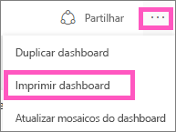
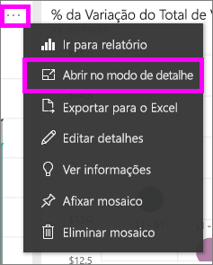
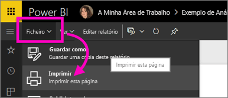

# Imprimir a partir do serviço Power BI
Imprima um dashboard completo, um mosaico do dashboard, uma página de relatório ou um elemento visual de um relatório a partir do serviço Power BI. Os relatórios só podem ser impressos uma página de cada vez. Não pode imprimir todo o relatório de uma só vez.

> [!NOTE]
> A impressão só está disponível no serviço Power BI e não no Power BI Desktop.
> 
> 

Veja a Amanda a imprimir o seu dashboard e relatório. Em seguida, siga as instruções passo a passo abaixo do vídeo para experimentar.

<iframe width="560" height="315" src="https://www.youtube.com/embed/jtlLGRKBvXY" frameborder="0" allowfullscreen></iframe>

## Imprimir um dashboard
1. Abra o dashboard que quer imprimir.
2. No canto superior direito, selecione as reticências (...) e escolha **Imprimir dashboard**.
   
    
3. A janela Imprimir do browser abre. Escolha as definições e o destino de impressão, e selecione **Imprimir**.
   
   > [!NOTE]
   > A caixa de diálogo de impressão que é apresentada depende do browser que está a utilizar.
   > 
   > 
   
    

## Imprimir um mosaico do dashboard
1. [Abra o mosaico no Modo de detalhe](service-focus-mode.md), selecionando as reticências e escolhendo o ícone de Foco .
   
    
2. Abra o mosaico no [modo de ecrã inteiro](service-fullscreen-mode.md), selecionando o ícone de ecrã inteiro  na barra de navegação superior.
3. Paire o rato sobre o mosaico para revelar o menu de Opções.
   
    
4. Selecione o ícone de impressão  .     
   
   > [!NOTE]
   > A caixa de diálogo de impressão que é apresentada depende do browser que está a utilizar.
   > 
   > 

## Imprimir uma página de relatório
Os relatórios podem ser impressos uma página de cada vez.

1. Abra o relatório na Vista de Leitura ou na Vista de Edição.
2. Selecione **Ficheiro** > **Imprimir** para imprimir a página do relatório atual.
   
    
3. A janela Imprimir do browser abre.
   
   > [!NOTE]
   > A caixa de diálogo de impressão que é apresentada depende do browser que está a utilizar.
   > 
   > 

## Imprimir um elemento visual de relatório
1. [Abra o elemento visual no Modo de detalhe](service-focus-mode.md), pairando o rato sobre o mosaico e selecionando o ícone de Foco  no canto superior direito.
2. Siga os passos 2 e 3 em *Imprimir uma página de relatório* acima.

## Considerações e resolução de problemas
* P: Não consigo encontrar o botão **Imprimir**.    
* R: Se estiver a utilizar o Power BI Desktop, impressão não é suportada.  A impressão só funciona no serviço Power BI.
* P: Não consigo imprimir todas as páginas do relatório de uma só vez.    
* R: Está correto. As páginas do relatório só podem ser impressas uma página de cada vez.
* P: Não consigo imprimir em PDF.    
* R: Esta opção só é apresentada se já tiver configurado o controlador de PDF no seu browser.    
* P: O que vejo quando seleciono **Imprimir** não corresponde ao que estão a mostrar aqui.    
* R: Os ecrãs de impressão variam consoante o browser e a versão do software.
* P: A minha impressão não é dimensionada corretamente.  O meu dashboard não cabe na página. Outras perguntas sobre dimensionamento e orientação.    
* R: Não podemos garantir que a cópia impressa será exatamente igual ao que aparece no serviço Power BI. Aspetos como o dimensionamento, as margens, os detalhes visuais, a orientação e o tamanho não são controlados pelo Power BI. Para obter ajuda com problemas como este, consulte a documentação relativa ao seu browser específico.      

## Próximos passos
[Partilhar dashboards e relatórios com colegas e outras pessoas](service-share-dashboards.md)

Mais perguntas? [Pergunte à Comunidade do Power BI](http://community.powerbi.com/)

